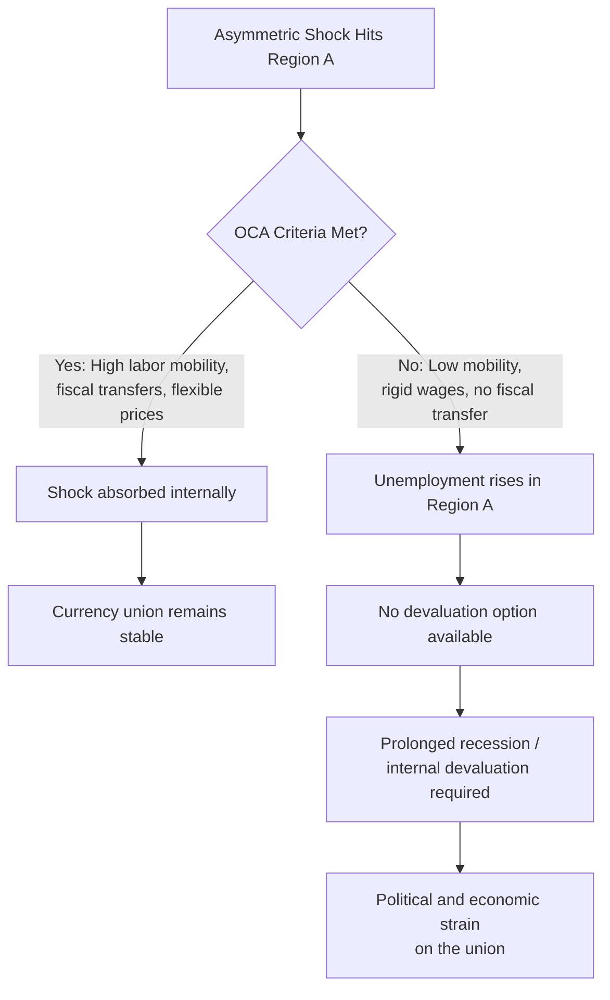
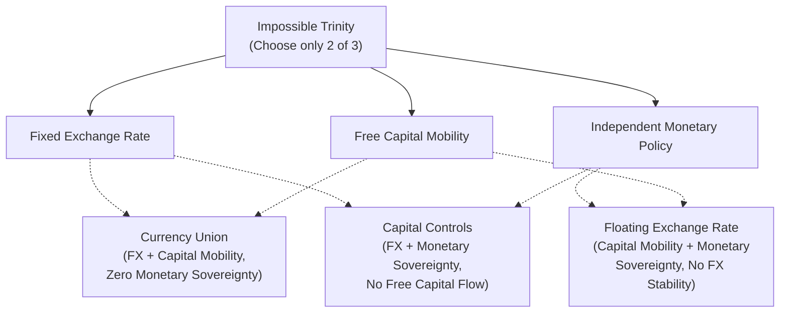

## Currency Unions and Monetary Sovereignty Tradeoffs

### Definition and Conceptual Framework

A currency union is an arrangement in which two or more sovereign states or jurisdictions adopt a single common currency, or irrevocably fix their exchange rates to each other while ceding control of monetary policy to a common central authority. Monetary sovereignty refers to a nation's independent capacity to issue its own currency, set its own interest rates, control its own money supply, and use exchange rate adjustment as a policy tool. Joining a currency union necessarily involves surrendering some or all of these capacities in exchange for the benefits of monetary integration.

The central analytical tension is this: a single monetary policy set by a common central bank cannot simultaneously be optimal for all member economies unless those economies are sufficiently similar in structure and synchronized in their business cycles. When asymmetric shocks hit different members differently, the shared policy rate becomes too loose for some and too tight for others.

### Types of Currency Arrangements

**Full Currency Union (Monetary Union)**

Members share a single currency and a single central bank, as in the Eurozone. National currencies cease to exist; monetary policy is set once for the entire bloc.

**Currency Board**

A domestic currency is retained nominally but is fully backed by and fixed to a foreign anchor currency (e.g., Hong Kong's peg to the US dollar via HKMA). Domestic monetary policy is effectively constrained to mirror the anchor.

**Dollarization/Euroization**

A country formally adopts another country's currency as legal tender, abandoning its own currency entirely (e.g., Ecuador and El Salvador using the US dollar; Kosovo and Montenegro using the euro without formal Eurozone membership).

**Fixed Exchange Rate Peg**

A softer arrangement where a country maintains its own currency and central bank but commits to a fixed parity with an anchor currency, retaining a nominal (if constrained) ability to exit.

### Optimum Currency Area (OCA) Theory

The theoretical foundation for evaluating currency unions comes from Robert Mundell's Optimum Currency Area theory (1961), later extended by Ronald McKinnon and Peter Kenen. OCA theory specifies the conditions under which a group of regions or countries would benefit from sharing a single currency rather than maintaining independent, floating currencies.

**Core OCA Criteria:**

1. **Labor mobility** — Workers can move freely between regions to absorb asymmetric shocks. If one region suffers a negative shock, workers migrate to the region unaffected, reducing unemployment pressure without needing exchange rate adjustment.
2. **Capital mobility and price/wage flexibility** — Capital flows and flexible wages/prices allow markets to adjust to shocks internally, substituting for currency devaluation.
3. **Fiscal transfer mechanisms** — A centralized fiscal authority can transfer resources from booming regions to depressed ones (as US federal fiscal transfers do between states), cushioning asymmetric shocks.
4. **Similarity of economic structure / symmetry of shocks** — If member economies produce similar goods and are hit by similar shocks, a single monetary policy suits all of them reasonably well.
5. **Degree of economic openness and trade integration** — Highly open, trade-integrated economies benefit more from eliminating exchange rate uncertainty and transaction costs.
6. **Financial market integration** — Deep, integrated capital markets allow risk-sharing across borders (private risk-sharing channel), partially substituting for fiscal transfers.

$$\text{OCA suitability} \propto (\text{labor mobility} + \text{fiscal integration} + \text{price flexibility} + \text{shock symmetry})$$

[Inference] Empirical assessments generally find that most real-world currency unions, including the Eurozone, satisfy these criteria only partially, which is why OCA theory is frequently invoked to explain currency union stress rather than currency union formation.

### The Core Tradeoff: Benefits vs. Costs of Monetary Sovereignty

**Benefits of Joining a Currency Union**

- **Elimination of exchange rate risk** — Firms and investors trading within the union no longer face currency volatility, reducing hedging costs and encouraging cross-border investment and trade.
- **Lower transaction costs** — No currency conversion costs on intra-union trade and travel.
- **Price transparency** — Consumers and firms can directly compare prices across borders, intensifying competition and market integration.
- **Credibility and inflation discipline** — Smaller or historically inflation-prone countries can "import" the credibility of a stronger central bank (this was a major motivation for peripheral Eurozone members joining, anchoring inflation expectations to German-style Bundesbank credibility).
- **Deeper financial market integration** — A larger, unified currency area can develop deeper, more liquid capital markets, lowering borrowing costs.
- **Reduced speculative attack risk** — A country cannot suffer a currency crisis in its own currency if it no longer has one (though it can still face a sovereign debt crisis, as Greece demonstrated).

**Costs of Losing Monetary Sovereignty**

- **Loss of independent monetary policy** — The country can no longer set interest rates to match its own domestic business cycle; it inherits whatever policy rate suits the union's aggregate conditions (or its most influential/largest members).
- **Loss of the exchange rate as a shock absorber** — Without the ability to devalue, an asymmetric negative shock cannot be cushioned by making the country's exports more competitive. Adjustment must instead occur through **internal devaluation**: cutting nominal wages and prices, which is slower, more painful, and often faces downward wage rigidity.
- **Loss of seigniorage** — The country forfeits the revenue/policy flexibility that comes from being able to issue its own currency, including as a lender of last resort mechanism for its own banking system and government debt.
- **No independent lender of last resort for sovereign debt** — A country borrowing in a currency it does not control (like Eurozone members borrowing in euros) cannot inflate away its debt or have its central bank act as an unconditional backstop, raising default risk relative to a country that borrows in its own freely-issued currency [this dynamic was central to the 2010–2012 Eurozone sovereign debt crisis].
- **One-size-fits-all policy misalignment** — A single interest rate set for the currency area as a whole may be too loose for booming members (fueling asset bubbles) and too tight for lagging members (deepening recession) simultaneously.

### The Mundell-Fleming Trilemma Connection

Currency unions are best understood through the lens of the **Impossible Trinity (Trilemma)**, which states a country can only choose two of the following three:

1. A fixed exchange rate
2. Free capital mobility
3. Independent monetary policy

A full currency union is the extreme corner solution: it achieves a permanently fixed exchange rate (in fact, currency elimination) and full capital mobility, at the total cost of independent monetary policy (option 3 is fully sacrificed, not merely constrained).

### Case Study: The Eurozone

The Eurozone is the preeminent modern example of a currency union among sovereign states without full fiscal or political union, making it a natural stress test of OCA theory.

**Structural design:**

- Monetary policy is centralized under the European Central Bank (ECB), which sets a single policy rate for all 20 member states (as of the 2026 membership).
- Fiscal policy remains largely decentralized, constrained only loosely by rules such as the Stability and Growth Pact (deficit and debt ceiling targets), with no significant automatic fiscal transfer mechanism comparable to a federal system.
- Labor mobility exists in principle (EU freedom of movement) but is dampened in practice by language barriers, housing costs, and credential recognition differences — much lower than interstate labor mobility in the United States.

**The 2010–2012 Sovereign Debt Crisis as an OCA failure illustration:**

Countries like Greece, Portugal, Ireland, and Spain experienced asymmetric shocks (housing bubbles, competitiveness losses, fiscal crises) that a unified ECB interest rate could not address for all members simultaneously. Because these countries had no national currency to devalue, they were forced into "internal devaluation" — multi-year processes of wage and price deflation, high unemployment, and austerity to restore competitiveness — a slower and more socially costly process than an exchange rate adjustment would have been. [Inference] Many economists across the political spectrum cite this episode as empirical evidence that the Eurozone did not (and largely still does not) meet key OCA criteria, particularly fiscal risk-sharing and labor mobility.

**Institutional responses since the crisis** include the creation of the European Stability Mechanism (ESM) as a fiscal backstop fund, moves toward Banking Union (Single Supervisory Mechanism, Single Resolution Mechanism), and periodic proposals for a common Eurozone fiscal capacity or deposit insurance scheme — all attempts to retrofit the fiscal-transfer and risk-sharing elements the currency union initially lacked.

### Case Study: Dollarization (Ecuador, El Salvador, Panama)

Full dollarization represents the most extreme surrender of monetary sovereignty: the domestic economy adopts the US dollar entirely and has zero influence over the monetary policy set by the US Federal Reserve, which is calibrated for US economic conditions, not the dollarized country's.

**Motivations:** Typically pursued after episodes of hyperinflation or chronic currency instability (Ecuador dollarized in 2000 following a severe banking and currency crisis) to instantly import monetary credibility and end inflationary expectations.

**Costs:** The dollarized country has no lender of last resort in its own currency; its central bank (if one remains) cannot create dollars to backstop its banking system during a liquidity crisis, and it has zero seigniorage revenue. It is a pure interest-rate taker with no exchange rate tool whatsoever.

### Case Study: Currency Boards (Historical Argentina, Present Hong Kong)

**Argentina (1991–2001) — Convertibility Plan:** Argentina pegged the peso 1:1 to the US dollar via a currency board, requiring the central bank to hold dollar reserves equal to the monetary base. This ended hyperinflation initially but left Argentina unable to devalue when the peso became overvalued (partly due to a strengthening dollar and Brazilian real devaluation in 1999). The rigidity ultimately produced a severe recession and the catastrophic 2001–2002 economic collapse and default, ending in forced abandonment of the peg. [Unverified as a monocausal claim] The exact weighting of the currency board rigidity versus fiscal mismanagement as causes of the crisis remains debated among economists.

**Hong Kong (1983–present):** The Hong Kong Monetary Authority maintains a currency board pegging the Hong Kong dollar to the US dollar within a narrow band. This has persisted for decades due to Hong Kong's role as a financial entrepôt, high capital mobility, and flexible labor/goods markets that allow internal adjustment — illustrating that currency board rigidity can be sustainable when other OCA-style adjustment channels are sufficiently flexible.

### Asymmetric Shocks and Adjustment Mechanisms Compared

| Adjustment Channel | Independent Currency | Currency Union Member |
| --- | --- | --- |
| Exchange rate devaluation | Available | Unavailable |
| Independent interest rate policy | Available | Unavailable (shared rate) |
| Wage/price flexibility (internal devaluation) | Supplementary tool | Primary tool |
| Labor migration | Possible but often slower cross-border | Depends on union's internal mobility |
| Fiscal transfers from other members | Not applicable | Available only if union has fiscal capacity |
| Lender of last resort for own debt | Available (own central bank) | Only if union provides one |
| Risk of speculative currency attack | Present | Eliminated (no independent currency) |
| Risk of sovereign debt crisis | Lower (can monetize debt) | Higher (cannot monetize; debt in "foreign" currency) |

### Political Economy Dimension

Currency unions are not purely technical/economic arrangements; they encode significant political economy tradeoffs:

- **Loss of the inflation tax option** — Governments lose the ability to use surprise inflation or currency depreciation to reduce the real burden of domestic-currency debt, which can be a meaningful (if distortionary) fiscal tool during crises.
- **Democratic accountability gap** — Monetary policy affecting a member state is set by a supranational body (e.g., ECB Governing Council) where that state has only partial representation, raising questions about democratic legitimacy of decisions with major domestic consequences.
- **Convergence criteria and political conditionality** — Entry often requires meeting fiscal and inflation convergence targets (e.g., Eurozone's Maastricht criteria: deficit below 3% of GDP, debt below 60% of GDP, inflation and interest rate convergence bands), which constrains national fiscal policy even before entry.
- **Exit costs are asymmetrically enormous** — Because currency unions involve redenomination risk, bank contract restructuring, and capital flight fears, exiting a currency union (e.g., a hypothetical "Grexit") is far more disruptive than exiting a simple fixed exchange rate peg, which creates a strong status quo bias even for members experiencing severe strain.

### Worked Example: Comparing Policy Space

Consider two economies, Country A (independent currency, floating exchange rate) and Country B (currency union member), both hit by an identical negative export demand shock.

**Country A's response options:**

1. Central bank cuts interest rates to stimulate domestic demand.
2. Currency depreciates (or is devalued), making exports cheaper and imports more expensive, improving the trade balance.
3. Adjustment occurs over months via financial markets and trade flows.

**Country B's response options:**

1. Cannot independently cut the union-wide interest rate (it is set based on aggregate union conditions, which may show no such shock).
2. Cannot devalue since it shares the union's currency.
3. Must rely on wage and price deflation (internal devaluation) — a process that can take years due to nominal wage rigidity — or wait for union-level fiscal transfers/support if such mechanisms exist.
4. Unemployment likely rises more sharply and persists longer than under Country A's scenario, absent offsetting fiscal support from the union.

[Inference] This stylized comparison illustrates the standard OCA argument rather than a universal empirical result; actual outcomes depend heavily on the specific shock, labor market institutions, and fiscal space available in each case.

### Related Topics

- Optimum Currency Area theory in depth (Mundell, McKinnon, Kenen criteria formalized)
- The Mundell-Fleming (IS-LM-BP) model and the impossible trinity in detail
- Fixed vs. floating exchange rate regime tradeoffs
- Balance of payments crises and speculative currency attacks
- Eurozone sovereign debt crisis case study (Greece, Ireland, Portugal, Spain, Cyprus)
- Fiscal federalism and cross-border risk-sharing mechanisms
- Seigniorage and the inflation tax
- Internal devaluation vs. external devaluation as adjustment mechanisms
- Historical gold standard as a precursor fixed-exchange-rate regime
- African monetary unions (CFA franc zone) as a comparative case
- Central bank independence and credibility/time-inconsistency theory