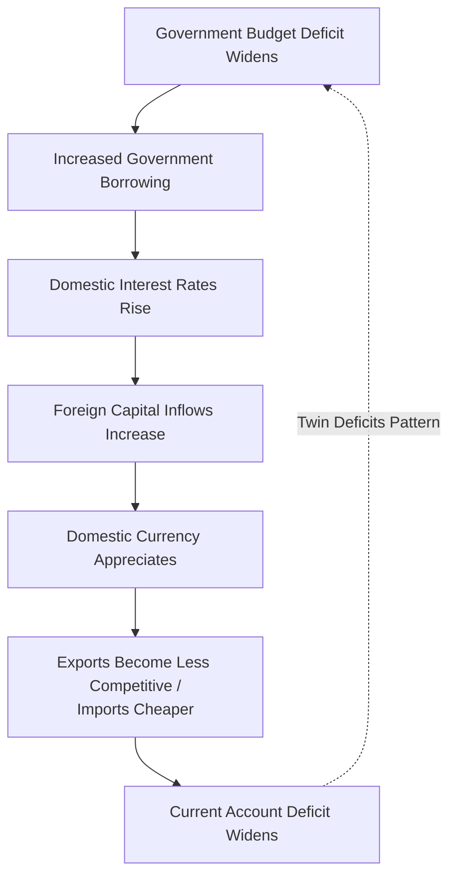

## Twin Deficits Hypothesis

### Definition

The twin deficits hypothesis proposes a systematic causal link between a country's government budget deficit (fiscal deficit) and its current account deficit (external/trade deficit), predicting that the two tend to move together. The core claim is that an increase in the government's fiscal deficit tends to produce, or is accompanied by, a corresponding deterioration in the current account balance, and vice versa for fiscal surpluses.

### The Underlying Accounting Identity

The hypothesis rests on the national income accounting identity that links private saving, investment, government budget balance, and the current account. Starting from the national income identity:

$$Y = C + I + G + (X - M)$$

where $Y$ is output/national income, $C$ is consumption, $I$ is investment, $G$ is government spending, and $(X - M)$ is net exports (the current account, approximately).

National income is also allocated between consumption, saving, and taxes:

$$Y = C + S + T$$

where $S$ is private saving and $T$ is net taxes. Setting these two expressions for $Y$ equal and rearranging:

$$(S - I) + (T - G) = (X - M)$$

This is the **sectoral balances identity**. It decomposes the current account balance $(X - M)$ into the sum of the private sector's net saving $(S - I)$ and the government sector's budget balance $(T - G)$.

Rearranging further to isolate the current account:

$$CA = (S - I) + (T - G)$$

**Key implication:** If the government budget balance $(T - G)$ worsens (moves toward deficit, i.e., $T - G$ falls) and private saving behavior $(S - I)$ does **not** fully offset this change, then the current account $CA$ must also deteriorate. This is the accounting backbone of the twin deficits claim — it is an identity, not itself a behavioral theory, but it sets up the conditions under which the hypothesis holds.

[Inference] Whether twin deficits actually move together in practice depends entirely on whether private saving and investment behavior offset or reinforce the fiscal deficit change, which is an empirical and theoretical question rather than a mechanical certainty from the identity alone.

### Transmission Mechanism (Mundell-Fleming / IS-LM-BP Channel)

The standard open-economy macroeconomic mechanism connecting fiscal deficits to current account deficits, particularly under flexible exchange rates and high capital mobility, runs as follows:

1. Government increases spending or cuts taxes, widening the fiscal deficit.
2. To finance the deficit, government borrowing increases, raising demand for loanable funds and pushing up domestic interest rates (assuming private saving does not rise commensurately, i.e., no full Ricardian offset).
3. Higher domestic interest rates attract foreign capital inflows, as domestic assets now offer relatively higher returns.
4. Capital inflows increase demand for the domestic currency, causing it to **appreciate**.
5. Currency appreciation makes exports more expensive and imports cheaper, reducing net exports.
6. The current account balance deteriorates, completing the "twin" relationship: fiscal deficit → current account deficit.

### Theoretical Perspectives: Competing Views

**1. Keynesian / Mundell-Fleming View (Supports Twin Deficits Link)**

This is the mainstream open-economy macro view described above: fiscal deficits raise interest rates, attract capital inflows, appreciate the currency, and worsen the current account. It predicts a positive, causal relationship running from the fiscal deficit to the current account deficit, particularly strong in economies with flexible exchange rates, high capital mobility, and imperfect Ricardian behavior.

**2. Ricardian Equivalence View (Rejects the Twin Deficits Link)**

Associated with Robert Barro's extension of David Ricardo's original insight, the Ricardian Equivalence hypothesis argues that rational, forward-looking households anticipate that a current tax cut (financed by deficit borrowing) implies higher future taxes to repay that debt. Consequently, households increase private saving today by the same amount as the tax cut, to prepare for the future tax liability, leaving national saving unchanged.

Under full Ricardian Equivalence:

$$\Delta(T - G) < 0 \implies \Delta S = -\Delta(T-G) \implies \Delta(S - I) \text{ offsets it fully}$$

Since $(S-I)$ rises exactly enough to offset the fall in $(T-G)$, the current account $CA = (S-I) + (T-G)$ remains **unchanged**. Under this view, fiscal deficits have no necessary effect on the current account — the "twin" link breaks down entirely.

[Speculation/Opinion] Most economists regard full Ricardian Equivalence as an extreme theoretical benchmark rather than an empirically accurate description of household behavior, due to factors like liquidity constraints, finite lifetimes/bequest motive limitations, and myopia, meaning partial rather than full offset is the more commonly assumed real-world case.

**3. Intermediate/Empirical View**

Most empirical and applied macroeconomic analysis takes a middle position: private saving offsets fiscal deficits only partially, so an increase in the government deficit typically does worsen the current account, but by less than one-for-one, and the strength of the relationship varies by country, exchange rate regime, and time period.

### Conditions That Strengthen or Weaken the Twin Deficits Relationship

| Factor | Strengthens the Link | Weakens the Link |
| --- | --- | --- |
| Exchange rate regime | Flexible exchange rates (interest rate changes transmit via currency appreciation) | Fixed exchange rates (appreciation channel is blocked) |
| Capital mobility | High capital mobility (interest differentials attract flows quickly) | Capital controls / low mobility |
| Ricardian behavior | Low Ricardian offset (households don't fully anticipate future taxes) | High Ricardian offset (full offset via increased private saving) |
| Domestic investment response | Investment relatively insensitive to interest rates | Investment highly interest-sensitive, absorbing funds domestically |
| Financial market openness | Open, integrated global capital markets | Financially closed or segmented economy |
| Source of the deficit | Deficit driven by permanent tax cuts/spending increases (viewed as persistent) | Deficit viewed as temporary/cyclical (smaller behavioral response) |

### Historical Case Study: United States in the 1980s

The twin deficits hypothesis gained its name and prominence from the US experience during the Reagan administration. Large tax cuts (Economic Recovery Tax Act of 1981) combined with increased defense spending produced a substantially widened federal budget deficit. Simultaneously, high real interest rates (partly a legacy of the Volcker Fed's disinflation policy) attracted large capital inflows, the US dollar appreciated sharply (peaking around 1985), and the US current account deficit widened substantially over the same period. This episode is the canonical historical reference point most textbooks use to illustrate the mechanism, though the exact magnitude of the causal contribution of the fiscal deficit versus other factors (monetary policy, structural competitiveness shifts) remains debated among economists. [Unverified as a precise quantitative decomposition] The relative share of the current account deterioration attributable strictly to the fiscal channel versus other concurrent factors in the 1980s is not settled with precision in the literature.

### Historical Case Study: United States in the Early-to-Mid 2000s

A more complicated case: the US ran both a fiscal deficit (following tax cuts and increased spending, including post-9/11 military spending) and a large current account deficit simultaneously during the 2000s. However, this period also featured the "global saving glut" phenomenon (a term associated with Ben Bernanke), in which surplus savings from countries like China and oil-exporting nations were recycled into US Treasury and other dollar assets, holding US interest rates lower than the simple twin-deficits mechanism would predict despite the widening fiscal deficit. [Inference] This case is frequently cited as evidence that global capital flow dynamics and foreign saving behavior can complicate or partially decouple the simple twin deficits transmission mechanism, rather than as a clean confirmation or refutation of the hypothesis.

### Fixed Exchange Rate Case: A Different Transmission Path

Under a fixed exchange rate or currency union (see related topic: currency unions and monetary sovereignty), the classic Mundell-Fleming appreciation channel is blocked since the exchange rate cannot adjust. In this case, a fiscal deficit can still worsen the current account, but through a different channel:

1. Fiscal expansion raises domestic income and aggregate demand.
2. Higher domestic income raises import demand directly (via the marginal propensity to import), independent of any exchange rate movement.
3. The current account deteriorates through the trade/import channel rather than the interest-rate/appreciation channel.

This is relevant to Eurozone member states, where fiscal deficits can still transmit into current account deficits despite the shared currency eliminating the exchange rate adjustment mechanism.

### Worked Numerical Example

Suppose an economy has the following initial values (as % of GDP):

- Private saving $(S)$ = 20%
- Private investment $(I)$ = 18%
- Tax revenue $(T)$ = 22%
- Government spending $(G)$ = 24%

Initial fiscal balance: $T - G = 22 - 24 = -2\%$ (a 2% deficit)

Initial private balance: $S - I = 20 - 18 = +2\%$ (a 2% surplus)

Initial current account: $CA = (S-I) + (T-G) = 2 + (-2) = 0\%$ (balanced)

Now suppose the government cuts taxes, and $T$ falls to 19% (assume $G$ unchanged at 24%), with **no** Ricardian offset in private saving ($S$ and $I$ remain unchanged at 20% and 18%):

New fiscal balance: $T - G = 19 - 24 = -5\%$

Private balance unchanged: $S - I = +2\%$

New current account: $CA = 2 + (-5) = -3\%$

The current account has moved from balanced to a 3% deficit — a direct one-for-one transmission of the additional 3-percentage-point fiscal deterioration, illustrating the "twin" pattern under the zero-Ricardian-offset assumption.

Now suppose instead there is a 50% Ricardian offset: households raise saving by half of the tax cut, so $S$ rises from 20% to 21.5% (offsetting half of the 3-point tax cut):

New private balance: $S - I = 21.5 - 18 = +3.5\%$

New fiscal balance: $T - G = -5\%$ (unchanged from above)

New current account: $CA = 3.5 + (-5) = -1.5\%$

The current account deteriorates by only 1.5 percentage points instead of the full 3 points — illustrating how partial Ricardian offset dampens, but does not eliminate, the twin deficits relationship.

### Policy Implications

- **Fiscal consolidation as external rebalancing tool** — Countries seeking to reduce current account deficits (e.g., to reduce reliance on foreign borrowing or address competitiveness concerns) are sometimes advised to reduce fiscal deficits, on the logic that this reduces the need for capital inflows and associated currency appreciation pressure.
- **Limits under fixed exchange rate/currency union regimes** — In such regimes, fiscal consolidation still matters for the current account (via the income/import channel) but cannot rely on a currency depreciation effect to help rebalance, making the required fiscal adjustment potentially larger to achieve the same current account effect.
- **International policy coordination concerns** — Because the twin deficits mechanism operates partly through global capital flows and exchange rates, large economies' fiscal policy choices can have significant spillover effects on trading partners' currencies and trade balances, a recurring theme in G7/G20 macroeconomic policy coordination discussions.
- **Debt sustainability interactions** — Persistent twin deficits imply a country is simultaneously accumulating government debt and relying on foreign borrowing/capital inflows to finance both, raising compounding concerns about external debt sustainability if capital inflows reverse ("sudden stop" risk).

### Empirical Status of the Hypothesis

[Inference] The empirical literature testing the twin deficits hypothesis across countries and time periods produces mixed results: some studies find a robust positive relationship consistent with the Mundell-Fleming transmission mechanism, others find a weak or statistically insignificant relationship consistent with substantial (though not necessarily complete) Ricardian-type offsetting behavior, and still others find the relationship is unstable across different exchange rate regimes and time periods. This mixed empirical record is generally interpreted as evidence that the relationship is real but conditional — dependent on exchange rate regime, capital mobility, and the degree of forward-looking behavior in private saving — rather than either a strict identity-driven certainty or a fully rejected theory.

### Related Topics

- Sectoral balances identity and stock-flow consistent macroeconomic modeling
- Ricardian Equivalence theorem in depth (Barro-Ricardo)
- Mundell-Fleming (IS-LM-BP) model under fixed vs. floating exchange rates
- Currency unions and monetary sovereignty tradeoffs
- Global saving glut hypothesis (Bernanke, 2005)
- Current account sustainability and external debt dynamics
- Balance of payments accounting framework
- Fiscal policy transmission mechanisms in open economies
- Interest rate parity conditions (covered and uncovered)
- "Sudden stop" capital flow reversal crises