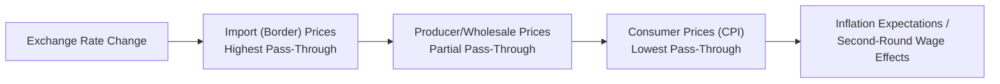

## Exchange Rate Pass-Through to Prices

### Definition

Exchange rate pass-through (ERPT) refers to the degree to which changes in the nominal exchange rate translate into changes in domestic prices — most directly import prices, but also, through further transmission, producer prices and ultimately consumer prices. It is typically expressed as an elasticity: the percentage change in a price level resulting from a one percent change in the exchange rate.

$$ERPT = \frac{\%\Delta P}{\%\Delta E}$$

where $P$ is a relevant price index (import prices, producer prices, or consumer prices) and $E$ is the nominal exchange rate, conventionally defined as the domestic-currency price of foreign currency (so a rise in $E$ represents a domestic currency depreciation).

**Complete pass-through** occurs when $ERPT = 1$: a 10% depreciation of the domestic currency raises import prices in domestic currency terms by exactly 10%, leaving the foreign-currency (exporter's) price unchanged. **Incomplete pass-through** occurs when $0 < ERPT < 1$: part of the exchange rate change is absorbed elsewhere (typically in the exporter's markup), so domestic prices rise by less than the full percentage depreciation. **Zero pass-through** ($ERPT = 0$) means domestic prices are entirely insulated from exchange rate movements.

### Theoretical Benchmark: Law of One Price and PPP

The theoretical starting point for ERPT is the Law of One Price (LOOP), which states that in the absence of trade frictions, arbitrage should equalize the price of an identical good across countries once converted to a common currency:

$$P_{domestic} = E \times P_{foreign}$$

If this relationship holds exactly and $P_{foreign}$ (the foreign-currency export price) is fixed, then pass-through is complete and mechanical: any change in $E$ passes fully and immediately into $P_{domestic}$. Purchasing Power Parity (PPP) is the aggregate-price-level extension of this same logic across the whole economy. In reality, pass-through is empirically almost always incomplete, especially in the short run, which is one of the most robust "puzzles" in international macroeconomics relative to the frictionless LOOP/PPP benchmark.

### Why Pass-Through Is Incomplete: Pricing-to-Market and Markup Adjustment

The dominant explanation for incomplete pass-through is **pricing-to-market (PTM)**, developed prominently by Paul Krugman (1987) and formalized further by researchers such as Peter Betts and Michael Devereux. Under PTM, exporting firms with market power in the destination country adjust their markups in response to exchange rate movements rather than passing the full exchange rate change through to the local-currency price.

Consider an exporting firm selling into a foreign market, setting a destination-currency price $P^*$ as a markup $\mu$ over marginal cost $MC$ converted at the exchange rate:

$$P^* = \mu \times \frac{MC}{E}$$

If the exporter's home currency **appreciates** (their goods become more expensive to foreign buyers in foreign-currency terms at a constant markup), a profit-maximizing firm facing a downward-sloping demand curve in the destination market may choose to **compress its markup $\mu$** to keep $P^*$ from rising as much as the exchange rate move alone would imply — preserving market share at the cost of the exporter's own profit margin. This markup adjustment is the central mechanism generating incomplete pass-through.

**Factors that reduce pass-through (support markup absorption):**

- High market power/product differentiation, giving firms room to adjust margins rather than lose customers.
- High price sensitivity of foreign demand (elastic demand curves), making firms reluctant to raise local-currency prices fully.
- Local currency pricing (LCP) practices, where exporters explicitly set and hold prices in the destination market's currency for extended periods, absorbing exchange rate volatility into their own margins.
- Presence of local distribution costs and non-traded retail/distribution margins between the border price and the final consumer price, which dilute the exchange-rate-sensitive component of the final price.

### Stages of Pass-Through: Border to Consumer

Pass-through is not a single, uniform phenomenon; it typically weakens as prices move further along the distribution chain from the border to the final consumer.

1. **Import (border) price pass-through** — Typically the highest degree of pass-through, since these prices are closest to the actual transaction between the foreign exporter and domestic importer, with less added local value.
2. **Producer price pass-through** — Partially diluted by domestic value added, distribution costs, and local inputs mixed with imported inputs.
3. **Consumer price (CPI) pass-through** — Usually the lowest, as retail prices reflect substantial non-traded components (rent, local labor, retail markups) alongside the imported input cost, and often exhibit price stickiness (menu costs, contract rigidities) that delays adjustment.

[Inference] Empirical studies consistently find pass-through to import prices is meaningfully higher than pass-through to consumer prices across most economies studied, though the precise numerical gap varies by country, time period, and sector.

### Short-Run vs. Long-Run Pass-Through

Pass-through elasticities are typically estimated to be **lower in the short run and higher in the long run**, reflecting several dynamic frictions:

- **Nominal price rigidities** — Menu costs and pre-existing contracts mean firms do not instantaneously reprice all goods when the exchange rate moves.
- **Distribution and retail lags** — Time is required for exchange rate changes to work through supply chains, inventories (goods already purchased at the old exchange rate), and retail repricing cycles.
- **Firms' "wait and see" behavior** — Exporters may be uncertain whether an exchange rate movement is temporary or persistent, and may delay price adjustments until the change appears durable.

A commonly used empirical specification captures this dynamic adjustment with a distributed lag model:

$$\Delta p_t = \alpha + \sum_{i=0}^{n} \beta_i \Delta e_{t-i} + \sum_{j} \gamma_j X_{jt} + \epsilon_t$$

where $\Delta p_t$ is the change in the price index, $\Delta e_{t-i}$ are current and lagged changes in the exchange rate, and $X_{jt}$ are control variables (e.g., domestic demand conditions, foreign marginal cost proxies). The cumulative sum of the $\beta_i$ coefficients over the estimation horizon gives the long-run pass-through elasticity, while $\beta_0$ alone captures the immediate/contemporaneous (short-run) pass-through.

### Key Determinants of Pass-Through Magnitude

| Determinant | Effect on Pass-Through | Mechanism |
| --- | --- | --- |
| Market structure/competition | Lower pass-through under imperfect competition and product differentiation | Firms absorb exchange rate moves into markups rather than prices |
| Inflation environment | Higher pass-through in high-inflation economies | Firms reprice more frequently anyway, so exchange rate changes are incorporated faster |
| Exchange rate volatility/persistence | Higher pass-through when exchange rate changes are perceived as persistent rather than transitory | Firms are more willing to adjust prices to changes expected to last |
| Invoicing currency practices | Lower pass-through with local-currency invoicing/pricing; higher with producer/exporter-currency invoicing | Determines whose currency absorbs the exchange rate risk in the short run |
| Import share of consumption basket | Higher pass-through to CPI where imports are a larger share of consumption | Direct compositional weighting effect |
| Central bank credibility | Lower pass-through with high monetary policy credibility | Firms expect the central bank to stabilize inflation, dampening the incentive to fully reprice after a depreciation (a form of expectations anchoring) |

### The "Taylor Hypothesis" on Pass-Through and Monetary Credibility

John B. Taylor (2000) proposed an influential hypothesis linking declining exchange rate pass-through observed in many countries during the 1990s–2000s to improved monetary policy credibility. Under this view, when a central bank has a strong track record of maintaining low and stable inflation, firms rationally expect that any cost shock (including one from currency depreciation) will not translate into a sustained rise in aggregate inflation, since the central bank will act to keep inflation anchored. This expectation reduces firms' incentive to fully pass through exchange rate changes into their own prices, since they anticipate limited persistence in the shock's effect on the broader price level. [Inference] This is a widely cited but not universally accepted explanation; other explanations for declining pass-through in this period include increased trade openness/competition and changes in the composition of imports (e.g., toward China and other low-cost manufacturing sources with thin margins).

### Asymmetric Pass-Through: Appreciation vs. Depreciation

Empirical research has documented that pass-through can be asymmetric depending on the direction of the exchange rate movement:

- **Depreciation episodes** often show faster/higher pass-through, particularly for imported inputs and consumer goods, since exporters facing a weaker destination currency are less willing to absorb the full cost in reduced margins (protecting their own profitability), passing more of the increase to consumers.
- **Appreciation episodes** sometimes show slower/lower pass-through ("rockets and feathers" style dynamics, more commonly discussed in the fuel-price pass-through literature but also observed in exchange rate contexts), as firms may be more willing to retain wider margins when costs fall rather than immediately lowering consumer prices.

[Speculation] The precise degree and consistency of this asymmetry varies substantially by study, country, and sector, and is less firmly established than the general finding of incomplete pass-through itself.

### Worked Numerical Example

Suppose the domestic currency depreciates by 10% against the currency of a key trading partner ($\%\Delta E = +10\%$). Assume the following stylized empirical estimates:

- Import price pass-through elasticity: 0.7
- Producer price pass-through elasticity: 0.35
- Consumer price (CPI) pass-through elasticity: 0.15

**Effect on import prices:**

$$\%\Delta P_{import} = 0.7 \times 10\% = 7\%$$

Import prices in domestic currency rise by 7%, meaning foreign exporters have absorbed the remaining 3 percentage points of the depreciation into a smaller effective foreign-currency price/margin (incomplete pass-through of 0.7).

**Effect on producer prices:**

$$\%\Delta P_{producer} = 0.35 \times 10\% = 3.5\%$$

Domestic producer prices rise by only 3.5%, reflecting the diluting effect of domestic value-added and non-traded inputs blended with the more exchange-rate-sensitive imported input costs.

**Effect on consumer prices:**

$$\%\Delta P_{CPI} = 0.15 \times 10\% = 1.5\%$$

Consumer prices rise by just 1.5%, the smallest effect, reflecting the large share of non-traded goods and services, retail margins, and sticky pricing in the CPI basket.

This illustrates the typical "funnel" pattern: pass-through elasticities shrink as the price measure moves from the border toward the final consumer.

### Policy Implications for Monetary Policy and Inflation Targeting

- **Import inflation from depreciation** — Central banks running inflation-targeting regimes must judge how much of an exchange rate depreciation will pass through to consumer inflation to determine whether and how much to tighten policy in response. High pass-through economies (often smaller, more trade-open economies with less anchored inflation expectations) face a more direct policy tradeoff between accommodating a depreciation-driven growth benefit (via improved export competitiveness) and containing the resulting imported inflation.
- **Exchange rate as inflation shock absorber vs. transmitter** — In economies with low pass-through, exchange rate movements act more as a "shock absorber" that can adjust to external conditions (terms of trade shocks, capital flow changes) without generating large domestic inflation consequences, giving the central bank more room to tolerate currency movements. In high pass-through economies, exchange rate volatility itself becomes a more direct source of domestic inflation volatility, which can motivate more active exchange rate management or intervention (see also: "fear of floating").
- **Implications for currency union or peg decisions** — The magnitude of pass-through interacts with tradeoffs discussed in currency union analysis: higher pass-through can make maintaining independent monetary policy more valuable (currency movements matter more for domestic inflation), while very high and unstable pass-through in historically high-inflation, low-credibility economies can conversely make credible currency pegs or unions more attractive as a nominal anchor.
- **Structural/competition policy angle** — Because market structure and competition levels affect pass-through, some policymakers view domestic competition policy as an indirect lever affecting how exchange rate shocks propagate into consumer prices.

### Related Topics

- Purchasing Power Parity (absolute and relative) and its empirical failures
- Pricing-to-market and local-currency pricing models (Krugman, Betts-Devereux)
- Currency unions and monetary sovereignty tradeoffs
- Inflation targeting frameworks and central bank credibility
- Terms of trade shocks and small open economy models
- "Fear of floating" and exchange rate intervention behavior
- J-curve effect and trade balance dynamics following depreciation
- Marshall-Lerner condition
- Producer currency pricing vs. local currency pricing vs. dominant currency pricing (invoicing currency literature)