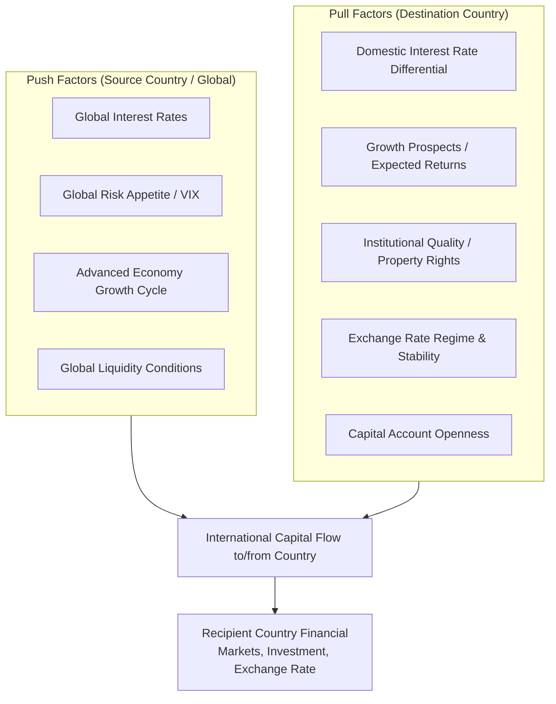
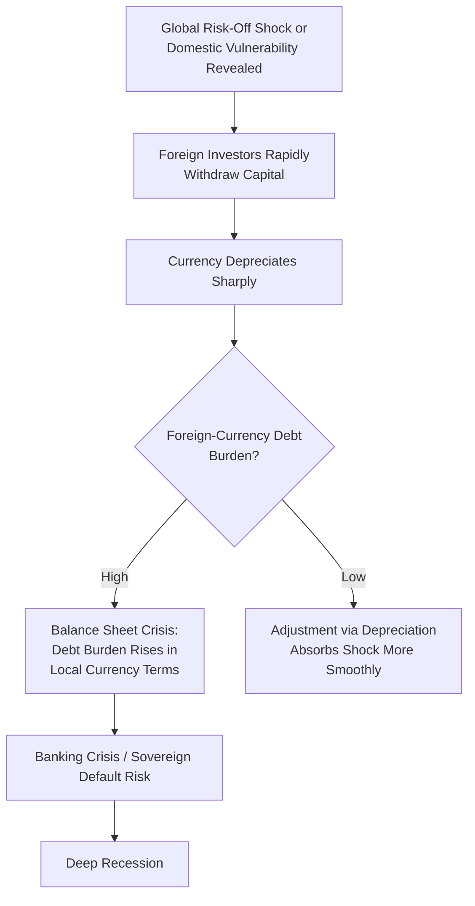

## Determinants of International Capital Flows

### Definition

International capital flows refer to the cross-border movement of financial capital between countries, encompassing purchases and sales of financial assets (equities, bonds, bank loans, foreign direct investment) between residents of different countries. These flows are recorded in the financial account of the balance of payments and are the counterpart to current account imbalances: a current account deficit must be financed by net capital inflows, and a current account surplus corresponds to net capital outflows (subject to the balance of payments identity and reserve changes).

$$CA + KA + \Delta R = 0$$

where $CA$ is the current account balance, $KA$ is the capital/financial account balance, and $\Delta R$ is the change in official reserve assets (sign conventions vary by source, but the identity captures that these components must sum to zero/balance in the overall balance of payments).

### Classification of Capital Flows

**By Type of Asset**

1. **Foreign Direct Investment (FDI)** — Cross-border investment involving a lasting management interest (conventionally, ownership of 10% or more of voting equity) in an enterprise, such as building a factory abroad or acquiring a controlling stake in a foreign firm. Generally considered the most stable and long-term-oriented form of capital flow.
2. **Portfolio Investment** — Cross-border purchases of equities and debt securities that do not confer a controlling/management interest, such as buying shares or bonds through financial markets. Typically more liquid and volatile than FDI, since portfolio positions can be unwound quickly.
3. **Other Investment** — Primarily cross-border bank loans, trade credit, and currency/deposit flows. Bank-intermediated flows in particular are often cited as highly sensitive to global liquidity conditions and can reverse abruptly.
4. **Reserve Assets** — Flows involving central bank/official holdings of foreign exchange reserves, gold, and IMF-related assets, reflecting official rather than private sector transactions.

**By Duration/Stability**

- **Long-term flows** — FDI and long-maturity portfolio debt/equity, generally viewed as more stable and less prone to sudden reversal.
- **Short-term flows ("hot money")** — Short-maturity bank loans, money market instruments, and speculative portfolio positions that can move in and out of a country rapidly in response to changing conditions, associated with higher volatility and crisis risk (see: sudden stops).

### Theoretical Framework: Push vs. Pull Factors

The dominant analytical framework for organizing the determinants of capital flows into and out of countries — particularly emerging markets — is the distinction between **push factors** (conditions in source/capital-exporting countries, largely advanced economies, that drive capital outward regardless of destination-country characteristics) and **pull factors** (conditions within the destination/recipient country that attract capital inflows).

### Push Factors (Global/Source-Country Determinants)

**1. Global Interest Rates (particularly US Federal Reserve policy rate)**

Since much of global dollar-denominated financing and a large share of international portfolio benchmarks are tied to US monetary conditions, changes in the US federal funds rate have outsized effects on global capital flows. When the Fed lowers rates, investors search for yield abroad, pushing capital toward higher-yielding emerging market and other assets; when the Fed raises rates, capital tends to flow back toward US assets, often triggering emerging market outflows (a dynamic frequently referenced in discussions of the "Fed tightening cycle" and its spillover effects, e.g., the 2013 "Taper Tantrum").

**2. Global Risk Appetite and Investor Sentiment**

Measured empirically via proxies such as the VIX (CBOE Volatility Index, often used as a proxy for global risk aversion), shifts in global risk appetite drive broad "risk-on" (capital flows toward higher-risk, higher-return assets including emerging markets) versus "risk-off" (capital retreats to perceived safe havens like US Treasuries, gold, and reserve currencies) cycles largely independent of any individual recipient country's own fundamentals.

**3. Business Cycle Conditions in Advanced/Capital-Source Economies**

Growth slowdowns in major capital-exporting economies can reduce the pool of investable surplus capital searching for returns abroad, while robust growth (combined with excess domestic saving) can increase capital available for outward investment.

**4. Global Liquidity and Quantitative Easing/Tightening**

Unconventional monetary policies such as quantitative easing (QE) in major economies (US, Eurozone, Japan) that expand the global supply of liquidity have historically been associated with surges in capital flows to emerging markets, as excess liquidity searches for yield; conversely, quantitative tightening (QT) or balance sheet reduction can contribute to capital flow reversals.

### Pull Factors (Domestic/Recipient-Country Determinants)

**1. Interest Rate Differentials**

Consistent with uncovered interest parity intuition, higher domestic interest rates relative to the source country (adjusted for expected exchange rate changes and risk premia) attract capital seeking higher yield. This is the mechanism most directly linked to interest-rate-driven capital flow models and the same mechanism underlying the twin deficits transmission channel discussed elsewhere in this chapter.

$$i_{domestic} \approx i_{foreign} + E[\%\Delta e] + \rho$$

where $i$ denotes nominal interest rates, $E[\%\Delta e]$ is the expected rate of currency depreciation, and $\rho$ is a risk premium compensating investors for country-specific risk.

**2. Growth Prospects and Expected Returns on Capital**

Countries with strong expected GDP growth, productive investment opportunities, and rising corporate earnings potential attract capital seeking higher marginal returns, consistent with basic neoclassical capital flow theory in which capital should flow from capital-abundant, lower-return advanced economies toward capital-scarce, higher-return developing economies (the "Lucas Paradox" notes this does not always occur as strongly as theory predicts, due to factors below).

**3. Institutional Quality and Governance**

Strength of property rights protection, rule of law, contract enforcement, regulatory quality, political stability, and control of corruption significantly affect investor willingness to commit capital, particularly long-term FDI. [Inference] This is frequently cited in the academic literature (including as a partial resolution to the Lucas Paradox) as a major reason capital does not flow as strongly toward capital-scarce, theoretically higher-return developing economies as simple neoclassical models would predict.

**4. Exchange Rate Regime and Currency Stability**

Perceived exchange rate stability (whether via credible pegs, currency unions, or well-managed floats) reduces currency risk for foreign investors, encouraging inflows; conversely, high exchange rate volatility or expectations of a large devaluation can deter inflows or trigger capital flight.

**5. Capital Account Openness and Financial Market Development**

The degree to which a country has liberalized capital controls, alongside the depth and liquidity of its domestic financial markets (developed bond and equity markets, efficient banking systems), directly determines the practical capacity for foreign capital to enter and be productively absorbed.

**6. Sovereign Credit Rating and Fiscal/External Sustainability**

Perceptions of government solvency, debt sustainability, and external financing needs (linked to current account and twin deficits dynamics) affect risk premia demanded by international investors, directly influencing capital flow volumes and costs.

**7. Taxation and Regulatory Treatment of Foreign Investment**

Corporate tax rates, capital gains treatment, repatriation rules, and sector-specific foreign ownership restrictions materially affect the after-tax return calculus for foreign investors, particularly for FDI decisions.

### Portfolio Choice Theory Perspective

From a portfolio balance/diversification perspective, international capital flows can also be understood through mean-variance portfolio optimization logic: global investors allocate capital across countries to maximize risk-adjusted expected return, given each country's expected asset returns, volatility, and correlation with the investor's existing portfolio. Countries offering diversification benefits (low correlation with an investor's home market returns) can attract capital flows even absent a pure yield differential, since diversification itself reduces overall portfolio risk for the investor. [Inference] This portfolio-based framework is a standard component of international finance theory though its relative empirical importance versus simpler yield-chasing behavior varies across studies and time periods.

### Capital Flow Volatility and "Sudden Stops"

A key applied concern in the capital flows literature, particularly following emerging market crises of the 1990s (Mexico 1994, Asian Financial Crisis 1997–98, Russia 1998), is the phenomenon of **sudden stops**: abrupt, large reversals of capital inflows, often triggered by a shift in global risk sentiment (push factor), a domestic shock revealing vulnerabilities (pull factor), or contagion from crises in other countries perceived as similar.

**Common features associated with sudden stop vulnerability:**

- Heavy reliance on short-term, foreign-currency-denominated debt ("original sin" — the inability of many emerging economies to borrow internationally in their own currency).
- Large current account deficits requiring continuous capital inflow financing.
- Currency/maturity mismatches between banks' foreign liabilities and domestic-currency assets.
- Fixed or heavily managed exchange rate regimes that cannot absorb the shock via depreciation, forcing painful reserve depletion or abrupt regime collapse.

### Contagion Effects

Capital flows to one country can be affected by crises or shocks in other, often geographically or structurally similar, countries — a phenomenon termed **contagion**. Mechanisms include:

- **Fundamental contagion** — Countries genuinely share economic linkages (trade, banking exposure) such that a shock in one plausibly signals real vulnerability in the other.
- **Pure/informational contagion** — Investors reassess risk in a country based on a crisis elsewhere due to imperfect information, herding behavior, or shared investor bases forced to de-risk their overall portfolios (e.g., emerging market funds facing redemptions sell across multiple country holdings simultaneously regardless of country-specific fundamentals).

[Inference] The relative empirical importance of fundamental versus pure contagion channels remains a debated question in the international finance literature, with evidence suggesting both mechanisms operate to varying degrees depending on the specific crisis episode studied.

### Policy Responses to Volatile Capital Flows

- **Capital controls** — Taxes, quantitative limits, or administrative restrictions on capital inflows or outflows, intended to reduce volatility or buy policy space (e.g., Chile's encaje reserve requirement on short-term inflows in the 1990s, Brazil's IOF tax on portfolio inflows in the 2010s).
- **Macroprudential policy** — Regulations targeting financial system resilience to capital flow volatility, such as limits on foreign-currency lending, countercyclical capital buffers, and loan-to-value ratio requirements, aimed at reducing systemic vulnerability without directly restricting flows.
- **Foreign exchange reserve accumulation** — Building substantial reserve buffers as self-insurance against sudden stops, allowing a country to smooth capital flow volatility without abrupt currency crises or the need for emergency external borrowing.
- **Exchange rate flexibility** — Allowing greater exchange rate flexibility so that currency depreciation, rather than reserve depletion or credit crunches, becomes the primary channel absorbing capital outflow pressure (connecting directly to the trilemma discussion under currency unions and monetary sovereignty).
- **IMF and multilateral facilities** — Precautionary credit lines (e.g., IMF Flexible Credit Line) that provide a backstop reducing the likelihood or severity of a sudden stop by assuring markets of available emergency financing.

### Worked Example: Push-Pull Decomposition

Consider an emerging market economy experiencing a surge in capital inflows. Analysts typically attempt to decompose the surge into push versus pull contributions using an empirical model such as:

$$Flow_{i,t} = \alpha + \beta_1 (i_{i,t} - i_{US,t}) + \beta_2 GrowthGap_{i,t} + \beta_3 VIX_t + \beta_4 FedRate_t + \beta_5 Institutions_i + \epsilon_{i,t}$$

where $Flow_{i,t}$ is net capital inflow to country $i$ at time $t$, $(i_{i,t} - i_{US,t})$ is the interest rate differential (pull), $GrowthGap_{i,t}$ is the country's growth differential relative to advanced economies (pull), $VIX_t$ and $FedRate_t$ are global push factors, and $Institutions_i$ is a time-invariant or slow-moving institutional quality proxy (pull/structural). If estimated coefficients show $VIX_t$ and $FedRate_t$ explain a large share of the variation in inflows across many different recipient countries simultaneously, this is interpreted as evidence that push factors dominate at that particular time; if country-specific pull variables explain more of the cross-country variation, pull factors are judged more important. [Inference] Empirical decompositions of this kind generally find that both push and pull factors matter, with their relative importance shifting depending on the global monetary and risk environment at any given time — push factors have often been found to dominate during periods of major shifts in advanced-economy monetary policy, such as the aftermath of the 2008 global financial crisis.

### Related Topics

- Sudden stops and emerging market financial crises
- Currency unions and monetary sovereignty tradeoffs
- Twin deficits hypothesis and current account financing
- Capital controls: theory, design, and effectiveness
- Uncovered and covered interest rate parity
- The Lucas Paradox and capital flows to developing countries
- Global financial cycle and US monetary policy spillovers
- Sovereign debt crises and default risk
- Balance of payments accounting framework
- Original sin and currency mismatch in emerging market borrowing