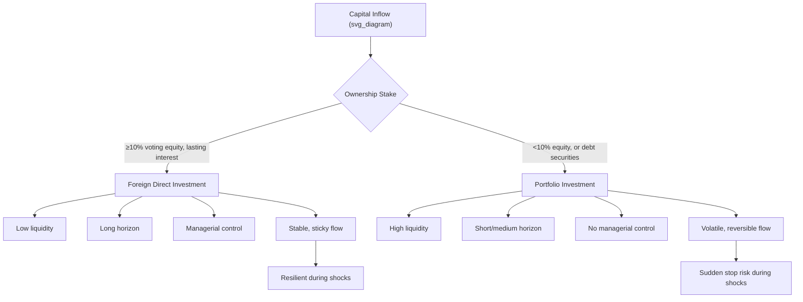

## Foreign Direct Investment versus Portfolio Investment

### Definitions

**Foreign Direct Investment (FDI)** is a category of cross-border investment in which an investor resident in one economy establishes a lasting interest in, and a significant degree of influence or control over, an enterprise resident in another economy. The IMF Balance of Payments Manual (BPM6) and OECD Benchmark Definition set the standard threshold at ownership of **10% or more of voting power** (ordinary shares) in the foreign enterprise. Below this threshold, the investment is classified as portfolio investment.

**Foreign Portfolio Investment (FPI)**, also called portfolio investment, refers to cross-border purchases of financial assets — equities (below the 10% threshold), bonds, money market instruments, and other securities — undertaken primarily for **financial return** rather than control or lasting managerial interest. The investor is a passive claimholder with no intention of influencing the operations of the issuing entity.

### Key Points

- **Ownership threshold**: The 10% voting-equity rule is the internationally agreed statistical convention (BPM6/OECD) separating FDI from portfolio equity investment. It is a statistical convention, not a precise economic measure of "control" — actual influence can exist below 10% or be absent above it, depending on shareholder dispersion. [Inference: the 10% line is a reporting convention; whether it corresponds to actual control in any given firm is a case-specific empirical question.]
- **Motive and horizon**: FDI is motivated by a lasting interest — market access, resource extraction, production efficiency, or strategic positioning — and is typically long-horizon. Portfolio investment is motivated by yield, capital appreciation, and portfolio diversification, and is typically shorter-horizon and more liquid.
- **Degree of control**: FDI confers managerial influence (board seats, technology transfer, operational decision-making). Portfolio investment confers no managerial control — the investor's recourse is to sell the asset ("exit"), not to intervene ("voice").
- **Components of FDI**: (1) equity capital, (2) reinvested earnings, (3) intercompany debt (loans between affiliated enterprises). Portfolio investment components: equity securities (non-controlling), long-term debt securities (bonds, notes), and short-term debt/money-market instruments.
- **Volatility ("hot money" distinction)**: Portfolio flows are generally far more liquid and reversible than FDI, since securities can be sold on secondary markets almost instantly, whereas divesting a factory, subsidiary, or majority stake is slow and costly. This makes portfolio flows more prone to sudden stops and reversals during shocks. [Inference: relative volatility is a well-documented empirical regularity in international finance literature, not a fixed law — specific episodes vary by country, asset class, and investor base.]
- **Balance of payments treatment**: Both are recorded in the **financial account**. FDI is disaggregated by direct investor/direct investment enterprise relationships (directional principle: outward vs. inward); portfolio investment is disaggregated by instrument (equity vs. debt securities).
- **Exchange rate risk transmission**: FDI returns are tied to underlying enterprise profitability and are less sensitive to short-term interest rate differentials. Portfolio investment, especially in debt instruments, is highly sensitive to interest rate differentials and expected exchange rate movements (uncovered interest parity dynamics).

### Comparative Table

| Dimension | Foreign Direct Investment (FDI) | Portfolio Investment (FPI) |
| --- | --- | --- |
| Ownership threshold | ≥10% voting equity | <10% voting equity, or any share of debt securities |
| Investor motive | Lasting interest, control, strategic presence | Financial return, diversification, liquidity |
| Time horizon | Long-term | Short- to medium-term |
| Liquidity | Low (illiquid; physical/managerial assets) | High (tradable on secondary markets) |
| Volatility | Relatively stable | Relatively volatile ("hot money" prone) |
| Control/influence | Managerial and operational influence | No managerial influence |
| Typical instruments | Equity capital, reinvested earnings, intercompany loans | Equities, bonds, money market instruments |
| Response to interest rate differentials | Weak | Strong |
| Technology/knowledge transfer | Often significant | Minimal to none |
| BOP classification | Financial account — direct investment | Financial account — portfolio investment |

### Theoretical Underpinnings

**FDI theory** draws on:

- **Dunning's OLI (eclectic) paradigm**: firms invest abroad when they possess **O**wnership advantages (proprietary technology, brand), **L**ocation advantages (host-country market size, resources, labor costs), and **I**nternalization advantages (it is more efficient to own foreign operations than to license or export).
- **Market-seeking, resource-seeking, efficiency-seeking, and strategic asset-seeking** motives, a taxonomy commonly used to classify FDI by investor rationale.

**Portfolio investment theory** draws on:

- **Modern Portfolio Theory (Markowitz)**: international diversification reduces portfolio risk when asset returns across countries are imperfectly correlated.
- **Uncovered Interest Rate Parity (UIP)** and **covered interest arbitrage**: portfolio capital flows respond to interest rate differentials adjusted for expected exchange rate changes.
- **Push-pull framework**: portfolio flows to emerging markets are explained by "push" factors (global liquidity conditions, advanced-economy monetary policy) and "pull" factors (domestic growth prospects, institutional quality, yield).

### Macroeconomic Effects

**Effects of FDI on the host economy:**

- Augments domestic capital stock and productive capacity without generating debt-service obligations (equity-like risk-sharing).
- Potential for technology spillovers, managerial know-how transfer, and integration into global value chains.
- Can affect the **current account** through repatriated profits (recorded as investment income debits) and through associated trade in intermediate/final goods.
- May crowd in or crowd out domestic investment depending on the nature of the FDI (greenfield vs. mergers and acquisitions).

**Effects of portfolio investment on the host economy:**

- Provides financing for government and corporate borrowing (bond markets) and deepens equity markets, potentially lowering the cost of capital and improving market liquidity.
- Because of high reversibility, large portfolio inflows can appreciate the domestic currency and inflate asset prices; abrupt reversals ("sudden stops") can trigger currency depreciation, asset price collapses, and balance-of-payments crises.
- Widely implicated in emerging-market financial crises (e.g., the 1994 Mexican peso crisis and the 1997–98 Asian financial crisis involved substantial portfolio and short-term capital reversals). [Inference: causal weighting of portfolio flows versus other factors — such as fixed exchange rate regimes and banking-sector fragility — in these specific crises is subject to ongoing academic debate.]

### Risk and Volatility Comparison (Diagram)

### Worked Example

**Scenario**: A US-based automaker builds and operates a new assembly plant in Vietnam, holding 100% of the subsidiary's equity. Simultaneously, a US mutual fund purchases 3% of the shares of a Vietnamese telecom company on the Ho Chi Minh Stock Exchange, with no board representation.

- The automaker's investment is **FDI**: ownership exceeds 10%, the investor operates the plant directly, and the investment is illiquid (a factory cannot be sold overnight).
- The mutual fund's investment is **portfolio investment**: the 3% stake is below the 10% threshold, the fund has no operational control, and the shares can be sold on the exchange within seconds.
- **BOP recording**: Vietnam's balance of payments records the automaker's capital as an **inward FDI liability** (financial account, direct investment); the telecom shares purchase is recorded as an **inward portfolio investment liability** (financial account, portfolio investment — equity securities).
- If Vietnam experiences a sudden confidence shock (e.g., a regional currency crisis), the mutual fund can liquidate its stake within days, contributing to capital flight and currency depreciation pressure. The automaker's plant, by contrast, is not readily divested and its capital stock remains in place, though repatriated profits (investment income outflows) may still be affected by currency movements.

### Policy Considerations

- **Capital controls**: Many countries apply differentiated regulatory treatment — FDI is often actively courted (tax incentives, special economic zones) while short-term portfolio flows may be subject to controls (e.g., unremunerated reserve requirements, Tobin-tax-style levies, minimum holding periods) precisely because of their volatility.
- **Sequencing of capital account liberalization**: A common policy prescription in the international finance literature is to liberalize FDI inflows before liberalizing short-term portfolio and debt flows, given the differing risk profiles. [Inference: this sequencing view reflects a widely cited strand of policy literature, notably associated with IMF and World Bank work on capital account liberalization; it is a policy recommendation, not a universally applied rule, and country practice varies.]
- **Data/monitoring implications**: Because portfolio flows are more volatile, central banks and finance ministries typically monitor portfolio investment data (and associated reserve adequacy) more closely for early-warning purposes than FDI data.

### Related Topics

- Balance of Payments accounting: current account, capital account, financial account structure
- Sudden stops and capital flow reversals in emerging markets
- The Dunning OLI (eclectic) paradigm of multinational enterprise
- Push and pull factors in international capital flows
- Uncovered interest rate parity and covered interest arbitrage
- Capital controls and the "impossible trinity" (Mundell–Fleming trilemma)
- Greenfield investment versus mergers and acquisitions as FDI modes
- Sovereign debt and international bond markets
- Currency crises: Mexican peso crisis (1994), Asian financial crisis (1997–98)
- Global value chains and multinational enterprise strategy