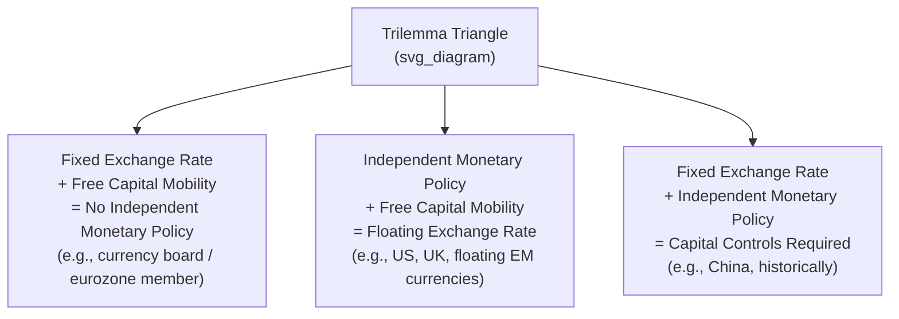

## Capital Account Liberalization and Its Risks

### Definition and Scope

Capital account liberalization (CAL) refers to the removal of government-imposed restrictions on cross-border capital flows — that is, transactions in financial assets between residents and non-residents. This includes foreign direct investment (FDI), portfolio investment (equities, bonds), cross-border bank lending, and derivatives transactions. It is distinct from **current account liberalization** (removing restrictions on trade in goods and services), though the two are often pursued together as part of broader external sector opening.

$$\text{Balance of Payments} = \text{Current Account} + \text{Capital Account} + \text{Financial Account} + \text{Errors and Omissions} = 0$$

**Note on terminology**: In IMF Balance of Payments Manual (BPM6) terminology, what is colloquially called the "capital account" in this context (covering FDI, portfolio flows, and other investment) is technically the **financial account**. The "capital account" in BPM6 is a narrow category covering capital transfers and non-produced non-financial assets. This document uses "capital account liberalization" in its conventional macroeconomics/policy usage, referring to liberalization of the financial account.

### Forms of Capital Controls Being Liberalized

- **Quantity-based controls**: Limits on the volume of capital that can enter or exit (e.g., caps on foreign ownership shares, quotas on external borrowing)
- **Price-based controls**: Taxes on capital flows (e.g., Chile's unremunerated reserve requirement in the 1990s, Tobin-tax-style levies on short-term inflows)
- **Administrative controls**: Approval requirements, licensing, or outright prohibitions on certain transaction types
- **Differentiated controls by flow type**: Many liberalization sequences distinguish between FDI (typically liberalized first, as it is considered more stable) and short-term portfolio/debt flows (often liberalized last, or retained under some restriction, due to volatility concerns)

### Theoretical Case for Liberalization

**1. Efficient Global Allocation of Capital**

In a neoclassical framework, capital should flow from capital-abundant, low-return countries to capital-scarce, high-return countries, raising global output. Open capital accounts allow this reallocation.

$$MPK_{\text{home}} = MPK_{\text{foreign}} \text{ (in equilibrium, adjusted for risk premia)}$$

where $MPK$ denotes the marginal product of capital.

**2. Consumption Smoothing**

Open capital markets allow countries to borrow during downturns and save/lend during booms, smoothing consumption relative to a closed-economy path where consumption must track domestic output one-for-one.

**3. Risk Diversification**

Residents can hold internationally diversified portfolios, reducing exposure to purely domestic (idiosyncratic) shocks.

**4. Discipline Effect on Domestic Policy**

The threat of capital flight can discipline governments against unsustainable fiscal or monetary policies (though this is also cited as a cost — see below).

**5. Financial Sector Development**

Exposure to foreign capital and foreign financial institutions can transfer technology, risk-management practices, and governance standards to the domestic financial sector.

**6. Signaling and Credibility**

Liberalization can signal a government's commitment to market-oriented reform, potentially attracting long-term investment beyond the direct capital account effects.

### The Empirical Puzzle

**[Unverified]** A substantial body of empirical literature (notably associated with Dani Rodrik, Joseph Stiglitz, and IMF research staff reassessments after the Asian Financial Crisis) has found that the growth benefits of capital account liberalization are much weaker and less robust in the data than the theoretical case predicts, particularly for portfolio and short-term debt flows as opposed to FDI. This is often referred to as the "Lucas paradox" in a related form — capital does not flow as strongly from rich to poor countries as simple neoclassical theory predicts, and where it does flow rapidly, it is not reliably associated with higher growth in the recipient country.

The dominant explanation in the literature centers on **preconditions**: liberalization delivers benefits primarily when a country has already achieved:

- Sound macroeconomic policy (fiscal discipline, credible monetary policy)
- Adequate financial sector supervision and regulation
- Sufficiently developed domestic financial markets
- Strong institutions and rule of law (contract enforcement, low corruption)

Liberalizing before these preconditions are met is the central risk channel discussed below.

### Risks of Capital Account Liberalization

**1. Sudden Stops and Reversals**

A "sudden stop" (terminology from Guillermo Calvo) occurs when capital inflows abruptly halt or reverse, typically triggered by a shift in investor sentiment, a shock to global risk appetite, or a re-assessment of country-specific risk.

- **Mechanism**: A country running a current account deficit financed by capital inflows suddenly loses that financing. It must then rapidly compress the current account deficit (via a sharp fall in imports/domestic demand) or draw down reserves, often accompanied by a currency collapse.
- Sudden stops are typically self-reinforcing: currency depreciation raises the local-currency value of foreign-currency debt (balance sheet effects), triggering defaults or distress, which further worsens sentiment and accelerates outflows.

**2. Currency and Maturity Mismatches ("Original Sin")**

Emerging market borrowers often cannot borrow internationally in their own currency (a phenomenon termed "original sin" by Eichengreen and Hausmann). This creates:

- **Currency mismatch**: Liabilities denominated in foreign currency, assets/income in domestic currency. A depreciation directly worsens the debtor's balance sheet.
- **Maturity mismatch**: Short-term foreign liabilities funding longer-term domestic assets (common in bank lending), creating rollover risk if foreign creditors decline to renew short-term credit lines.

**3. Boom-Bust Credit Cycles**

Capital inflows can fuel excessive domestic credit growth, asset price bubbles (real estate, equities), and overheating, followed by a painful bust when inflows reverse. This was a central feature of the 1994 Mexican ("Tequila") crisis and the 1997–1998 Asian Financial Crisis.

**4. Loss of Monetary Policy Autonomy (The Trilemma)**

Under the **impossible trinity** (Mundell-Fleming trilemma), a country cannot simultaneously maintain (1) free capital mobility, (2) a fixed exchange rate, and (3) independent monetary policy — only two of the three are jointly achievable.

Countries that liberalize the capital account while also trying to manage the exchange rate lose the ability to set interest rates according to domestic conditions — they must instead set rates to defend the currency peg.

**5. Contagion**

Capital account openness can transmit crises across borders even absent direct trade or fundamental linkages, through channels such as:

- Common creditor effects (a bank or fund facing losses in one country liquidates positions elsewhere to meet redemptions/margin calls)
- Wake-up call effects (a crisis in one country prompts investors to reassess similar-looking countries)
- Pure panic/herding effects

**6. Procyclicality**

Capital flows to emerging markets tend to be procyclical — inflows surge during global booms/low interest rate environments (particularly reflecting "push factors" from advanced economies, such as low U.S. interest rates) and reverse sharply during global tightening or risk-off episodes, amplifying rather than smoothing the domestic business cycle. This runs counter to the theoretical consumption-smoothing benefit described above.

**7. Real Exchange Rate Appreciation and Dutch-Disease-like Effects**

Large capital inflows can appreciate the real exchange rate, eroding export competitiveness in tradable sectors — a dynamic structurally similar to (though distinct in cause from) Dutch disease.

**8. Constraints on Fiscal Policy**

Open capital markets subject sovereign borrowing costs to real-time market discipline; a loss of investor confidence can trigger sudden increases in sovereign borrowing costs, constraining counter-cyclical fiscal policy exactly when it may be most needed (a dynamic prominent in the Eurozone periphery crisis of 2010–2012, discussed under [[optimal-currency-areas]] logic more broadly for EMU members without their own currency, and equally relevant for any liberalized emerging economy).

### The Sequencing Debate

Given these risks, a substantial policy literature (associated with the IMF's post-1990s reassessment and economists such as Ronald McKinnon) argues for **sequenced liberalization** rather than a "big bang" approach:

**Recommended sequencing (illustrative, contested in details):**

1. Achieve macroeconomic stabilization (fiscal balance, low and stable inflation)
2. Liberalize current account (trade) transactions
3. Strengthen domestic financial sector regulation and supervision
4. Liberalize long-term, stable flows first (FDI)
5. Liberalize outward flows before, or alongside, inward short-term portfolio and debt flows
6. Liberalize short-term capital flows and cross-border bank lending last, once domestic financial institutions can manage the associated risks

**[Inference]** The underlying logic is that premature liberalization of volatile, short-term flows before domestic financial institutions and regulators can supervise the resulting risk exposures is the specific channel most associated with crisis episodes, rather than capital account openness in general.

### The IMF's Evolving Institutional View

**[Unverified — reflects institutional position as of published IMF statements]** The IMF historically promoted capital account liberalization as a near-universal objective (this was formally proposed as an amendment to the IMF Articles of Agreement in 1997, shortly before the Asian Financial Crisis, and was not adopted). Following the Asian Financial Crisis and the 2008 Global Financial Crisis, the IMF adopted a more nuanced "Institutional View" (2012) that:

- Recognizes capital flows can bring substantial benefits but also risks
- Acknowledges that capital flow management measures (CFMs), including capital controls, can be appropriate tools in some circumstances — not merely a policy failure to be phased out
- Emphasizes the importance of preconditions and sequencing rather than treating full liberalization as an unconditional goal
- Distinguishes CFMs used for macroprudential/financial stability purposes from those used to avoid necessary macroeconomic adjustment

### Case Illustrations

**Chile (1991–1998) — Price-based controls on inflows**: Imposed an unremunerated reserve requirement (URR), effectively a tax on short-term capital inflows, aimed at shifting the composition of inflows toward longer maturities without banning capital movement outright. **[Unverified]** Evidence on its effectiveness at reducing volume versus altering composition/maturity of inflows is mixed in the empirical literature.

**Asian Financial Crisis (1997–1998)**: Thailand, Indonesia, South Korea, and others had liberalized capital accounts (particularly short-term bank borrowing) while maintaining pegged exchange rates and underdeveloped financial supervision. Large short-term foreign-currency-denominated bank liabilities, combined with a loss of confidence, produced severe sudden stops, currency collapses, and banking crises — a frequently cited textbook illustration of liberalization risk materializing without adequate preconditions.

**China — gradualist approach**: Maintained extensive capital controls for decades while liberalizing the current account and gradually opening specific, narrow channels (e.g., Qualified Foreign Institutional Investor programs, Stock Connect schemes) rather than full liberalization, often cited as a deliberate application of the sequencing logic above.

### Illustrative Numerical Framing: Sudden Stop Dynamics

Consider a country with a current account deficit of 6% of GDP financed by capital inflows. If investor sentiment shifts and net capital inflows fall to zero:

- The current account deficit must close by roughly the same magnitude (absent reserve drawdown), typically achieved through a combination of import compression (falling domestic demand) and currency depreciation improving net exports
- **[Inference]** The larger the pre-existing current account deficit and the greater the reliance on short-term/portfolio (versus FDI) financing, the sharper the required adjustment tends to be, since FDI is generally less prone to rapid reversal than portfolio and short-term debt flows

### Summary Table: Benefits vs. Risks

| Dimension | Benefit (Theoretical) | Risk (Empirical Concern) |
| --- | --- | --- |
| Capital allocation | Flows to highest-return uses globally | Flows driven by global "push" factors, not local fundamentals |
| Consumption smoothing | Borrow in bad times, save in good times | Procyclical flows amplify booms and busts |
| Monetary policy | N/A | Loss of autonomy under fixed/managed exchange rates (trilemma) |
| Financial development | Technology/governance transfer | Credit booms outpace supervisory capacity |
| Currency exposure | Diversification | Currency/maturity mismatch ("original sin") |
| Crisis transmission | N/A | Contagion via common creditors and sentiment shifts |
| Sovereign policy space | Market discipline | Fiscal policy constrained by market confidence swings |

### Related Topics

- Sudden stops and the Calvo cycle
- Mundell-Fleming trilemma and monetary policy autonomy
- Sovereign debt crises and self-fulfilling debt dynamics
- Macroprudential policy and capital flow management measures (CFMs)
- The Asian Financial Crisis (1997–1998) as a case study
- Original sin and currency mismatch in emerging market debt
- Sterilized intervention and reserve accumulation as self-insurance
- Optimal currency areas theory (related trilemma logic)
- Exchange rate regime choice: fixed, floating, and intermediate (managed float) regimes