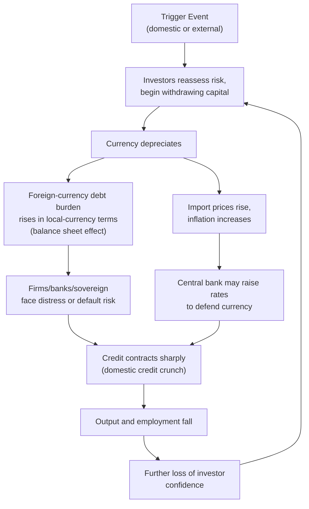

## Sudden Stops and Capital Flight

### Definition and Distinction

**Sudden stop**: An abrupt, large deceleration or reversal in net capital inflows to a country, typically defined empirically as a fall in capital inflows of at least two standard deviations below the historical mean, occurring over a short period. The term originates with Guillermo Calvo's work analyzing emerging market crises in the 1990s.

**Capital flight**: The rapid outflow of capital (both foreign and domestic-owned) from a country, typically driven by loss of confidence in domestic economic conditions, political stability, or the value of the domestic currency. Capital flight can occur independently of a sudden stop (i.e., a country's own residents moving assets abroad even while gross foreign inflows continue) but the two frequently coincide and reinforce one another during crises.

$$\text{Net Capital Flows} = \text{Gross Inflows (foreign investment)} - \text{Gross Outflows (capital flight + repatriation)}$$

A sudden stop is defined on **net** flows; it can result from a collapse in gross inflows, a surge in gross outflows (capital flight), or both simultaneously.

### Theoretical Mechanism

**1. Triggers**

Sudden stops are typically triggered by a shift in the perceived risk-return profile of holding a country's assets. Triggers fall into two broad categories:

- **Idiosyncratic/domestic triggers**: Deteriorating fiscal position, political instability, banking sector weakness, a policy misstep, or revelation of previously hidden vulnerabilities (e.g., unsustainable current account deficits, contingent liabilities)
- **External/global triggers ("push factors")**: Rising interest rates in advanced economies (raising the opportunity cost of holding emerging market assets), a global risk-off shift (flight to safety), commodity price shocks, or contagion from a crisis elsewhere

**2. The Self-Reinforcing Spiral**

Once a sudden stop begins, several amplification mechanisms typically operate simultaneously:

This feedback loop is the core reason sudden stops are associated with output collapses far larger than the initiating shock alone would suggest — the mechanism is sometimes described in the literature as a "financial accelerator" or "balance sheet crisis" dynamic (associated with work by Calvo, and separately with Bernanke-Gertler-style financial accelerator models applied to open economies).

**3. Why the Exchange Rate Amplifies Rather Than Cushions**

In a standard Mundell-Fleming framework, currency depreciation should be *stabilizing*: it improves competitiveness and supports net exports, helping close a current account deficit. However, when liabilities are denominated in foreign currency (the "original sin" problem, per Eichengreen and Hausmann) and balance sheets are highly leveraged, depreciation instead directly *worsens* domestic balance sheets faster than trade competitiveness gains can offset it. This is often called the **contractionary depreciation** effect, distinguishing sudden-stop crises from textbook expenditure-switching adjustment.

$$\text{Net Effect of Depreciation} = \underbrace{\Delta(\text{Net Exports})}_{\text{expansionary}} - \underbrace{\Delta(\text{Real value of FX debt burden})}_{\text{contractionary}}$$

**[Inference]** When foreign-currency-denominated liabilities are large relative to GDP or to export revenue, the contractionary balance-sheet term tends to dominate the expansionary trade term, which is why sudden-stop episodes are frequently associated with deep recessions rather than the export-led recoveries a simple trade model would predict.

### Precursor Conditions (Vulnerability Indicators)

Empirical crisis literature identifies a set of conditions that raise the probability and severity of a sudden stop:

- **Current account deficit financed by short-term/portfolio flows** rather than FDI (FDI is empirically far less prone to reversal)
- **Currency and maturity mismatches**: foreign-currency-denominated, short-term liabilities funding longer-term or local-currency assets
- **Fixed or heavily managed exchange rate regimes**: these regimes tend to encourage unhedged foreign-currency borrowing (since the exchange rate appears stable) and constrain the central bank's ability to respond flexibly once a stop begins
- **Low foreign exchange reserves relative to short-term external debt** (the Guidotti-Greenspan rule of thumb suggests reserves should cover at least one year of short-term external debt)
- **High reliance on external financing (large gross external financing needs) relative to GDP**
- **Weak or under-supervised banking sector**, prone to credit booms during the inflow phase
- **Political instability or weak institutional credibility**

### Capital Flight: Additional Considerations

Capital flight specifically emphasizes outflows, including by domestic residents, and is often associated with:

- **Currency substitution/dollarization behavior**: residents shifting savings into foreign currency or offshore accounts in anticipation of devaluation or capital controls
- **Anticipation effects**: capital flight frequently *precedes* formal crisis recognition, as informed domestic actors (sometimes including politically connected insiders) exit before the broader market
- **Measurement difficulty**: capital flight is harder to measure directly than gross portfolio flow data, since it often occurs through misinvoicing of trade transactions, unrecorded transfers, or the "errors and omissions" balance of payments residual
- **Policy responses**: capital controls on outflows (e.g., Malaysia in 1998, Iceland in 2008, Greece in 2015) are sometimes imposed specifically to stem capital flight during acute crises, a use case increasingly recognized by the IMF's post-2012 Institutional View as a legitimate emergency tool rather than solely a sign of policy failure

### Policy Responses During a Sudden Stop

**1. Exchange Rate Policy**

- Allow depreciation (if debt is not heavily dollarized) to restore competitiveness
- Defend the peg via reserve sales and/or interest rate hikes (costly, and only sustainable while reserves last)

**2. Monetary Policy**

- Raise interest rates to stem outflows and defend the currency — but this is contractionary domestically, creating the classic sudden-stop policy dilemma: tightening to defend the currency deepens the domestic recession, while easing to support the economy accelerates outflows

**3. Fiscal Policy**

- Typically constrained: market access may be lost or severely curtailed exactly when counter-cyclical spending is most needed, often necessitating pro-cyclical austerity (a widely cited critique of crisis-response programs, particularly in the Eurozone periphery and various IMF program contexts)

**4. Capital Controls / Capital Flow Management Measures (CFMs)**

- Temporary restrictions on outflows to buy time for orderly adjustment (e.g., Malaysia 1998, Iceland 2008)
- Increasingly recognized in the post-2012 IMF Institutional View as an appropriate crisis-management tool in specific circumstances, rather than purely a last-resort admission of failure

**5. External Support**

- IMF or bilateral/multilateral emergency financing to bridge the financing gap and restore confidence
- Debt restructuring where the debt burden is assessed as unsustainable rather than merely a liquidity problem

**6. Self-Insurance (Ex-Ante, Prevention)**

- Reserve accumulation substantially above short-term external debt levels (post-Asian-crisis policy shift observed across many emerging markets)
- Development of local-currency government bond markets to reduce reliance on foreign-currency borrowing
- Macroprudential limits on foreign-currency lending/borrowing by domestic banks and corporates

### Case Illustrations

**Mexico, 1994–1995 ("Tequila Crisis")**: Mexico had financed a large current account deficit substantially through short-term, dollar-linked government securities (Tesobonos). A combination of political shocks and rising U.S. interest rates triggered a sudden stop; the peso collapsed, and a large IMF/U.S. Treasury support package was required.

**East Asia, 1997–1998**: Thailand, Indonesia, South Korea, and others experienced severe sudden stops after years of large short-term foreign-currency bank borrowing under pegged exchange rate regimes. The contractionary depreciation dynamic (currency collapse worsening dollar-denominated balance sheets) was a central feature distinguishing this crisis from earlier, more purely trade-driven balance-of-payments crises.

**Argentina, 2001–2002**: Collapse of the currency board (peg to the U.S. dollar) after a sustained sudden stop and capital flight, culminating in the largest sovereign default at the time and a sharp economic contraction.

**Eurozone periphery, 2010–2012**: A "sudden stop" in cross-border interbank and portfolio flows to Greece, Portugal, Ireland, Spain, and Cyprus, with the important distinction that these were within a currency union — the exchange rate could not depreciate, so adjustment had to occur through internal devaluation (wage/price deflation) and, in Greece's case, eventual capital controls (2015).

### Illustrative Numerical Framing

Suppose a country runs a current account deficit of 5% of GDP, financed primarily by short-term portfolio debt, and holds foreign exchange reserves equal to only 60% of its short-term external debt (below the Guidotti-Greenspan benchmark of 100%). If a global risk-off shock causes net portfolio inflows to fall to zero:

- The current account deficit must close abruptly (via import compression and depreciation) since reserves are insufficient to fully bridge the financing gap
- **[Inference]** Given the reserve shortfall relative to short-term debt, the adjustment is more likely to require external emergency financing or a sharp domestic demand contraction than a gradual, orderly rebalancing, consistent with the empirical association between low reserve-to-short-term-debt ratios and higher sudden-stop severity found in the crisis literature

### Distinguishing Sudden Stops from Ordinary Capital Flow Volatility

| Feature | Ordinary Volatility | Sudden Stop |
| --- | --- | --- |
| Magnitude | Within normal historical range | ≥ 2 standard deviations below mean inflow |
| Duration | Short-lived, often reverses quickly | Can persist for multiple quarters/years |
| Real economy impact | Limited | Typically associated with sharp output contraction |
| Balance sheet effects | Minimal | Often severe, especially with FX-denominated debt |
| Policy response needed | Minimal / normal central bank operations | Often requires emergency measures (rate hikes, controls, external financing) |

### Related Topics

- Capital account liberalization and sequencing
- Original sin and currency/maturity mismatch in emerging market debt
- The Mundell-Fleming trilemma and exchange rate regime choice
- Balance sheet / financial accelerator models of crisis transmission
- The Guidotti-Greenspan reserve adequacy rule
- Contagion channels: common creditor and wake-up-call effects
- IMF program design and conditionality during balance of payments crises
- Sovereign debt restructuring and debt sustainability analysis
- Internal devaluation under fixed exchange rate/currency union constraints