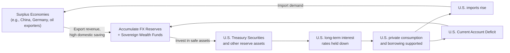

## Global Imbalances and Reserve Currency Dynamics

### Definition and Scope

**Global imbalances** refer to the persistent, large current account surpluses and deficits accumulated by major economies in the international system — most prominently, sustained U.S. current account deficits mirrored by sustained surpluses in economies such as China, Germany, Japan, and oil-exporting nations. **Reserve currency dynamics** refers to the role a small number of currencies (predominantly the U.S. dollar) play as the dominant medium for international trade invoicing, cross-border financial contracts, and central bank foreign exchange reserve holdings, and how this role interacts with, and partly explains, the pattern of global imbalances.

$$\text{Current Account} = \text{National Saving} - \text{National Investment} = S - I$$

By definition, since global current accounts must sum to approximately zero (abstracting from statistical discrepancies), persistent deficits in some countries require persistent, offsetting surpluses elsewhere.

### Accounting Identity Foundations

The current account balance can be decomposed via the national income identity:

$$CA = (S_{private} - I_{private}) + (T - G)$$

where $(T-G)$ is the government fiscal balance (public saving) and $(S_{private} - I_{private})$ is private net saving. A current account deficit therefore reflects some combination of low private saving relative to investment and/or a fiscal deficit — a link central to the U.S. "twin deficits" debate (fiscal deficit and current account deficit moving together, though the empirical relationship is not one-to-one and is contested).

### The U.S. as Global Imbalance Center

The United States has run persistent current account deficits for most of the period since the early 1980s (with a brief exception in the early 1990s), financed by capital inflows from the rest of the world.

**Key features:**

- The U.S. is the primary issuer of the world's dominant reserve currency (the U.S. dollar)
- U.S. Treasury securities are the primary global "safe asset," held extensively by foreign central banks, sovereign wealth funds, and private investors
- The U.S. current account deficit is, by the accounting identity above, the mirror image of the rest of the world's aggregate net saving surplus vis-à-vis the U.S.

### Explanatory Frameworks for Global Imbalances

**1. The "Global Saving Glut" Hypothesis (Bernanke, 2005)**

Ben Bernanke argued that global imbalances in the mid-2000s were driven primarily by a surplus of desired saving over desired investment in surplus countries (particularly emerging Asia and oil exporters), which was pushed into U.S. and other advanced-economy safe assets due to:

- Underdeveloped domestic financial markets in surplus economies (unable to efficiently intermediate high domestic saving into domestic investment)
- Precautionary reserve accumulation motives following the 1997–1998 Asian Financial Crisis (a direct, often-cited link between the crisis literature on [[sudden-stops-capital-flight]] and subsequent reserve-accumulation behavior)
- Demographic and structural factors elevating saving rates in surplus economies (notably China)

Under this view, capital flows "uphill" from the surplus economies into safe U.S. assets, which — per standard portfolio-balance mechanics — helps depress U.S. long-term interest rates and, some argue, contributed to pre-2008 credit and housing market conditions.

**2. The "Exorbitant Privilege" View (Rueff, popularized in the Triffin/de Gaulle era; explored further by Gourinchas and Rey)**

The term "exorbitant privilege" (attributed to French officials in the 1960s) describes the benefit the U.S. derives from issuing the world's reserve currency: it can borrow internationally in its own currency, run persistent external deficits without the balance-of-payments discipline that would typically be imposed on non-reserve-currency countries, and earn a positive net investment income position for extended periods (borrowing cheaply via safe liquid liabilities while investing in higher-yielding foreign assets — the "banker to the world" pattern documented by Gourinchas and Rey).

**3. Bretton Woods II Hypothesis (Dooley, Folkerts-Landau, Garber, 2003)**

This view characterizes the post-2000 international monetary arrangement as an implicit revived Bretton Woods system, in which emerging Asian economies (especially China) pursue export-led growth strategies supported by managed/undervalued exchange rates, financing the resulting U.S. current account deficit through reserve accumulation (buying U.S. Treasuries) as a byproduct of exchange rate management — an arrangement mutually reinforcing in the short run but raising sustainability questions over the long run.

**4. Structural/Demand-Side Explanations**

Alternative and complementary explanations emphasize:

- Differences in fiscal policy stance across countries
- Structural differences in social safety nets affecting private saving rates (e.g., higher precautionary saving in economies with less developed social insurance)
- Corporate saving behavior and profit retention patterns in surplus economies

### The Triffin Dilemma

A foundational tension in reserve currency economics, articulated by Robert Triffin in the 1960s in the context of the Bretton Woods gold-dollar system:

- For a national currency to function as the world's reserve currency, the issuing country must supply the world with a growing stock of that currency (or currency-denominated safe assets) to satisfy rising global demand for reserves
- This typically requires the reserve-currency country to run persistent current account (or balance of payments) deficits
- But persistent deficits erode confidence in the long-run value/soundness of the reserve currency, since the issuing country's external liabilities grow relative to its ability to redeem or service them
- This creates an inherent tension between supplying sufficient reserve assets to the world and maintaining the reserve currency's stability and credibility

**[Inference]** The modern analogue of the Triffin dilemma, under a fiat (non-gold-backed) system, is framed less around convertibility risk and more around the sustainability of ever-growing U.S. net external liabilities relative to GDP and the risk of a disorderly loss of confidence, though economists disagree substantially on how binding this constraint is in practice or over what horizon.

### Diagram: The Global Imbalance / Reserve Currency Circuit

### Risks and Sustainability Debates

**1. Disorderly Unwinding Risk**

**[Speculation]** A frequently discussed but empirically unrealized tail risk is a sudden, disorderly shift away from dollar assets by major reserve holders, which could trigger a sharp dollar depreciation, a spike in U.S. borrowing costs, and global financial disruption. This scenario has been anticipated periodically since at least the mid-2000s without materializing at scale, and many economists view a gradual adjustment as more likely than an abrupt one, though this remains a matter of ongoing debate rather than settled consensus.

**2. Dollar Dominance Persistence Despite Imbalances**

Empirically, dollar dominance in reserves, trade invoicing, and international debt issuance has persisted and shown only gradual change over recent decades, despite repeated predictions of decline, reflecting network effects (liquidity, depth of U.S. capital markets), the absence of a comparably deep and open alternative safe-asset market, and inertia in existing contracts and institutional arrangements.

**3. Reserve Diversification Trends**

Some gradual diversification of reserve holdings toward other currencies (euro, yen, and more recently a modest increase in non-traditional reserve currencies) and gold has been observed, alongside discussions of the renminbi's international role — though **[Unverified]** the pace and ultimate extent of any structural shift away from dollar dominance is actively debated and sensitive to the specific time period and data source examined.

**4. Trade Policy Tensions**

Persistent bilateral imbalances (e.g., U.S.-China) have been a recurring source of trade policy friction, including tariff disputes, accusations of currency manipulation, and debates over the appropriate policy response to structural imbalances versus cyclical or exchange-rate-driven ones.

**5. Financial Stability Spillovers**

Large, persistent capital flows associated with global imbalances have been linked in the literature (including post-2008 assessments) to asset price distortions and credit booms in recipient economies — connecting this topic directly to the boom-bust credit cycle risks discussed under [[capital-account-liberalization]].

### Measuring and Monitoring Global Imbalances

Institutions such as the IMF (via its External Sector Report) and the U.S. Treasury (via semi-annual currency reports) systematically assess:

- Current account balances relative to "norms" implied by a country's fundamentals (demographics, development level, natural resource endowments)
- Real effective exchange rate misalignment relative to fundamentals
- Foreign exchange reserve adequacy and intervention patterns
- Net international investment positions (stock measure of accumulated imbalances)

$$\text{Net International Investment Position (NIIP)} = \text{Foreign Assets Held by Residents} - \text{Domestic Assets Held by Foreigners}$$

Persistent current account deficits accumulate into an increasingly negative NIIP over time, a stock measure of a country's net external indebtedness.

### Illustrative Numerical Framing

If the U.S. runs a current account deficit of approximately 3% of GDP annually and nominal GDP grows at approximately 4% per year, the NIIP-to-GDP ratio will tend toward a long-run steady state rather than growing without bound, provided the deficit does not systematically outpace nominal GDP growth. **[Inference]** This is why economists often focus less on the current account deficit in isolation and more on its trajectory relative to GDP growth and the associated trend in the NIIP-to-GDP ratio when assessing sustainability, since a stable NIIP/GDP ratio does not require balanced trade, only that the deficit remain proportionate to the growth in the economy's overall balance sheet capacity.

### Summary Table: Competing Explanations for U.S.-Centered Imbalances

| Framework | Primary Driver | Key Proponent(s) |
| --- | --- | --- |
| Global saving glut | Excess desired saving in surplus economies pushed into U.S. safe assets | Bernanke (2005) |
| Exorbitant privilege | U.S. dollar's reserve status allows persistent deficits at low cost | Rueff (term); Gourinchas & Rey (formalization) |
| Bretton Woods II | Deliberate export-led growth strategy via exchange rate management and reserve accumulation | Dooley, Folkerts-Landau, Garber (2003) |
| Twin deficits | U.S. fiscal deficits drive the current account deficit | Traditional Mundell-Fleming-based view |
| Structural saving differences | Demographics, safety nets, and corporate saving behavior differ systematically across countries | Various (structural/demand-side literature) |

### Related Topics

- The Triffin dilemma and reserve asset supply constraints
- Capital account liberalization and sequencing
- Sudden stops and capital flight
- Net international investment position and external debt sustainability
- Real effective exchange rate misalignment and current account "norms"
- Petrodollar recycling and oil-exporter surplus dynamics
- The renminbi's internationalization and potential multipolar reserve system
- Twin deficits hypothesis (fiscal and current account balances)
- Bretton Woods system history and its post-1971 fiat successor arrangements