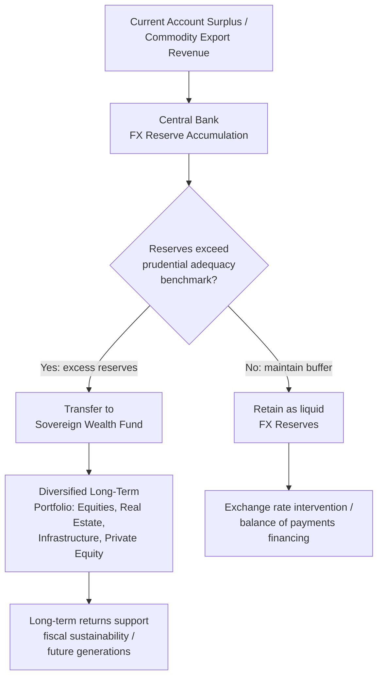

## Sovereign Wealth Funds and Foreign Exchange Reserves

### Definitions and Core Distinction

**Foreign exchange (FX) reserves**: Foreign-currency-denominated assets held by a country's central bank or monetary authority, primarily to support the domestic currency, meet balance of payments financing needs, and maintain confidence in the ability to service external obligations. Reserves are typically held in highly liquid, low-risk instruments (government securities of major reserve-currency issuers, primarily U.S. Treasuries).

**Sovereign wealth fund (SWF)**: A state-owned investment fund that manages a pool of assets — often derived from commodity export revenues (oil, gas, minerals) or accumulated foreign exchange surpluses — with the explicit objective of achieving higher long-term returns through a diversified portfolio including equities, real estate, infrastructure, and alternative assets, rather than the liquidity/safety objectives of traditional FX reserves.

$$\text{Total Sovereign External Assets} = \text{Central Bank FX Reserves} + \text{SWF Assets} + \text{Other State-Owned Foreign Holdings}$$

### Functional Comparison

| Dimension | FX Reserves | Sovereign Wealth Fund |
| --- | --- | --- |
| Primary objective | Liquidity, currency stability, crisis buffer | Long-term return maximization, intergenerational saving |
| Managing institution | Central bank / monetary authority | Dedicated fund management entity (often separate from central bank) |
| Typical asset composition | Short/medium-term government securities, highly liquid | Equities, fixed income, real estate, private equity, infrastructure |
| Risk tolerance | Low | Moderate to high |
| Time horizon | Short-term (immediate availability) | Long-term (years to decades) |
| Transparency | Generally reported per IMF data standards | Highly variable — from full public disclosure to minimal disclosure |

### Why Countries Accumulate FX Reserves

**1. Precautionary/Self-Insurance Motive**

Following the 1997–1998 Asian Financial Crisis, many emerging market economies substantially increased reserve holdings as self-insurance against future [[sudden-stops-capital-flight]] episodes, rather than relying solely on IMF emergency financing (which carries conditionality and, at the time, was perceived as slow or politically costly to access).

**2. Exchange Rate Management**

Countries operating fixed, pegged, or managed exchange rate regimes require reserves to intervene in FX markets — buying domestic currency (selling reserves) to prevent depreciation, or selling domestic currency (accumulating reserves) to prevent appreciation, as seen historically in export-oriented economies managing competitiveness.

**3. Transaction/Liquidity Needs**

Reserves provide working capital to settle international transactions and service external debt obligations as they come due.

**4. Reserve Adequacy Benchmarks**

Common metrics used to assess whether reserve holdings are adequate include:

$$\text{Guidotti-Greenspan Rule: Reserves} \geq \text{Short-term External Debt (1-year coverage)}$$

$$\text{Import Cover Ratio} = \frac{\text{Reserves}}{\text{Monthly Imports}} \quad (\text{traditional benchmark: } \geq 3 \text{ months})$$

The IMF also publishes a composite **Reserve Adequacy Metric (ARA metric)** that weights exposure to export volatility, broad money, short-term debt, and other portfolio liabilities, reflecting a more comprehensive risk-based approach than single-ratio benchmarks.

### Why Countries Establish Sovereign Wealth Funds

**1. Excess Reserves Beyond Precautionary Needs**

Once FX reserves substantially exceed prudential adequacy benchmarks, the opportunity cost of holding low-yielding, highly liquid assets becomes significant. SWFs are often established to redeploy this "excess" into higher-returning, longer-horizon investments.

**2. Commodity Revenue Management and Intergenerational Equity**

Resource-exporting nations establish SWFs to convert a depleting, finite natural resource endowment into a diversified, renewable financial asset base for future generations — a strategy explicitly designed to counter the "resource curse" and Dutch-disease-style volatility associated with commodity dependence.

**3. Fiscal Stabilization**

Some SWFs (stabilization funds) are structured to smooth government spending across commodity price cycles — accumulating assets during high-price periods and drawing them down during low-price periods, functioning as a fiscal buffer.

**4. Sterilization of FX Intervention**

In economies running persistent current account surpluses combined with managed exchange rates, SWFs can serve as a vehicle to invest accumulated reserves abroad, helping to manage the domestic monetary consequences (liquidity/inflation effects) of large-scale FX intervention.

### Classification of Sovereign Wealth Funds

**1. Stabilization Funds**: Primary goal is insulating the budget and economy from commodity price volatility (e.g., funds tied to oil revenue in various oil-exporting economies)

**2. Savings/Intergenerational Funds**: Primary goal is converting non-renewable resource wealth into a diversified financial endowment for future generations

**3. Reserve Investment Corporations**: Established specifically to manage a portion of excess FX reserves for higher returns, distinct from the central bank's core reserve function

**4. Development Funds**: Focused on funding domestic socioeconomic development projects (infrastructure, strategic industries) rather than purely external diversification

**5. Pension Reserve Funds**: Structured to help finance future government pension/social security liabilities

### Governance and Transparency Frameworks

**The Santiago Principles (2008)**

A voluntary framework of generally accepted principles and practices for SWFs, developed by the International Working Group of Sovereign Wealth Funds (later institutionalized as the International Forum of Sovereign Wealth Funds), covering:

- Legal framework and clear objectives
- Institutional governance separating the fund from short-term political direction
- Investment policy based on economic and financial considerations rather than political objectives
- Transparency and accountability practices, including regular reporting

**[Unverified]** Adherence to the Santiago Principles varies considerably across funds, and independent assessments (such as the Linaburg-Maduell Transparency Index) show a wide dispersion in actual disclosure practices, from highly transparent funds publishing detailed annual reports and holdings to funds disclosing minimal information about asset size, composition, or governance.

### Diagram: Capital Flow from Reserves to SWF Deployment

### Policy and Financial Stability Considerations

**1. Home-Country Investment Concerns**

SWF investments in foreign strategic assets (ports, telecommunications, critical infrastructure) have raised national security review concerns in recipient countries, leading to enhanced foreign investment screening mechanisms (e.g., CFIUS-type reviews in various jurisdictions).

**2. Market Impact and Systemic Size**

Given the scale of assets under management, large SWF portfolio rebalancing or investment decisions can have measurable effects on global asset markets, and coordination or signaling effects among major funds are a subject of ongoing market and academic interest.

**[Inference]** Because SWFs are generally longer-horizon and less leveraged than many private institutional investors, they are frequently characterized in the literature as potential sources of counter-cyclical stability during market stress (buying when prices are depressed), though the extent to which individual funds actually behave counter-cyclically in practice varies and is not uniformly documented.

**3. Interaction with Global Imbalances**

SWFs are directly connected to [[global-imbalances-reserve-currency]] dynamics: surplus economies' accumulation of reserves and subsequent SWF deployment represents the financial counterpart to deficit countries' external borrowing, reinforcing the broader saving-investment imbalance discussed in that context.

**4. Fiscal Rule Integration**

Well-designed SWFs are often integrated with explicit fiscal rules governing deposit and withdrawal (e.g., rules limiting withdrawals to a sustainable long-run return, or linking withdrawals to a reference commodity price), intended to prevent pro-cyclical fiscal spending during commodity booms and insulate the fund from short-term political pressure.

### Illustrative Numerical Framing

Suppose a country's central bank holds reserves equal to 25% of GDP, while prudential benchmarks (e.g., the IMF ARA metric combined with the Guidotti-Greenspan rule) suggest an adequate level closer to 15% of GDP. The excess 10% of GDP represents a candidate pool for SWF transfer.

- If retained as low-yielding reserves (assume a real return near zero after accounting for reserve-currency inflation and opportunity cost), this excess generates minimal return
- If redeployed into a diversified SWF portfolio targeting a long-run real return of, for example, 4–5% annually (a plausible long-run range for a diversified global equity/fixed-income/alternatives portfolio, though actual realized returns vary significantly by period and are not guaranteed), the same capital stock compounds meaningfully over a multi-decade horizon

**[Inference]** This return differential is the core economic rationale for separating "excess" reserves into a dedicated SWF rather than holding all sovereign external assets at central bank liquidity/safety standards — though the appropriate size of the retained liquidity buffer versus the transferable excess depends on country-specific vulnerability to sudden stops and external shocks, meaning there is no universal optimal split.

### Related Topics

- Global imbalances and reserve currency dynamics
- Sudden stops and capital flight (reserve adequacy as self-insurance)
- The resource curse and Dutch disease
- Fiscal rules and commodity price stabilization mechanisms
- Foreign direct investment screening and national security review regimes
- IMF reserve adequacy metrics (ARA metric)
- Central bank balance sheet management and sterilized intervention
- Intergenerational equity in public finance