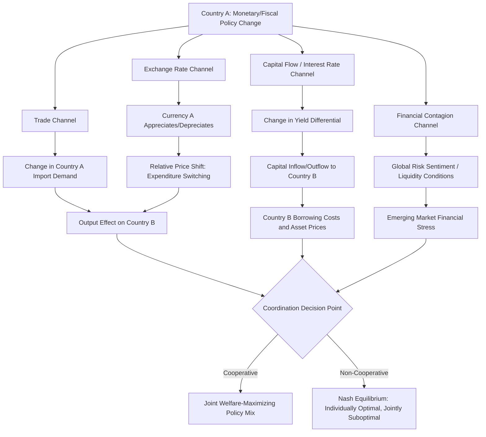

## International Policy Coordination

### Definition and Conceptual Foundation

International policy coordination refers to the deliberate, mutual adjustment of national macroeconomic policies (monetary, fiscal, exchange rate, and regulatory) by two or more countries to achieve outcomes superior to those attainable under unilateral, independently-set policy. Coordination arises because national economies are linked through trade flows, capital flows, and expectations channels, meaning one country's policy choices generate spillover effects (externalities) on others.

Coordination is distinct from mere **information sharing** (exchanging data and forecasts) or **surveillance** (multilateral monitoring, e.g., IMF Article IV consultations), both of which fall short of actual joint policy-setting. True coordination involves countries jointly optimizing a shared or compatible objective function, often requiring each to deviate from its individually optimal (Nash) policy setting.

### Theoretical Rationale: Why Coordination Can Improve Outcomes

**Policy Spillovers and Externalities**

In an interdependent world, a country's monetary or fiscal policy affects trading partners through several channels:

- **Trade channel**: A domestic fiscal expansion raises imports, boosting foreign output (positive spillover).
- **Exchange rate channel**: Domestic monetary tightening appreciates the currency, diverting demand toward domestic goods and away from foreign goods (negative spillover, sometimes called "beggar-thy-neighbor").
- **Interest rate/capital flow channel**: Higher domestic interest rates draw capital inflows, raising borrowing costs and currency volatility abroad.
- **Financial contagion channel**: Regulatory or liquidity policy in a systemically important economy affects global financial conditions and capital flows to emerging markets.

**The Nash vs. Cooperative Equilibrium**

The canonical framework models coordination as a two-country game. Each government minimizes a loss function over inflation and output gaps:

$$L_i = \alpha_i (\pi_i - \pi_i^*)^2 + \beta_i (y_i - y_i^*)^2$$

where $i \in \{1,2\}$ indexes countries. Under **Nash (non-cooperative) equilibrium**, each country sets policy taking the other's policy as given, ignoring spillovers onto the partner's welfare. Under **cooperative equilibrium**, the countries jointly minimize a weighted sum of both loss functions:

$$L_{coop} = \omega_1 L_1 + \omega_2 L_2$$

[Inference] The classic result from the Hamada (1976) and subsequent Canzoneri-Gray (1985) models is that cooperation can yield a Pareto improvement over Nash equilibrium when spillovers are significant, but the *size* of the gains found in calibrated models has generally been modest — often cited in the range of a few tenths of a percent of GDP in welfare terms, and highly sensitive to model specification, making this an area of ongoing debate rather than settled consensus.

### Historical Episodes of Coordination

**Bretton Woods System (1944–1971)**

Institutionalized coordination through fixed-but-adjustable exchange rates pegged to the US dollar, itself convertible to gold. This represented rules-based coordination: countries surrendered independent exchange rate policy in exchange for stability, with the IMF as overseer.

**Plaza Accord (1985)**

The G5 (US, Japan, West Germany, France, UK) agreed to coordinate intervention to depreciate an overvalued US dollar, addressing US trade deficits and protectionist pressure. Central banks conducted concerted foreign exchange intervention, and the dollar depreciated substantially over the following two years.

**Louvre Accord (1987)**

A follow-up agreement among the G6/G7 to stabilize exchange rates after the dollar had fallen "enough," committing to coordinate policies to keep currencies within informal target zones.

**G20 Response to the 2008 Global Financial Crisis**

Coordinated fiscal stimulus (the "global fiscal stimulus" commitments at the 2009 London Summit), coordinated central bank liquidity swap lines, and joint bank recapitalization/guarantee commitments. This is widely cited as a relatively successful episode of crisis-driven coordination.

**COVID-19 Pandemic Response (2020–2021)**

Coordinated central bank swap line expansion, IMF emergency financing (including a general Special Drawing Rights allocation in 2021), and G20 debt service suspension initiatives (DSSI) for low-income countries.

### Institutional Mechanisms for Coordination

| Institution/Forum | Coordination Function |
| --- | --- |
| **International Monetary Fund (IMF)** | Surveillance (Article IV), financial assistance conditionality, Global Financial Stability Reports, Special Drawing Rights (SDR) allocation |
| **G7 / G20** | High-level political coordination, communiqués on exchange rates and fiscal stance |
| **Bank for International Settlements (BIS)** | Central bank coordination on financial regulation (Basel Accords), forum for central bank governors |
| **Financial Stability Board (FSB)** | Coordinates financial regulatory reform post-2008 |
| **Central bank swap lines** | Bilateral/multilateral liquidity provision (e.g., Federal Reserve swap lines with other major central banks) during stress periods |
| **Regional arrangements** | EU/Eurozone fiscal rules (Stability and Growth Pact), Chiang Mai Initiative (ASEAN+3), European Stability Mechanism |

### Barriers and Limits to Coordination

**Time Inconsistency and Credibility**

Even when coordination is agreed upon, individual governments face incentives to renege once other parties have committed, particularly around election cycles or domestic political pressure. This is a variant of the classic time-inconsistency problem in monetary policy applied to the international setting.

**Model Uncertainty**

Coordination requires agreement not just on objectives but on the *model* of how the world economy works — the sign and magnitude of spillovers. If countries disagree on whether a policy's spillover is positive or negative, apparent "coordination" can produce welfare losses relative to no coordination at all. [Inference] Some academic literature (e.g., critiques following Rogoff's 1985 analysis) suggests that coordination based on a flawed shared model can be worse than no coordination, though this remains a theoretical rather than universally empirically verified claim.

**Sovereignty and the "Trilemma"**

The **Mundell-Fleming trilemma** (impossible trinity) holds that a country cannot simultaneously maintain (1) a fixed exchange rate, (2) free capital mobility, and (3) independent monetary policy — at most two of the three are achievable. Coordination often requires countries to sacrifice some monetary sovereignty, which is politically costly, particularly where domestic mandates (e.g., a central bank's domestic inflation target) conflict with international objectives.

**Asymmetric Country Size and Incentives**

Large, systemically important economies (US, China, Eurozone) generate large spillovers onto smaller economies but internalize relatively little of the spillovers directed at them, reducing their incentive to coordinate. Smaller open economies are "spillover takers" with limited bargaining power, sometimes described in the literature as facing spillovers without reciprocal influence.

**Verification and Enforcement**

Unlike domestic policy, there is no supranational enforcement mechanism compelling compliance with international agreements absent treaty-based structures (e.g., EU fiscal rules), making most G7/G20-level coordination "soft" and reliant on reputation and peer pressure rather than binding law.

### Diagram: Channels of Cross-Border Policy Spillover

### Diagram: Coordination Payoff Matrix (Two-Country Game)

<svg xmlns="http://www.w3.org/2000/svg" viewBox="0 0 640 420" font-family="Arial, sans-serif">
<text x="320" y="30" text-anchor="middle" font-size="18" font-weight="bold" fill="#1a1a1a">International Policy Coordination Game (svg_diagram)</text>
<line x1="180" y1="70" x2="180" y2="330" stroke="#333" stroke-width="2" />
<line x1="180" y1="70" x2="560" y2="70" stroke="#333" stroke-width="2" />

<text x="370" y="55" text-anchor="middle" font-size="14" font-weight="bold" fill="#333">Country B Strategy</text>

<text x="270" y="90" text-anchor="middle" font-size="13" fill="#333">Cooperate</text>

<text x="470" y="90" text-anchor="middle" font-size="13" fill="#333">Defect (Nash)</text>

<text x="90" y="200" text-anchor="middle" font-size="14" font-weight="bold" fill="#333" transform="rotate(-90 90 200)">Country A Strategy</text>

<text x="120" y="150" text-anchor="middle" font-size="13" fill="#333">Cooperate</text>

<text x="120" y="290" text-anchor="middle" font-size="13" fill="#333">Defect (Nash)</text>

<rect x="200" y="110" width="180" height="100" fill="#d4edda" stroke="#333" />
<text x="290" y="150" text-anchor="middle" font-size="14" font-weight="bold" fill="#155724">A: 3, B: 3</text>
<text x="290" y="170" text-anchor="middle" font-size="11" fill="#155724">Cooperative Optimum</text>
<rect x="380" y="110" width="180" height="100" fill="#fff3cd" stroke="#333" />
<text x="470" y="150" text-anchor="middle" font-size="14" font-weight="bold" fill="#856404">A: 1, B: 4</text>
<text x="470" y="170" text-anchor="middle" font-size="11" fill="#856404">B Free-Rides</text>
<rect x="200" y="210" width="180" height="100" fill="#fff3cd" stroke="#333" />
<text x="290" y="250" text-anchor="middle" font-size="14" font-weight="bold" fill="#856404">A: 4, B: 1</text>
<text x="290" y="270" text-anchor="middle" font-size="11" fill="#856404">A Free-Rides</text>
<rect x="380" y="210" width="180" height="100" fill="#f8d7da" stroke="#333" />
<text x="470" y="250" text-anchor="middle" font-size="14" font-weight="bold" fill="#721c24">A: 2, B: 2</text>
<text x="470" y="270" text-anchor="middle" font-size="11" fill="#721c24">Nash Equilibrium</text>

<text x="320" y="360" text-anchor="middle" font-size="12" fill="#555">Payoffs illustrative: cooperation is jointly optimal but individually</text>

<text x="320" y="378" text-anchor="middle" font-size="12" fill="#555">tempting to defect from, creating a prisoner's-dilemma-like structure</text>

<text x="320" y="400" text-anchor="middle" font-size="11" fill="#888">[Illustrative model, not derived from a specific calibrated study]</text>

</svg>

### Worked Example: Monetary Policy Spillover and Coordination Gain

Consider two economies, A (large, e.g., the US) and B (small open economy). Suppose A tightens monetary policy to combat domestic inflation, raising its policy rate by 100 basis points.

**Without coordination (Nash outcome):**

- A's tightening raises US yields, causing capital outflow from B toward A.
- B's currency depreciates, imported inflation rises in B.
- B's central bank is forced to also tighten — even if B's domestic output gap does not warrant it — purely to defend the currency and contain imported inflation, generating an unwanted domestic slowdown in B (a spillover cost B did not choose).

**With coordination:**

- A recognizes that its policy generates negative spillovers onto B and other emerging markets.
- A might moderate the pace of tightening, or extend swap lines/liquidity support to B.
- B avoids externally-forced over-tightening, and A internalizes some of the global financial stability risk its policy generates (which can eventually feed back to A through financial contagion).

**Key Points**

- Spillovers create a wedge between individually optimal and globally optimal policy.
- Coordination is a mechanism to close that wedge, but requires costly concessions from the "spillover generator" (often the large/reserve-currency economy).
- In practice, full coordination is rare; what typically occurs is looser "coordination-lite" — information sharing, swap lines, and ad hoc crisis cooperation — rather than joint optimization of policy rules.

### Coordination vs. Alternatives: A Comparative View

| Approach | Description | Example |
| --- | --- | --- |
| **No coordination (Nash)** | Each country optimizes independently, ignoring spillovers | Floating exchange rates with fully independent central banks |
| **Information sharing/surveillance** | Countries share data/forecasts but retain independent policy | IMF Article IV consultations |
| **Rules-based coordination** | Binding commitments to specific policy rules or targets | Bretton Woods fixed exchange rates, EU Stability and Growth Pact |
| **Discretionary/crisis coordination** | Ad hoc joint action during acute stress, without permanent commitment | 2008 G20 stimulus, COVID-19 swap lines |
| **Full cooperative optimization** | Joint welfare function maximized across countries | Largely theoretical; rarely observed in practice |

### Contemporary Relevance and Debates

**Global Financial Cycle and Reduced Monetary Autonomy**

[Inference] Research associated with Hélène Rey's "Global Financial Cycle" hypothesis argues that under free capital mobility, even flexible exchange rates do not fully insulate small open economies from major central banks' (particularly the Federal Reserve's) policy stance, effectively challenging the classic trilemma's implication that floating rates preserve monetary independence. This remains an active area of empirical and theoretical debate rather than settled doctrine, sometimes framed as a "dilemma" (only two policy choices are truly available regardless of exchange rate regime) rather than a trilemma.

**Currency Wars and Competitive Devaluation Concerns**

Periods of aggressive unconventional monetary policy (post-2008 quantitative easing, for example) have prompted accusations of "currency wars," where domestic-focused monetary easing is perceived by trade partners as deliberate competitive devaluation, illustrating the tension between domestically-mandated policy and internationally-generated spillovers.

**Climate and Green Transition Coordination**

Emerging areas of policy coordination extend beyond traditional monetary/fiscal domains into carbon pricing coordination, cross-border carbon border adjustment mechanisms, and coordinated green industrial policy, reflecting a broadening of the coordination agenda beyond the classical Mundell-Fleming framework. [Unverified] The long-run effectiveness and enforcement structure of these emerging coordination efforts remains uncertain given their comparative novelty.

**Conclusion**

International policy coordination addresses the fundamental tension between nationally-mandated economic policy and globally-integrated economic and financial systems. While theory suggests coordination can generate Pareto improvements by internalizing cross-border spillovers, real-world coordination is constrained by credibility problems, model uncertainty, sovereignty concerns, and enforcement limitations. Historical practice shows coordination succeeds most reliably during acute crises (2008, COVID-19) where shared urgency overcomes these barriers, while steady-state coordination remains comparatively thin, typically limited to surveillance, information-sharing, and informal norms rather than binding joint policy-setting.

**Related Topics**

- Mundell-Fleming trilemma (impossible trinity) in depth
- Time inconsistency and central bank credibility
- Exchange rate regimes: fixed, floating, and managed float
- Capital controls and macroprudential policy
- Special Drawing Rights (SDRs) and IMF quota system
- Global Financial Cycle hypothesis (Rey)
- Currency wars and competitive devaluation
- Central bank swap lines and international lender of last resort function
- Optimal currency area theory (Mundell) and Eurozone design
- Sovereign debt restructuring and coordinated creditor frameworks (Paris Club, DSSI)