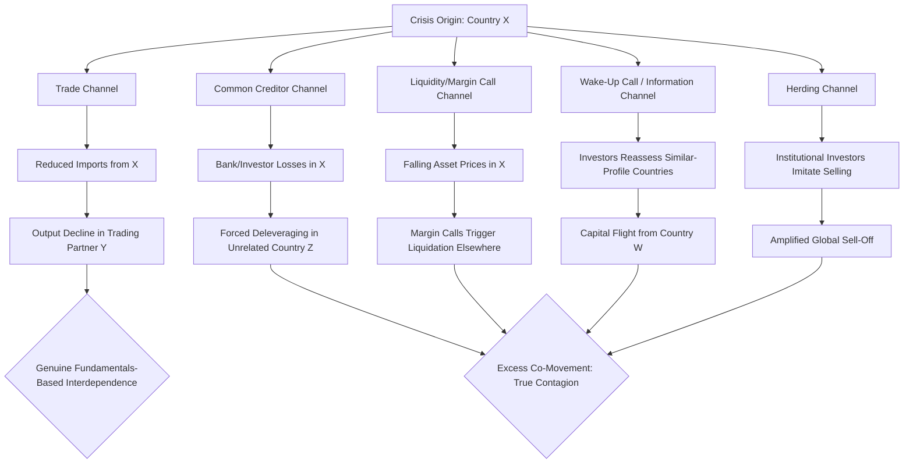

## Contagion in International Financial Crises

### Definition and Conceptual Foundation

Financial contagion refers to the transmission of a financial crisis or shock from one country (or market) to others beyond what can be explained by shared economic fundamentals alone. The defining analytical challenge in the literature is distinguishing contagion from **interdependence**: if two countries experience joint distress purely because they share genuine economic linkages (trade, common creditors, similar macro fundamentals), that co-movement reflects normal interdependence, not contagion in the strict sense. Contagion, more narrowly defined, is the *excess* co-movement — cross-market correlation that rises during crisis periods beyond what fundamentals-based linkages would predict.

[Inference] This distinction, most closely associated with Forbes and Rigobon (2002), remains contested in the empirical literature, since correlation itself tends to rise mechanically during high-volatility periods (a statistical artifact), making it genuinely difficult to cleanly separate "true contagion" from "fundamentals-based interdependence" in practice.

### Channels of Transmission

**Trade Channel (Real Linkages)**

A crisis in one country that causes currency depreciation and demand contraction reduces its imports, which can transmit output declines to trading partners. It can also create competitive devaluation pressure — trading partners facing an appreciated relative currency may face incentives to devalue to preserve export competitiveness.

**Financial/Banking Channel (Common Creditor Effect)**

When international banks or investors hold exposures across multiple emerging markets, a crisis-driven loss in one country can force deleveraging and liquidity withdrawal from *other, fundamentally unrelated* countries simply because the common lender needs to shore up its own balance sheet or meet margin calls. This channel is considered central to explaining otherwise-puzzling contagion between countries with limited direct trade or fundamental linkages.

**Liquidity and Margin Call Channel**

Falling asset prices in a crisis country trigger margin calls on leveraged investors, forcing them to liquidate positions in other, unrelated markets to raise cash — transmitting price pressure and volatility globally regardless of local fundamentals.

**Wake-Up Call / Information Channel**

A crisis in one country can prompt investors to reassess risk in countries sharing similar observable characteristics (currency regime, current account deficit, banking sector leverage, political risk profile), even without direct financial or trade links. This is sometimes described as investors updating their priors about a whole asset class ("emerging markets") based on new information revealed by one country's crisis.

**Herding and Investor Behavior Channel**

Institutional investors may rationally or irrationally imitate other investors' portfolio decisions (selling what others sell) due to reputational concerns, information asymmetries, or reliance on shared benchmarks/indices, amplifying sell-offs beyond what fundamentals justify.

**Sovereign-Bank Nexus / Doom Loop**

Where domestic banks hold large quantities of their own government's debt, a sovereign debt crisis erodes bank balance sheets, and a banking crisis raises the fiscal cost of bailouts, worsening the sovereign's position — this domestic feedback loop can itself interact with cross-border contagion when foreign banks are also exposed to the same sovereign debt.

### Diagram: Contagion Transmission Channels

### Historical Episodes

**Mexican Peso Crisis and the "Tequila Effect" (1994–1995)**

Mexico's December 1994 devaluation triggered capital flight not only from Mexico but from other Latin American economies (Argentina, Brazil) with superficially similar profiles (current account deficits, pegged/managed exchange rates), despite limited direct trade or financial linkage to Mexico — a canonical "wake-up call" contagion episode.

**Asian Financial Crisis (1997–1998)**

Beginning with the Thai baht's July 1997 devaluation, the crisis spread rapidly to Indonesia, South Korea, Malaysia, and the Philippines. Common creditor exposure (Japanese and Western banks lending across the region), similar exchange rate regimes (pegs under pressure), and herding by international investors are widely cited as key contagion mechanisms. [Inference] The relative weight of "true contagion" versus shared regional fundamentals (similar current account deficits, short-term dollar-denominated debt, weak banking supervision) in explaining the Asian crisis's spread remains debated in the empirical literature.

**Russian Crisis and LTCM (1998)**

Russia's August 1998 sovereign default and ruble devaluation triggered a global flight to quality, contributing to the near-collapse of the US hedge fund Long-Term Capital Management (LTCM), illustrating contagion transmitted through leveraged financial institutions and liquidity/margin channels rather than trade linkages — countries with essentially no economic connection to Russia experienced capital flow reversals.

**Global Financial Crisis (2007–2009)**

Originating in US subprime mortgage markets, the crisis spread globally via the common creditor/interbank channel (European banks with US mortgage-backed securities exposure), the liquidity channel (global dollar funding market freeze), and eventually the trade channel (collapse in global trade volumes in 2008–2009).

**European Sovereign Debt Crisis (2010–2012)**

Contagion spread from Greece to Ireland, Portugal, Spain, and Italy through the sovereign-bank nexus (European banks holding peripheral sovereign debt), rising bond yield co-movement ("spillover" into borrowing costs of otherwise more fundamentally sound economies), and redenomination risk (fear of eurozone breakup affecting the whole currency union).

### Contagion vs. Interdependence: Empirical Testing Approaches

**Correlation-Based Tests**

Early studies tested for contagion by checking whether cross-market correlation coefficients rose significantly during crisis periods relative to calm periods. Forbes and Rigobon (2002) demonstrated that naive correlation tests are biased upward during high-volatility periods purely due to heteroskedasticity, proposing an adjusted correlation coefficient to correct for this bias. [Inference] Their adjusted test found less evidence of "pure contagion" and more evidence of interdependence in several episodes previously classified as contagious, though this finding itself has been subject to methodological critique and is not universally accepted as the final word.

$$\rho_{adj} = \frac{\rho_h}{\sqrt{1 + \delta[1 - \rho_h^2]}}$$

where $\rho_h$ is the correlation observed during the high-volatility (crisis) period and $\delta$ is the relative increase in variance of the shock-originating market's returns.

**Regime-Switching and Extreme Value Approaches**

More recent econometric approaches use regime-switching models or extreme value theory (tail dependence) to identify contagion as a shift in the *joint distribution* of returns during crisis periods, rather than relying solely on correlation coefficients.

### Diagram: Distinguishing Contagion from Interdependence

<svg xmlns="http://www.w3.org/2000/svg" viewBox="0 0 640 380" font-family="Arial, sans-serif">
<text x="320" y="28" text-anchor="middle" font-size="17" font-weight="bold" fill="#1a1a1a">Contagion vs. Interdependence (svg_diagram)</text>
<line x1="80" y1="320" x2="580" y2="320" stroke="#333" stroke-width="2" />
<line x1="80" y1="320" x2="80" y2="60" stroke="#333" stroke-width="2" />
<text x="330" y="350" text-anchor="middle" font-size="13" fill="#333">Time (Tranquil Period → Crisis Period)</text>
<text x="45" y="190" text-anchor="middle" font-size="13" fill="#333" transform="rotate(-90 45 190)">Cross-Market Correlation</text>
<line x1="100" y1="270" x2="300" y2="260" stroke="#2b6cb0" stroke-width="3" />
<line x1="300" y1="260" x2="560" y2="250" stroke="#2b6cb0" stroke-width="3" stroke-dasharray="6,4" />
<text x="560" y="240" font-size="11" fill="#2b6cb0">Interdependence (stable link)</text>
<line x1="100" y1="280" x2="300" y2="270" stroke="#c0392b" stroke-width="3" />
<line x1="300" y1="270" x2="560" y2="100" stroke="#c0392b" stroke-width="3" />
<text x="420" y="90" font-size="11" fill="#c0392b">Contagion (excess co-movement)</text>
<line x1="300" y1="60" x2="300" y2="320" stroke="#888" stroke-width="1" stroke-dasharray="3,3" />
<text x="300" y="50" text-anchor="middle" font-size="11" fill="#666">Crisis Onset</text>

<text x="330" y="375" text-anchor="middle" font-size="11" fill="#888">Interdependence: correlation stays roughly stable pre/post-crisis. Contagion: correlation jumps beyond the fundamentals-implied baseline.</text>

</svg>

### Policy Responses to Contagion Risk

**Capital Controls**

Temporary restrictions on capital outflows (e.g., Malaysia in 1998) or macroprudential controls on inflows (e.g., Brazil's IOF tax on portfolio inflows, 2009–2013) intended to reduce vulnerability to sudden capital flow reversals.

**International Lender of Last Resort Facilities**

IMF emergency lending facilities (Stand-By Arrangements, Flexible Credit Line, Precautionary and Liquidity Line) designed to provide liquidity backstops that reduce the incentive for panic-driven capital flight.

**Central Bank Swap Lines**

Bilateral currency swap arrangements between central banks (most prominently the Federal Reserve's dollar swap lines with major and, during 2008 and 2020, several emerging market central banks) to ensure foreign banks and institutions retain access to dollar funding during stress, directly targeting the liquidity/margin call contagion channel.

**Regional Financial Safety Nets**

Regional pooling arrangements such as the Chiang Mai Initiative Multilateralization (ASEAN+3) and the European Stability Mechanism, designed to provide a first line of defense against contagion within a region before requiring IMF involvement.

**Macroprudential Regulation**

Post-2008 reforms (Basel III liquidity coverage ratios, net stable funding ratios, countercyclical capital buffers) aim to reduce the degree to which globally active banks transmit shocks across borders via the common creditor channel.

**Key Points**

- Contagion is transmission of crisis effects *beyond* what fundamentals justify; distinguishing it from fundamentals-based interdependence is an unresolved empirical and methodological challenge.
- Common creditor and liquidity/margin-call channels typically explain contagion between countries with weak direct economic links.
- Historical episodes (Tequila effect, Asian crisis, LTCM/Russia, GFC, Eurozone crisis) each illustrate different dominant channels.
- Policy responses (swap lines, IMF facilities, capital controls, macroprudential regulation) target specific transmission channels rather than contagion as a monolithic phenomenon.

**Worked Example: Tracing a Contagion Event**

Suppose Country A, an emerging market with a pegged exchange rate and large current account deficit, suffers a sudden currency crisis and devalues by 30%.

1. **Direct trade partners** of A see reduced export demand — this is interdependence, predictable from trade data.
2. **International banks** with lending exposure to A face losses and, to protect capital ratios, reduce lending to Country B, an unrelated economy with no trade ties to A but which shares the same regional lending desk — this is the common creditor channel.
3. **Institutional investors** holding an "emerging markets" index fund see A's currency crash trigger investor redemptions from the fund; the fund manager must sell holdings across *all* constituent countries proportionally, including Country C with strong fundamentals — this is the herding/index-linked channel, a pure contagion effect unrelated to C's fundamentals.
4. **Analysts and rating agencies** reassess Country D, which shares A's exchange rate regime and current account profile, downgrading D's outlook despite no direct link to A — the wake-up call channel.

Country B and C's capital outflows in steps 2–3 constitute contagion in the strict sense; Country D's downgrade in step 4 reflects a hybrid case (information-driven reassessment of genuinely shared vulnerability characteristics, blurring the contagion/interdependence line).

**Conclusion**

Contagion in international financial crises describes the mechanisms by which shocks propagate across borders beyond what direct economic fundamentals would predict, operating primarily through common creditor exposure, liquidity/margin-call dynamics, investor herding, and information-driven reassessment. While canonical historical episodes (Tequila effect, Asian crisis, GFC, Eurozone crisis) provide rich case evidence for these channels, empirical identification of "pure" contagion remains methodologically contested, since crisis periods mechanically raise measured correlations even absent genuine contagion. Policy responses have evolved to target specific channels directly — liquidity backstops (swap lines, IMF facilities) for the funding channel, and macroprudential regulation for the common creditor channel — rather than treating contagion as a single undifferentiated phenomenon.

**Related Topics**

- Sudden stops in capital flows
- Currency crisis models (first-generation, second-generation, third-generation)
- Sovereign debt crises and restructuring mechanisms
- International lender of last resort and IMF facilities
- Capital controls: theory and effectiveness
- Global banking networks and systemic risk
- Basel III macroprudential framework
- International policy coordination
- Sovereign-bank "doom loop" dynamics
- Flight to quality and safe-haven asset dynamics