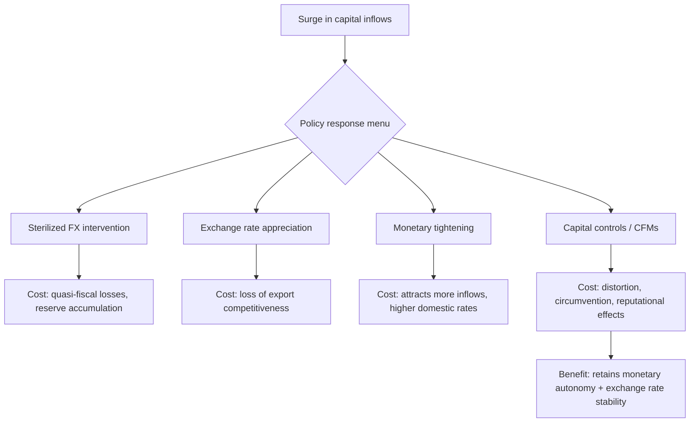

## Capital Controls: Rationale and Effectiveness

### Definition and Scope

Capital controls are policy measures — taxes, quantity restrictions, outright prohibitions, or administrative requirements — that governments and central banks impose on cross-border capital flows. They may apply to inflows (foreign capital entering the domestic economy), outflows (domestic capital leaving), or both, and can target specific asset classes (portfolio investment, foreign direct investment, bank lending, derivatives) differently.

Capital controls sit within the broader **Impossible Trinity** (Mundell-Fleming trilemma), which states that a country cannot simultaneously maintain:

1. A fixed exchange rate
2. Free capital movement
3. Independent monetary policy

A country can achieve at most two of the three. Capital controls are the tool that allows a country to sacrifice free capital mobility in order to retain both exchange rate stability and monetary autonomy.

**(svg_diagram)** Impossible Trinity Triangle:

<svg xmlns="http://www.w3.org/2000/svg" viewBox="0 0 480 420" font-family="Helvetica, Arial, sans-serif">
<text x="240" y="24" text-anchor="middle" font-size="16" font-weight="bold" fill="#1a1a1a">Impossible Trinity (svg_diagram)</text>
<polygon points="240,60 60,360 420,360" fill="none" stroke="#2c3e50" stroke-width="2.5" />
<circle cx="240" cy="60" r="6" fill="#2c3e50" />
<circle cx="60" cy="360" r="6" fill="#2c3e50" />
<circle cx="420" cy="360" r="6" fill="#2c3e50" />
<text x="240" y="42" text-anchor="middle" font-size="13" font-weight="bold" fill="#1a1a1a">Fixed Exchange Rate</text>
<text x="55" y="385" text-anchor="middle" font-size="13" font-weight="bold" fill="#1a1a1a">Free Capital Flow</text>
<text x="425" y="385" text-anchor="middle" font-size="13" font-weight="bold" fill="#1a1a1a">Monetary Independence</text>
<line x1="150" y1="210" x2="330" y2="210" stroke="#c0392b" stroke-width="1.5" stroke-dasharray="6,4" />
<text x="240" y="200" text-anchor="middle" font-size="11" fill="#c0392b">Sacrifice one side to keep the other two</text>
<text x="130" y="290" text-anchor="middle" font-size="11" fill="#34495e">Capital controls sit here:</text>
<text x="130" y="305" text-anchor="middle" font-size="11" fill="#34495e">give up free flow,</text>
<text x="130" y="320" text-anchor="middle" font-size="11" fill="#34495e">keep fixed rate + monetary control</text>
</svg>

### Taxonomy of Capital Controls

**By direction:**

- **Inflow controls** — restrict foreign capital entering the country (e.g., unremunerated reserve requirements on foreign borrowing, taxes on portfolio inflows)
- **Outflow controls** — restrict domestic capital leaving the country (e.g., surrender requirements for export proceeds, limits on foreign currency purchases by residents)

**By mechanism:**

- **Price-based (market-friendly) controls** — taxes, levies, or differential reserve requirements that raise the cost of the targeted flow without prohibiting it outright. Example: Chile's *encaje* (unremunerated reserve requirement) in the 1990s.
- **Quantity-based (administrative) controls** — outright limits, quotas, licensing requirements, or prohibitions. Example: China's approval system for outbound FDI and individual foreign-exchange purchase quotas.

**By duration:**

- **Permanent/structural controls** — long-standing features of the financial system (common in many emerging markets and some advanced economies historically, e.g., postwar Bretton Woods-era controls)
- **Temporary/crisis-contingent controls** — imposed during episodes of stress and intended to be lifted once conditions normalize (e.g., Iceland 2008, Cyprus 2013, Greece 2015)

**By asset class targeted:**

- Foreign direct investment (FDI)
- Portfolio equity and debt
- Bank and non-bank cross-border credit
- Derivatives and currency forwards
- Real estate purchases by non-residents

### Rationale for Capital Controls

**1. Macroeconomic (monetary policy) autonomy**

Under free capital mobility and a fixed or managed exchange rate, domestic interest rates are pinned to world rates via interest rate parity. Controls decouple domestic rates from global rates, restoring room for independent monetary policy — for example, to fight domestic inflation without attracting destabilizing carry-trade inflows, or to ease policy without triggering capital flight.

**2. Preventing "hot money" surges and reversals**

Large, rapid inflows of short-term portfolio capital can appreciate the currency, inflate asset prices, and fuel credit booms; a sudden reversal ("sudden stop") can trigger a currency crisis and banking-sector distress. Inflow controls (e.g., Chile's *encaje*, Brazil's IOF tax on portfolio inflows in 2009–2013) are designed to lengthen the maturity structure of inflows and dampen speculative "hot money."

**3. Preventing capital flight during crises**

Outflow controls are used defensively when a country faces a balance-of-payments crisis, bank run, or sovereign debt crisis, to prevent a self-reinforcing collapse of reserves and the exchange rate. Examples: Malaysia (1998), Iceland (2008), Cyprus (2013), Greece (2015), Argentina (2019).

**4. Preserving financial stability and macroprudential goals**

Controls can be framed as macroprudential tools rather than pure capital-account tools — limiting foreign-currency denominated bank liabilities, curbing currency mismatches on corporate and bank balance sheets, and reducing systemic risk from external debt buildup.

**5. Preserving exchange rate competitiveness**

Countries pursuing export-led growth strategies may use controls (particularly on inflows) to prevent currency appreciation that would erode export competitiveness — a recurring theme in discussions of undervalued exchange rate regimes (e.g., China's historical capital account restrictions).

**6. Protecting a narrow or underdeveloped domestic financial system**

In economies with shallow financial markets, weak banking supervision, or underdeveloped institutions, unrestricted capital flows can be destabilizing before adequate regulatory frameworks are in place. Controls act as a bridge during financial sector development and sequencing of liberalization.

**7. Preserving fiscal space and tax base**

Some controls (e.g., limits on outbound remittances or profit repatriation) aim to reduce tax base erosion and prevent capital flight that would undermine domestic investment.

### Costs and Criticisms

- **Circumvention and evasion**: Sophisticated actors reroute flows through misinvoicing of trade, related-party lending, or offshore structuring, eroding effectiveness over time and creating an "arms race" between regulators and evaders.
- **Distortion of capital allocation**: Controls can misallocate capital domestically, protect inefficient firms/banks from external discipline, and raise the domestic cost of capital.
- **Reduced access to foreign capital and investment**: Discourages FDI and portfolio inflows that could fund productive investment, especially costly for capital-scarce economies.
- **Signaling and credibility costs**: Imposing controls, especially outflow controls during a crisis, can signal policy weakness, trigger capital flight in anticipation of future controls, and damage a country's reputation with international investors, raising the future cost of external borrowing.
- **Administrative and enforcement costs**: Quantity-based controls require monitoring, licensing bureaucracies, and enforcement capacity, which can foster corruption and rent-seeking.
- **Retaliation and cross-border spillovers**: Advanced-economy inflow controls or outflow restrictions can be seen as (or actually be) protectionist, prompting friction in trade and investment relations.

### Evidence on Effectiveness

**Key Points**

- Empirical research (IMF, NBER, and central bank studies) generally finds capital controls have **modest effects on the volume of flows** but **more significant effects on the composition** of flows (i.e., shifting toward longer maturities, away from short-term debt).
- Effects on **exchange rate levels** are typically small and often statistically insignificant or short-lived, though effects on **the pace of appreciation** during surge episodes can be more discernible.
- **Price-based, market-friendly controls** (e.g., Chile's *encaje*) are generally found to be more durable and less distortionary than blunt administrative controls, though Chile's controls' aggregate effect on total inflow volume is debated in the literature — most studies find limited impact on total flows but a shift in composition toward longer-term instruments.
- **Crisis-response outflow controls** (Malaysia 1998, Iceland 2008–2017, Cyprus 2013, Greece 2015) are found to have been effective in **stopping acute capital flight** and buying time for policy adjustment, at the cost of prolonged financial fragmentation and difficulty in ultimately lifting the controls (Iceland's controls took nearly a decade to fully unwind).
- The **IMF's Institutional View** (adopted 2012, updated since) now treats capital flow management measures (CFMs) as a legitimate part of the policy toolkit under specific circumstances — not a first-line tool, but appropriate when macroeconomic policy space is limited, when flows are excessive/volatile, and when used temporarily and transparently, ideally alongside macroprudential and monetary/fiscal measures. [Unverified: exact current IMF language and case-specific staff assessments should be checked against the IMF's most recent Institutional View review, as this framework has been revisited periodically.]
- **[Inference]** Effectiveness appears to depend heavily on institutional capacity: controls in economies with strong administrative capacity and less financial sophistication (fewer avenues for circumvention) tend to bind more effectively than in economies with deep, complex financial systems.

### Case Studies

| Case | Type | Context | Assessed Outcome |
| --- | --- | --- | --- |
| Chile (1991–1998), *encaje* | Price-based inflow control (unremunerated reserve requirement) | Surge in portfolio inflows post-liberalization | Shifted composition toward longer maturities; limited effect on aggregate inflow volume; largely dismantled by 1998 |
| Malaysia (1998) | Outflow controls + fixed exchange rate peg | Asian Financial Crisis, ringgit under speculative attack | Widely credited with stabilizing the currency and allowing domestic policy easing without capital flight; controversial at the time relative to IMF-style approaches used elsewhere in the region |
| Brazil (2009–2013), IOF tax | Price-based inflow tax on portfolio investment/fixed income | Post-GFC surge in inflows amid near-zero rates in advanced economies | Modest, temporary dampening effect on inflows and currency appreciation; largely circumvented over time via derivatives and structuring |
| Iceland (2008–2017) | Comprehensive outflow controls | Banking system collapse, krona crisis | Prevented a disorderly collapse of the currency and banking system; controls proved difficult and slow to unwind |
| Cyprus (2013) | Outflow/deposit controls | Banking crisis, bank bail-in | Prevented a bank run and full capital flight during resolution; gradually lifted over ~2 years |
| China (ongoing) | Comprehensive administrative controls (inflow and outflow) | Managed exchange rate regime, financial system development | Long-standing feature; effectiveness debated given growing sophistication of circumvention channels (e.g., trade misinvoicing, UnionPay-based outflows), but generally credited with preserving substantial monetary autonomy and orderly RMB internationalization |

### Mathematical Framework: Interest Rate Parity and the Trilemma

Under **uncovered interest rate parity (UIP)** with free capital mobility:

$$i_d = i_f + E[\Delta s]$$

where $i_d$ is the domestic interest rate, $i_f$ is the foreign interest rate, and $E[\Delta s]$ is the expected rate of currency depreciation.

Under a **fixed exchange rate** with free capital mobility, $E[\Delta s] = 0$ is enforced by the peg commitment, which forces:

$$i_d = i_f$$

This eliminates monetary policy independence. Capital controls introduce a wedge, $\tau$, representing the effective cost imposed on cross-border arbitrage (transaction taxes, reserve requirements, or quantitative frictions):

$$i_d = i_f + E[\Delta s] + \tau$$

The wedge $\tau$ allows $i_d$ to diverge from $i_f$ even with a fixed exchange rate ($E[\Delta s] = 0$), restoring monetary policy space proportional to the effectiveness (bindingness) of the control. **[Inference]** The size of $\tau$ that is actually achieved in practice — as opposed to the statutory/nominal wedge — depends on enforcement capacity and the ease of circumvention, which is why empirical estimates of "effective" capital control intensity (e.g., the Chinn-Ito index, Fernández et al. capital control indices) diverge from de jure legal restrictiveness.

### Capital Controls vs. Macroprudential Policy

A key modern distinction in the literature (particularly post-2008) is between:

- **Capital controls proper**: measures that discriminate explicitly on the basis of residency of the counterparty (resident vs. non-resident)
- **Macroprudential measures**: measures that apply regardless of residency but happen to affect cross-border flows (e.g., loan-to-value caps, countercyclical capital buffers, limits on foreign-currency lending)

The IMF's terminology of **Capital Flow Management Measures (CFMs)** and, where they overlap with financial stability tools, **CFM/macroprudential measures (CFM/MPMs)**, reflects this blending. This distinction matters for effectiveness assessment because macroprudential tools are generally viewed as less distortionary and more compatible with open capital accounts, while still achieving some of the same stability goals as targeted capital controls.

### Sequencing and the Policy Trilemma in Practice

**[Unverified]** Many central banks in practice use a **combination** of these tools rather than relying on any single instrument — sterilized intervention plus targeted, temporary CFMs is a commonly cited "second-best" approach in IMF and BIS policy literature, though the optimal mix is context-dependent and contested among researchers.

### Example: Stylized Calculation of an Inflow Tax (Chile-style *Encaje*)

Suppose a foreign investor brings in $1,000,000 in portfolio capital, and the unremunerated reserve requirement (URR) mandates that 30% of the inflow be deposited at the central bank for one year, earning zero interest, while the investor's opportunity cost of capital is 8% annually.

$$\text{Reserve amount} = 0.30 \times \$1{,}000{,}000 = \$300{,}000$$

$$\text{Opportunity cost (implicit tax)} = \$300{,}000 \times 0.08 = \$24{,}000$$

$$\text{Effective tax rate on the inflow} = \frac{\$24{,}000}{\$1{,}000{,}000} = 2.4\%$$

This effective tax is **regressive by holding period**: an investor planning to stay only 3 months bears a much higher annualized cost than one planning to stay 3 years, since the URR deposit period is often fixed rather than pro-rated. This is precisely the mechanism through which such controls are intended to skew inflow composition toward longer-term capital.

### Related Topics

- Mundell-Fleming model and the open-economy IS-LM-BP framework
- Sudden stops and the Calvo (1998) framework of capital flow reversals
- Sterilized vs. unsterilized foreign exchange intervention
- Currency crises: first-, second-, and third-generation models
- The IMF Institutional View on capital flows and CFM/MPM taxonomy
- De jure vs. de facto capital account openness indices (Chinn-Ito index, Fernández et al. dataset)
- Exchange rate regimes: fixed, floating, and managed float
- Macroprudential regulation and cross-border banking supervision
- Dollarization and currency mismatch risk in emerging markets
- Balance of payments crises and IMF stabilization programs