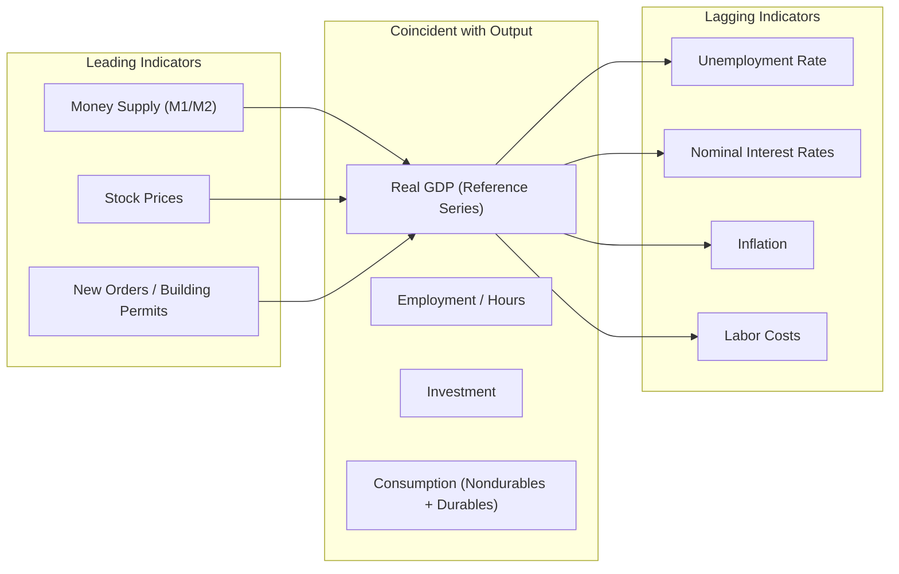

## Stylized Facts of Business Cycles

### Definition and Scope

**Key Points**

- Stylized facts are empirical regularities observed across countries, time periods, and business cycle episodes, robust enough to be treated as "facts" that macroeconomic theories must explain.
- The term originates from Nicholas Kaldor's 1957 characterization of growth facts, later extended by researchers such as Finn Kydland, Edward Prescott, and Robert Lucas to describe cyclical (not just trend) regularities.
- Stylized facts differ from precise econometric estimates: they describe qualitative patterns (direction of comovement, relative volatility, timing) rather than exact numerical coefficients, which vary by country and sample period.
- These facts serve as the empirical discipline for Real Business Cycle (RBC) models, New Keynesian models, and other quantitative macro frameworks, which are calibrated or estimated to match them.

### Methodological Preliminaries

#### Detrending and the Definition of "Cycle"

Business cycles are fluctuations around a trend, not the raw levels of series. Before stylized facts can be computed, the trend (potential/permanent component) must be separated from the cyclical component.

Common detrending methods:

- **Hodrick-Prescott (HP) filter**: minimizes a penalized sum of squared deviations from trend, controlled by smoothing parameter $\lambda$ (commonly $\lambda = 1600$ for quarterly data).
- **Linear or log-linear detrending**: fits a deterministic trend line to log output.
- **First-differencing**: treats growth rates themselves as the object of study (used when series are believed to follow a unit root/difference-stationary process).
- **Band-pass filters** (Baxter-King, Christiano-Fitzgerald): isolate fluctuations within a specified frequency band, typically 6 to 32 quarters, corresponding to conventional business cycle duration.

$$\min_{\{\tau_t\}} \sum_{t=1}^{T} (y_t - \tau_t)^2 + \lambda \sum_{t=2}^{T-1} \left[(\tau_{t+1} - \tau_t) - (\tau_t - \tau_{t-1})\right]^2$$

Here $y_t$ is the log of the raw series, $\tau_t$ is the estimated trend, and the cyclical component is $c_t = y_t - \tau_t$.

[Unverified] The choice of filter can materially affect the magnitude (though rarely the sign or qualitative ranking) of reported volatility and comovement statistics, so cross-study comparisons should note which filter was used.

#### The Three Core Moments

For any macroeconomic variable $x_t$, three statistics summarize its cyclical behavior relative to a reference variable — typically real GDP ($y_t$):

1. **Volatility**: the standard deviation of the cyclical component, $\sigma_x$, often reported relative to output volatility as $\sigma_x / \sigma_y$.
2. **Comovement (procyclicality)**: the contemporaneous correlation with output, $\text{corr}(x_t, y_t)$.
   - Procyclical: correlation strongly positive
   - Countercyclical: correlation strongly negative
   - Acyclical: correlation near zero
3. **Phase shift/persistence**: whether the variable leads, lags, or is coincident with output, assessed via cross-correlations $\text{corr}(x_{t+k}, y_t)$ at various leads/lags $k$, and the autocorrelation $\text{corr}(x_t, x_{t-1})$ measuring persistence.

### Fact 1: Output Volatility and Persistence

- Real GDP exhibits sustained deviations from trend lasting several quarters to a few years, not white-noise fluctuations; the autocorrelation of the cyclical component is high and positive (typically 0.7–0.9 at one lag for HP-filtered US quarterly data).
- Recessions are, historically, shorter and steeper than expansions; expansions tend to be longer and more gradual. This asymmetry is a robust qualitative feature, though its strength varies by country and era.
- Output volatility itself is not constant over time: many advanced economies experienced a marked decline in GDP volatility from the mid-1980s to mid-2000s, a phenomenon termed the **"Great Moderation."** [Unverified] The causes of the Great Moderation (better monetary policy, structural change toward services, inventory management technology, or simple good luck in shocks) remain debated among researchers.

### Fact 2: Consumption Is Less Volatile Than Output

- Across essentially all industrialized economies studied, $\sigma_c / \sigma_y < 1$ for total consumption, and durable goods consumption is more volatile than nondurables and services, sometimes more volatile than output itself.
- This pattern is consistent with the **permanent income hypothesis / life-cycle hypothesis**: households smooth consumption relative to transitory income fluctuations by saving and borrowing.
- Nondurable and services consumption typically shows $\sigma_c/\sigma_y$ in the range of roughly 0.5–0.8 in US data; durables consumption often shows ratios above 1.0, since durable purchases behave like investment (postponable, lumpy).

### Fact 3: Investment Is Highly Volatile

- Gross fixed investment is the most volatile major GDP component, typically 3 to 5 times as volatile as output ($\sigma_I/\sigma_y \approx 3$–$5$).
- Investment is strongly procyclical, with contemporaneous correlation with output often exceeding 0.8.
- Inventory investment, despite being a small share of GDP, contributes disproportionately to output volatility because of its own high volatility and procyclicality — a fact central to inventory-cycle theories.
- This volatility is theoretically linked to the **accelerator mechanism**, where investment responds to the *rate of change* of demand rather than its level, and to adjustment-cost and irreversibility frictions that make investment lumpy.

### Fact 4: Employment, Hours, and Productivity

- Total hours worked and employment are strongly procyclical and roughly as volatile as output ($\sigma_N/\sigma_y$ close to 1).
- The split between the **extensive margin** (number of workers employed) and **intensive margin** (hours per worker) matters: in the US, most cyclical adjustment historically occurs on the extensive margin (employment/unemployment), though hours per worker also move procyclically.
- **Labor productivity** (output per hour) is procyclical but with a correlation weaker than employment's, and this correlation has weakened or become ambiguous in some post-1980s samples — a pattern debated in the RBC versus New Keynesian literature.
- The **unemployment rate** is strongly countercyclical, and **Okun's Law** captures the empirical relationship between output gaps and unemployment gaps:

$$u_t - u_t^{*} \approx -\beta (y_t - y_t^{*}), \quad \beta > 0$$

where $u_t$ is the unemployment rate, $u_t^*$ the natural rate, and $\beta$ (Okun's coefficient) is commonly estimated near 0.3–0.5 for the US, though [Unverified] this coefficient varies across countries and has shown signs of instability over time.

- **Real wages** are only mildly procyclical, and the correlation is often weak or ambiguous — a fact that posed a challenge to early Keynesian sticky-wage models predicting strong procyclicality, and that RBC models handle more naturally through technology shocks shifting labor demand.

### Fact 5: Prices, Inflation, and Money

- The cyclicality of the **price level** and **inflation** relative to output has varied historically: pre-WWII and gold-standard-era data often show countercyclical prices, while post-WWII data shows a weaker, sometimes procyclical or acyclical relationship. [Unverified] This instability across eras is itself treated as a stylized fact and is a point of ongoing debate regarding its causes (supply versus demand shock dominance in different periods).
- **Nominal and real money supply** (M1, M2) are procyclical and tend to *lead* the cycle — money growth often turns before output does, a pattern central to monetarist interpretations of the cycle (e.g., Friedman and Schwartz).
- **Nominal interest rates** are procyclical and tend to lag the cycle, rising during expansions (often peaking near or after the cyclical peak) and falling during recessions.
- **Inflation** itself tends to lag the cycle, consistent with the "long and variable lags" view of monetary policy transmission.

### Fact 6: Government Spending and Net Exports

- Government purchases are typically only weakly correlated with output, closer to acyclical, though this varies by country and by whether automatic stabilizers or discretionary fiscal policy dominate the sample.
- Net exports (trade balance) are commonly countercyclical: imports rise strongly during domestic expansions (procyclical imports) while exports depend more on foreign demand, so the trade balance tends to worsen during booms.

### Fact 7: International Comovement

- Business cycles are correlated across countries, particularly among economies with strong trade and financial linkages, giving rise to the concept of a **"global business cycle"** or **synchronized recessions** (e.g., 2008-09, 2020).
- **Real exchange rates** are highly volatile relative to relative price levels or output — a puzzle relative to simple purchasing-power-parity-based models — and are typically **more persistent** than nominal fundamentals would suggest [Unverified — magnitude and persistence estimates vary substantially by exchange rate regime and sample period].
- Cross-country consumption correlations are often found to be *lower* than cross-country output correlations, which is puzzling under complete international risk-sharing (the "quantity anomaly" or international consumption correlation puzzle), since full risk sharing would predict the opposite ranking.

### Summary Table of Standard US Stylized Facts

| Variable | Relative Volatility ($\sigma_x/\sigma_y$) | Correlation with Output | Timing |
| --- | --- | --- | --- |
| Consumption (nondurables/services) | < 1 (≈0.5–0.8) | Strongly procyclical | Coincident |
| Consumption (durables) | > 1 | Strongly procyclical | Coincident |
| Investment | ≈3–5 | Strongly procyclical | Coincident |
| Employment/hours | ≈1 | Strongly procyclical | Coincident/slightly lagging |
| Unemployment rate | High | Strongly countercyclical | Slightly lagging |
| Labor productivity | < 1 | Mildly procyclical | Leading/coincident |
| Real wages | Low | Weakly procyclical/acyclical | Mixed |
| Money supply (M1/M2) | Moderate | Procyclical | Leading |
| Nominal interest rates | Moderate | Procyclical | Lagging |
| Price level / inflation | Varies by era | Ambiguous (era-dependent) | Lagging |
| Government spending | Low | Weak/acyclical | Mixed |
| Net exports | Moderate | Countercyclical | Mixed |

[Inference] Exact numerical values differ across studies depending on country, sample period, and detrending method; the table reflects commonly cited orderings from the RBC and empirical business cycle literature rather than a single definitive estimate.

### Diagram: Comovement and Timing Relative to the Reference Cycle

### Diagram: Volatility Ranking of Major Aggregates (svg_diagram)

<svg xmlns="http://www.w3.org/2000/svg" viewBox="0 0 640 320">
<text x="320" y="24" text-anchor="middle" font-size="16" font-weight="bold" fill="#1a1a1a">Relative Volatility of Key Aggregates (svg_diagram)</text>
<line x1="80" y1="270" x2="600" y2="270" stroke="#333" stroke-width="2" />
<line x1="80" y1="270" x2="80" y2="50" stroke="#333" stroke-width="2" />
<text x="20" y="160" font-size="12" fill="#333" transform="rotate(-90 20,160)">sigma_x / sigma_y</text>

<rect x="110" y="70" width="60" height="200" fill="#c0392b" />
<text x="140" y="290" text-anchor="middle" font-size="11">Investment</text>
<text x="140" y="65" text-anchor="middle" font-size="11">~4.0</text>

<rect x="200" y="130" width="60" height="140" fill="#d35400" />
<text x="230" y="290" text-anchor="middle" font-size="11">Durables</text>
<text x="230" y="125" text-anchor="middle" font-size="11">~2.2</text>

<rect x="290" y="190" width="60" height="80" fill="#2980b9" />
<text x="320" y="290" text-anchor="middle" font-size="11">Employment</text>
<text x="320" y="185" text-anchor="middle" font-size="11">~1.0</text>

<rect x="380" y="190" width="60" height="80" fill="#7f8c8d" />
<text x="410" y="290" text-anchor="middle" font-size="11">Output (ref.)</text>
<text x="410" y="185" text-anchor="middle" font-size="11">1.0</text>

<rect x="470" y="225" width="60" height="45" fill="#27ae60" />
<text x="500" y="290" text-anchor="middle" font-size="11">Nondur./Serv.</text>
<text x="500" y="220" text-anchor="middle" font-size="11">~0.6</text>
</svg>

### Theoretical Interpretations of the Facts

**Key Points**

- **Real Business Cycle (RBC) theory** (Kydland-Prescott, 1982) treats stylized facts as moments to match via calibration, attributing fluctuations primarily to technology (total factor productivity) shocks propagated through optimal intertemporal labor-leisure and consumption-savings decisions.
- **New Keynesian theory** incorporates nominal rigidities (sticky prices/wages) and demand shocks to explain facts that RBC models struggle with, particularly the weak/ambiguous real-wage procyclicality and the role of monetary policy in generating output-employment comovement.
- **Monetarist theory** emphasizes the leading, procyclical behavior of money supply as evidence for money-driven cycles and the transmission-lag structure of inflation and interest rates.
- No single framework matches every stylized fact simultaneously without qualification; part of the ongoing research agenda is reconciling models with the full set of moments rather than a subset.

### Worked Example: Computing Relative Volatility

**Example**

Given HP-filtered log deviations from trend for output ($y_t$) and investment ($i_t$) over a sample:

$$\sigma_y = 1.6\%, \quad \sigma_i = 6.4\%$$

$$\frac{\sigma_i}{\sigma_y} = \frac{6.4}{1.6} = 4.0$$

This ratio of 4.0 is consistent with the standard finding that investment is roughly four times as volatile as output, and would be reported in a stylized-facts table as strong evidence of investment's disproportionate contribution to aggregate fluctuations, since $\text{Var}(y) $ can be decomposed via the national accounts identity $y = c + i + g + nx$, and the covariance terms show investment's swings are only partially offset by consumption smoothing.

### Common Pitfalls and Caveats

- **Filter sensitivity**: reported volatility rankings are generally robust across HP, band-pass, and first-difference detrending, but exact magnitudes are not; comparing statistics computed with different filters without adjustment is a common analytical error.
- **Sample instability**: stylized facts computed in pre-1984 data (before the Great Moderation) can differ meaningfully from post-1984 data; papers should specify the sample window.
- **Aggregation bias**: cross-country "stylized facts" summarize a distribution across many national experiences; individual countries, especially emerging markets, can show materially different patterns (e.g., often *more* countercyclical government spending, and more volatile real wages, than advanced economies).
- **Structural breaks**: events such as the 2008 Global Financial Crisis and the 2020 COVID-19 recession introduced fluctuations of a magnitude and cause (financial-sector shock, pandemic supply-and-demand shock) that may not conform cleanly to prior decades' comovement patterns. [Unverified] Whether these episodes represent a lasting change in the stylized facts or a temporary outlier remains an open empirical question.

### Related Topics

- Hodrick-Prescott filter and alternative detrending methods (Baxter-King, Christiano-Fitzgerald)
- Real Business Cycle (RBC) theory and calibration methodology
- New Keynesian DSGE models and nominal rigidities
- Okun's Law and the output-unemployment relationship
- The Great Moderation: causes and debates
- Permanent income and life-cycle hypotheses of consumption
- Investment theory: accelerator models and adjustment costs
- International business cycle synchronization and risk-sharing puzzles
- Leading, coincident, and lagging economic indicators (NBER methodology)
- Monetary transmission mechanism and the role of money in the cycle