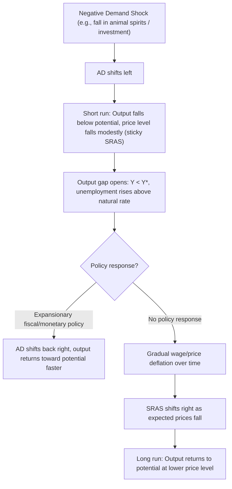

## Keynesian Theories of the Business Cycle

### Definition and Scope

**Key Points**

- Keynesian business cycle theory attributes fluctuations in output and employment primarily to instability in **aggregate demand**, rather than to real supply-side shocks (as in RBC theory) or purely monetary shocks (as in strict monetarism).
- The core mechanism is that prices and/or wages are **sticky** (do not adjust instantaneously to clear markets), so demand shortfalls translate into quantity adjustments — output and employment contraction — rather than immediate price/wage deflation.
- The theory spans several generations: **original Keynesian** (Keynes, 1936), **neo-Keynesian synthesis** (Hicks-Hansen IS-LM, 1950s-60s), and **New Keynesian** (1980s-present), each adding progressively more rigorous microfoundations for the nominal rigidities that Keynes described more informally.
- Keynesian theory treats recessions as **demand-deficient equilibria** that can persist because there is no automatic, fast mechanism restoring full employment — as opposed to classical/RBC views in which markets clear continuously and observed employment fluctuations are voluntary or efficient responses to shocks.

### Historical Origins: Keynes's General Theory (1936)

- Keynes wrote in response to the Great Depression, rejecting the classical view (embodied in **Say's Law**, "supply creates its own demand") that economies self-correct quickly to full employment.
- Central concept: **effective demand** — the level of aggregate demand at which firms' output and employment decisions settle, which need not equal the full-employment level.
- Keynes emphasized that investment is driven by volatile, psychologically-grounded expectations about future profitability, which he termed **"animal spirits"** — a source of exogenous instability in aggregate demand independent of any real technology shock.
- **Liquidity preference theory**: money demand depends on the interest rate as well as income, which Keynes used to explain how monetary factors interact with real output determination — a building block later formalized in the LM curve.
- Wages, in Keynes's account, are **downwardly rigid** (sticky), partly for institutional/bargaining reasons, so a fall in labor demand shows up as unemployment rather than an immediate wage-clearing adjustment.

### The Keynesian Cross: Basic Income-Expenditure Model

The simplest formalization of effective demand determination, before monetary interactions are introduced.

**Definitions**

- Planned aggregate expenditure: $AE = C + I + G + NX$
- Consumption function: $C = C_0 + c(Y - T)$, where $C_0$ is autonomous consumption, $c$ is the **marginal propensity to consume (MPC)**, $0 < c < 1$
- Equilibrium condition: output adjusts until $Y = AE$

$$Y = C_0 + c(Y - T) + I + G + NX$$

Solving for equilibrium output:

$$Y^{*} = \frac{1}{1-c}\left[C_0 - cT + I + G + NX\right]$$

The term $\dfrac{1}{1-c}$ is the **simple spending multiplier**. A shock to autonomous spending (e.g., a drop in $I$ due to pessimistic animal spirits) is amplified into a larger change in equilibrium output — this multiplier mechanism is the core micro-level explanation for why demand shocks generate business cycles rather than being immediately self-correcting.

**Example**

If $c = 0.75$, the multiplier is $\dfrac{1}{1-0.75} = 4$. A $\$50$ billion autonomous fall in investment (a plausible "animal spirits" shock) produces a $\$200$ billion fall in equilibrium output, absent any offsetting policy response.

### IS-LM Model: The Neo-Keynesian Synthesis

Developed by Hicks (1937) and Hansen, formalizing the interaction between goods and money markets, and providing the operational core of mid-century Keynesian macroeconomics.

#### IS Curve (Goods Market Equilibrium)

$$Y = C(Y-T) + I(r) + G + NX(Y, e)$$

Investment is a decreasing function of the real interest rate $r$; the IS curve slopes downward in $(Y, r)$ space because higher interest rates depress investment, lowering equilibrium output.

#### LM Curve (Money Market Equilibrium)

$$\frac{M}{P} = L(Y, r)$$

Real money supply equals real money demand $L(Y, r)$, which increases in income (transactions demand) and decreases in the interest rate (opportunity cost of holding money). The LM curve slopes upward in $(Y, r)$ space.

#### Diagram: IS-LM Equilibrium and Demand Shocks (svg_diagram)

<svg xmlns="http://www.w3.org/2000/svg" viewBox="0 0 640 400">
<text x="320" y="24" text-anchor="middle" font-size="16" font-weight="bold" fill="#1a1a1a">IS-LM Equilibrium (svg_diagram)</text>
<line x1="80" y1="340" x2="580" y2="340" stroke="#333" stroke-width="2" />
<line x1="80" y1="340" x2="80" y2="50" stroke="#333" stroke-width="2" />
<text x="580" y="360" font-size="13">Output (Y)</text>
<text x="40" y="50" font-size="13">Rate (r)</text>

<path d="M 120 100 Q 300 200 540 320" stroke="#2980b9" stroke-width="3" fill="none" />
<text x="545" y="315" font-size="12" fill="#2980b9">IS_0</text>

<path d="M 120 180 Q 260 260 460 330" stroke="#c0392b" stroke-width="3" stroke-dasharray="6,4" fill="none" />
<text x="465" y="335" font-size="12" fill="#c0392b">IS_1 (demand shock)</text>

<path d="M 160 320 Q 300 180 420 90" stroke="#27ae60" stroke-width="3" fill="none" />
<text x="425" y="85" font-size="12" fill="#27ae60">LM</text>

<circle cx="300" cy="200" r="5" fill="#1a1a1a" />
<text x="308" y="195" font-size="11">E0</text>
<circle cx="260" cy="245" r="5" fill="#1a1a1a" />
<text x="268" y="260" font-size="11">E1</text>
<line x1="300" y1="200" x2="300" y2="340" stroke="#999" stroke-dasharray="3,3" />
<line x1="260" y1="245" x2="260" y2="340" stroke="#999" stroke-dasharray="3,3" />
<text x="285" y="358" font-size="11">Y1</text>
<text x="290" y="378" font-size="11">Y0</text>
</svg>

**Interpretation**: A negative demand shock (fall in autonomous investment or consumption) shifts IS leftward from $IS_0$ to $IS_1$, lowering both output and the interest rate at the new equilibrium $E_1$. This is the textbook Keynesian account of a demand-driven recession, and it identifies two policy levers: fiscal policy (shifting IS by changing $G$ or $T$) and monetary policy (shifting LM by changing $M$).

#### Fiscal and Monetary Policy Transmission in the IS-LM Framework

- **Expansionary fiscal policy** (higher $G$ or lower $T$) shifts IS rightward, raising both $Y$ and $r$. The rise in $r$ **crowds out** some private investment, so the net output effect is smaller than the simple multiplier would suggest — the **"crowding-out effect."**
- **Expansionary monetary policy** (higher $M$) shifts LM rightward (or downward), lowering $r$ and raising $Y$ through increased investment.
- **Liquidity trap**: at very low interest rates, the LM curve becomes effectively flat (money demand becomes infinitely elastic near a floor rate), so monetary expansion fails to lower $r$ further and has little effect on output — a case Keynes highlighted and later revisited in the 2008-09 and post-2020 zero-lower-bound episodes.

### AD-AS Framework: Adding the Price Level

The IS-LM model treats the price level as fixed in the short run; the **Aggregate Demand-Aggregate Supply (AD-AS)** framework relaxes this to study inflation-output dynamics.

- **Aggregate Demand (AD) curve**: derived from IS-LM, slopes downward in $(Y, P)$ space — a higher price level reduces real money balances $M/P$, raising $r$ (via LM) and reducing $Y$ (via IS).
- **Short-run Aggregate Supply (SRAS)**: upward sloping, reflecting sticky prices/wages — firms/workers only partially adjust prices/wages to demand changes in the short run, so higher demand raises both output and price level somewhat.
- **Long-run Aggregate Supply (LRAS)**: vertical at potential output $Y^*$, since in the long run prices and wages fully adjust and output is determined by real factors (capital, labor, technology), consistent with the classical dichotomy holding only in the long run.

$$P = P^e \left[1 + \phi(Y - Y^{*})\right]$$

This expectations-augmented SRAS relation (a Lucas-type or Phelps-Friedman-type supply curve) shows output above potential ($Y > Y^*$) is associated with prices exceeding expected prices $P^e$, linking short-run demand-driven booms to inflationary pressure — the basis of the **short-run Phillips curve** trade-off between inflation and unemployment.

### Diagram: AD-AS Adjustment to a Demand Shock

### Wage and Price Rigidity: The Microfoundations Problem

**Key Points**

- Original Keynesian theory largely *assumed* sticky wages and prices without deep microfoundations, which drew the influential **Lucas Critique**: models without rational, optimizing foundations for rigidities may give unreliable policy prescriptions, since agents' behavior parameters are not invariant to policy regime changes.
- The **New Keynesian** research program (roughly 1980s onward) responded by building rigidities from optimizing behavior under frictions, integrating them into dynamic stochastic general equilibrium (DSGE) models alongside rational expectations.

#### Key New Keynesian Microfoundations

- **Menu costs**: fixed costs of changing prices (Mankiw, 1985) mean firms only reprice periodically, generating aggregate price stickiness from individually small, rational frictions — an application of the idea that "small individual costs can have large aggregate effects."
- **Calvo pricing** (Calvo, 1983): each firm resets its price with fixed probability $1-\theta$ each period, independent of time since last reset, giving a tractable stochastic framework for staggered price adjustment widely used in DSGE models.
- **Staggered contracts** (Taylor, 1979; Fischer, 1977): wage or price contracts are set for multiple periods and not synchronized across firms/workers, so the aggregate price/wage level adjusts gradually even though individual contracts are periodically renegotiated.
- **Efficiency wage theory**: firms pay above-market-clearing wages to induce effort, reduce turnover, or attract higher-quality workers, generating real wage rigidity and equilibrium unemployment even in the long run.
- **Coordination failure models**: multiple equilibria exist because firms' pricing/output decisions are strategic complements; a pessimistic-equilibrium recession can be self-fulfilling even without any change in fundamentals.

#### The New Keynesian Phillips Curve

$$\pi_t = \beta \, E_t[\pi_{t+1}] + \kappa (Y_t - Y_t^{*})$$

Derived from Calvo pricing and firms' forward-looking optimal price-setting, this relates current inflation $\pi_t$ to expected future inflation $E_t[\pi_{t+1}]$ (discounted by $\beta$) and the current output gap, weighted by $\kappa$ (a function of the price-adjustment frequency and the elasticity of marginal cost with respect to output). This differs from the older, backward-looking (adaptive-expectations) Phillips curve by emphasizing forward-looking inflation expectations, a hallmark of New Keynesian modeling.

### The Standard New Keynesian DSGE Model (Three-Equation Core)

The canonical New Keynesian model used in modern monetary policy analysis and business cycle research combines three log-linearized equations:

1. **New Keynesian IS curve** (forward-looking, derived from household Euler equation):

$$Y_t = E_t[Y_{t+1}] - \sigma\left(i_t - E_t[\pi_{t+1}] - r_t^{n}\right)$$

2. **New Keynesian Phillips Curve** (as above)
3. **Monetary Policy Rule** (commonly a **Taylor Rule**):

$$i_t = r^{*} + \pi_t + \phi_\pi(\pi_t - \pi^{*}) + \phi_y(Y_t - Y_t^{*})$$

where $i_t$ is the nominal policy rate, $r_t^n$ the natural real rate, $r^*$ the long-run real rate, $\pi^*$ the inflation target, and $\phi_\pi, \phi_y > 0$ the policy responsiveness coefficients.

- This system embeds nominal rigidity (via the Phillips Curve) into an otherwise fully optimizing, rational-expectations general equilibrium framework, allowing monetary policy to have real short-run effects — the central Keynesian insight — while remaining consistent with modern equilibrium modeling standards.
- [Inference] The specific numerical calibration of $\phi_\pi$, $\phi_y$, $\sigma$, and $\kappa$ varies substantially across studies and central bank DSGE models (e.g., the Fed's FRB/US or the ECB's New Area-Wide Model), so this should be treated as a canonical structural form rather than a single estimated system.

### Sources of Business Cycle Fluctuations in Keynesian Models

| Shock Type | Description | Transmission Channel |
| --- | --- | --- |
| Autonomous demand shocks | Shifts in consumer/investor confidence ("animal spirits") | Directly shifts IS/AD |
| Fiscal policy shocks | Changes in $G$ or $T$ | Shifts IS/AD via multiplier |
| Monetary policy shocks | Changes in policy rate or money supply | Shifts LM, affects $r$, investment |
| Financial frictions / credit shocks | Changes in credit availability, balance-sheet constraints | Amplifies investment/consumption swings (financial accelerator) |
| Expectational/confidence shocks | Shifts in $E_t[\pi_{t+1}]$ or $E_t[Y_{t+1}]$ | Operates through forward-looking NK-IS and NKPC |
| Coordination failures | Self-fulfilling pessimism among strategic complements | Multiple equilibria, sunspot-driven downturns |

### Policy Implications

**Key Points**

- Because recessions are demand-deficient and self-correction is slow (due to nominal rigidities), Keynesian theory prescribes **active stabilization policy**: countercyclical fiscal and monetary policy to close output gaps.
- **Automatic stabilizers** (progressive taxation, unemployment insurance) reduce the multiplier's amplification of shocks without requiring discretionary action.
- **Monetary policy** operating via interest-rate rules (e.g., Taylor Rule) is the primary modern stabilization tool in the New Keynesian consensus, with fiscal policy playing a larger role near the **zero lower bound**, where conventional monetary policy loses traction.
- This contrasts sharply with RBC-style policy conclusions, where business cycles reflect efficient responses to real shocks and stabilization policy has little role or may be counterproductive by distorting efficient allocations. [Inference] The relative weight given to fiscal versus monetary tools in this literature has shifted historically depending on political and institutional context (e.g., renewed interest in fiscal stabilization after the 2008 financial crisis and the effective lower bound episode).

### Comparison with Other Business Cycle Theories

| Feature | Keynesian / New Keynesian | Real Business Cycle (RBC) | Monetarist |
| --- | --- | --- | --- |
| Primary shock source | Aggregate demand, confidence, financial | Technology (TFP) | Money supply |
| Price/wage flexibility | Sticky (short run) | Fully flexible | Sticky (short run, in some variants) |
| Market clearing | Not continuous in short run | Continuous | Not continuous in short run |
| Role of expectations | Rational (New Keynesian) / adaptive (older) | Rational | Adaptive/rational |
| Policy role | Active stabilization justified | Limited/no role | Rule-based, focus on stable money growth |
| Unemployment interpretation | Involuntary (demand-deficient) | Voluntary/efficient | Mixture, often involuntary short run |

### Common Pitfalls and Caveats

- Conflating the **simple Keynesian cross** (fixed price level, income-expenditure only) with the full **IS-LM** or **AD-AS** framework is a frequent error; the simple multiplier overstates output effects once crowding-out and price adjustment are included.
- The **liquidity trap** is a special case, not the general condition of monetary policy; treating near-zero rates as always implying monetary policy impotence overgeneralizes a boundary phenomenon.
- New Keynesian models nest classical/RBC results as a limiting case when rigidities vanish ($\theta \to 0$ in Calvo pricing); it is a common misconception to treat Keynesian and RBC modeling as methodologically incompatible rather than as differing primarily in the assumed source and propagation of shocks within similar DSGE architectures.
- [Unverified] The empirical magnitude of the fiscal multiplier is heavily contested and state-dependent (e.g., larger during liquidity-trap/zero-lower-bound periods, smaller during normal times or under high government debt), so citing a single multiplier value as universally valid is a common but analytically weak simplification.

### Related Topics

- IS-LM model derivation and comparative statics
- Aggregate demand and aggregate supply curve derivation
- New Keynesian Phillips Curve and inflation dynamics
- Calvo pricing and menu-cost models of nominal rigidity
- Taylor Rule and modern monetary policy design
- Fiscal multipliers and crowding-out effects
- Liquidity trap and zero lower bound policy
- Real Business Cycle theory (for contrast)
- Financial accelerator and credit-cycle amplification
- Rational expectations and the Lucas Critique