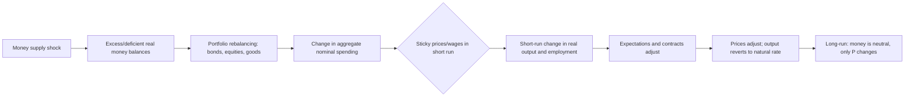

## Monetarist Explanations of Business Cycles

### Core Premise

Monetarism holds that fluctuations in the money supply are the dominant proximate cause of business cycles — that changes in the quantity of money, primarily driven by errors in central bank policy, are transmitted to real output and employment in the short run and to prices in the long run. This stands in contrast to Keynesian explanations centered on aggregate demand shocks from investment or fiscal instability, and to real business cycle theory's emphasis on technology shocks.

The foundational articulation is associated with **Milton Friedman** and **Anna Schwartz**, most fully developed in *A Monetary History of the United States, 1867–1960* (1963), alongside Friedman's theoretical work on the quantity theory of money and the natural rate of unemployment.

### The Quantity Theory Foundation

Monetarist business cycle theory rests on the equation of exchange:

$$MV = PY$$

where $M$ is the money supply, $V$ is the velocity of money (the rate at which money circulates through the economy), $P$ is the price level, and $Y$ is real output.

In growth-rate form, taking logarithmic differences:

$$\dot{M} + \dot{V} = \dot{P} + \dot{Y}$$

The monetarist claim is that $V$ is **stable and predictable** in the short-to-medium run (though not necessarily constant), so that changes in $M$ map fairly directly onto changes in nominal income $PY$. Because prices are sticky in the short run, an unanticipated change in $M$ shows up disproportionately as a change in $Y$ (real output) before eventually working through to $P$ once expectations and contracts adjust.

### Transmission Mechanism: From Money to the Business Cycle

**Key Points**

- **Step 1 — Monetary shock**: The central bank (or, historically, the banking system's money-multiplier dynamics) causes the money supply to grow faster or slower than the economy's underlying real growth rate.
- **Step 2 — Portfolio adjustment**: Economic agents holding more money than desired at the prevailing interest rate and price level attempt to rebalance portfolios, buying bonds, equities, real assets, and goods. This is the **direct transmission mechanism** monetarists emphasize (distinct from the narrower Keynesian interest-rate channel).
- **Step 3 — Spending and output effects**: Because nominal wages and prices are sticky in the short run (due to contracts, menu costs, and imperfect information), the excess money translates into higher real spending, output, and employment above their "natural" or trend levels — an economic expansion.
- **Step 4 — Price adjustment and correction**: As expectations catch up and contracts are renegotiated, prices rise to absorb the excess money, and real output/employment revert toward their natural rate. If the initial monetary expansion is not sustained, the economy can overshoot into a subsequent contraction as agents realize real balances have fallen relative to what they had adjusted their spending plans around.
- **Step 5 — Lags**: Friedman's most distinctive empirical claim is that monetary policy operates with **"long and variable lags"** — commonly cited as roughly 6 to 18 months between a change in monetary growth and its effect on output, and longer and more variable for effects on prices. This lag structure is central to the monetarist critique of discretionary policy (see below).

### The Natural Rate Hypothesis and the Expectations-Augmented Phillips Curve

Friedman (1968, "The Role of Monetary Policy") and Edmund Phelps independently argued that the **short-run Phillips curve trade-off** between inflation and unemployment is exploitable only when inflation is unanticipated. This produces the **expectations-augmented Phillips curve**:

$$\pi_t = \pi_t^e + \phi(u_n - u_t) + \varepsilon_t$$

where $\pi_t$ is actual inflation, $\pi_t^e$ is expected inflation, $u_n$ is the natural rate of unemployment, $u_t$ is actual unemployment, $\phi > 0$ is a sensitivity parameter, and $\varepsilon_t$ is a supply shock term.

**Business cycle implication**: An unanticipated monetary expansion lowers unemployment below $u_n$ only temporarily, as long as $\pi_t > \pi_t^e$. Once expectations adjust ($\pi_t^e \to \pi_t$), unemployment reverts to $u_n$, but at a permanently higher inflation rate. Repeated attempts to hold unemployment below $u_n$ via monetary expansion produce **accelerating inflation** rather than sustained real gains — this is the monetarist explanation for stagflation-type dynamics and a direct critique of the naive Keynesian Phillips-curve trade-off exploited in the 1960s.

### Why Monetary Policy Itself Causes Cycles: The Policy-Induced Cycle Argument

A distinctive monetarist claim (as opposed to simply "money matters") is that **discretionary monetary policy is itself typically the source of cyclical instability**, rather than a stabilizing force, because of:

1. **Recognition lag** — time needed to identify that the economy has entered a downturn or overheating episode from noisy, revised data
2. **Decision lag** — time for the policy authority to decide on and implement a response
3. **Impact lag** — the "long and variable lag" (per above) between policy action and its effect on the real economy, meaning a policy response calibrated to today's conditions often lands when conditions have already changed, exacerbating rather than dampening the cycle

Friedman's conclusion: because these lags are long and variable (and hence not reliably forecastable), discretionary fine-tuning is more likely to destabilize than stabilize the economy. This motivates the monetarist policy prescription of a **fixed money growth rule** (the "k-percent rule"): grow the money supply at a constant rate approximating the long-run real growth rate of the economy, removing discretion as a source of shocks.

### Historical Application: The Great Depression as a Monetary Phenomenon

Friedman and Schwartz's most influential empirical claim is that the **Great Depression (1929–1933)** was caused and dramatically worsened by a collapse in the U.S. money supply — roughly one-third contraction between 1929 and 1933 — driven by Federal Reserve policy failures (failing to act as lender of last resort during banking panics, and tightening rather than easing policy) rather than by a collapse in the real economy or investment demand as emphasized in Keynesian accounts.

**[Inference]** This reframing of the Depression as a **monetary policy failure** (a failure of omission — the Fed not expanding the money supply to counteract bank failures — rather than a failure of the market economy per se) had substantial influence on how contemporary central banks (notably the Federal Reserve in 2008 and again in 2020) approached banking crises with aggressive liquidity provision, and this influence is well-documented in central bank communications and academic retrospectives (e.g., Bernanke's own scholarship on the Depression).

### Monetarism vs. Competing Business Cycle Frameworks

| Framework | Primary shock source | Transmission | Policy implication |
| --- | --- | --- | --- |
| Monetarist | Money supply growth deviations | Portfolio rebalancing → nominal spending → sticky-price real effects | Fixed money growth rule; minimize discretion |
| Keynesian (traditional) | Aggregate demand — investment/animal spirits, fiscal shocks | Multiplier effects, sticky wages/prices, liquidity trap possibility | Active fiscal and monetary countercyclical policy |
| New Keynesian | Demand and supply shocks with microfounded nominal rigidities | Sticky prices (Calvo/menu cost) interacting with monetary policy rule | Rules-based but state-contingent (e.g., Taylor rule) |
| Real Business Cycle (RBC) | Real productivity/technology shocks | Intertemporal substitution of labor and consumption; money is largely neutral/endogenous | Limited role for stabilization policy; cycles are efficient responses to shocks |
| Austrian | Credit expansion distorting the interest rate/capital structure | Malinvestment during artificial credit booms, followed by liquidation | Avoid central bank-driven credit expansion; minimal intervention |

**[Inference]** The monetarist and Austrian frameworks share an emphasis on **credit/money expansion as the root cause** of cycles, but diverge sharply on mechanism (aggregate nominal spending and sticky prices for monetarists, vs. intertemporal capital misallocation for Austrians) and on prescription (a stable growth rule vs. non-intervention).

### Empirical Evidence and Critiques

**Supporting evidence commonly cited:**

- Strong historical correlation between money supply growth (M1/M2) and nominal GDP growth across many countries and periods, particularly in the Friedman-Schwartz dataset
- Episodes of hyperinflation are essentially universally associated with extreme money supply growth, consistent with the long-run quantity theory
- The correlation between disinflation (e.g., the Volcker disinflation of 1979–1982) and a preceding sharp deceleration in money growth, accompanied by a severe recession consistent with short-run real effects of monetary contraction

**Major critiques:**

- **Velocity instability**: From the early 1980s onward, financial innovation (money market funds, ATMs, changing regulation) made $V$ considerably less stable and predictable in many advanced economies, undermining the practical usefulness of monetary targeting — this was a key reason most major central banks (Fed, Bank of England) abandoned strict monetary targeting by the mid-1980s to 1990s in favor of interest-rate-based frameworks (later inflation targeting).
- **Endogeneity/reverse causation critique**: Keynesian and later New Keynesian economists have argued that money supply changes are often the *result* of changes in economic activity (banks lend more when demand for credit rises in an expansion) rather than an exogenous cause, complicating the causal story in Friedman-Schwartz's correlational evidence.
- **Difficulty defining and measuring "the" money supply**: Proliferation of near-money instruments (money market funds, repo, shadow banking liabilities) has made it increasingly unclear which monetary aggregate ($M1$, $M2$, $M3$, or broader measures) is theoretically and empirically relevant, weakening the practical implementability of a money-growth rule.
- **Absence of a rigorous general equilibrium microfoundation** relative to later New Keynesian DSGE models, which reframed monetary non-neutrality using explicit optimizing behavior and nominal rigidities, effectively subsuming and reformulating many monetarist insights within a more rigorous framework — this is one reason monetarism per se receded as an active research program from the 1990s onward while its core proposition (money and monetary policy affect the real economy in the short run) survived in modified form.
- **[Speculation]** Some economists have argued the 2008 Global Financial Crisis, driven substantially by financial-sector leverage and asset-price dynamics rather than by aggregate money supply mismanagement per se, sits uncomfortably within a pure monetarist framework, though this remains a live and contested debate among historians of the crisis.

### Policy Prescription: The Monetary Growth Rule

Friedman's proposed **k-percent rule**:

$$\dot{M}_t = k \quad \text{for all } t$$

where $k$ is set equal to the estimated long-run trend growth rate of real output (so that with stable velocity, $\dot{P} \to 0$ in the long run). The rule is designed to eliminate policy-induced cyclical shocks arising from the lag problems described above, at the cost of forgoing any discretionary countercyclical response to demand or supply shocks.

**[Inference]** In practice, no major central bank currently operates a strict k-percent rule; most adopted flexible inflation targeting instead, which retains discretion but anchors it to an explicit numerical objective — a partial, modified inheritance of the monetarist critique of unconstrained discretion rather than an adoption of its specific mechanical prescription.

### Example: Stylized Numerical Illustration

Suppose the economy's real trend growth rate is 3% annually and velocity is stable. Under the quantity theory, long-run price stability requires:

$$\dot{M} = \dot{Y} - \dot{V} = 3\% - 0\% = 3\%$$

If the central bank instead expands the money supply by 8% in a given year (an unanticipated deviation of 5 percentage points above the rule), the monetarist prediction is:

- **Short run** (before expectations adjust): most of the extra 5% shows up as a temporary boost to real output growth and a temporary fall in unemployment below $u_n$
- **Medium run**: as wage/price contracts are renegotiated and expected inflation $\pi^e$ rises, the real effects fade and the excess money growth increasingly shows up as price inflation
- **Long run**: output and employment return to their natural rates; the 5-percentage-point excess money growth is fully absorbed into a permanently higher inflation rate, consistent with long-run monetary neutrality

### Related Topics

- Real Business Cycle theory and technology-shock-driven fluctuations
- New Keynesian DSGE models and the New Keynesian Phillips curve
- Federal Reserve monetary policy history: from monetary targeting to inflation targeting
- Rational expectations and the Lucas critique
- The Volcker disinflation (1979–1982) as an applied test of monetary contraction effects
- Taylor rule and interest-rate-based policy frameworks
- Austrian business cycle theory and malinvestment
- Money multiplier and the endogenous vs. exogenous money supply debate
- Velocity of money and its breakdown post-1980s financial innovation
- Friedman-Schwartz *A Monetary History of the United States* and the Great Depression debate