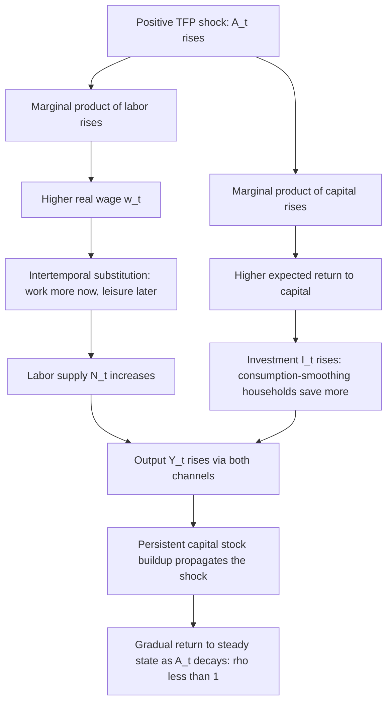

## Real Business Cycle Theory Foundations

### Core Premise

Real Business Cycle (RBC) theory explains aggregate fluctuations in output, employment, consumption, and investment as the **efficient, optimal responses of rational agents to real (non-monetary) shocks**, primarily shocks to total factor productivity (technology). In this framework, business cycles are not market failures or disequilibrium phenomena requiring correction — they are the equilibrium outcome of forward-looking households and firms optimally reallocating consumption, leisure, labor, and investment over time in response to changing production possibilities.

The foundational contributions are **Finn Kydland and Edward Prescott**, "Time to Build and Aggregate Fluctuations" (*Econometrica*, 1982), which introduced the core methodology, along with subsequent work by Charles Plosser, John Long, and others. Kydland and Prescott received the 2004 Nobel Memorial Prize in Economics substantially for this and related work on time consistency in policy.

### Methodological Break from Earlier Business Cycle Theory

RBC theory represented a methodological revolution as much as a substantive one, built on three pillars:

1. **Microfoundations and dynamic optimization**: Unlike earlier Keynesian macro models built from aggregate behavioral equations (consumption functions, investment functions calibrated to historical correlations), RBC models are explicitly derived from the optimization problems of a representative household and representative firm, solved as a dynamic stochastic general equilibrium (DSGE).
2. **Market clearing and flexible prices**: All markets clear continuously; there is no involuntary unemployment or sticky prices/wages. Observed fluctuations in employment reflect voluntary intertemporal substitution of labor supply, not disequilibrium.
3. **Calibration rather than econometric estimation**: Model parameters (capital share, discount factor, depreciation rate, labor supply elasticity) are set using long-run micro and growth-accounting evidence rather than estimated to fit the business cycle data being explained, and the model's simulated moments (variances, covariances, autocorrelations of output, consumption, investment, hours) are then compared against actual data moments as a test of fit.

### The Baseline RBC Model Structure

**Representative household** maximizes expected lifetime utility over consumption and leisure:

$$\max E_0 \sum_{t=0}^{\infty} \beta^t U(C_t, 1 - N_t)$$

where $\beta \in (0,1)$ is the subjective discount factor, $C_t$ is consumption, $N_t$ is labor supplied (so $1 - N_t$ is leisure, with total time endowment normalized to 1), subject to the budget constraint:

$$C_t + I_t = w_t N_t + r_t K_t$$

**Capital accumulation** follows:

$$K_{t+1} = (1 - \delta) K_t + I_t$$

where $\delta$ is the depreciation rate and $I_t$ is investment.

**Representative firm** produces output using a constant-returns-to-scale technology, typically Cobb-Douglas:

$$Y_t = A_t K_t^{\alpha} N_t^{1-\alpha}$$

where $\alpha$ is capital's share of income and $A_t$ is total factor productivity (TFP) — the exogenous **technology shock** that is the model's central driving force.

**The technology shock process** is typically modeled as a highly persistent AR(1) process in logs:

$$\ln A_t = \rho \ln A_{t-1} + \varepsilon_t, \quad \varepsilon_t \sim N(0, \sigma_\varepsilon^2)$$

with $\rho$ close to 1 (high persistence), calibrated from Solow-residual estimates of actual TFP.

**Resource constraint (goods market clearing)**:

$$Y_t = C_t + I_t$$

### Transmission Mechanism: How a Technology Shock Generates a "Cycle"

**Key Points**

- A positive technology shock raises both the marginal product of labor and capital simultaneously.
- Because the shock is persistent ($\rho$ near 1), the *expected* future return to capital rises, inducing agents to substitute intertemporally — working more today (when productivity/wages are temporarily high) and consuming leisure later, and investing more today to take advantage of high current productivity being embedded into a higher future capital stock.
- This **intertemporal substitution of labor supply** is the central mechanism generating pro-cyclical employment: workers voluntarily choose to supply more labor during high-productivity periods, not because of nominal rigidities or involuntary unemployment.
- **Propagation**: even though $\varepsilon_t$ may be a one-time shock, capital accumulation ($K_{t+1} = (1-\delta)K_t + I_t$) acts as an internal propagation mechanism, spreading the shock's effect over many periods after the shock itself has decayed — this is why RBC models can generate persistent, hump-shaped output responses from transient underlying shocks.

### Key Predictions and Stylized Facts RBC Models Target

RBC models are evaluated by how well their simulated second moments match observed U.S. business cycle statistics (typically HP-filtered data):

| Variable | Empirical stylized fact | RBC model prediction |
| --- | --- | --- |
| Consumption | Less volatile than output | Matches well — consumption smoothing via intertemporal optimization |
| Investment | More volatile than output (roughly 3x) | Matches reasonably well — investment as the adjustment margin |
| Hours worked | Procyclical, roughly as volatile as output | Partially matches, but baseline models often under-predict hours volatility relative to data (the "hours volatility puzzle") |
| Real wages | Mildly procyclical | Matches qualitatively, though the empirical procyclicality of wages is smaller than in some model variants |
| Productivity (output per hour) | Procyclical | Matches by construction, since $A_t$ is the driving shock |
| Correlation of consumption and output | Highly positive | Matches well |

**[Inference]** The relatively weak hours-worked volatility generated by the baseline model (given realistic labor supply elasticities estimated from micro data) has been one of the most persistent and widely cited empirical challenges to the framework, motivating extensions such as indivisible labor (Hansen, 1985) and home production margins.

### Solving the Model: Method of Moments and Calibration Workflow

**Key Points**

1. **Specify functional forms** — typically Cobb-Douglas production, CRRA or log utility over consumption, and either separable or GHH-type utility over labor.
2. **Calibrate parameters** from independent micro/growth evidence rather than fitting to cycle data: $\alpha \approx 0.33$ (capital's income share from national accounts), $\beta \approx 0.99$ (quarterly, implying ~4% annual real interest rate), $\delta \approx 0.025$ (quarterly depreciation), labor supply elasticity from labor economics estimates.
3. **Estimate the TFP shock process** ($\rho$, $\sigma_\varepsilon$) from the Solow residual: $\ln A_t = \ln Y_t - \alpha \ln K_t - (1-\alpha)\ln N_t$, computed from actual output, capital, and labor data.
4. **Solve the model** — typically by log-linearizing the equilibrium conditions (first-order conditions plus resource constraint) around the deterministic steady state, yielding a linear rational expectations system solvable via standard methods (e.g., Blanchard-Kahn, or the method of undetermined coefficients).
5. **Simulate** the linearized model repeatedly using drawn shock sequences, HP-filter the simulated series (matching the filtering applied to actual data), and compare simulated moments (standard deviations, cross-correlations, autocorrelations) to the empirical moments.
6. **Assess fit** qualitatively — RBC methodology explicitly eschews formal statistical hypothesis testing (e.g., likelihood-ratio tests) in its classic form, instead asking whether the model "mimics" the qualitative business cycle facts, which was itself a methodological point of contention with more traditional econometric approaches.

### Major Extensions to the Baseline Model

- **Indivisible labor (Hansen, 1985)**: Assumes workers either work a fixed shift or not at all (rather than choosing hours continuously), with employment lotteries aggregating to a representative household framework. This amplifies the volatility of aggregate hours relative to the continuous-hours baseline, helping address the hours-volatility puzzle.
- **Government spending shocks**: Adding stochastic government purchases financed by lump-sum taxes as an additional real shock, working through a wealth effect on labor supply.
- **Multi-sector RBC models**: Distinguishing sectors (e.g., durable/non-durable goods, or investment-good vs. consumption-good sectors) to capture sectoral reallocation dynamics.
- **Home production models** (Benhabib, Rogerson, and Wright, 1991): Adding a non-market production sector to better explain the substitution between market and non-market work over the cycle.
- **News shocks / anticipated technology shocks**: Later literature (e.g., Beaudry and Portier) explores agents receiving advance information about future productivity changes, generating "news-driven" cycles even before the technology change materializes.
- **Real frictions**: Variable capital utilization, adjustment costs to investment, and habit formation in consumption, added to bring model dynamics closer to the data without abandoning the flexible-price, market-clearing core.

### RBC as the Precursor to New Keynesian DSGE Modeling

**[Inference]** The RBC methodological apparatus — dynamic optimization, calibration/estimation of structural parameters, log-linearization, and general equilibrium simulation — was subsequently adopted almost wholesale by New Keynesian economists, who added nominal rigidities (Calvo pricing, staggered wage contracts), monopolistic competition, and a role for monetary policy shocks/rules on top of the RBC real core. This produced the modern **New Keynesian DSGE** framework used at most central banks today, meaning RBC's lasting influence on macroeconomic methodology substantially exceeds the acceptance of its specific substantive claim that technology shocks alone (with fully flexible prices) can account for observed business cycles.

### Critiques of RBC Theory

**Key Points**

- **Identification and interpretation of the Solow residual**: Critics (notably Summers, 1986, and subsequent literature) argue the Solow residual used to calibrate $A_t$ is not a clean measure of exogenous technology; it can reflect unmeasured variation in capital/labor utilization, labor hoarding, and increasing returns to scale, so that "technology shocks" may partly be capturing endogenous responses to demand rather than genuine exogenous productivity innovations.
- **Implausibility of large, frequent negative technology shocks**: The theory requires literal technological regress (negative TFP shocks) to explain recessions, which many economists find difficult to reconcile with observed patterns of measured productivity and the absence of any obvious "technology going backward" narrative for most recessions.
- **Money non-neutrality evidence**: A large empirical literature (VAR-identified monetary policy shocks, natural experiments) finds monetary policy has real effects on output and employment, which is inconsistent with the RBC assumption that money is essentially a veil with no independent role in driving cycles — this is one of the most significant empirical challenges to a "pure" RBC interpretation of aggregate fluctuations.
- **Labor supply elasticity**: Micro-econometric estimates of the intertemporal (Frisch) elasticity of labor supply are generally much lower than the values RBC models often require to generate realistic employment volatility, creating tension between the micro-data-consistency the calibration approach claims and the parameter values actually used.
- **Neglect of financial frictions**: Baseline RBC models have no meaningful role for credit markets, banking, or financial intermediation frictions, which limits their ability to explain crises with clear financial origins (e.g., 2008), a gap later addressed by financial-accelerator and DSGE-with-financial-frictions models (Bernanke-Gertler-Gilchrist and successors).
- **[Speculation]** Whether recessions are best understood as efficient equilibrium responses to shocks (implying no welfare-improving role for stabilization policy) versus costly deviations from potential output remains a genuinely contested normative and positive question in macroeconomics, and is not resolved purely by the RBC model's ability to match certain business cycle moments.

### Example: Numerical Illustration of the Solow Residual

Given data showing quarterly output growth of 3.2%, capital growth of 2.0%, labor growth of 1.0%, and a calibrated capital share $\alpha = 0.33$, the implied TFP (Solow residual) growth is:

$$\dot{A} = \dot{Y} - \alpha \dot{K} - (1-\alpha)\dot{N}$$

$$\dot{A} = 3.2\% - (0.33)(2.0\%) - (0.67)(1.0\%)$$

$$\dot{A} = 3.2\% - 0.66\% - 0.67\% = 1.87\%$$

This residual — the portion of output growth not accounted for by measured input growth — is what the RBC model attributes entirely to exogenous technological change, which is precisely the identification assumption critics (e.g., Summers) dispute.

### Related Topics

- Solow growth model and growth accounting methodology
- New Keynesian DSGE models and nominal rigidities (Calvo pricing)
- Monetarist explanations of business cycles (contrast in shock source and price flexibility assumptions)
- Financial accelerator models (Bernanke-Gertler-Gilchrist)
- Hansen (1985) indivisible labor model
- News-driven business cycles (Beaudry-Portier)
- Time consistency in policy and the Kydland-Prescott (1977) rules-vs-discretion critique
- Hodrick-Prescott filter and business cycle measurement methodology
- Frisch elasticity of labor supply and micro-macro labor supply elasticity puzzle
- Log-linearization and solution methods for DSGE models