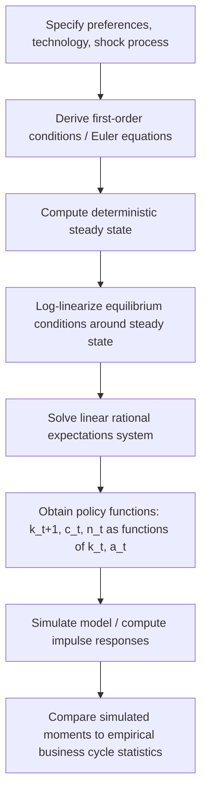

## Technology Shocks and RBC Propagation Mechanisms

### Overview

Real Business Cycle (RBC) theory explains aggregate fluctuations as the equilibrium response of a dynamic economy to exogenous shocks, primarily total factor productivity (TFP) shocks. Unlike Keynesian approaches that emphasize demand-side rigidities, RBC theory holds that business cycles are largely driven by real (as opposed to monetary) disturbances propagating through an economy populated by optimizing agents operating in competitive markets. The theory originated with Kydland and Prescott (1982) and Long and Plosser (1983), who showed that a standard neoclassical growth model, when hit by persistent productivity shocks, can generate co-movements in output, consumption, investment, and hours worked that resemble observed business cycles.

The central claim is twofold: (1) technology shocks are the primary impulse driving cyclical fluctuations, and (2) the internal structure of the economy — capital accumulation, labor-leisure choice, consumption smoothing — acts as a propagation mechanism that transforms a short-lived impulse into a persistent, hump-shaped, and correlated pattern of movements across macroeconomic aggregates.

### The Basic RBC Framework

#### Households

A representative household maximizes expected lifetime utility over consumption $C_t$ and leisure $1 - N_t$ (where $N_t$ is labor supply):

$$E_0 \sum_{t=0}^{\infty} \beta^t U(C_t, 1 - N_t)$$

subject to the budget constraint:

$$C_t + I_t = w_t N_t + r_t K_t$$

where $\beta \in (0,1)$ is the discount factor, $w_t$ is the real wage, $r_t$ is the rental rate of capital, $I_t$ is investment, and $K_t$ is the capital stock.

#### Firms and Technology

A representative firm produces output using a constant-returns-to-scale Cobb-Douglas production function:

$$Y_t = A_t K_t^{\alpha} N_t^{1-\alpha}$$

where $A_t$ is total factor productivity (the technology shock), and $\alpha \in (0,1)$ is capital's share of income.

#### Capital Accumulation

$$K_{t+1} = (1-\delta)K_t + I_t$$

where $\delta$ is the depreciation rate.

#### The Technology Shock Process

TFP is typically modeled as following a stationary AR(1) process in logs:

$$\ln A_t = \rho \ln A_{t-1} + \varepsilon_t, \quad \varepsilon_t \sim N(0, \sigma_\varepsilon^2)$$

with $\rho \in (0,1)$ governing persistence. High persistence ($\rho$ close to 1) is essential to generating realistic business cycle dynamics — a purely transitory shock ($\rho = 0$) produces almost no propagation, since agents have little incentive to adjust capital or labor in response to a shock they know will vanish next period.

### The Social Planner's Problem

Because markets are complete and competitive in the baseline RBC model, the decentralized equilibrium coincides with the solution to a social planner's problem:

$$\max_{\{C_t, N_t, K_{t+1}\}} E_0 \sum_{t=0}^{\infty} \beta^t U(C_t, 1-N_t)$$

subject to the resource constraint:

$$C_t + K_{t+1} - (1-\delta)K_t = A_t K_t^{\alpha} N_t^{1-\alpha}$$

This equivalence (the First Welfare Theorem applied in a stochastic dynamic setting) is what makes the model tractable via planner-based dynamic programming rather than requiring explicit market-clearing price computation.

### Equilibrium Conditions

Optimality yields:

**Euler equation (intertemporal consumption smoothing):**

$$U_C(C_t, 1-N_t) = \beta E_t \left[ U_C(C_{t+1}, 1-N_{t+1}) \left(\alpha A_{t+1} K_{t+1}^{\alpha-1} N_{t+1}^{1-\alpha} + 1 - \delta\right) \right]$$

**Labor supply condition (intratemporal trade-off):**

$$\frac{U_L(C_t, 1-N_t)}{U_C(C_t, 1-N_t)} = w_t = (1-\alpha) A_t K_t^{\alpha} N_t^{-\alpha}$$

**Capital rental rate:**

$$r_t = \alpha A_t K_t^{\alpha - 1} N_t^{1-\alpha}$$

These three conditions, together with the resource constraint and the AR(1) shock process, fully characterize the equilibrium dynamics.

### Propagation Mechanisms

The "propagation mechanism" is the set of internal channels through which a one-time technology shock generates persistent, amplified, and correlated movements in aggregate variables — as opposed to a single-period blip. RBC models rely on several interacting propagation channels.

#### 1. Capital Accumulation (Internal Propagation)

This is the single most important propagation mechanism in the baseline RBC model. A positive shock to $A_t$ raises the marginal product of capital, inducing higher investment. Because capital cannot be adjusted instantaneously to its new steady-state level (it is accumulated gradually via $K_{t+1} = (1-\delta)K_t + I_t$), the capital stock rises slowly over many periods even after the shock itself has partially decayed. This creates **hump-shaped, persistent dynamics** in output and investment even when the underlying shock is only moderately persistent.

Capital accumulation acts like a low-pass filter: it smooths and stretches the impulse response of a shock over time, converting a shock with autocorrelation $\rho$ into output dynamics with even greater effective persistence.

#### 2. Intertemporal Substitution in Consumption (Consumption Smoothing)

Because households value smooth consumption paths (concave utility), a temporary positive technology shock is not immediately consumed in full. Instead, agents save part of the transitory gain, converting it into investment and future consumption. The permanent-income-like logic here reallocates resources across time, further smoothing and stretching the shock's effects.

#### 3. Intertemporal Substitution in Labor Supply

Under separable utility with labor disutility, a persistent positive technology shock raises the expected future return to working today relative to tomorrow (via anticipated higher future wages and returns to capital), inducing households to work more in the current period when productivity is high ("make hay while the sun shines"). This labor supply response amplifies the initial output effect beyond what capital and TFP alone would generate, and it is central to explaining procyclical hours and employment.

#### 4. Variable Capital Utilization (Extension)

In extended RBC models, firms can vary the utilization rate $u_t$ of existing capital (not just its quantity), so that effective capital input is $u_t K_t$. This allows output to respond more strongly to shocks without requiring large, costly, and slow changes in the physical capital stock, improving the model's ability to match the amplitude of observed output volatility.

#### 5. Time-to-Build (Kydland-Prescott Extension)

In the original Kydland-Prescott (1982) formulation, investment projects take multiple periods to complete before yielding productive capital. This "time-to-build" structure creates additional lags and hump-shaped investment responses, since resources committed to a project in progress cannot be redirected instantly when new information arrives.

#### 6. Labor Hoarding and Adjustment Costs (Extensions)

Extensions incorporating costs of adjusting employment (hiring/firing costs) or capital (investment adjustment costs) further smooth and delay the response of factor inputs to shocks, contributing additional persistence and reducing excess volatility relative to simple frictionless models.

### Impulse Response Dynamics

A one-time positive technology shock $\varepsilon_t > 0$ in a calibrated RBC model typically generates:

- **Output ($Y_t$):** Jumps up on impact, then declines gradually back toward trend as $A_t$ decays and capital slowly reverts, often displaying a hump-shaped path since capital continues rising for several periods after the shock.
- **Investment ($I_t$):** Rises more than proportionally to output on impact (investment is more volatile than output in the data, a pattern RBC models replicate reasonably well) and remains elevated for an extended period.
- **Consumption ($C_t$):** Rises but by less than output, reflecting consumption-smoothing behavior; its response is smoother and more persistent than output's.
- **Hours worked ($N_t$):** Rises on impact due to intertemporal labor substitution, then gradually returns to steady state.
- **Real wage ($w_t$):** Rises, since the marginal product of labor increases directly with $A_t$ and indirectly with the capital stock.
- **Capital stock ($K_t$):** Rises slowly and persistently, peaking well after the shock itself has largely dissipated — this lagged, hump-shaped response is the clearest signature of capital accumulation as a propagation mechanism.

#### Impulse Response Diagram (svg_diagram)

<svg xmlns="http://www.w3.org/2000/svg" viewBox="0 0 760 460" font-family="Helvetica, Arial, sans-serif">
<text x="380" y="24" text-anchor="middle" font-size="16" font-weight="bold" fill="#1a1a1a">Impulse Responses to a Positive Technology Shock (svg_diagram)</text>

<line x1="70" y1="380" x2="720" y2="380" stroke="#333" stroke-width="1.5" />
<line x1="70" y1="60" x2="70" y2="380" stroke="#333" stroke-width="1.5" />
<text x="395" y="410" text-anchor="middle" font-size="12" fill="#333">Time (periods after shock)</text>
<text x="30" y="220" text-anchor="middle" font-size="12" fill="#333" transform="rotate(-90 30 220)">% Deviation from Steady State</text>

<line x1="70" y1="380" x2="720" y2="380" stroke="#999" stroke-width="1" stroke-dasharray="2,2" />

<path d="M 70,140 C 150,170 250,230 350,280 C 450,315 550,340 650,355 L 720,362" fill="none" stroke="`#e63946`" stroke-width="2.5" />

<text x="655" y="350" font-size="11" fill="`#e63946`" font-weight="bold">A_t (TFP)</text>

<path d="M 70,190 C 160,150 220,140 300,150 C 400,165 500,220 600,290 C 650,320 690,345 720,358" fill="none" stroke="`#1d3557`" stroke-width="2.5" />

<text x="300" y="135" font-size="11" fill="`#1d3557`" font-weight="bold">Output (Y)</text>

<path d="M 70,120 C 150,80 230,75 300,95 C 400,130 500,220 600,310 C 650,340 690,360 720,368" fill="none" stroke="`#2a9d8f`" stroke-width="2.5" />

<text x="220" y="68" font-size="11" fill="`#2a9d8f`" font-weight="bold">Investment (I)</text>

<path d="M 70,290 C 200,270 350,255 450,250 C 550,248 650,255 720,262" fill="none" stroke="`#f4a261`" stroke-width="2.5" />

<text x="500" y="240" font-size="11" fill="`#f4a261`" font-weight="bold">Consumption (C)</text>

<path d="M 70,378 C 200,375 350,340 450,300 C 550,270 650,255 720,248" fill="none" stroke="`#6a4c93`" stroke-width="2.5" stroke-dasharray="6,3" />

<text x="560" y="240" font-size="11" fill="`#6a4c93`" font-weight="bold">Capital (K)</text>

<path d="M 70,250 C 140,220 220,225 300,250 C 400,285 500,330 600,360 C 650,372 690,378 720,380" fill="none" stroke="`#e76f51`" stroke-width="2.5" />

<text x="150" y="215" font-size="11" fill="`#e76f51`" font-weight="bold">Hours (N)</text>

<text x="70" y="395" font-size="10" fill="#666">t=0</text>

<text x="720" y="395" font-size="10" fill="#666" text-anchor="end">t=T</text>

</svg>

### Amplification vs. Propagation: A Key Distinction

- **Impulse**: the exogenous technology shock $\varepsilon_t$ itself — a one-time disturbance to $A_t$.
- **Propagation**: the internal mechanisms (capital accumulation, consumption smoothing, labor substitution) that convert this impulse into a serially correlated, cross-correlated pattern of fluctuations across variables.
- **Amplification**: the degree to which the *magnitude* of the output response exceeds the magnitude of the underlying shock. Standard RBC models often exhibit relatively weak amplification (output volatility close to Solow-residual volatility), which is a longstanding criticism.

### Solving RBC Models

Because the model has no closed-form solution in general, quantitative RBC analysis relies on **log-linearization** around the deterministic steady state, then applying the method of undetermined coefficients, Blanchard-Kahn conditions, or perturbation methods to obtain linear (or higher-order) policy functions of the form:

$$\hat{k}_{t+1} = \pi_{kk}\hat{k}_t + \pi_{ka}\hat{a}_t, \qquad \hat{c}_t = \pi_{ck}\hat{k}_t + \pi_{ca}\hat{a}_t$$

where hatted variables denote log-deviations from steady state. These policy functions are then used to simulate the model economy and generate artificial time series for comparison against real-world data.

#### Solution Workflow Diagram

### Calibration and Model Evaluation

RBC methodology (following Kydland and Prescott) does not estimate parameters via econometric likelihood maximization but instead **calibrates** them using microeconomic evidence and long-run averages:

| Parameter | Typical Value | Source |
| --- | --- | --- |
| $\alpha$ (capital share) | 0.33–0.36 | National income accounts (labor share ≈ 2/3) |
| $\beta$ (discount factor) | 0.96–0.99 (annual/quarterly) | Matches real interest rate |
| $\delta$ (depreciation rate) | 0.02–0.10 (quarterly/annual) | Investment/capital ratios |
| $\rho$ (TFP persistence) | 0.90–0.98 | Solow residual autocorrelation |
| $\sigma_\varepsilon$ (shock std. dev.) | 0.007–0.01 | Solow residual volatility |

The model's success is judged by comparing **second moments** (standard deviations, relative volatilities, and cross-correlations with output) of simulated series to their empirical counterparts — a technique known as "moment matching," in contrast to formal hypothesis testing.

### The Solow Residual and Measuring Technology Shocks

Empirically, TFP shocks are typically backed out as the **Solow residual**:

$$\hat{A}_t = \ln Y_t - \alpha \ln K_t - (1-\alpha)\ln N_t$$

This residual is treated as a direct measure of exogenous technology. A major criticism (Summers, 1986; Hall, 1988) is that the Solow residual is contaminated by procyclical factor utilization, labor hoarding, and increasing returns to scale, meaning it may partly reflect endogenous responses to demand rather than pure exogenous technology — undermining the causal interpretation central to RBC theory. [Inference: the extent of this contamination remains disputed and estimates vary considerably across studies and identification strategies.]

### Strengths of the RBC Propagation Framework

- **Microfoundations:** Built from optimizing households and firms rather than ad hoc behavioral equations, satisfying the Lucas Critique.
- **Internal consistency:** Prices and quantities are jointly and simultaneously determined in general equilibrium.
- **Parsimony:** A small number of structural parameters can replicate a surprisingly rich set of co-movement patterns.
- **Quantitative discipline:** Calibration to microeconomic and long-run data imposes external validity that purely statistical models lack.

### Criticisms and Limitations

- **Weak internal propagation:** Basic RBC models require highly persistent ($\rho$ close to 1) and relatively volatile shocks to match observed output volatility, effectively "assuming" much of what needs to be explained — capital accumulation alone provides only modest additional persistence beyond the shock's own persistence.
- **Procyclical productivity puzzle:** The theory hinges on procyclical TFP, but measured Solow residuals may reflect labor hoarding and variable utilization rather than true technology.
- **Labor supply elasticity:** Matching observed employment volatility requires a labor supply elasticity implausibly high relative to microeconomic (household-survey) estimates — a central point of the "hours puzzle" often raised against RBC.
- **Neglect of monetary and financial factors:** Baseline RBC abstracts entirely from money, nominal rigidities, and financial frictions, limiting its ability to explain phenomena like the transmission of monetary policy or financial crises.
- **Negative technology shocks:** The requirement that recessions stem from negative technology shocks (implying periods of technological regress) is viewed by critics as empirically and conceptually implausible.
- **Nature of the shock itself:** Later New Keynesian and DSGE literature reinterprets "technology shocks" more broadly (including shocks to investment efficiency, preferences, and government spending) partly in response to this critique. [Inference: the relative empirical importance of TFP shocks versus other shocks in explaining the variance of output remains a live debate in the DSGE literature.]

### Extensions Beyond the Baseline Model

- **Indivisible labor (Hansen, 1985):** Introduces a lottery over employment status to generate large employment volatility from small individual labor supply elasticities, addressing the hours puzzle.
- **Government spending shocks:** Adds fiscal shocks as an additional impulse alongside technology.
- **Two-sector RBC models:** Distinguish consumption-goods and investment-goods sectors, each with sector-specific technology shocks.
- **Open-economy RBC (International RBC):** Extends the framework to multi-country settings with cross-border capital flows and terms-of-trade shocks.
- **New Keynesian DSGE synthesis:** Retains the RBC real-side propagation core (capital accumulation, consumption smoothing) while adding nominal rigidities (sticky prices/wages), monopolistic competition, and monetary policy rules — the dominant modern modeling paradigm (e.g., Christiano-Eichenbaum-Evans, Smets-Wouters).

### Key Points

- RBC theory attributes business cycles primarily to persistent technology (TFP) shocks propagating through an optimizing general equilibrium economy.
- The core propagation mechanism is capital accumulation: because capital adjusts gradually, a transitory shock generates hump-shaped, persistent responses in output and investment.
- Consumption smoothing and intertemporal labor substitution are secondary but important propagation channels.
- Quantitative evaluation relies on calibration and moment-matching rather than econometric estimation.
- The framework's principal weaknesses are its reliance on highly persistent shocks, the contested interpretation of the Solow residual, and implausibly high implied labor supply elasticities.

### Related Topics

- Solow Growth Model and the neoclassical growth framework
- Log-linearization and the Blanchard-Kahn solution method
- Hansen's indivisible labor model and the "hours puzzle"
- New Keynesian DSGE models and nominal rigidities
- The Solow residual and TFP measurement controversies
- Time-to-build models (Kydland and Prescott, 1982)
- Hodrick-Prescott filtering and business cycle stylized facts
- Labor hoarding and variable capital utilization
- International RBC models and cross-country business cycle co-movement
- Monetary policy shocks vs. real shocks as competing business cycle drivers