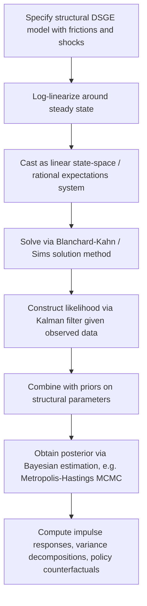

## New Keynesian Business Cycle Models

### Overview

New Keynesian (NK) business cycle theory emerged in the 1980s–1990s as a response to two competing traditions: the Real Business Cycle (RBC) school, which explained fluctuations through real technology shocks in frictionless markets, and older Keynesian macroeconometric models, which lacked rigorous microfoundations. NK theory retains the RBC commitment to dynamic stochastic general equilibrium (DSGE) modeling with optimizing households and firms, but reintroduces the classical Keynesian insight that **nominal rigidities** (sticky prices and wages) and **imperfect competition** prevent markets from clearing instantaneously. This combination allows monetary policy to have real effects in the short run — a feature absent from baseline RBC models — while preserving long-run monetary neutrality and internal theoretical consistency.

The modern synthesis of these ideas, often called the New Keynesian DSGE model or the "New Neoclassical Synthesis," now forms the workhorse framework used by most central banks for policy analysis and forecasting.

### Core Theoretical Building Blocks

NK models are built from three interacting blocks, typically referred to as the **New Keynesian trinity**:

1. A **dynamic IS curve** describing aggregate demand, derived from household intertemporal optimization (the consumption Euler equation).
2. A **New Keynesian Phillips Curve (NKPC)** describing aggregate supply, derived from monopolistically competitive firms facing price-adjustment frictions.
3. A **monetary policy rule** (typically a Taylor rule) closing the model by specifying how the central bank sets the nominal interest rate.

#### Diagram: The New Keynesian Trinity (svg_diagram)

<svg xmlns="http://www.w3.org/2000/svg" viewBox="0 0 720 380" font-family="Helvetica, Arial, sans-serif">
<text x="360" y="26" text-anchor="middle" font-size="16" font-weight="bold" fill="#1a1a1a">The New Keynesian Trinity (svg_diagram)</text>
<rect x="40" y="70" width="200" height="100" rx="10" fill="#e7f0fd" stroke="#1d3557" stroke-width="1.5" />
<text x="140" y="105" text-anchor="middle" font-size="13" font-weight="bold" fill="#1d3557">Dynamic IS Curve</text>
<text x="140" y="125" text-anchor="middle" font-size="11" fill="#333">Household Euler equation</text>
<text x="140" y="142" text-anchor="middle" font-size="11" fill="#333">Output gap ~ real rate</text>
<rect x="500" y="70" width="200" height="100" rx="10" fill="#fdeee7" stroke="#e76f51" stroke-width="1.5" />
<text x="600" y="105" text-anchor="middle" font-size="13" font-weight="bold" fill="#e76f51">NK Phillips Curve</text>
<text x="600" y="125" text-anchor="middle" font-size="11" fill="#333">Sticky prices (Calvo)</text>
<text x="600" y="142" text-anchor="middle" font-size="11" fill="#333">Inflation ~ output gap</text>
<rect x="270" y="230" width="200" height="100" rx="10" fill="#eafbe7" stroke="#2a9d8f" stroke-width="1.5" />
<text x="370" y="265" text-anchor="middle" font-size="13" font-weight="bold" fill="#2a9d8f">Monetary Policy Rule</text>
<text x="370" y="285" text-anchor="middle" font-size="11" fill="#333">Taylor rule</text>
<text x="370" y="302" text-anchor="middle" font-size="11" fill="#333">Sets nominal rate i_t</text>
<line x1="240" y1="120" x2="500" y2="120" stroke="#666" stroke-width="1.5" marker-end="url(#arrow1)" />
<line x1="500" y1="150" x2="240" y2="150" stroke="#666" stroke-width="1.5" marker-end="url(#arrow1)" />
<line x1="140" y1="170" x2="330" y2="230" stroke="#666" stroke-width="1.5" marker-end="url(#arrow1)" />
<line x1="370" y1="230" x2="370" y2="170" stroke="#666" stroke-width="1.5" marker-end="url(#arrow1)" />
<line x1="600" y1="170" x2="410" y2="230" stroke="#666" stroke-width="1.5" marker-end="url(#arrow1)" />
</svg>

### The Dynamic IS Curve

Derived from the representative household's consumption Euler equation under monopolistic competition, log-linearized around a zero-inflation steady state:

$$\hat{y}_t = E_t \hat{y}_{t+1} - \frac{1}{\sigma}\left(i_t - E_t \pi_{t+1} - r_t^n\right)$$

where $\hat{y}_t$ is the output gap (deviation of output from its natural/flexible-price level), $\sigma$ is the coefficient of relative risk aversion (inverse of the intertemporal elasticity of substitution), $i_t$ is the nominal interest rate, $\pi_{t+1}$ is expected inflation, and $r_t^n$ is the **natural rate of interest** — the real rate that would prevail under flexible prices.

This equation says current spending depends on expected future spending and the real interest rate gap $(i_t - E_t\pi_{t+1} - r_t^n)$: when the central bank sets rates above the natural rate, current output falls below its natural level.

### The New Keynesian Phillips Curve

Firms are monopolistically competitive and face price-adjustment frictions, most commonly modeled via the **Calvo (1983) pricing mechanism**: in each period, a firm can reset its price only with fixed probability $(1-\theta)$, independent of how long it has held its current price. This yields, after aggregation and log-linearization:

$$\pi_t = \beta E_t \pi_{t+1} + \kappa \hat{y}_t$$

where $\kappa = \frac{(1-\theta)(1-\beta\theta)}{\theta} \cdot \left(\sigma + \frac{\varphi + \alpha}{1-\alpha}\right)$ (the exact composition of $\kappa$ depends on modeling assumptions about labor supply elasticity $\varphi$ and returns to scale $\alpha$), and $\beta$ is the household discount factor.

Unlike the traditional backward-looking Phillips Curve, this is **purely forward-looking**: current inflation depends on expected future inflation and the current output gap, because price-setters who cannot adjust every period must consider the entire expected future path of marginal costs when they do get to reset.

#### Calvo Pricing Mechanism

Under Calvo pricing, a firm resetting its price at time $t$ chooses $p_t^*$ to maximize the expected discounted sum of profits over all future periods in which the price remains fixed:

$$p_t^* = (1-\beta\theta) \sum_{k=0}^{\infty} (\beta\theta)^k E_t \left[mc_{t+k}\right]$$

where $mc_{t+k}$ is real marginal cost. The aggregate price level then evolves as a weighted average of the previous period's price level and the newly reset price:

$$P_t = \left[\theta P_{t-1}^{1-\epsilon} + (1-\theta)(P_t^*)^{1-\epsilon}\right]^{\frac{1}{1-\epsilon}}$$

with $\epsilon$ the elasticity of substitution across differentiated goods varieties.

**Alternative price-stickiness formulations:**

- **Rotemberg (1982) quadratic adjustment costs**: firms face a direct convex cost of changing prices, yielding an NKPC that is analytically similar to the Calvo version but without the discrete probability structure — often preferred for its tractability in nonlinear/second-order solution methods.
- **Taylor (1980) staggered contracts**: prices are fixed for a deterministic number of periods rather than a random duration, producing similar qualitative implications with different lag structures.

### Monetary Policy: The Taylor Rule

The model is closed with a specification for how the central bank sets the nominal interest rate, typically a **Taylor (1993) rule**:

$$i_t = \rho_i i_{t-1} + (1-\rho_i)\left[\bar{r} + \pi^* + \phi_\pi (\pi_t - \pi^*) + \phi_y \hat{y}_t\right] + \varepsilon_t^m$$

where $\bar{r}$ is the long-run real rate, $\pi^*$ is the inflation target, $\phi_\pi$ and $\phi_y$ are the policy responsiveness coefficients to inflation and the output gap, $\rho_i$ captures interest-rate smoothing, and $\varepsilon_t^m$ is an exogenous monetary policy shock.

**The Taylor Principle:** for equilibrium determinacy (a unique stable rational-expectations equilibrium), the rule must satisfy $\phi_\pi > 1$ — the nominal rate must rise by more than one-for-one with inflation, so that the *real* interest rate rises when inflation rises, thereby stabilizing the economy. If $\phi_\pi < 1$, the model exhibits indeterminacy or self-fulfilling inflationary spirals.

### The Three-Equation NK Model (Compact Form)

$$\text{IS curve:} \quad \hat{y}_t = E_t\hat{y}_{t+1} - \frac{1}{\sigma}(i_t - E_t\pi_{t+1} - r_t^n)$$

$$\text{NKPC:} \quad \pi_t = \beta E_t \pi_{t+1} + \kappa \hat{y}_t + u_t$$

$$\text{Taylor Rule:} \quad i_t = \bar{r} + \phi_\pi \pi_t + \phi_y \hat{y}_t + \varepsilon_t^m$$

where $u_t$ is a "cost-push shock" (e.g., markup shock) — an ad hoc but common addition that breaks the divine coincidence (see below) and generates a meaningful stabilization trade-off.

### The Divine Coincidence

A striking result of the baseline three-equation NK model (Blanchard and Galí, 2007) is the **divine coincidence**: if the only shocks hitting the economy are demand shocks or technology shocks (and there is no separate cost-push shock), then stabilizing inflation at zero and closing the output gap are *simultaneously achievable* — there is no trade-off for the central bank. This coincidence disappears once cost-push shocks (e.g., markup shocks, oil price shocks) are introduced, at which point the central bank faces a genuine trade-off between inflation and output stabilization.

### Sticky Wages and the NK Wage Phillips Curve

Erceg, Henderson, and Levin (2000) extend the Calvo framework to the labor market: households (or labor unions) supply differentiated labor and reset nominal wages only with probability $(1-\theta_w)$ each period. This produces an analogous **wage Phillips curve**:

$$\pi_t^w = \beta E_t \pi_{t+1}^w + \kappa_w \left(\text{mrs}_t - w_t\right)$$

where $\pi_t^w$ is wage inflation and $\text{mrs}_t - w_t$ is the gap between the marginal rate of substitution (workers' reservation wage) and the actual real wage. Combining sticky prices and sticky wages allows the model to generate more persistent and realistic responses of inflation, wages, and employment to shocks, and is now a standard feature of medium-scale NK models.

### Medium-Scale Estimated DSGE Models

Modern policy-relevant NK models extend the three-equation core with numerous "real" and nominal frictions to better fit the data, most prominently:

- **Habit formation** in consumption (utility depends on $C_t - h C_{t-1}$), generating hump-shaped consumption responses.
- **Investment adjustment costs**, slowing the response of investment to shocks.
- **Variable capital utilization**.
- **Sticky wages** (Calvo-style, as above).
- **Indexation** of non-reset prices/wages to past inflation, adding backward-looking inertia to the NKPC and wage Phillips curve.
- **A rich set of structural shocks**: TFP, investment-specific technology, preference (discount factor), government spending, monetary policy, price markup, and wage markup shocks.

The two most influential examples are:

- **Christiano, Eichenbaum, and Evans (2005)** ("CEE") — introduced habit formation, investment adjustment costs, and sticky wages to match the hump-shaped, persistent responses of output and inflation to monetary policy shocks observed in VAR evidence.
- **Smets and Wouters (2003, 2007)** ("SW") — a fully Bayesian-estimated medium-scale DSGE model of the Euro Area/US economy, now a benchmark tool at central banks including the ECB and Federal Reserve.

These models are typically estimated using **Bayesian methods**: priors are placed over structural parameters (informed by microeconomic evidence and calibration conventions), and the posterior distribution is obtained by combining the model's implied likelihood (via the Kalman filter, given the linearized state-space representation) with observed macro time series.

#### Estimation Workflow

### The Zero Lower Bound and Unconventional Policy

A major strand of post-2008 NK research incorporates the **zero lower bound (ZLB)** on nominal interest rates, since the Taylor rule can imply negative rates that are infeasible (or were, prior to negative-rate experiments). At the ZLB:

$$i_t = \max\left(0, \bar{r} + \phi_\pi \pi_t + \phi_y \hat{y}_t\right)$$

When the ZLB binds, conventional interest-rate policy is constrained, motivating analysis of:

- **Forward guidance**: committing to future low rates to shape current expectations via the forward-looking IS and Phillips curves.
- **Quantitative easing (QE)**: asset purchases intended to affect long-term rates or risk premia, typically requiring departures from the frictionless-finance assumptions of the baseline model (necessitating financial frictions, segmented markets, or portfolio-balance channels).
- **Forward guidance puzzle**: the baseline NK model implies implausibly large output effects from far-future forward guidance, a widely studied anomaly.

### Financial Frictions: The New Keynesian-Financial Accelerator Synthesis

Following the 2008 Global Financial Crisis, NK models were extended to incorporate financial frictions, most influentially via the **financial accelerator** mechanism (Bernanke, Gertler, and Gilchrist, 1999) and the **Gertler-Karadi (2011)** banking-sector framework. These introduce balance-sheet constraints on borrowers or financial intermediaries such that adverse shocks are amplified through tightening credit spreads and collateral constraints, helping explain the depth and persistence of the 2008–09 recession, which baseline NK models (lacking a financial sector) could not generate endogenously.

### NK vs. RBC: Key Comparison

| Feature | RBC | New Keynesian |
| --- | --- | --- |
| Market clearing | Instantaneous (flexible prices) | Sluggish (sticky prices/wages) |
| Competition | Perfect competition | Monopolistic competition |
| Primary shock | Technology (TFP) | Demand, monetary, cost-push, technology |
| Monetary policy | Irrelevant (neutral) | Real effects in the short run |
| Business cycle source | Efficient equilibrium response | Inefficient deviations from potential output |
| Policy implication | Minimal stabilization role | Active stabilization role (Taylor rule) |
| Key equation | Resource constraint + Euler equation | IS curve + NK Phillips Curve + Taylor rule |

### Impulse Response to a Contractionary Monetary Policy Shock

A positive shock to $\varepsilon_t^m$ (unexpected interest rate hike) in the baseline three-equation model produces:

- **Output gap:** falls immediately, then recovers gradually as the shock's effect on the real rate dissipates.
- **Inflation:** falls, but with a lag relative to output due to the forward-looking, sluggish nature of price adjustment (and even more so with backward-looking indexation).
- **Nominal interest rate:** rises on impact, then declines back toward baseline as the policy rule responds to falling inflation and output.
- **Real wage:** typically falls, reflecting reduced labor demand from firms facing lower marginal cost pressure to hire.

In estimated medium-scale models with habit formation and adjustment costs (CEE-style), these responses become notably **hump-shaped**, better matching the delayed peak effects on output and inflation found in VAR-based empirical studies of monetary policy shocks.

### Criticisms and Open Issues

- **Microfoundational tension of Calvo pricing:** the assumption that price-adjustment probability is independent of time-since-last-adjustment is a modeling convenience with debated microeconomic realism relative to menu-cost or state-dependent pricing models. [Inference: the quantitative importance of this simplification for aggregate dynamics is disputed and depends on the specific comparison exercise.]
- **Reduced-form cost-push and markup shocks:** several shocks used to fit the data (notably wage and price markup shocks) lack fully satisfying structural interpretations, drawing criticism as "measurement without theory in a structural disguise."
- **Forward guidance puzzle:** baseline NK models overstate the power of distant forward guidance, motivating alternative expectation formation assumptions (bounded rationality, cognitive discounting, e.g., Gabaix 2020).
- **Determinacy and learnability:** results depend sensitively on the specific policy rule and parameterization; some critics argue the reliance on rational expectations equilibrium selection understates the real-world uncertainty central banks face.
- **Estimated shock proliferation:** medium-scale DSGE models (CEE, SW) require numerous structural shocks to fit the data well, raising concerns about overfitting versus genuine structural insight. [Inference: the balance between parsimony and empirical fit remains an active methodological debate in the DSGE literature.]

### Related Topics

- Calvo pricing vs. Rotemberg adjustment costs: analytical and quantitative differences
- The Taylor Principle and equilibrium determinacy conditions
- Zero lower bound dynamics and forward guidance puzzle
- Financial accelerator models (Bernanke-Gertler-Gilchrist) and banking-sector DSGE (Gertler-Karadi)
- Bayesian estimation of DSGE models (Metropolis-Hastings, Kalman filtering)
- Smets-Wouters and Christiano-Eichenbaum-Evans model architectures
- Optimal monetary policy under commitment vs. discretion
- Divine coincidence and the inflation-output stabilization trade-off
- Heterogeneous Agent New Keynesian (HANK) models
- Sticky information and rational inattention as alternatives to Calvo pricing