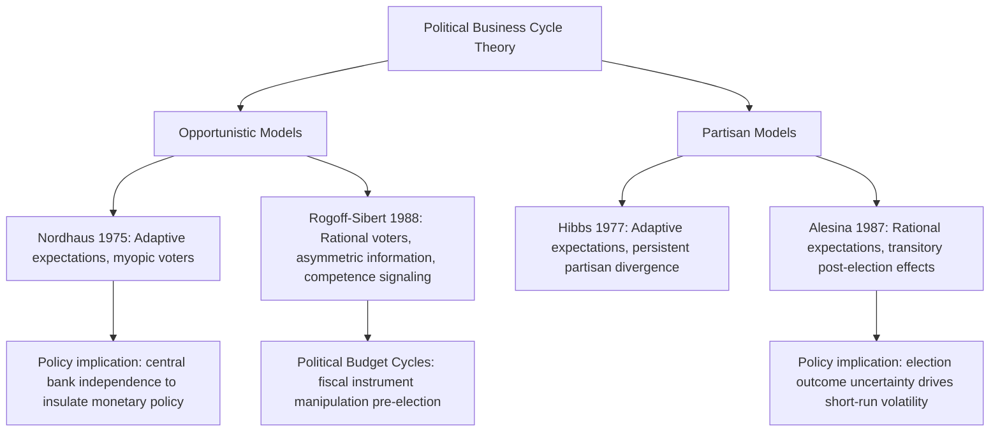

## Political Business Cycle Theory

### Overview

Political business cycle (PBC) theory explains fluctuations in macroeconomic aggregates and policy instruments as the result of incumbent politicians' strategic manipulation of economic policy to influence electoral outcomes, or as the natural consequence of partisan differences in policy preferences across parties. Unlike RBC or NK theories, which locate the source of cycles in technology shocks or nominal rigidities, PBC theory locates the source in the **political incentive structure** facing elected officials: politicians are modeled as rational actors who use fiscal and monetary policy instrumentally to maximize reelection probability or to implement their party's ideological policy preferences once in office.

The theory divides into two major branches distinguished by their assumptions about voter rationality and partisan motivation:

1. **Opportunistic models** (also called "political budget cycle" or traditional PBC models): all politicians, regardless of ideology, manipulate policy before elections purely to maximize reelection chances.
2. **Partisan models**: politicians of different parties have genuinely different policy preferences (e.g., over the inflation-unemployment trade-off) and pursue them once in office, generating cycles correlated with which party holds power rather than with the electoral calendar per se.

### Historical Development

#### The Nordhaus Opportunistic Model (1975)

William Nordhaus's 1975 paper "The Political Business Cycle" is the foundational contribution. It assumes:

- Voters are **myopic/adaptive**: they judge incumbents based on recent economic performance (especially unemployment and inflation just before the election) rather than performance over the full term.
- The economy is characterized by an **exploitable Phillips Curve** trade-off between inflation and unemployment.
- All incumbents, regardless of party, behave identically: they stimulate the economy (expansionary fiscal/monetary policy) before elections to lower unemployment, then contract policy after winning to control the resulting inflation.

This generates a predictable political cycle: **pre-election booms** (falling unemployment, rising growth) followed by **post-election contractions** (rising unemployment, disinflation) — a cycle synchronized with the electoral calendar rather than with underlying economic conditions.

#### Formal Structure of the Nordhaus Model

The incumbent chooses a policy instrument (e.g., money growth $m_t$) each period to influence unemployment via an expectations-augmented Phillips Curve:

$$u_t = u_n - \alpha(\pi_t - \pi_t^e)$$

where $u_n$ is the natural rate of unemployment, $\pi_t$ is actual inflation, and $\pi_t^e$ is expected inflation. Because voters are assumed to have **adaptive expectations** ($\pi_t^e$ based on past inflation, updated slowly), the incumbent can systematically exploit the short-run Phillips Curve: engineering surprise inflation before the election lowers unemployment temporarily, boosting the incumbent's perceived competence, at the cost of higher inflation realized only after votes are cast.

The incumbent's objective is to maximize a vote function:

$$V_t = V(u_t, \pi_t), \quad \frac{\partial V}{\partial u_t} < 0, \quad \frac{\partial V}{\partial \pi_t} < 0$$

subject to the timing constraint that voters weight recent (pre-election) economic conditions most heavily.

#### Diagram: The Nordhaus Opportunistic Cycle (svg_diagram)

<svg xmlns="http://www.w3.org/2000/svg" viewBox="0 0 740 380" font-family="Helvetica, Arial, sans-serif">
<text x="370" y="24" text-anchor="middle" font-size="16" font-weight="bold" fill="#1a1a1a">Nordhaus Opportunistic Political Business Cycle (svg_diagram)</text>
<line x1="70" y1="330" x2="700" y2="330" stroke="#333" stroke-width="1.5" />
<line x1="70" y1="60" x2="70" y2="330" stroke="#333" stroke-width="1.5" />
<text x="385" y="360" text-anchor="middle" font-size="12" fill="#333">Time (relative to election dates)</text>
<text x="35" y="195" text-anchor="middle" font-size="12" fill="#333" transform="rotate(-90 35 195)">Level</text>

<line x1="250" y1="60" x2="250" y2="330" stroke="#999" stroke-width="1.5" stroke-dasharray="4,3" />
<text x="250" y="52" text-anchor="middle" font-size="11" fill="#666" font-weight="bold">Election 1</text>
<line x1="550" y1="60" x2="550" y2="330" stroke="#999" stroke-width="1.5" stroke-dasharray="4,3" />
<text x="550" y="52" text-anchor="middle" font-size="11" fill="#666" font-weight="bold">Election 2</text>

<path d="M 70,150 C 130,190 190,230 250,255 C 310,200 370,160 430,150 C 480,190 530,230 550,255 C 610,200 660,160 700,150" fill="none" stroke="`#e63946`" stroke-width="2.5" />

<text x="150" y="140" font-size="11" fill="`#e63946`" font-weight="bold">Unemployment</text>

<path d="M 70,270 C 130,250 190,220 250,190 C 300,240 350,290 400,300 C 450,240 500,220 550,190 C 600,240 650,290 700,300" fill="none" stroke="`#1d3557`" stroke-width="2.5" />

<text x="120" y="285" font-size="11" fill="`#1d3557`" font-weight="bold">Inflation</text>

<text x="200" y="345" font-size="10" fill="#666">Pre-election stimulus</text>

<text x="450" y="345" font-size="10" fill="#666">Post-election austerity</text>

</svg>

### Rational Expectations Critique and the Rogoff-Sibert Model

The Nordhaus model's reliance on adaptive (backward-looking) expectations was heavily criticized following the Rational Expectations Revolution: if voters are rational and understand the incumbent's incentive to manipulate policy, they should not be systematically fooled by pre-election stimulus, since they would anticipate the subsequent post-election inflation. This critique nearly killed opportunistic PBC theory until it was revived using an **asymmetric information** framework.

**Rogoff and Sibert (1988)** and **Rogoff (1990)** developed "rational opportunistic" models in which:

- Voters are fully rational but possess **incomplete information** about the incumbent's underlying competence (e.g., ability to run the government efficiently, cost of public good provision).
- Incumbents have private information about their own competence, which is partially revealed through their tax and spending choices.
- Incumbents of all competence levels have an incentive to signal high competence before elections by temporarily distorting the fiscal mix — cutting taxes and increasing highly visible spending relative to the socially optimal path, financed by running down assets or by reduced investment in less visible public goods, since these signals cannot be immediately verified by voters.
- Since even a rational, competent incumbent has incentive to send this signal, in equilibrium *all* incumbent types do so, and a **political budget cycle in fiscal policy** persists in equilibrium despite voter rationality.

This "rational opportunistic" or **political budget cycle (PBC)** framework predicts cycles primarily in **fiscally visible instruments** — tax cuts, transfer payments, public sector wages, and infrastructure spending announcements — timed close to elections, rather than necessarily in inflation and unemployment, which are less directly and immediately controllable and more easily attributed to broader economic conditions.

### The Partisan Model: Hibbs (1977)

Douglas Hibbs's partisan theory offers an alternative mechanism, dispensing with the assumption that all politicians behave identically. Instead:

- **Left-wing parties** are assumed to place relatively greater weight on reducing unemployment (representing working-class/labor constituencies), and are willing to tolerate higher inflation to achieve it.
- **Right-wing parties** are assumed to place relatively greater weight on controlling inflation (representing capital-owning/creditor constituencies), and are willing to tolerate higher unemployment to achieve it.

Under **adaptive expectations**, each party's ideological preference translates into distinct, persistent policy stances once in office: left-wing governments pursue more expansionary policy throughout their tenure (not just pre-election), producing lower average unemployment and higher average inflation, while right-wing governments do the reverse. The cycle here is driven by **which party wins**, not by proximity to the election date — it is a partisan cycle, not strictly an opportunistic one.

### The Rational Partisan Model: Alesina (1987)

Alberto Alesina's **rational partisan theory** modernizes Hibbs's insight using rational expectations, producing sharper and more empirically distinct predictions:

- Parties still have genuinely different inflation-unemployment preferences (as in Hibbs).
- But voters and wage/price setters are **rational** and know each party's true preferences in advance.
- Nominal wage contracts are set **before the election outcome is known**, based on the expected policy of whichever party wins (a probability-weighted average).
- After the election, if the winning party's actual policy differs from what was priced into pre-set wage contracts, there is a **temporary, transitional real effect** — but only in the period immediately following the election, since contracts can be renegotiated once the winner's stance is confirmed.

This generates a distinctive prediction: a **short-lived, transitional cycle immediately after each election** (not before it, as in Nordhaus), whose direction depends on which party wins and whether the outcome was anticipated:

- If a **left-wing (expansionary)** party wins unexpectedly: output rises and unemployment falls temporarily above/below trend before returning to the natural rate, since nominal wages were set too high in anticipation of a more contractionary outcome.
- If a **right-wing (contractionary)** party wins unexpectedly: output falls and unemployment rises temporarily before returning to the natural rate.
- If the election outcome was **fully anticipated**, no real effects occur at all — wage contracts adjust in advance, and only the (correctly anticipated) inflation rate differs between administrations, consistent with long-run monetary neutrality.

#### Comparison of PBC Model Variants

| Model | Voter Expectations | Politician Behavior | Predicted Cycle Timing | Primary Variable Affected |
| --- | --- | --- | --- | --- |
| Nordhaus (1975) | Adaptive/myopic | All incumbents identical, opportunistic | Pre-election boom, post-election bust | Unemployment, inflation |
| Rogoff-Sibert (1988) | Rational, asymmetric info | All incumbents signal competence | Pre-election fiscal distortion | Taxes, visible spending |
| Hibbs (1977) | Adaptive | Partisan, ideologically driven | Throughout term, by party | Average inflation/unemployment level |
| Alesina (1987) | Rational | Partisan, ideologically driven | Brief post-election transition only | Output, unemployment (transitorily) |

### The Political Budget Cycle in Fiscal Policy

A large empirical literature, following Rogoff-Sibert, documents **political budget cycles** distinct from political business cycles proper — cycles in fiscal *instruments* rather than in real macroeconomic outcomes:

- **Pre-election spending increases**, particularly in highly visible categories (infrastructure, transfers, public sector wages).
- **Pre-election tax cuts or delayed tax increases**.
- **Widening fiscal deficits** in election years relative to non-election years.
- **Post-election fiscal consolidation** as incumbents (or new governments) address the resulting imbalances.

This pattern has been found to be considerably more robust in **developing democracies and newer democratic institutions** with weaker fiscal transparency and accountability mechanisms, and comparatively weaker or absent in mature democracies with strong independent fiscal institutions, transparent budgeting processes, and sophisticated media scrutiny — consistent with the Rogoff-Sibert prediction that PBCs arise from *information asymmetries* that erode as institutional quality improves. [Inference: the precise institutional threshold at which political budget cycles disappear is not sharply established and varies across empirical studies and country samples.]

### Central Bank Independence as an Institutional Response

A major policy implication of PBC theory is the case for **central bank independence (CBI)**: if opportunistic or partisan manipulation of monetary policy is a primary driver of inefficient inflation-unemployment cycles, insulating monetary policy from short-run electoral pressure by delegating it to an independent, non-elected central bank can reduce or eliminate the monetary component of the political cycle, though fiscal policy (which remains under direct political control) may still exhibit political budget cycles. Empirical cross-country studies (e.g., Alesina and Summers, 1993) generally find that greater central bank independence is associated with lower and less volatile inflation without a clear long-run unemployment cost, consistent with the PBC-motivated case for delegation — though the strength and universality of this relationship across country samples and time periods remains debated. [Inference: causality running specifically from independence to lower inflation, as opposed to both being driven by a common institutional or cultural factor, is difficult to establish definitively.]

### Diagram: Institutional and Theoretical Branches of PBC Theory

### Empirical Evidence and Testing Challenges

Testing PBC theory empirically faces several difficulties:

- **Identifying exogenous election timing**: in parliamentary systems, incumbents may strategically call elections when economic conditions are favorable (reverse causality), confounding tests of whether policy caused the boom or the boom prompted the election call.
- **Distinguishing opportunistic from partisan cycles**: many datasets cannot cleanly separate "all incumbents behave the same" (Nordhaus/Rogoff-Sibert) from "different parties behave differently" (Hibbs/Alesina) without large cross-country, multi-party panels.
- **Distinguishing rational partisan (Alesina) transitory effects from adaptive partisan (Hibbs) persistent effects** requires precise timing analysis of when real effects emerge and how long they last relative to the election date.
- **Evidence generally supports**: political budget cycles in fiscal policy (spending, deficits) are relatively robust findings across many countries; evidence for cycles in unemployment and output is more mixed and appears more consistent with the short-lived, rational partisan (Alesina) pattern than with the persistent Nordhaus-style pre-election boom in many advanced economies with sophisticated electorates and independent central banks. [Inference: the relative empirical support for each model varies substantially by country, time period, and the specific outcome variable studied, and no single variant has achieved universal empirical dominance.]

### Criticisms and Limitations

- **Sophistication of modern electorates and media**: highly informed electorates and financial markets may substantially blunt incumbents' ability to manipulate perceptions, particularly in mature democracies with a free press and active opposition scrutiny.
- **Constraints from independent fiscal and monetary institutions**: independent central banks, fiscal councils, and balanced-budget rules limit the discretionary policy space available for manipulation in many modern economies.
- **Global and open-economy constraints**: in small open economies with mobile capital and flexible exchange rates, unilateral opportunistic monetary expansion may be rapidly undone by capital flight or currency depreciation, limiting its effectiveness as an electoral tool.
- **Model specificity**: predictions are highly sensitive to the assumed expectation formation mechanism (adaptive vs. rational) and information structure, making the theory somewhat difficult to falsify cleanly against a single, unambiguous empirical signature.

### Related Topics

- Time inconsistency of monetary policy and the Kydland-Prescott/Barro-Gordon framework
- Central bank independence and the case for policy delegation
- Median voter theorem and political-economy models of policy choice
- Fiscal rules and fiscal councils as institutional constraints on political budget cycles
- Reputation and credibility in monetary policy (Barro-Gordon reputational equilibrium)
- Rational expectations and the Lucas Critique
- Adaptive vs. rational expectations in macroeconomic modeling
- Democratic institutions and fiscal transparency indices in comparative political economy
- Signaling models under asymmetric information (Spence-type frameworks applied to fiscal policy)
- Election timing endogeneity and identification strategies in political-economy empirics