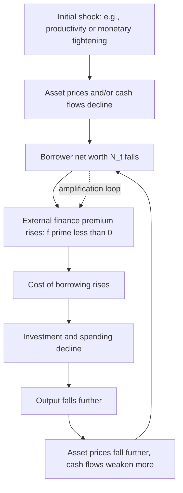

## Financial Accelerator and Credit Cycles

### Core Premise

The financial accelerator framework explains how imperfections in credit markets — arising from asymmetric information, costly monitoring, and agency problems between borrowers and lenders — cause financial conditions to **amplify and propagate** business cycle fluctuations rather than merely reflect them. Small shocks to the real economy or to balance sheets can generate large, persistent swings in credit availability, investment, and output, because a borrower's net worth affects the cost and availability of external finance, and shocks that damage net worth further tighten financing conditions in a self-reinforcing loop.

The canonical formalization is **Bernanke, Gertler, and Gilchrist (1999)**, "The Financial Accelerator in a Quantitative Business Cycle Framework" (in the *Handbook of Macroeconomics*), building on earlier agency-cost work by Bernanke and Gertler (1989) and Kiyotaki and Moore (1997), whose collateral-constraint model is a closely related and frequently co-taught framework.

### The External Finance Premium

The central concept is the **external finance premium (EFP)**: the gap between the cost of externally raised funds (debt or equity) and the opportunity cost of internal funds (retained earnings), arising because lenders cannot costlessly observe or verify a borrower's true project outcomes (a costly state verification problem, following Townsend, 1979).

$$\text{EFP} = i_{\text{external}} - i_{\text{internal}}$$

The key theoretical result is that the EFP is **inversely related to borrower net worth**:

$$\text{EFP}_t = f(N_t), \quad f' < 0$$

where $N_t$ is the borrower's net worth. Intuition: a borrower with more net worth (collateral, equity stake) has more "skin in the game," reducing the lender's exposure to moral hazard and costly monitoring/verification, and therefore commands a lower risk premium on external funds.

### The Accelerator Mechanism

**Key Points**

- **Amplification**: A given-size initial shock produces a larger output and investment response than it would under frictionless (Modigliani-Miller) credit markets, because the induced change in net worth feeds back into financing costs.
- **Propagation**: Net worth accumulates and depletes gradually (it is a stock, built up through retained earnings and asset values over time), so the effects of a shock persist and build over several periods rather than dissipating immediately — turning transient shocks into extended credit cycles.
- **Procyclicality of leverage and credit spreads**: The mechanism predicts that credit spreads (the empirical proxy for the EFP) are countercyclical — rising sharply in downturns and compressing in expansions — a pattern strongly supported by observed corporate bond spread behavior around recessions.
- **Fisherian debt-deflation linkage**: The mechanism formalizes and generalizes Irving Fisher's (1933) debt-deflation theory of the Great Depression, in which falling prices raise the real burden of nominal debt, depressing net worth and spending in a self-reinforcing downward spiral.

### Formal Structure (BGG-Style Framework)

**Entrepreneurial net worth accumulation**:

$$N_{t+1} = \gamma \left[ R_t^k Q_t K_t - (R_t^k - R_t)\frac{B_t}{N_t} \cdot \text{risk premium terms} \right] + W_t^e$$

(simplified schematically), where $\gamma$ is the fraction of entrepreneurs surviving to the next period (capturing entry/exit and preventing entrepreneurs from ever fully self-financing), $R_t^k$ is the realized return on capital, $Q_t$ is the price of capital (Tobin's Q), $K_t$ is the capital stock, $B_t$ is external borrowing, and $W_t^e$ is entrepreneurial labor income injected as a source of new net worth.

**External finance premium as a function of leverage**:

$$\text{EFP}_t = s\left(\frac{Q_t K_t}{N_t}\right), \quad s' > 0$$

expressed here as increasing in the **leverage ratio** $Q_t K_t / N_t$ (equivalent formulation to the net-worth version above, since higher leverage for a given asset value corresponds to lower net worth).

**Investment/capital demand condition**: Firms invest until the expected marginal return on capital equals the cost of capital *inclusive of* the external finance premium:

$$E_t[R_{t+1}^k] = R_t \cdot \text{EFP}_t$$

This is the key departure from a frictionless model, where $E_t[R_{t+1}^k] = R_t$ alone (the premium collapses to 1, i.e., Modigliani-Miller irrelevance holds).

### Kiyotaki-Moore Collateral Constraint Framework (Complementary Approach)

**Key Points**

- Kiyotaki and Moore (1997), "Credit Cycles," models durable assets (land, capital) that serve **dual roles**: as productive inputs and as **collateral** securing debt.
- Borrowing capacity is constrained by collateral value: $B_t \leq \theta \cdot Q_t K_t$, where $\theta < 1$ reflects a limited enforcement/collateralizability parameter and $Q_t$ is the asset price.
- **Asset price feedback loop**: a shock that lowers $Q_t$ tightens borrowing capacity, forcing constrained agents to reduce asset purchases or sell assets, which pushes $Q_t$ down further — a distinct but related amplification channel operating through collateral values rather than net-worth-driven risk premia.
- This framework is particularly influential for modeling **real estate and land-price-driven credit cycles**, and is a standard reference point for analyzing housing-collateral channels in household and small-business borrowing (directly relevant to the 2008 U.S. housing-driven financial crisis).

### Financial Accelerator vs. Kiyotaki-Moore: Comparison

| Dimension | BGG Financial Accelerator | Kiyotaki-Moore Collateral Constraint |
| --- | --- | --- |
| Core friction | Costly state verification / asymmetric information | Limited enforcement / collateral constraint |
| Key variable | External finance premium as function of net worth | Borrowing limit as function of collateral asset price |
| Amplification channel | Risk premium on external finance rises as net worth falls | Asset "fire sales" as constrained agents deleverage, depressing prices further |
| Typical application | Corporate investment, business cycle amplification generally | Land/real estate-collateralized borrowing, household and firm balance sheets |
| Debt contract | Standard debt contract with costly bankruptcy verification | Simple collateralized borrowing limit, no explicit bankruptcy cost modeling |

### The Financial Crisis of 2008 as an Applied Case

**Key Points**

- The 2008 crisis is widely analyzed as a textbook, if severe, financial-accelerator/collateral-cycle episode: falling house prices reduced household and financial-institution net worth (particularly via mortgage-backed securities held on bank and shadow-bank balance sheets), sharply raising external finance premia (visible in the spike in LIBOR-OIS spreads, corporate bond spreads, and asset-backed commercial paper rates in 2008).
- The resulting credit contraction reduced investment and consumption well beyond what the initial housing-sector shock alone would predict under frictionless credit markets — the hallmark signature of accelerator-driven amplification.
- **[Inference]** The scale and speed of the 2008 amplification, driven substantially through **wholesale funding markets, securitization, and shadow banking** rather than traditional bank lending alone, motivated a subsequent generation of DSGE models explicitly incorporating banking-sector balance sheets and financial intermediary net worth (e.g., Gertler and Kiyotaki, 2010, "Financial Intermediation and Credit Policy in Business Cycle Analysis"), extending the original BGG framework, which had focused on non-financial borrower net worth, to intermediary balance sheets themselves.

### Policy Implications

- **Countercyclical capital buffers and macroprudential regulation**: Since leverage and net-worth cycles amplify shocks, policies that require additional capital buffers to be built up during expansions (when net worth/collateral values are high) and drawn down during contractions aim to dampen the accelerator mechanism directly, rather than only responding after a downturn begins.
- **Central bank credit policy / lender-of-last-resort interventions**: The Gertler-Kiyotaki-style extension provides a formal rationale for direct central bank intervention in credit markets during crises (e.g., the Fed's 2008–2009 emergency lending facilities), since restoring intermediary net worth or bypassing impaired intermediation channels can short-circuit the amplification loop.
- **Debt-deflation avoidance as a monetary policy goal**: Because falling price levels raise real debt burdens and worsen net worth (Fisherian channel), the financial accelerator literature reinforces the case for avoiding deflationary monetary policy errors, connecting back to monetarist critiques of policy-induced instability (see Monetarist explanations of business cycles) but through a distinct balance-sheet transmission channel.
- **[Inference]** The financial accelerator/collateral-constraint literature is frequently cited as a key theoretical underpinning for the post-2008 expansion of macroprudential toolkits (e.g., countercyclical capital buffers under Basel III), though the empirical calibration of exactly how much buffer-building is optimal remains an active and debated area of central bank research.

### Example: Numerical Illustration of Leverage-Driven EFP Amplification

Suppose a firm has assets worth $Q_t K_t = \$100$ million and net worth $N_t = \$25$ million, implying leverage of 4x ($Q_tK_t/N_t = 4$). Assume the external finance premium function is calibrated as:

$$\text{EFP}_t = 1 + 0.02 \times \left(\frac{Q_t K_t}{N_t} - 1\right)$$

At leverage 4x: $\text{EFP}_t = 1 + 0.02(4-1) = 1.06$, i.e., a 6% premium over the risk-free rate.

Now suppose a shock reduces asset values by 15%, so $Q_tK_t$ falls to $85 million, while debt (a predetermined nominal claim) stays fixed at $75 million. New net worth:

$$N_{t+1} = \$85\text{m} - \$75\text{m} = \$10\text{m}$$

New leverage: $85/10 = 8.5$, and the new premium:

$$\text{EFP}_{t+1} = 1 + 0.02(8.5 - 1) = 1.15$$

A 15% asset-value shock has nearly tripled leverage (4x → 8.5x) and raised the external finance premium from 6% to 15% — illustrating how a moderate real shock to asset values, combined with fixed nominal debt, produces a disproportionately large increase in the cost of external finance, which then further depresses investment and asset demand in the next round.

### Related Topics

- Fisher's debt-deflation theory of the Great Depression (1933)
- Kiyotaki-Moore collateral constraint models and asset "fire sales"
- Gertler-Kiyotaki banking sector DSGE models and central bank credit policy
- Macroprudential regulation: countercyclical capital buffers, Basel III
- Minsky's Financial Instability Hypothesis and the "stability breeds instability" thesis
- Shadow banking and wholesale funding market fragility
- Real Business Cycle theory foundations (contrast: no role for financial frictions)
- Costly state verification and optimal debt contracts (Townsend, 1979)
- Tobin's Q and investment theory
- The 2008 Global Financial Crisis: transmission channels and policy response