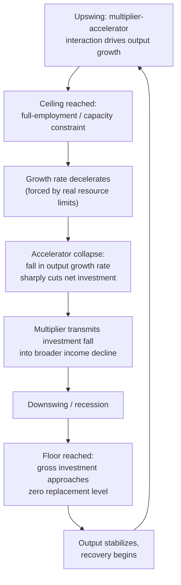

## Multiplier-Accelerator Interaction Models

### Overview

The multiplier-accelerator model is a formal business cycle theory combining the Keynesian income **multiplier** (changes in spending produce amplified changes in national income) with the investment **accelerator** (changes in output produce amplified changes in induced investment). The interaction of these two mechanisms, when embedded in a dynamic (time-lagged) framework, can generate self-sustaining cyclical fluctuations in national income without requiring repeated external shocks. The canonical formalization is due to Paul Samuelson (1939), with major extensions by John Hicks (1950) in *A Contribution to the Theory of the Trade Cycle*.

### The Multiplier Component

The multiplier describes how an initial change in autonomous expenditure produces a larger change in equilibrium national income, due to successive rounds of induced consumption spending.

For a simple closed economy:

$$Y = C + I + G$$

With consumption function $C_t = a + cY_{t-1}$, where $c$ is the marginal propensity to consume (MPC), the simple multiplier is:

$$k = \frac{1}{1-c}$$

A $1 increase in autonomous spending (investment or government spending) raises equilibrium income by $\frac{1}{1-c}$ dollars, since each round of new income induces further consumption spending of $c$ times that round's income.

### The Accelerator Component

The accelerator principle, associated with John Maurice Clark (1917) and earlier antecedents (Aftalion, Bickerdike), holds that **net investment** depends not on the level of output but on the *rate of change* of output. This follows from a fixed capital-output ratio assumption: firms hold capital stock in proportion to output, so an increase in output requires a proportional increase in capital stock, and investment is the flow that fills that gap.

Let $v$ be the capital-output ratio (the accelerator coefficient), $K_t$ the desired capital stock, and $Y_t$ output:

$$K_t^{*} = vY_t$$

Net induced investment in period $t$:

$$I_t = K_t^{*} - K_{t-1} = v(Y_t - Y_{t-1})$$

**Key Points**

- The accelerator implies investment is highly volatile relative to output: even a small deceleration in output growth (not necessarily a decline in output level) can cause net investment to fall sharply or turn negative.
- This volatility amplification is the core mechanical reason investment is the most cyclically volatile component of GDP in empirical business cycle data.

### The Samuelson Multiplier-Accelerator Model (1939)

Samuelson combined both mechanisms into a single second-order linear difference equation describing the time path of national income.

**Model setup**:

- Government spending $G_t = G$ (constant, autonomous)
- Consumption: $C_t = cY_{t-1}$ (consumption in period $t$ depends on income in the *previous* period, i.e., a one-period lag)
- Induced investment: $I_t = v(Y_{t-1} - Y_{t-2})$ (accelerator applied to the change in lagged income)
- Equilibrium condition: $Y_t = C_t + I_t + G$

**Combined difference equation**:

$$Y_t = cY_{t-1} + v(Y_{t-1} - Y_{t-2}) + G$$

$$Y_t = (c+v)Y_{t-1} - vY_{t-2} + G$$

This is a **second-order linear difference equation with constant coefficients**. Its solution consists of a particular solution (the equilibrium level driven by $G$) plus a complementary function (the homogeneous solution) that determines whether and how the system oscillates.

### Characteristic Equation and Dynamic Regimes

Substituting a trial solution $Y_t = A\lambda^t$ into the homogeneous part of the equation yields the characteristic equation:

$$\lambda^2 - (c+v)\lambda + v = 0$$

Solving via the quadratic formula:

$$\lambda = \frac{(c+v) \pm \sqrt{(c+v)^2 - 4v}}{2}$$

The nature of the roots — and therefore the qualitative time path of income — depends on the discriminant $(c+v)^2 - 4v$ and the modulus of the roots, giving **five distinct dynamic regimes**:

| Regime | Root condition | Behavior |
| --- | --- | --- |
| I | Real roots, both $< 1$ | Smooth, monotonic convergence to equilibrium |
| II | Real roots, one or both $\geq 1$ | Damped or explosive monotonic path (non-oscillatory) |
| III | Complex roots, modulus $< 1$ | Damped oscillations converging to equilibrium |
| IV | Complex roots, modulus $= 1$ | Constant-amplitude ("regular") oscillations — a limit cycle |
| V | Complex roots, modulus $> 1$ | Explosive oscillations |

The modulus of the complex roots equals $\sqrt{v}$. This gives a clean stability criterion: the system produces oscillations (complex roots) when $(c+v)^2 < 4v$, and those oscillations are **damped** if $v < 1$, **explosive** if $v > 1$, and of **constant amplitude** if $v = 1$ exactly.

**Key Points**

- The accelerator coefficient $v$ is the primary determinant of whether cycles explode, dampen, or stay constant.
- The MPC $c$ (via $c+v$) determines whether the path is oscillatory (cyclical) or monotonic (smooth) in the first place.
- A purely explosive or purely damped model is theoretically unsatisfying as a "business cycle" explanation — real economies neither grow without bound nor settle into permanent equilibrium — which motivated Hicks' extension below.

**(svg_diagram)** — Samuelson model dynamic regions by parameter values:

<svg viewBox="0 0 700 480" xmlns="http://www.w3.org/2000/svg">
<title>Samuelson Multiplier-Accelerator Parameter Regions (svg_diagram)</title>
<line x1="60" y1="420" x2="640" y2="420" stroke="#333" stroke-width="1.5"/>
<line x1="60" y1="420" x2="60" y2="30" stroke="#333" stroke-width="1.5"/>
<text x="640" y="440" font-size="13" text-anchor="end">v (accelerator)</text>
<text x="30" y="30" font-size="13" text-anchor="start">c+v</text>
<line x1="350" y1="420" x2="350" y2="30" stroke="#999" stroke-dasharray="5,4"/>
<text x="355" y="45" font-size="11" fill="#555">v = 1</text>
<path d="M60,420 Q200,180 350,120 Q500,60 640,20" fill="none" stroke="#0066cc" stroke-width="2"/>
<text x="420" y="90" font-size="11" fill="#0066cc">boundary: (c+v)^2 = 4v</text>

<text x="150" y="380" font-size="12" fill="`#28a745`" font-weight="bold">I: smooth convergence</text>

<text x="150" y="400" font-size="10" fill="#555">real roots, both < 1</text>

<text x="230" y="250" font-size="12" fill="`#17a2b8`" font-weight="bold">III: damped oscillation</text>

<text x="230" y="270" font-size="10" fill="#555">complex roots, modulus < 1</text>

<text x="420" y="150" font-size="12" fill="`#e0a800`" font-weight="bold">IV: constant-amplitude cycle</text>

<text x="420" y="170" font-size="10" fill="#555">modulus = 1 (v = 1)</text>

<text x="450" y="90" font-size="12" fill="`#dc3545`" font-weight="bold">V: explosive oscillation</text>

<text x="450" y="110" font-size="10" fill="#555">complex roots, modulus > 1</text>

<text x="480" y="400" font-size="12" fill="`#6c757d`" font-weight="bold">II: explosive/damped monotonic</text>

<text x="480" y="415" font-size="10" fill="#555">real roots</text>

</svg>

### Hicks' Extension: Ceiling and Floor (1950)

John Hicks addressed the unrealistic implication of unbounded explosive growth (Regime V) by introducing **nonlinear constraints** on the linear accelerator-multiplier core:

- **The ceiling**: Output cannot permanently grow faster than the economy's full-employment growth path (determined by labor force growth and productivity growth), because real resource constraints (labor, capital utilization) bind. When the explosive upswing hits the ceiling, growth is forced to decelerate.
- **The floor**: Gross investment cannot fall below zero (an economy can reduce net investment to zero by not replacing depreciated capital, but *gross* investment — replacement investment — has a floor near zero, since firms will not actively scrap useful capital). This limits how far the downswing can go via the pure accelerator mechanism.

**Mechanism of the bounded cycle**:

1. An upswing driven by the multiplier-accelerator interaction accelerates output growth.
2. The economy hits the **ceiling** (full employment / capacity constraint); growth decelerates sharply because it cannot continue at the explosive rate.
3. The deceleration in output growth causes the accelerator to produce a *sharp fall* in net investment (since accelerator investment depends on the *change* in output growth, not just the level).
4. This investment collapse, combined with the multiplier, drives a contraction (recession).
5. The contraction is arrested by the **floor** (gross investment cannot go below the replacement/depreciation floor), preventing indefinite collapse.
6. Once the floor is reached, output stabilizes and slowly begins recovering, restarting the cycle.

This produces a **bounded, self-sustaining, endogenous cycle** — oscillations that persist indefinitely between the ceiling and the floor, without requiring the model's underlying difference equation itself to be in the "constant amplitude" Regime IV knife-edge case (which is empirically implausible because it requires $v$ to equal exactly 1).

### Comparison: Samuelson (Linear) vs. Hicks (Nonlinear Bounded)

| Feature | Samuelson (1939) | Hicks (1950) |
| --- | --- | --- |
| Model type | Linear second-order difference equation | Linear core + nonlinear ceiling/floor constraints |
| Source of turning points | Determined entirely by parameter values ($c$, $v$) | Determined by structural resource constraints (ceiling) and non-negativity of gross investment (floor) |
| Long-run behavior | Explosive, damped, or knife-edge constant — no natural persistence mechanism for realistic parameters | Bounded, persistent oscillation between ceiling and floor for a wide range of parameters |
| Realism of sustained cycles | Requires the special case $v=1$ exactly (empirically implausible) | Sustained cycles occur robustly for many parameter combinations |

### Extensions and Related Formalizations

- **Goodwin's nonlinear accelerator (1951)**: Richard Goodwin proposed a smooth nonlinear (rather than kinked ceiling/floor) accelerator function, producing self-sustaining limit-cycle behavior without Hicks' discrete constraint boundaries — mathematically related to relaxation-oscillator dynamics.
- **Flexible accelerator models**: Later empirical investment models (e.g., those built on Jorgenson's neoclassical investment theory) relax the assumption that firms instantaneously close the gap between actual and desired capital stock, instead allowing a partial-adjustment lag:

  $$I_t = \lambda(K_t^{*} - K_{t-1}), \quad 0 < \lambda < 1$$

  This dampens the volatility of the simple accelerator and better fits empirical investment data.
- **Inventory accelerator models (Metzler, 1941)**: Lloyd Metzler applied a similar accelerator logic to inventory investment rather than fixed capital, producing "inventory cycle" models with similar difference-equation dynamics.
- **Multiplier-accelerator in open economies**: Extensions incorporate imports (leaking part of induced spending abroad), which lowers the effective multiplier and can dampen cycle amplitude — relevant to small open-economy business cycle analysis.

### Numerical Example

Assume $c = 0.6$ (MPC) and $v = 0.5$ (accelerator coefficient), with autonomous spending $G = 100$.

Difference equation:

$$Y_t = (0.6+0.5)Y_{t-1} - 0.5Y_{t-2} + 100 = 1.1Y_{t-1} - 0.5Y_{t-2} + 100$$

Characteristic equation:

$$\lambda^2 - 1.1\lambda + 0.5 = 0$$

Discriminant: $(1.1)^2 - 4(0.5) = 1.21 - 2.0 = -0.79 < 0$ → complex roots → oscillatory path.

Modulus of roots: $\sqrt{v} = \sqrt{0.5} \approx 0.707 < 1$ → **damped oscillations** (Regime III): income oscillates around its new equilibrium with progressively shrinking amplitude, eventually converging.

Equilibrium level (particular solution), setting $Y_t = Y_{t-1} = Y_{t-2} = Y^{*}$:

$$Y^{*} = (c+v)Y^{*} - vY^{*} + G \implies Y^{*}(1-c) = G \implies Y^{*} = \frac{G}{1-c} = \frac{100}{0.4} = 250$$

If instead $v = 1.2$ (with $c=0.6$), modulus $=\sqrt{1.2}\approx 1.095 > 1$, producing **explosive oscillations** — illustrating how sensitive the qualitative dynamic is to the accelerator coefficient alone.

### Criticisms and Limitations

- **Parameter instability**: Empirically, $c$ and $v$ are not structurally fixed constants; they vary with expectations, credit conditions, and policy, undermining the model's determinism. [Inference] This is a standard critique shared with many simple linear macro-dynamic models of the era.
- **Behavioral rigidity**: The model assumes mechanical, backward-looking (adaptive) expectations via fixed lags, with no role for forward-looking or rational expectations, later criticized heavily by New Classical economists.
- **Ignoring monetary/financial factors**: The basic model omits interest rates, credit availability, and financial fragility (contrast with Minsky's Financial Instability Hypothesis, which centers finance explicitly).
- **Ceiling/floor as ad hoc**: Critics note Hicks' ceiling and floor, while economically motivated, are introduced somewhat externally to make the linear core produce realistic bounded cycles, rather than emerging endogenously from a single unified formal mechanism.
- **Empirical fit**: [Unverified] The degree to which multiplier-accelerator models quantitatively match observed post-war business cycle amplitude and periodicity is mixed across empirical studies and country contexts; the model is generally regarded today as a foundational pedagogical and conceptual device rather than a state-of-the-art forecasting model.

### Related Topics

- Second-order linear difference equations in economic dynamics
- Goodwin's growth cycle model (predator-prey dynamics in economics)
- Metzler's inventory cycle model
- Jorgenson's neoclassical theory of investment
- Minsky's Financial Instability Hypothesis (financial vs. real-sector cycle drivers)
- Real Business Cycle theory (contrast: exogenous vs. endogenous shock propagation)
- Kalecki's political business cycle and profit-based investment theory
- Phase diagrams and stability analysis in discrete dynamical systems