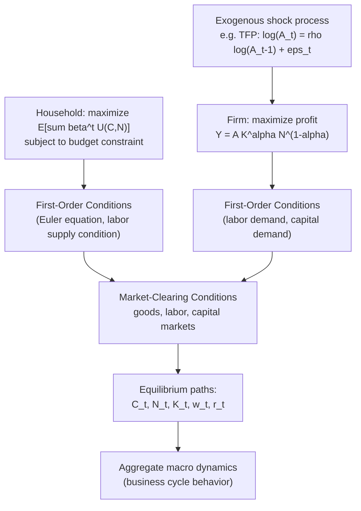

## Microfoundations and Representative Agent Framework

### Overview

Microfoundations refers to the methodological requirement that macroeconomic relationships be derived explicitly from the optimizing behavior of individual economic agents — households, firms, and other decision-makers — rather than being postulated directly at the aggregate level. The **representative agent** framework is the primary technical device used to operationalize this requirement in modern macroeconomics, particularly in Dynamic Stochastic General Equilibrium (DSGE) modeling: instead of modeling the heterogeneous behavior of millions of distinct households and firms, the modeler posits a single "representative" household and/or firm whose optimization problem, when solved, is assumed to characterize aggregate behavior.

This approach forms the methodological backbone of modern DSGE models and stands in direct contrast to earlier "reduced-form" or "old Keynesian" macroeconomics, which specified aggregate behavioral relationships (consumption functions, investment functions) without deriving them from individual optimization.

### Motivation: The Lucas Critique

The modern push toward microfoundations is inseparable from Robert Lucas's 1976 critique of macroeconometric policy evaluation. Lucas argued that the parameters of reduced-form, aggregate behavioral equations (e.g., a Keynesian consumption function estimated from historical data) are not structural — they are combinations of deeper "deep parameters" (preferences, technology) and the *policy rule in place when the data was generated*. If the policy regime changes, agents' expectations and behavior change, and the previously estimated reduced-form relationship breaks down.

**Key Points**

- The Lucas Critique implies that only models built from parameters that are genuinely invariant to policy changes — preferences, technology, and the constraints agents face — can be reliably used for counterfactual policy analysis.
- This directly motivated the requirement that macro models be "microfounded": derived from optimization problems whose parameters (discount rates, risk aversion, technology parameters) are policy-invariant, in contrast to statistically-fitted aggregate relationships.
- Microfoundations are therefore not merely an aesthetic preference for rigor — they are presented as a *methodological necessity* for models to be usable in policy counterfactuals.

### Core Building Blocks of a Microfounded Model

A standard microfounded DSGE model is built from three canonical optimization problems, aggregated via market-clearing conditions:

**1. Household optimization problem**

The representative household chooses a consumption path $\{C_t\}$ and labor supply $\{N_t\}$ to maximize expected lifetime utility subject to a sequence of budget constraints:

$$\max_{\{C_t, N_t\}} \; \mathbb{E}_0 \sum_{t=0}^{\infty} \beta^t U(C_t, N_t)$$

subject to (in a simple closed-economy setting):

$$C_t + K_{t+1} - (1-\delta)K_t \leq w_t N_t + r_t K_t$$

where $\beta \in (0,1)$ is the subjective discount factor, $U(\cdot)$ is a period utility function (typically increasing and concave in consumption, decreasing and convex in labor), $\delta$ is the capital depreciation rate, $w_t$ is the real wage, and $r_t$ is the capital rental rate.

**2. Firm optimization problem**

A representative firm chooses labor and capital inputs to maximize profit, given a production technology (commonly Cobb-Douglas):

$$Y_t = A_t K_t^{\alpha} N_t^{1-\alpha}$$

$$\max_{K_t, N_t} \; A_t K_t^{\alpha} N_t^{1-\alpha} - w_t N_t - r_t K_t$$

where $A_t$ is total factor productivity (TFP), often modeled as a stochastic process (e.g., an AR(1) process in logs), and $\alpha$ is capital's share of output.

**3. Market-clearing (equilibrium) conditions**

$$Y_t = C_t + I_t \quad \text{(goods market)}$$

$$N_t^{\text{supplied}} = N_t^{\text{demanded}} \quad \text{(labor market)}$$

$$K_t^{\text{supplied}} = K_t^{\text{demanded}} \quad \text{(capital market)}$$

The solution to the model is the set of price and quantity paths $\{C_t, N_t, K_t, w_t, r_t\}$ that simultaneously satisfy the household's first-order (Euler) conditions, the firm's first-order conditions, and all market-clearing conditions, for every possible realization of the stochastic shock process.

### The Euler Equation: Central Dynamic Link

The household's intertemporal first-order condition — the **consumption Euler equation** — is the central dynamic relationship linking present and future consumption decisions:

$$U_C(C_t, N_t) = \beta \, \mathbb{E}_t \left[ U_C(C_{t+1}, N_{t+1})(1 + r_{t+1} - \delta) \right]$$

This condition states that the household is indifferent, at the optimum, between consuming one more unit today versus saving it (earning the net return $1+r_{t+1}-\delta$) and consuming the proceeds tomorrow, appropriately discounted by $\beta$ and weighted by the marginal utility of future consumption.

**Key Points**

- The Euler equation is the direct micro-founded replacement for the ad hoc Keynesian consumption function $C_t = a + cY_t$.
- It implies consumption smoothing: rational, forward-looking households adjust current consumption based on *expected future* income and returns, not merely current income (this is the theoretical link to Friedman's Permanent Income Hypothesis and Modigliani's Life-Cycle Hypothesis, both precursors to the fully optimization-based approach).
- Because it involves a conditional expectation $\mathbb{E}_t[\cdot]$, the Euler equation embeds rational expectations directly into the model's dynamics.

### The Representative Agent Assumption: Justification and Aggregation

The representative agent (RA) device is a simplifying assumption that a single agent's optimization problem can stand in for the aggregate behavior of a heterogeneous population.

**Formal justification (when it holds)**: Aggregation from heterogeneous individual agents to a representative agent is formally valid under restrictive conditions, most notably:

- **Gorman aggregation**: If all households have preferences that are quasi-linear or belong to the Gorman polar form (linear Engel curves with common slopes across consumers, differing only in intercepts), then aggregate demand can be represented as if generated by a single representative consumer with aggregate income, regardless of the distribution of income across individuals.
- Under complete markets and homothetic, identical preferences across agents, individual consumption/savings decisions can similarly be shown to aggregate cleanly.

**Why it is used despite being restrictive**: Outside these special cases, exact aggregation to a representative agent is not generally valid — aggregate behavior in a heterogeneous-agent economy can differ systematically from the behavior implied by a single "average" agent, particularly when there are borrowing constraints, uninsurable idiosyncratic risk, or wealth heterogeneity. The representative agent is nonetheless retained in canonical models primarily for **analytical and computational tractability**: it collapses a high-dimensional heterogeneous-agent problem into a small system of equations that can be solved, log-linearized, and estimated with standard techniques.

### Criticisms of the Representative Agent Approach

- **Aggregation bias / Sonnenschein-Mantel-Debreu results**: Formal general equilibrium theory (the SMD theorems) shows that aggregate excess demand functions, even when derived from well-behaved individual optimizers, need not inherit the well-behaved properties (e.g., uniqueness of equilibrium, monotonicity) of individual demand functions. This is a foundational theoretical objection to assuming aggregate behavior mirrors individual optimizing behavior.
- **Suppression of distributional effects**: A representative agent model by construction cannot address questions involving inequality, heterogeneous exposure to shocks, credit constraints affecting some households but not others, or distributional consequences of policy — all central concerns of applied macroeconomics (e.g., differential impact of monetary policy across income groups).
- **The "fallacy of composition" critique**: Critics (including many post-Keynesian and some New Keynesian economists) argue that the representative agent framework can mask genuinely aggregate phenomena — such as coordination failures, systemic financial fragility (cf. Minsky), or Keynesian paradox-of-thrift dynamics — that only emerge from the *interaction* of heterogeneous agents and cannot be captured by a single optimizing unit.
- **Empirical micro-data contradiction**: Household-level panel data frequently show behavior inconsistent with the pure permanent-income/Euler-equation prediction of the representative agent framework — e.g., excess sensitivity of consumption to predictable income changes ("excess sensitivity puzzle"), which the simple RA-Euler-equation framework cannot explain without modification.
- **Response and evolution**: These critiques substantially motivated the development of **Heterogeneous Agent New Keynesian (HANK)** models and earlier **Bewley-Huggett-Aiyagari** incomplete-markets models, which explicitly retain a distribution of agents differing in wealth and income, solving for an equilibrium distribution rather than a single representative path. [Inference] The relative empirical superiority of HANK versus representative-agent New Keynesian (RANK) models for specific policy questions is an active area of ongoing research rather than a fully settled matter.

### Representative Agent vs. Heterogeneous Agent Models

| Feature | Representative Agent (RA) | Heterogeneous Agent (HA / HANK) |
| --- | --- | --- |
| Number of distinct agent types | One (or a small finite number, e.g., "Ricardian" vs. "hand-to-mouth") | Continuum, differing in wealth/income state |
| Computational complexity | Low — small system of equations | High — requires solving for an evolving cross-sectional distribution |
| Insurance markets assumption | Typically complete markets (full risk-sharing) | Typically incomplete markets (idiosyncratic risk, borrowing constraints) |
| Can address distributional policy questions | No | Yes |
| Standard solution technique | Log-linearization around steady state (e.g., Blanchard-Kahn, perturbation methods) | Distributional methods (e.g., Krusell-Smith algorithm, sequence-space Jacobians) |
| Typical use case | Aggregate business cycle dynamics, monetary policy transmission at the aggregate level | Distributional monetary/fiscal policy effects, consumption heterogeneity, wealth inequality dynamics |

### Steady State and Log-Linearization

In practice, microfounded DSGE models are solved by:

1. Deriving the full set of nonlinear first-order and equilibrium conditions from the optimization problems above.
2. Computing the **deterministic steady state** (the values of all variables absent shocks, where $A_t = \bar{A}$ constant and all growth rates are zero or constant).
3. **Log-linearizing** the nonlinear system around this steady state (commonly via first-order Taylor approximation in log-deviations, producing the standard "hat" notation $\hat{x}_t = \ln(X_t/\bar{X})$).
4. Solving the resulting linear rational-expectations system using standard techniques (e.g., the Blanchard-Kahn method, or numerical solvers such as Dynare's `stoch_simul`).

This linearized system is what is ultimately estimated against real macroeconomic data (via Bayesian or maximum-likelihood methods) and used for impulse-response analysis and policy counterfactuals.

### Numerical Illustration: Steady-State Consumption-Capital Ratio

Using the Cobb-Douglas production function and household Euler equation in steady state (no growth, no shocks): setting $C_{t+1}=C_t$ and $r_{t+1}=r_t=\bar r$ in the Euler equation with standard CRRA utility $U(C)=\frac{C^{1-\sigma}}{1-\sigma}$ gives the steady-state real interest rate condition:

$$1 = \beta(1 + \bar r - \delta) \implies \bar r = \frac{1}{\beta} - 1 + \delta$$

With $\beta = 0.99$ (implying roughly a 4% annual discount rate at quarterly frequency) and $\delta = 0.025$ (2.5% quarterly depreciation):

\bar r = \frac{1}{0.99} - 1 + 0.025 \approx 0.0101 + 0.025 = 0.0351 \text{ (approx. 3.5% per quarter)}

From the firm's first-order condition for capital, $\bar r = \alpha A \bar K^{\alpha - 1}\bar N^{1-\alpha}$, this steady-state return pins down the steady-state capital-output ratio, which in turn determines steady-state consumption via the resource constraint $\bar C = \bar Y - \delta \bar K$. [Inference] Exact numerical values for $\bar K$, $\bar Y$, $\bar C$ require specifying $\alpha$, $A$, and normalizing $\bar N$; the relationships shown are the standard structural derivation used in calibration exercises.

### Related Topics

- Lucas Critique and structural vs. reduced-form modeling
- Real Business Cycle (RBC) theory as the first fully microfounded DSGE framework
- New Keynesian DSGE models (Calvo pricing, nominal rigidities layered on RA core)
- Rational expectations hypothesis
- Bewley-Huggett-Aiyagari incomplete-markets models
- Heterogeneous Agent New Keynesian (HANK) models
- Gorman polar form and exact aggregation theory
- Sonnenschein-Mantel-Debreu theorems
- Log-linearization and the Blanchard-Kahn solution method
- Calibration vs. Bayesian estimation of DSGE models