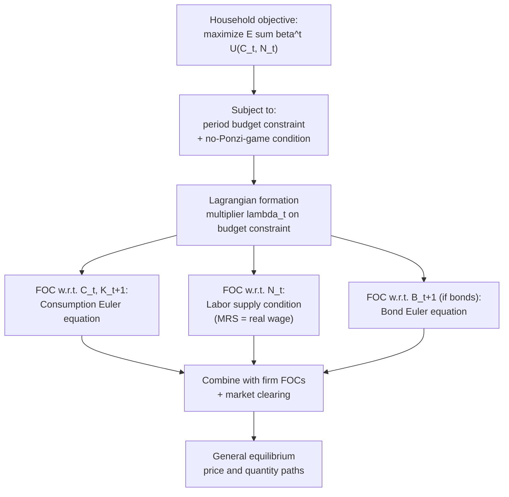

## Household Optimization in DSGE Models

### Overview

Household optimization is the microeconomic core of the demand side of a Dynamic Stochastic General Equilibrium (DSGE) model. The representative household is modeled as a forward-looking, rational, infinitely-lived optimizer that chooses paths for consumption, labor supply, and asset accumulation to maximize expected lifetime utility subject to a sequence of budget constraints. The solution to this problem — a set of first-order conditions, most centrally the consumption Euler equation and the labor supply condition — supplies the structural (microfounded) equations that replace ad hoc aggregate consumption and labor supply functions used in earlier reduced-form macro models.

### The General Household Problem

**Objective function**

$$\max_{\{C_t, N_t, K_{t+1}, B_{t+1}\}_{t=0}^{\infty}} \; \mathbb{E}_0 \sum_{t=0}^{\infty} \beta^t U(C_t, N_t)$$

where:

- $C_t$ = consumption in period $t$
- $N_t$ = labor supplied (hours) in period $t$
- $\beta \in (0,1)$ = subjective discount factor, reflecting time preference
- $U(\cdot,\cdot)$ = period utility function, typically increasing and concave in $C_t$, decreasing and convex in $N_t$ (disutility of labor)
- $\mathbb{E}_0[\cdot]$ = expectation conditional on information available at time 0, reflecting rational expectations over future stochastic shocks

**Budget constraint** (per period, in a closed economy with capital and a risk-free bond)

$$C_t + K_{t+1} - (1-\delta)K_t + \frac{B_{t+1}}{1+i_t} \leq w_t N_t + r_t K_t + B_t + \Pi_t - T_t$$

where $K_t$ is physical capital owned by the household (in models where households directly own capital and rent it to firms), $\delta$ is the depreciation rate, $B_t$ is holdings of a nominal or real risk-free bond, $i_t$ is the nominal interest rate, $w_t$ is the real wage, $r_t$ is the capital rental rate, $\Pi_t$ is profit income (if the household owns firms), and $T_t$ is lump-sum taxes.

A **no-Ponzi-game (transversality) condition** is imposed to rule out the household running an ever-growing debt path financed by further borrowing:

$$\lim_{t\to\infty} \mathbb{E}_0 \left[ \beta^t U_C(C_t,N_t) K_{t+1} \right] = 0$$

### Common Utility Function Specifications

**Separable CRRA (Constant Relative Risk Aversion) utility** — the canonical baseline form:

$$U(C_t, N_t) = \frac{C_t^{1-\sigma}}{1-\sigma} - \chi\frac{N_t^{1+\varphi}}{1+\varphi}$$

where $\sigma > 0$ is the coefficient of relative risk aversion (also the inverse of the intertemporal elasticity of substitution, IES $=1/\sigma$), $\varphi > 0$ is the inverse Frisch elasticity of labor supply, and $\chi > 0$ is a scale parameter calibrating steady-state hours.

**GHH (Greenwood-Hercowitz-Huffman) preferences** — used to eliminate the wealth effect on labor supply, common in RBC and open-economy models:

$$U(C_t, N_t) = \frac{\left(C_t - \chi\frac{N_t^{1+\varphi}}{1+\varphi}\right)^{1-\sigma}}{1-\sigma}$$

**Habit formation utility** — introduces external or internal consumption habits to generate hump-shaped consumption responses to shocks, widely used in medium-scale New Keynesian models (e.g., Christiano-Eichenbaum-Evans, Smets-Wouters):

$$U(C_t, N_t) = \frac{(C_t - hC_{t-1})^{1-\sigma}}{1-\sigma} - \chi\frac{N_t^{1+\varphi}}{1+\varphi}$$

where $h \in [0,1)$ is the habit persistence parameter.

**Key Points**

- The choice of utility specification is not cosmetic — it materially changes the model's implied dynamics (e.g., habit formation slows consumption adjustment and improves the model's fit to hump-shaped empirical impulse responses; GHH preferences change how labor responds to wealth shocks, which matters for open-economy and news-shock models).
- $\sigma$ and $\varphi$ are "deep parameters" in the Lucas-Critique sense — they are meant to be structural (policy-invariant) and are the targets of calibration or Bayesian estimation.

### First-Order Conditions (FOCs)

Forming the Lagrangian with multiplier $\lambda_t$ on the budget constraint and differentiating:

**1. Consumption Euler equation** (intertemporal consumption-savings margin, via capital):

$$U_C(C_t, N_t) = \beta \, \mathbb{E}_t\left[ U_C(C_{t+1}, N_{t+1})\left(1 + r_{t+1} - \delta\right)\right]$$

With CRRA utility ($U_C = C_t^{-\sigma}$), this becomes the familiar log-linearized consumption-growth Euler equation:

$$\hat{c}_t = \mathbb{E}_t \hat{c}_{t+1} - \frac{1}{\sigma}\left(\hat{r}_{t+1} - \mathbb{E}_t\hat{\pi}_{t+1}... \right)$$

(in New Keynesian variants, the relevant return is the real interest rate $i_t - \mathbb{E}_t\pi_{t+1}$, giving the New Keynesian IS-curve building block).

**2. Labor supply condition** (intratemporal consumption-leisure margin):

$$-\frac{U_N(C_t,N_t)}{U_C(C_t,N_t)} = w_t$$

With the separable CRRA-type specification above:

$$\chi N_t^{\varphi} C_t^{\sigma} = w_t$$

This states that the household equates the marginal rate of substitution between leisure and consumption to the real wage — the standard labor supply condition.

**3. Bond Euler equation** (if a nominal bond is present):

$$U_C(C_t,N_t) = \beta(1+i_t)\, \mathbb{E}_t\left[\frac{U_C(C_{t+1},N_{t+1})}{1+\pi_{t+1}}\right]$$

This is the condition that, combined with a monetary policy (Taylor) rule and the New Keynesian Phillips Curve, closes the canonical 3-equation New Keynesian model.

**Key Points**

- The consumption Euler equation is the direct structural replacement for the Keynesian consumption function; it makes current consumption a function of *expected future* consumption and the expected real return, not current income.
- The labor supply FOC is a static (intratemporal) condition, in contrast to the Euler equation's intertemporal (dynamic) nature — the two conditions jointly pin down the consumption-leisure-savings choice each period.

### Intertemporal Elasticity of Substitution (IES)

The parameter $\sigma$ in CRRA utility governs the household's willingness to shift consumption across time in response to changes in the expected real interest rate. The IES is defined as:

$$\text{IES} = -\frac{\partial \ln(C_{t+1}/C_t)}{\partial \ln(1+r_{t+1})} = \frac{1}{\sigma}$$

A higher $\sigma$ (lower IES) implies the household strongly prefers a smooth consumption path and responds weakly to interest rate changes — this parameter is central to how strongly monetary policy (via the real interest rate channel) affects aggregate demand in the model's IS-curve-equivalent equation.

### Consumption-Savings Decision and Asset Pricing Link

The consumption Euler equation is formally identical to the **stochastic discount factor** (SDF) asset-pricing equation used in finance:

$$1 = \mathbb{E}_t\left[ \beta \frac{U_C(C_{t+1},N_{t+1})}{U_C(C_t,N_t)} R_{t+1} \right]$$

where $R_{t+1}$ is the gross return on *any* asset available to the household. This connects DSGE household optimization directly to consumption-based asset pricing (Lucas 1978 tree model, Mehra-Prescott equity premium puzzle framework) — the same marginal-utility-weighted discount factor prices bonds, equity, and capital simultaneously in a complete-markets setting.

### Incorporating Frictions on the Household Side

Standard extensions to the baseline household problem, common in medium-scale estimated DSGE models (e.g., Smets-Wouters 2007, Christiano-Eichenbaum-Evans 2005):

- **Habit formation**: as shown above, generates gradual, hump-shaped consumption responses rather than immediate jumps, better matching estimated VAR impulse responses.
- **Investment adjustment costs**: a convex cost of *changing* the rate of investment is added to the capital accumulation equation, smoothing investment responses:

  $$K_{t+1} = (1-\delta)K_t + \left[1 - S\left(\frac{I_t}{I_{t-1}}\right)\right]I_t$$

  where $S(\cdot)$ is a convex adjustment cost function with $S(1)=S'(1)=0$ at steady state.
- **Variable capital utilization**: households (or firms, depending on model ownership structure) can vary the utilization rate of existing capital at a cost, improving the model's ability to match procyclical measured TFP.
- **Two-agent / limited asset market participation (TANK models)**: a fraction of households are "hand-to-mouth" or "rule-of-thumb" consumers who consume their entire current labor income each period (no access to asset markets), consuming $C_t = w_tN_t$ directly rather than solving the full intertemporal problem. This partially addresses the empirical "excess sensitivity" of consumption to current income that the pure representative-agent Euler equation cannot explain.
- **Heterogeneous-agent extension (HANK)**: replaces the single household with a continuum of households facing idiosyncratic income risk and borrowing constraints, solved via methods such as the Aiyagari-Bewley-Huggett framework combined with aggregate shocks (e.g., via the Krusell-Smith algorithm or sequence-space Jacobian methods).

### Numerical Example: Steady-State Labor Supply

Given CRRA-separable utility with $\sigma = 1$ (log utility, $U_C = 1/C$), $\varphi = 1$, $\chi = 1$, and a steady-state real wage $\bar w = 2.0$, and steady-state consumption $\bar C = 1.5$:

Labor supply FOC: $\chi N^{\varphi} C^{\sigma} = w$

$$1 \cdot N^{1} \cdot 1.5^{1} = 2.0 \implies N = \frac{2.0}{1.5} \approx 1.333$$

[Inference] In calibrated models, $\chi$ is typically chosen residually (i.e., solved for) so that steady-state hours $N$ match a target such as $N=1/3$ (one-third of the time endowment), rather than being fixed a priori as in this illustrative example.

### Criticisms and Empirical Challenges

- **Excess sensitivity puzzle**: Empirical consumption data shows households respond to *anticipated* (predictable) income changes more than the pure forward-looking Euler equation predicts — evidence often attributed to liquidity constraints or myopia, motivating TANK/HANK extensions.
- **Excess smoothness puzzle**: Conversely, aggregate consumption sometimes responds *less* to permanent income shocks than the simple permanent-income-hypothesis-consistent Euler equation would imply.
- **Equity premium puzzle**: Standard CRRA-based household optimization, when used to price assets via the SDF framework above, requires implausibly high risk aversion ($\sigma$) to match the observed historical equity premium (Mehra-Prescott 1985), a long-standing empirical challenge to the standard household optimization framework.
- **Weak micro-evidence for high Frisch elasticities**: Macro-DSGE models frequently require higher labor supply elasticities ($1/\varphi$) to match aggregate hours volatility than most micro-level labor studies estimate — the "micro-macro labor supply elasticity puzzle." [Inference] This discrepancy is actively debated, with some reconciliation attempts via extensive-margin (employment) versus intensive-margin (hours-per-worker) labor supply distinctions.

### Related Topics

- Consumption Euler equation and the New Keynesian IS curve
- Permanent Income Hypothesis (Friedman) and Life-Cycle Hypothesis (Modigliani) as precursors
- Frisch elasticity of labor supply
- Habit formation and hump-shaped impulse responses
- TANK and HANK models (limited asset market participation)
- Consumption-based asset pricing and the equity premium puzzle
- Investment adjustment costs and Tobin's Q
- Firm optimization and production technology in DSGE models
- Log-linearization and the Blanchard-Kahn solution method