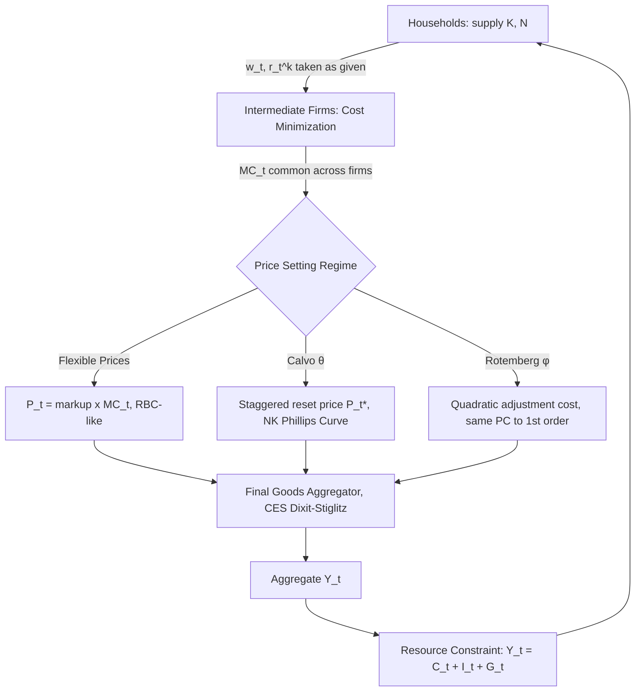

## Firm Optimization and the Production Side

### Overview and Role in the DSGE Framework

The production side of a Dynamic Stochastic General Equilibrium (DSGE) model formalizes how firms transform inputs into output, how they choose factor demands, and how they set prices. It is the counterpart to the household block: households supply labor and capital and demand goods; firms demand labor and capital and supply goods. The firm's optimization problem determines the marginal products of labor and capital, which pin down real wages and the rental rate of capital in equilibrium, and — in models with nominal rigidities — determines the marginal cost that anchors the New Keynesian Phillips Curve.

Three layers are typically modeled:

1. **Technology**: an aggregate (or firm-level) production function mapping capital and labor into output, often subject to a stochastic technology shock.
2. **Static cost minimization**: given factor prices, firms choose the cost-minimizing combination of labor and capital.
3. **Price/profit-maximization**: firms choose output and, in monopolistically competitive settings, prices, subject to constraints (perfect competition, or Calvo/Rotemberg pricing frictions).

The distinction between the **Real Business Cycle (RBC)** production side and the **New Keynesian (NK)** production side is central: RBC models typically assume perfect competition and flexible prices, while NK models require monopolistic competition and price stickiness to generate meaningful monetary non-neutrality.

---

### The Aggregate Production Function

The canonical production function is Cobb-Douglas:

$$Y_t = A_t K_t^{\alpha} N_t^{1-\alpha}$$

where $Y_t$ is output, $K_t$ is capital, $N_t$ is labor (hours), $\alpha \in (0,1)$ is capital's share of output, and $A_t$ is total factor productivity (TFP), following an exogenous stochastic process, typically:

$$\ln A_t = \rho_A \ln A_{t-1} + \varepsilon_t^A, \quad \varepsilon_t^A \sim N(0, \sigma_A^2)$$

**Key Points**

- Cobb-Douglas implies constant factor income shares: labor's share is $1-\alpha$ and capital's share is $\alpha$, independent of relative factor prices. This matches long-run Kaldor facts in most calibrated models.
- $\alpha$ is typically calibrated to the observed labor share of national income (around 0.33–0.36 for the US), computed from national accounts data.
- $A_t$ is the primary driver of business cycles in canonical RBC models; in NK models it remains important but shares the stage with markup, monetary, and preference shocks.
- More general CES (constant elasticity of substitution) production functions are used when the elasticity of substitution between capital and labor is a parameter of interest:

  $$Y_t = A_t \left[ \alpha K_t^{\frac{\sigma-1}{\sigma}} + (1-\alpha) N_t^{\frac{\sigma-1}{\sigma}} \right]^{\frac{\sigma}{\sigma-1}}$$

  Cobb-Douglas is the special case $\sigma = 1$.

**[Inference]** Whether TFP shocks alone can account for the bulk of business cycle volatility is a long-standing empirical dispute (the "RBC critique"); this is a modeling choice/interpretive question rather than a settled fact, and later-generation DSGE models (e.g., Smets-Wouters) attribute much of the cycle to a richer shock structure instead.

---

### Firm Market Structure: Perfect Competition vs. Monopolistic Competition

#### Perfectly Competitive Final-Goods Firms (RBC Baseline)

In the simplest RBC setup, a single representative firm (or a continuum of identical price-taking firms) rents capital and hires labor in competitive factor markets, taking the real wage $w_t$ and rental rate $r_t^k$ as given. The firm solves a static profit-maximization problem each period:

$$\max_{K_t, N_t} \; A_t K_t^{\alpha} N_t^{1-\alpha} - w_t N_t - r_t^k K_t$$

Because the production function is constant-returns-to-scale (CRS) and the market is perfectly competitive, equilibrium profits are exactly zero, and the firm's problem reduces to setting factor prices equal to marginal products.

#### Monopolistically Competitive Firms (New Keynesian Baseline)

The NK framework requires market power so that firms have pricing decisions to make (a firm with zero market power and flexible prices has no meaningful pricing problem). This is implemented with a **two-tier production structure**:

- A continuum of **intermediate-goods firms** indexed by $i \in [0,1]$, each producing a differentiated variety $Y_t(i)$ using capital and labor, each holding some monopoly power over its own variety.
- A single **perfectly competitive final-goods firm** (a fictional aggregator) that combines varieties into the final consumption good using a Dixit-Stiglitz CES aggregator:

$$Y_t = \left( \int_0^1 Y_t(i)^{\frac{\epsilon-1}{\epsilon}} di \right)^{\frac{\epsilon}{\epsilon-1}}$$

where $\epsilon > 1$ is the elasticity of substitution across varieties. Cost minimization by the final-goods firm yields each variety's demand curve:

$$Y_t(i) = \left( \frac{P_t(i)}{P_t} \right)^{-\epsilon} Y_t$$

and the associated aggregate price index:

$$P_t = \left( \int_0^1 P_t(i)^{1-\epsilon} di \right)^{\frac{1}{1-\epsilon}}$$

**Key Points**

- $\epsilon$ determines the **steady-state markup** over marginal cost: $\mu = \frac{\epsilon}{\epsilon - 1}$. Higher $\epsilon$ (closer substitutes) implies lower market power and a markup closer to 1 (perfect competition as $\epsilon \to \infty$).
- Intermediate firms take the aggregate price level $P_t$ and aggregate demand $Y_t$ as given but recognize they face a downward-sloping demand curve for their own variety — this is what creates a genuine (constrained) profit-maximization problem over price.
- This structure is standard in virtually all NK DSGE models (e.g., Smets-Wouters, the FRB/US-style academic cousins, and textbook treatments such as Galí's *Monetary Policy, Inflation, and the Business Cycle*).

---

### Cost Minimization and Marginal Cost

Whether competitive or monopolistic, every intermediate firm first solves a **static cost-minimization problem** for a given required output level $Y_t(i)$, taking $w_t$ and $r_t^k$ as given:

$$\min_{K_t(i), N_t(i)} \; w_t N_t(i) + r_t^k K_t(i) \quad \text{s.t.} \quad A_t K_t(i)^{\alpha} N_t(i)^{1-\alpha} \geq Y_t(i)$$

Forming the Lagrangian with multiplier $mc_t(i)$ (which turns out to equal marginal cost) and taking first-order conditions yields the standard tangency condition:

$$\frac{w_t}{r_t^k} = \frac{1-\alpha}{\alpha} \cdot \frac{K_t(i)}{N_t(i)}$$

i.e., firms equate the capital-labor ratio to the point where the ratio of marginal products equals the ratio of factor prices. Because all firms face the same factor prices and the same Cobb-Douglas technology, this capital-labor ratio is **identical across all firms** regardless of their individual output level or price — a convenient aggregation result.

Real marginal cost, common to all firms under identical Cobb-Douglas technology, is:

$$mc_t = \frac{1}{A_t} \left( \frac{w_t}{1-\alpha} \right)^{1-\alpha} \left( \frac{r_t^k}{\alpha} \right)^{\alpha} \cdot \frac{1}{\alpha^\alpha (1-\alpha)^{1-\alpha}}$$

(constants absorbed depending on normalization convention).

**Key Points**

- Because $mc_t$ does not depend on $i$, all firms — regardless of when they last reset their price — share the same real marginal cost in equilibrium. This dramatically simplifies aggregation in Calvo-type models: heterogeneity in prices does not require heterogeneity in cost conditions.
- $mc_t$ is the crucial "forcing variable" that links the real (production) side of the model to the nominal (pricing/inflation) side via the Phillips Curve.
- In steady state, real marginal cost equals the inverse of the gross markup: $mc = 1/\mu$.

---

### Profit Maximization and Price Setting

#### Flexible-Price (Frictionless) Case

If prices are fully flexible, each intermediate firm simply sets price as a constant markup over marginal cost each period:

$$P_t(i) = \mu \cdot MC_t$$

Since $mc_t$ is common across firms, all firms charge the identical price, $P_t(i) = P_t$ for all $i$, and the price-setting problem is degenerate — output is entirely demand/technology-determined and inflation dynamics play no independent role. This is effectively the RBC production side "wearing NK clothing."

#### Calvo (1983) Staggered Pricing

The dominant approach to introducing nominal rigidity. Each period, a firm may reset its price with fixed probability $1-\theta$, independent of history, and keeps its old price with probability $\theta$ (implying an average price duration of $\frac{1}{1-\theta}$ periods). A firm resetting its price at $t$ chooses $P_t^*(i)$ to maximize the expected present discounted value of profits over all future states in which the price remains unchanged:

$$\max_{P_t^*(i)} \; \mathbb{E}_t \sum_{k=0}^{\infty} \theta^k Q_{t,t+k} \left[ P_t^*(i) Y_{t+k|t}(i) - MC_{t+k} \, Y_{t+k|t}(i) \right]$$

subject to the demand curve $Y_{t+k|t}(i) = \left( \frac{P_t^*(i)}{P_{t+k}} \right)^{-\epsilon} Y_{t+k}$, where $Q_{t,t+k}$ is the household's stochastic discount factor (firms are owned by households and discount using the household's marginal utility of consumption).

The first-order condition, log-linearized around the zero-inflation steady state, yields the familiar recursive optimal reset-price condition, which after aggregation with the Calvo price index produces the **New Keynesian Phillips Curve**:

$$\pi_t = \beta \, \mathbb{E}_t[\pi_{t+1}] + \kappa \, \widehat{mc}_t$$

where $\kappa = \frac{(1-\theta)(1-\beta\theta)}{\theta}$ and $\widehat{mc}_t$ is the log-deviation of real marginal cost from steady state.

**Key Points**

- $\theta$ (Calvo parameter) is usually calibrated from micro price-change frequency data — typical DSGE calibrations imply average price durations of roughly 3–4 quarters ($\theta \approx 0.75$).
- $\kappa$ is decreasing in $\theta$: stickier prices (higher $\theta$) flatten the Phillips Curve, meaning marginal cost changes translate less into current inflation.
- The Calvo assumption is mathematically convenient (it delivers a simple recursive aggregation) but is often criticized because it implies price durations are independent of the firm's incentive to change price — a form of "free lunch" randomness.

#### Rotemberg (1982) Quadratic Adjustment Costs

An alternative that yields an **identical log-linearized Phillips Curve** but is more tractable in models solved with global/nonlinear methods, since it avoids tracking a cross-sectional price distribution. Firms face a resource cost of changing prices:

$$\text{Adjustment Cost}_t(i) = \frac{\phi}{2} \left( \frac{P_t(i)}{P_{t-1}(i)} - 1 \right)^2 Y_t$$

Firms choose $P_t(i)$ to maximize discounted profits net of this cost. Because there is no cross-sectional price dispersion in equilibrium (all firms behave identically given the smooth quadratic cost), the aggregate resource constraint carries an explicit welfare loss term from price adjustment, whereas in Calvo models the welfare loss from price dispersion is implicit and appears only in a second-order approximation.

**Key Points**

- The Rotemberg-Calvo Phillips Curve equivalence is a well-known result: matching $\phi$ and $\theta$ appropriately (via $\phi = \frac{(\epsilon-1)(1-\theta)(1-\beta\theta)}{\theta}$ roughly, depending on exact normalization) delivers the same first-order dynamics.
- Rotemberg is generally preferred in models solved with perturbation methods beyond first order, or with occasionally binding constraints (e.g., zero lower bound models), because it avoids the state-space explosion of tracking the Calvo price distribution.
- **[Unverified]** The exact numerical equivalence mapping between $\phi$ and $\theta$ depends on the precise functional form and normalization used in a given paper; practitioners should re-derive it for their specific model rather than assume a universal formula.

---

### Firm's Investment and Capital Accumulation Decision

In many DSGE models, capital is not directly owned by the firm producing final output; instead, a separate class of "capital-goods producers" or "capital owners" (often households, in the simplest specification) accumulate capital and rent it to firms. The capital accumulation equation is:

$$K_{t+1} = (1-\delta) K_t + I_t$$

where $\delta$ is the depreciation rate and $I_t$ is investment. When investment adjustment costs are included (a standard feature since Christiano-Eichenbaum-Evans 2005), the law of motion becomes:

$$K_{t+1} = (1-\delta) K_t + \left[ 1 - S\left( \frac{I_t}{I_{t-1}} \right) \right] I_t$$

where $S(\cdot)$ is a convex adjustment cost function satisfying $S(1) = S'(1) = 0$ and $S''(1) > 0$ in steady state (no cost or marginal cost of investment growth at the steady-state growth rate, but a rising marginal cost of adjusting the investment rate away from trend).

**Key Points**

- Investment adjustment costs are essential empirically: without them, capital (and hence output and investment) responds too smoothly and too quickly to shocks relative to observed data, and models struggle to match the hump-shaped impulse responses of investment to monetary shocks.
- The rental rate of capital $r_t^k$ and Tobin's $Q$ (the shadow price of installed capital) become distinct objects once adjustment costs are present; $Q_t$ satisfies its own forward-looking difference equation (a discrete-time analogue of the continuous-time $q$-theory of investment).
- **[Inference]** The specific functional form chosen for $S(\cdot)$ (e.g., quadratic vs. more general convex forms) is a modeling convenience rather than a structurally estimated object in most applications; results can be sensitive to this choice at higher-order approximations.

---

### Aggregation and the Resource Constraint

Because all firms share identical marginal cost and capital-labor ratios (under Calvo, conditional on being able to reset price), aggregate output can be written in terms of aggregate capital and labor inputs, adjusted for a **price dispersion term** $\Delta_t \geq 1$:

$$Y_t = \frac{A_t K_t^{\alpha} N_t^{1-\alpha}}{\Delta_t}, \qquad \Delta_t = \int_0^1 \left( \frac{P_t(i)}{P_t} \right)^{-\epsilon} di$$

$\Delta_t$ equals 1 only in the special case of zero trend inflation and identical past prices; otherwise it represents a resource cost of price dispersion — a first-order source of the welfare cost of inflation in Calvo models, distinct from the Rotemberg formulation where the cost appears directly as a resource-using adjustment term instead.

The final goods market clearing condition (resource constraint) closes the model:

$$Y_t = C_t + I_t + G_t$$

where $G_t$ is government spending (exogenous or rule-based), linking the production side back to the household's consumption-savings decision and the government/monetary blocks.

---

### Example: Log-Linearized Production Block (Standard 3-Equation NK Core)

A worked, fully log-linearized system (variables denote log-deviations from steady state, denoted with hats) for a canonical NK production side without capital (labor-only, for tractability — a common textbook simplification, e.g., Galí Ch. 3):

$$\hat{y}_t = \hat{a}_t + (1-\alpha)\hat{n}_t$$

$$\widehat{mc}_t = \hat{w}_t - \hat{a}_t + \alpha \hat{n}_t$$

$$\pi_t = \beta \mathbb{E}_t \pi_{t+1} + \kappa \widehat{mc}_t$$

**Example**

Given $\alpha = 0$ (labor-only production, $Y_t = A_t N_t$), $\theta = 0.75$, $\beta = 0.99$:

- $\kappa = \frac{(1-0.75)(1-0.99\times0.75)}{0.75} = \frac{0.25 \times 0.2575}{0.75} \approx 0.0858$
- A 1% positive technology shock ($\hat{a}_t = 0.01$) that raises labor productivity while wages are sticky (e.g., under sticky wages as well) lowers real marginal cost, which under this Phillips Curve immediately implies downward pressure on current and expected inflation, consistent with the "divine coincidence" property of the baseline 3-equation NK model (output gap stabilization and inflation stabilization coincide under a technology shock when there are no cost-push shocks).

---

### Diagrammatic Summary of the Firm-Side Block

---

### Firm-Side Block Diagram (svg_diagram)

<svg xmlns="http://www.w3.org/2000/svg" viewBox="0 0 760 300">
<text x="380" y="24" text-anchor="middle" font-size="16" font-weight="bold" fill="#1a1a1a">Production Side Flow (svg_diagram)</text>
<rect x="20" y="60" width="150" height="60" rx="6" fill="#e8f0fe" stroke="#4a6fa5" />
<text x="95" y="85" text-anchor="middle" font-size="12" fill="#1a1a1a">Factor Markets</text>
<text x="95" y="102" text-anchor="middle" font-size="11" fill="#333">w_t, r_t^k</text>
<rect x="220" y="60" width="170" height="60" rx="6" fill="#fdecea" stroke="#c0533e" />
<text x="305" y="82" text-anchor="middle" font-size="12" fill="#1a1a1a">Cost Minimization</text>
<text x="305" y="99" text-anchor="middle" font-size="11" fill="#333">K/N ratio, MC_t</text>
<rect x="440" y="20" width="150" height="50" rx="6" fill="#eaf7ea" stroke="#3e8e41" />
<text x="515" y="42" text-anchor="middle" font-size="12" fill="#1a1a1a">Calvo Pricing</text>
<text x="515" y="58" text-anchor="middle" font-size="10" fill="#333">reset prob 1-θ</text>
<rect x="440" y="90" width="150" height="50" rx="6" fill="#eaf7ea" stroke="#3e8e41" />
<text x="515" y="112" text-anchor="middle" font-size="12" fill="#1a1a1a">Rotemberg Cost</text>
<text x="515" y="128" text-anchor="middle" font-size="10" fill="#333">quadratic φ</text>
<rect x="630" y="55" width="110" height="60" rx="6" fill="#fff4e0" stroke="#c98a1d" />
<text x="685" y="80" text-anchor="middle" font-size="12" fill="#1a1a1a">NK Phillips</text>
<text x="685" y="97" text-anchor="middle" font-size="11" fill="#333">Curve π_t</text>
<rect x="220" y="180" width="170" height="60" rx="6" fill="#f1e8fa" stroke="#7d4aa5" />
<text x="305" y="205" text-anchor="middle" font-size="12" fill="#1a1a1a">CES Aggregator</text>
<text x="305" y="222" text-anchor="middle" font-size="11" fill="#333">Y_t across varieties i</text>
<rect x="20" y="180" width="150" height="60" rx="6" fill="#e0f7fa" stroke="#1d7a8c" />
<text x="95" y="205" text-anchor="middle" font-size="12" fill="#1a1a1a">Resource Constraint</text>
<text x="95" y="222" text-anchor="middle" font-size="11" fill="#333">Y=C+I+G</text>
<line x1="170" y1="90" x2="220" y2="90" stroke="#555" stroke-width="1.5" marker-end="url(#arrow)" />
<line x1="390" y1="80" x2="440" y2="50" stroke="#555" stroke-width="1.5" marker-end="url(#arrow)" />
<line x1="390" y1="100" x2="440" y2="115" stroke="#555" stroke-width="1.5" marker-end="url(#arrow)" />
<line x1="590" y1="55" x2="630" y2="75" stroke="#555" stroke-width="1.5" marker-end="url(#arrow)" />
<line x1="590" y1="115" x2="630" y2="95" stroke="#555" stroke-width="1.5" marker-end="url(#arrow)" />
<line x1="305" y1="120" x2="305" y2="180" stroke="#555" stroke-width="1.5" marker-end="url(#arrow)" />
<line x1="220" y1="210" x2="170" y2="210" stroke="#555" stroke-width="1.5" marker-end="url(#arrow)" />
<line x1="95" y1="180" x2="95" y2="120" stroke="#999" stroke-width="1.2" stroke-dasharray="4,3" marker-end="url(#arrow)" />
</svg>

---

### Calibration Reference Table

| Parameter | Symbol | Typical Value | Source/Rationale |
| --- | --- | --- | --- |
| Capital share | $\alpha$ | 0.33–0.36 | National income accounts labor share |
| Discount factor | $\beta$ | 0.99 (quarterly) | Matches ~4% annual real rate |
| Depreciation rate | $\delta$ | 0.025 (quarterly) | ~10% annual depreciation |
| Elasticity of substitution across varieties | $\epsilon$ | 6–11 | Implies steady-state markup of 10–20% |
| Calvo parameter | $\theta$ | 0.66–0.85 | Micro price-change frequency studies (e.g., Bils-Klenow) |
| TFP shock persistence | $\rho_A$ | 0.90–0.97 | Estimated from Solow residual series |
| Investment adjustment cost curvature | $S''(1)$ | 2–8 | Estimated via Bayesian/GMM methods (Christiano-Eichenbaum-Evans) |

---

### Common Pitfalls and Modeling Considerations

- **Confusing nominal and real marginal cost**: the Phillips Curve requires *real* marginal cost in deviation from its steady-state value, not the level or the nominal marginal cost.
- **Forgetting capital's rental market structure**: whether capital is firm-owned (with investment decisions internal to the firm) or household-owned (rented out competitively) changes which agent's Euler equation prices capital, though it is largely a bookkeeping equivalence under complete markets. **[Inference]** In some model variants this equivalence can break down under financial frictions (e.g., financial accelerator models), where firm net worth matters independently.
- **Aggregation under Calvo requires care**: naively averaging firm-level variables ignores the price-dispersion term $\Delta_t$, which is second-order in a first-order approximation but first-order relevant for welfare and for models with high trend inflation.
- **Behavior may vary** across specific software implementations (Dynare, IRIS, gEcon) in how the log-linearization or steady-state normalization of the markup and marginal cost is handled; the exact syntax for declaring firm's block equations should always be checked against the specific solver's documentation.

---

**Related Topics**

- New Keynesian Phillips Curve derivation and hybrid (backward-looking) variants
- Household optimization: consumption-savings and labor supply
- Investment adjustment costs and Tobin's Q theory in discrete time
- Financial frictions and the financial accelerator (Bernanke-Gertler-Gilchrist)
- Wage stickiness (Calvo/Rotemberg wage setting) and the wage Phillips Curve
- Solving DSGE models: log-linearization, perturbation methods, and Dynare/gEcon implementation
- Steady-state calibration versus Bayesian estimation of structural parameters
- Trend inflation and its effects on Phillips Curve slope and price dispersion
- Multi-sector and heterogeneous-firm extensions (menu costs, firm-specific capital)