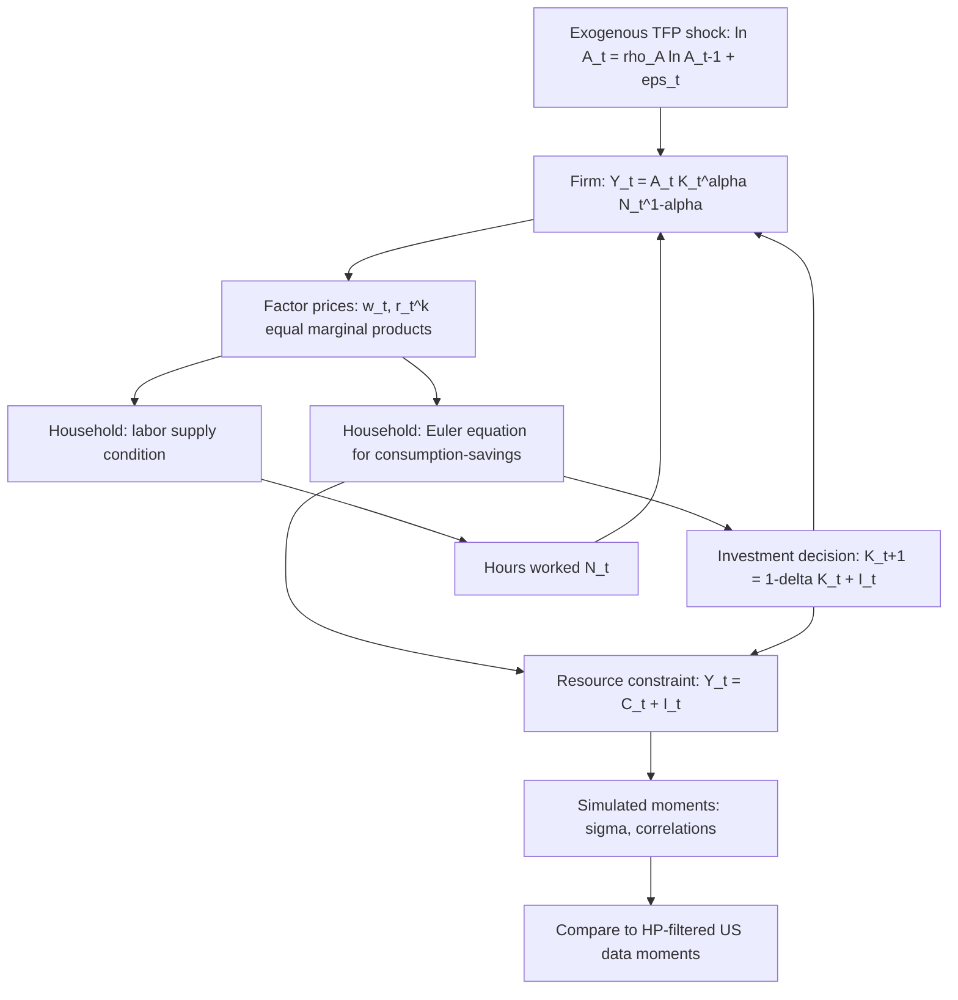

## Real Business Cycle Model as a Baseline DSGE Model

### Overview and Historical Position

The Real Business Cycle (RBC) model, originating with Kydland and Prescott (1982) and Long and Plosser (1983), is the foundational baseline DSGE model from which the broader DSGE literature — including New Keynesian extensions — descends. Its central claim is that business cycle fluctuations can, in principle, be generated **entirely by real (non-monetary) shocks**, chiefly stochastic technology (total factor productivity) shocks, propagating through an otherwise frictionless, perfectly competitive, flexible-price economy populated by optimizing, rational-expectations agents. It is the natural "stripped-down" DSGE baseline: no nominal rigidities, no monetary policy block, no market power — only households, a representative firm, and a resource constraint, closed by market clearing.

**Key Points**

- The RBC model was the first fully-specified general equilibrium model solved and simulated to match observed business cycle *moments* (standard deviations, relative volatilities, correlations with output) rather than estimated via traditional econometric methods — this methodological innovation (calibration) is inseparable from the model's historical significance.
- It demonstrated that a Walrasian, frictionless economy subject only to productivity shocks could generate co-movement and volatility patterns qualitatively resembling actual business cycles, challenging the then-dominant view that cycles necessarily reflect market failures or nominal frictions.
- **[Inference]** The degree to which RBC models can *quantitatively* match business cycle facts (as opposed to qualitatively replicate co-movement patterns) remains genuinely disputed in the literature; this is a live methodological and empirical debate rather than a settled question.

---

### Model Environment

#### Households

A representative household (or a continuum of identical households) chooses consumption $C_t$ and labor supply $N_t$ to maximize expected lifetime utility:

$$\max_{\{C_t, N_t\}} \; \mathbb{E}_0 \sum_{t=0}^{\infty} \beta^t \, U(C_t, N_t)$$

with a standard separable utility specification:

$$U(C_t, N_t) = \frac{C_t^{1-\sigma}}{1-\sigma} - \chi \frac{N_t^{1+\varphi}}{1+\varphi}$$

where $\beta \in (0,1)$ is the discount factor, $\sigma$ the coefficient of relative risk aversion (inverse intertemporal elasticity of substitution), $\varphi$ the inverse Frisch elasticity of labor supply, and $\chi$ a labor disutility scale parameter. The household's budget constraint each period is:

$$C_t + I_t = w_t N_t + r_t^k K_t$$

with the capital accumulation law of motion:

$$K_{t+1} = (1-\delta) K_t + I_t$$

#### Firms

A representative, perfectly competitive firm produces output using a constant-returns-to-scale Cobb-Douglas technology:

$$Y_t = A_t K_t^{\alpha} N_t^{1-\alpha}$$

renting capital and labor in competitive spot factor markets each period, with zero economic profit in equilibrium (see the companion topic "Firm optimization and the production side" for the full derivation).

#### Technology Shock

The sole exogenous driving force in the canonical RBC model is a stochastic TFP process, typically an AR(1) in logs:

$$\ln A_t = \rho_A \ln A_{t-1} + \varepsilon_t^A, \qquad \varepsilon_t^A \sim N(0, \sigma_A^2)$$

with $\rho_A$ close to but strictly less than 1 (highly persistent but stationary).

#### Market Clearing (Resource Constraint)

$$Y_t = C_t + I_t$$

(no government spending in the baseline version; $G_t$ is often added as a second, minor shock in extended versions).

---

### Equilibrium Conditions

Combining household and firm optimization with market clearing yields the model's core equilibrium system:

**Euler equation (intertemporal consumption-savings):**

$$C_t^{-\sigma} = \beta \, \mathbb{E}_t \left[ C_{t+1}^{-\sigma} \left( \alpha A_{t+1} K_{t+1}^{\alpha-1} N_{t+1}^{1-\alpha} + 1 - \delta \right) \right]$$

**Intratemporal labor supply condition:**

$$\chi N_t^{\varphi} = C_t^{-\sigma} \cdot (1-\alpha) A_t K_t^{\alpha} N_t^{-\alpha}$$

**Production function:**

$$Y_t = A_t K_t^{\alpha} N_t^{1-\alpha}$$

**Capital accumulation:**

$$K_{t+1} = (1-\delta) K_t + I_t$$

**Resource constraint:**

$$Y_t = C_t + I_t$$

**Technology process:**

$$\ln A_t = \rho_A \ln A_{t-1} + \varepsilon_t^A$$

This is a system of six equations in six endogenous variables ($C_t, N_t, K_{t+1}, Y_t, I_t, A_t$) that together fully characterize the competitive equilibrium — no separate market-clearing conditions for factor markets are needed since firm first-order conditions already equate marginal products to factor prices, which are then substituted out.

**Key Points**

- Because markets are complete and there are no distortions, the competitive equilibrium of the RBC model **coincides with the solution to a social planner's problem** maximizing household utility subject only to the technology and resource constraints (the First and Second Welfare Theorems apply). This is a defining analytical convenience: the model can be solved as a planner's problem, sidestepping the need to solve for decentralized prices at all, then prices can be recovered afterward from the planner's shadow values if needed.
- The model has **no nominal variables whatsoever** — there is no money, no price level, no nominal interest rate — "real" business cycle is a description of substance, not merely of a research tradition's name.

---

### Solving the Model: Steady State and Log-Linearization

The model has no closed-form solution due to the nonlinear expectational Euler equation, so it is solved numerically around the deterministic steady state.

**Steady state** (setting $A=1$, and all growth rates to zero):

$$\frac{1}{\beta} = \alpha \left(\frac{K}{N}\right)^{\alpha-1} + 1 - \delta \;\; \Rightarrow \;\; \frac{K}{N} = \left(\frac{\alpha}{\frac{1}{\beta}-1+\delta}\right)^{\frac{1}{1-\alpha}}$$

Given $K/N$, the remaining steady-state ratios ($Y/N$, $I/N$, $C/N$) follow directly, and steady-state hours $\bar{N}$ is pinned down jointly with $\chi$ (often calibrated to normalize $\bar{N}=1/3$).

**Log-linearization** around this steady state (using hats for log-deviations) produces a linear rational-expectations system solvable via standard methods:

$$-\sigma \hat{c}_t = -\sigma \mathbb{E}_t \hat{c}_{t+1} + \frac{(1-\beta(1-\delta))}{1} \, \mathbb{E}_t \hat{r}^k_{t+1}$$

$$\hat{y}_t = \hat{a}_t + \alpha \hat{k}_t + (1-\alpha)\hat{n}_t$$

$$\hat{k}_{t+1} = (1-\delta)\hat{k}_t + \delta \hat{\imath}_t$$

$$\bar{Y}\hat{y}_t = \bar{C}\hat{c}_t + \bar{I}\hat{\imath}_t$$

**Solution methods** for the linearized system:

- **Blanchard-Kahn method**: eigenvalue decomposition to separate stable/unstable roots and construct the unique saddle-path (non-explosive) solution, given the correct count of predetermined vs. jump (forward-looking) variables.
- **Method of undetermined coefficients**: guess a linear policy function $\hat{k}_{t+1} = \phi_{kk}\hat{k}_t + \phi_{ka}\hat{a}_t$ and solve for coefficients by matching terms.
- **Numerical solvers**: in practice, virtually all applied work uses software (Dynare's `stoch_simul`, `gEcon`, `IRIS`) that automates the log-linearization and Blanchard-Kahn (or generalized Schur/QZ decomposition) solution.

**[Unverified]** Whether a given calibration satisfies the Blanchard-Kahn order and rank conditions (existence and uniqueness of a stable solution) must be checked numerically for the specific parameterization; it is not guaranteed by the model class in general and depends on the exact parameter values chosen.

---

### Propagation Mechanism: Why a Transitory Shock Produces Persistent Cycles

A defining feature — and a major early selling point — of the RBC model is that even a single, relatively short-lived technology shock generates **hump-shaped, persistent responses** in output, investment, and hours, well beyond the shock's own persistence $\rho_A$. This propagation works through **capital accumulation**:

1. A positive TFP shock raises the marginal product of both capital and labor, raising current output, consumption, investment, and (depending on income vs. substitution effects) hours worked.
2. Higher investment raises next period's capital stock $K_{t+1}$, which raises the marginal product of labor in subsequent periods even after $A_t$ has begun to decay back toward its mean.
3. This elevated capital stock persists for many periods (since $\delta$ is small, e.g., 0.025 quarterly, implying capital depreciates slowly), so the shock's effects propagate and decay only gradually, well past the shock's own autocorrelation.

**Key Points**

- This capital-stock propagation channel is why RBC models can produce hump-shaped output dynamics from white-noise or near-white-noise shocks, though matching the full empirical hump shape typically also requires the persistent AR(1) shock process itself (empirically, $\rho_A$ is estimated close to 0.95–0.99 at a quarterly frequency from Solow-residual calculations).
- The strength of this propagation is sensitive to $\delta$ and to labor supply elasticity assumptions: with more elastic labor supply (lower $\varphi$), hours respond more strongly to the shock, amplifying the output response.

---

### Business Cycle Moments: The Core RBC Evaluation Exercise

The standard way an RBC model is evaluated is by comparing **model-simulated second moments** to their empirical counterparts (typically HP-filtered US quarterly data).

| Moment | Data (typical US, HP-filtered) | Canonical RBC Model |
| --- | --- | --- |
| $\sigma(Y)$ (output volatility, relative, %) | ~1.5–1.8 | Matched by construction (calibration target) |
| $\sigma(C)/\sigma(Y)$ | < 1 (consumption smoother than output) | Typically close to or below 1 — broadly matched |
| $\sigma(I)/\sigma(Y)$ | ~3 (investment several times more volatile) | Broadly matched, often somewhat under-predicted |
| $\sigma(N)/\sigma(Y)$ | ~0.7–1.0 | **Often under-predicted** — canonical weakness |
| $corr(N, Y/N)$ (labor-productivity procyclicality) | Close to 0 empirically | **Strongly positive in the model** — canonical weakness |
| $corr(C, Y)$, $corr(I, Y)$ | Strongly positive | Strongly positive — well matched |

**[Inference]** The mismatches on labor volatility and the labor-productivity correlation are widely discussed in the literature as core empirical weaknesses of the baseline RBC model, and much subsequent RBC-adjacent research (indivisible labor / Hansen-Rogerson lotteries, habit formation, variable capital utilization, home production) can be read as attempts to address exactly these two moments; framing them as "the canonical weaknesses" reflects a broad literature consensus but individual papers vary in which moment they emphasize most.

---

### Standard Extensions Within the RBC Tradition

- **Indivisible labor (Hansen 1985, Rogerson 1988)**: replacing continuous hours choice with a lottery over working full-time or not at all, which flattens the *aggregate* labor supply curve and raises employment volatility relative to the baseline model, addressing the labor-volatility mismatch above.
- **Variable capital utilization**: allowing firms to vary the *intensity* of capital use (not just the quantity), which amplifies the effective response of the capital input to shocks without requiring implausibly large changes in the physical capital stock.
- **Government spending shocks**: adding a second exogenous shock ($G_t$, financed by lump-sum taxes) to test whether fiscal shocks alone, or fiscal shocks in combination with technology shocks, better match the joint moment structure.
- **Multiple shocks (news shocks, investment-specific technology shocks)**: introducing shocks to the *future* expected path of TFP ("news shocks") or to the efficiency of transforming output into capital goods, aiming to generate additional propagation and better match investment volatility.
- **Home production**: adding a non-market production sector using household time and capital, addressing counterfactually smooth consumption-leisure substitution patterns in the baseline model.

---

### RBC as Baseline: Relationship to New Keynesian DSGE Models

The RBC model is frequently described as the "flexible-price limit" of the New Keynesian model: setting the Calvo/Rotemberg price-stickiness parameter to imply instantaneous price adjustment, removing monopolistic competition (letting the elasticity of substitution $\epsilon \to \infty$), and removing the monetary policy block collapses the standard medium-scale NK DSGE model back to (a close variant of) the RBC model. This nesting is why RBC is described as the DSGE literature's **baseline** — subsequent generations of models are most naturally understood as RBC-plus-frictions (nominal rigidities, financial frictions, labor market search frictions, habit formation, etc.), and the "**flexible-price / natural-rate output**" concept central to New Keynesian analysis is precisely the RBC model's equilibrium output path evaluated under the same shocks.

**Key Points**

- The New Keynesian "output gap" (actual output minus flexible-price/natural output) is *defined* relative to a hypothetical RBC-type economy facing the same shocks — making the RBC model conceptually load-bearing in NK monetary policy analysis even when RBC's real-shocks-only claim about the *source* of fluctuations is not what motivates the NK model itself.
- Monetary non-neutrality — the central object of NK analysis — is, by construction, entirely absent from the RBC model; adding it (nominal rigidities, monopolistic competition) is precisely what converts an RBC baseline into an NK model.

---

### Worked Example: Impulse Response Intuition

**Example**

Consider $\alpha = 0.33$, $\beta = 0.99$, $\delta = 0.025$, $\sigma = 1$ (log utility), $\varphi = 1$, $\rho_A = 0.95$, and a one-time 1% technology shock ($\varepsilon_0^A = 0.01$) with the economy starting at steady state.

- **Period 0**: $A_0$ rises 1%. Output rises roughly in proportion to the shock plus the labor response (hours typically rise slightly on impact under standard calibrations, since the substitution effect of a higher effective wage tends to dominate the wealth effect for a transitory shock). Investment rises more than proportionally (the "acceleration" typical of RBC investment dynamics), consistent with $\sigma(I)/\sigma(Y) \approx 3$ in the data.
- **Periods 1–20**: $A_t$ decays back toward steady state at rate $\rho_A = 0.95$ per quarter, but output, consumption, and hours decay *more slowly* than $A_t$ itself because the elevated capital stock (built up via the investment response) continues to support above-steady-state output even as $A_t$'s own contribution fades — the propagation mechanism described above.
- **Long run**: all variables return asymptotically to their original steady-state levels, since the shock is stationary and there is no permanent technology change in this canonical (non-unit-root) specification.

---

### RBC Model Structure Diagram

---

### RBC Propagation Mechanism (svg_diagram)

<svg xmlns="http://www.w3.org/2000/svg" viewBox="0 0 700 260">
<text x="350" y="24" text-anchor="middle" font-size="16" font-weight="bold" fill="#1a1a1a">TFP Shock Propagation Through Capital (svg_diagram)</text>
<line x1="60" y1="200" x2="660" y2="200" stroke="#333" stroke-width="1.5" />
<line x1="60" y1="200" x2="60" y2="50" stroke="#333" stroke-width="1.5" />
<text x="360" y="222" text-anchor="middle" font-size="11" fill="#333">time (quarters)</text>
<text x="30" y="130" text-anchor="middle" font-size="11" fill="#333" transform="rotate(-90 30 130)">% dev. from SS</text>
<path d="M 60,120 C 120,70 180,90 240,110 C 320,140 400,155 480,170 C 560,182 620,192 660,198" fill="none" stroke="#c0533e" stroke-width="2.5" />
<text x="120" y="60" font-size="11" fill="#c0533e">A_t (TFP)</text>
<path d="M 60,120 C 130,95 200,88 280,95 C 380,105 480,130 580,165 C 610,178 640,190 660,196" fill="none" stroke="#1d7a8c" stroke-width="2.5" />
<text x="280" y="82" font-size="11" fill="#1d7a8c">Y_t (Output)</text>
<path d="M 60,120 C 150,90 250,70 340,80 C 440,92 540,120 620,160" fill="none" stroke="#3e8e41" stroke-width="2.5" />
<text x="440" y="70" font-size="11" fill="#3e8e41">K_t+1 (Capital, builds then decays slowly)</text>
<line x1="60" y1="120" x2="660" y2="120" stroke="#999" stroke-dasharray="3,3" stroke-width="1" />
<text x="665" y="124" font-size="10" fill="#666">steady state</text>
</svg>

---

**Related Topics**

- Firm optimization and the production side (companion topic)
- New Keynesian extensions: monopolistic competition and price stickiness
- Indivisible labor and the Hansen-Rogerson lottery model
- Solving DSGE models: Blanchard-Kahn conditions and perturbation methods
- Calibration versus estimation approaches (companion topic)
- HP filtering and business cycle moment computation
- News shocks and investment-specific technology shocks
- Financial frictions as an RBC extension (financial accelerator models)