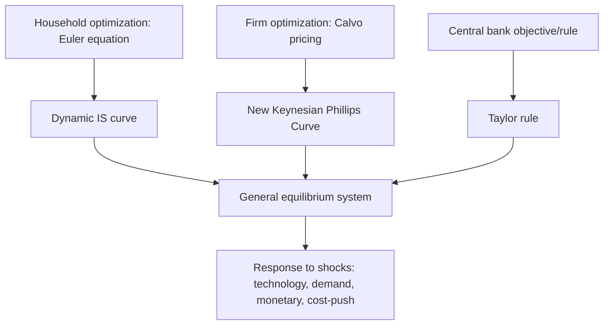

## New Keynesian DSGE Model Structure

### Core Premise

The New Keynesian DSGE (Dynamic Stochastic General Equilibrium) framework combines the rigorous microfoundations, dynamic optimization, and general equilibrium methodology inherited from Real Business Cycle theory with **nominal rigidities** (sticky prices and/or wages) and **imperfect competition**, restoring a meaningful role for monetary policy and demand shocks in driving short-run fluctuations. It is the workhorse framework used by most major central banks (Federal Reserve, ECB, Bank of England, and others) for policy analysis and forecasting.

The canonical synthesis is associated with Michael Woodford's *Interest and Prices* (2003), Jordi Galí's textbook treatment, and the empirically estimated versions developed by Frank Smets and Raf Wouters (2003, 2007) — often called the "Smets-Wouters model" — which remains a reference benchmark at institutions including the Federal Reserve and ECB.

### The Three-Equation Core (Basic New Keynesian Model)

The simplest New Keynesian model, often taught as the "three-equation model," consists of a dynamic IS curve, a New Keynesian Phillips Curve, and a monetary policy rule.

**1. Dynamic IS curve (from household Euler equation)**:

$$\tilde{y}_t = E_t[\tilde{y}_{t+1}] - \frac{1}{\sigma}(i_t - E_t[\pi_{t+1}] - r_t^n)$$

where $\tilde{y}_t$ is the output gap, $i_t$ is the nominal interest rate, $\pi_t$ is inflation, $\sigma$ is the inverse of the intertemporal elasticity of substitution, and $r_t^n$ is the natural (flexible-price) real interest rate. This is derived directly from the representative household's consumption Euler equation, log-linearized around the steady state.

**2. New Keynesian Phillips Curve (NKPC)**:

$$\pi_t = \beta E_t[\pi_{t+1}] + \kappa \tilde{y}_t$$

where $\beta$ is the household discount factor and $\kappa > 0$ depends on the degree of price stickiness and the elasticity of marginal cost with respect to output. This is derived from the firm-side Calvo pricing problem (below) and links current inflation to expected future inflation and the current output gap (a proxy for real marginal cost).

**3. Monetary policy rule (Taylor-type rule)**:

$$i_t = \rho + \phi_\pi \pi_t + \phi_y \tilde{y}_t + \nu_t$$

where $\rho$ is the steady-state real rate, $\phi_\pi$ and $\phi_y$ are policy response coefficients, and $\nu_t$ is a monetary policy shock. The **Taylor principle** ($\phi_\pi > 1$) is required for a unique, stable (determinate) rational expectations equilibrium — insufficiently aggressive inflation response can generate self-fulfilling inflation spirals or indeterminacy.

### Household Block

The representative household maximizes:

$$E_0 \sum_{t=0}^{\infty} \beta^t \left[ \frac{C_t^{1-\sigma}}{1-\sigma} - \frac{N_t^{1+\varphi}}{1+\varphi} \right]$$

subject to a budget constraint including nominal bond holdings, wage income, and (in models with monopolistic competition and profits) dividend income from firm ownership:

$$P_t C_t + Q_t B_t \leq B_{t-1} + W_t N_t + \Pi_t$$

where $\varphi$ is the inverse Frisch elasticity of labor supply, $Q_t$ is the price of a one-period nominal bond, $W_t$ is the nominal wage, and $\Pi_t$ is distributed firm profit. The household's first-order conditions yield the Euler equation (underlying the dynamic IS curve) and the labor supply condition equating the marginal rate of substitution between consumption and leisure to the real wage.

### Firm Block and Calvo Pricing

**Key Points**

- Firms operate under **monopolistic competition**, each producing a differentiated variety and setting its own price, aggregated via a Dixit-Stiglitz constant-elasticity-of-substitution aggregator.
- **Calvo (1983) pricing friction**: In each period, a firm can reset its price only with fixed probability $1 - \theta$ (equivalently, prices remain fixed with probability $\theta$ each period), independent of how long the price has been in place. This generates a tractable, staggered price-setting structure without requiring explicit tracking of individual price "ages."
- The **implied average price duration** is $\frac{1}{1-\theta}$ periods — e.g., $\theta = 0.75$ (quarterly) implies an average price duration of 4 quarters, a commonly cited calibration target consistent with micro-level price-stickiness evidence (e.g., Bils and Klenow, 2004; Nakamura and Steinsson, 2008).
- A firm resetting its price sets it equal to a weighted average of current and expected future desired (flexible-price) markups over marginal cost, since the price chosen today will remain in place for a stochastic future duration:

$$p_t^* = (1-\beta\theta) \sum_{k=0}^{\infty} (\beta\theta)^k E_t[mc_{t+k} + p_{t+k}]$$

(expressed here in log-linearized form, where $mc_t$ is real marginal cost). Aggregating this pricing decision with the Calvo price-updating structure across the continuum of firms yields the New Keynesian Phillips Curve.

- **Alternative price-stickiness formalizations**: Rotemberg (1982) quadratic price-adjustment costs are commonly used as a computationally convenient alternative to Calvo pricing, generating an isomorphic log-linearized NKPC under standard calibrations, though the two differ in their implications for the welfare costs of inflation and in nonlinear/higher-order model solutions.

### Shocks in the Standard New Keynesian Model

| Shock type | Source | Primary transmission |
| --- | --- | --- |
| Technology shock ($A_t$) | Total factor productivity | Shifts natural output/natural rate; RBC-inherited channel |
| Monetary policy shock ($\nu_t$) | Deviation from systematic policy rule | Directly moves $i_t$, transmitted to output gap via IS curve and to inflation via NKPC |
| Government spending shock | Fiscal policy | Demand-side shifter, analogous to a preference shock in simple models |
| Preference/demand shock | Discount factor or intertemporal preference shifts | Shifts the natural rate $r_t^n$, moving the IS curve |
| Cost-push shock | Markup/mark-down shocks, e.g., wage bargaining power shifts | Directly shifts the NKPC, creating a genuine inflation-output tradeoff distinct from demand shocks |
| Investment-specific technology shock | Efficiency of transforming savings into capital | Common in medium-scale models (Smets-Wouters) to help match investment dynamics |

**Key Points**

- The **cost-push shock** is theoretically important because it is the only shock type in the baseline model that creates a genuine short-run tradeoff between stabilizing inflation and stabilizing the output gap for the central bank — demand and technology shocks can, in principle, be fully offset by policy without any inflation-output tradeoff (the **"divine coincidence,"** per Blanchard and Galí, 2007).

### The Natural Rate of Output and the Output Gap

A central methodological feature of the New Keynesian framework is the **natural (flexible-price) equilibrium** — the level output and real interest rate would take absent nominal rigidities, computed by solving the same household/firm optimization problem under the counterfactual assumption of fully flexible prices. The **output gap**, $\tilde{y}_t = y_t - y_t^n$, the deviation of actual from natural output, is the key state variable driving inflation dynamics in the NKPC, replacing the "unemployment gap" of the traditional Phillips curve with a more theoretically grounded, model-consistent concept.

**[Inference]** Because the natural rate of output/interest is not directly observable and depends on unobserved structural shocks (particularly technology), real-time estimation of the output gap for policy purposes is subject to substantial measurement uncertainty — a widely acknowledged practical limitation of applying the framework in real time, distinct from the model's internal theoretical coherence.

### Medium-Scale Estimated Models: The Smets-Wouters Extension

Central banks' operational DSGE models extend the three-equation core substantially to improve empirical fit, incorporating:

- **Habit formation** in consumption (utility depends on $C_t - hC_{t-1}$), generating hump-shaped consumption responses to shocks
- **Investment adjustment costs**, slowing the response of investment to changes in the return to capital
- **Variable capital utilization**, allowing firms to intensify use of existing capital rather than only adjusting the capital stock via investment
- **Sticky wages** (Calvo-style, analogous to sticky prices) alongside sticky prices, generating a wage Phillips curve and a role for wage markup shocks
- **Indexation** of non-reoptimized prices/wages to lagged or steady-state inflation, generating inflation inertia beyond the purely forward-looking baseline NKPC
- **A richer shock structure** (typically 7+ structural shocks) estimated via Bayesian methods matching the model to a vector of macro time series (output, consumption, investment, hours, wages, inflation, interest rates)

**[Inference]** These medium-scale models are typically estimated using **Bayesian methods** (combining calibrated priors from micro evidence with likelihood-based updating from aggregate time series via the Kalman filter), rather than either pure calibration (RBC-style) or classical maximum likelihood alone, reflecting a practical compromise given the difficulty of cleanly identifying all structural parameters from aggregate data alone.

### Monetary Policy Analysis in the NK Framework

**Key Points**

- **Determinacy**: The Taylor principle ($\phi_\pi > 1$) ensures a unique stable equilibrium; passive rules ($\phi_\pi \leq 1$) can permit self-fulfilling expectation-driven fluctuations unrelated to fundamentals (sunspot equilibria).
- **Optimal policy under commitment vs. discretion**: A central bank that can credibly commit to a state-contingent policy rule (rather than re-optimizing each period under discretion) achieves better inflation-output tradeoffs, directly connecting to Kydland-Prescott time-consistency arguments — this is a primary theoretical rationale for explicit inflation-targeting frameworks and forward guidance.
- **The zero lower bound (ZLB)**: When $i_t$ cannot fall below zero (or a small negative value), conventional Taylor-rule-based analysis breaks down, motivating unconventional tools (forward guidance, quantitative easing) and substantial post-2008/post-2020 extensions of the basic framework to incorporate an occasionally-binding ZLB constraint.
- **The "divine coincidence"**: Under a purely forward-looking NKPC with no cost-push shocks, stabilizing the output gap at zero simultaneously stabilizes inflation at target — meaning strict inflation targeting and output-gap stabilization coincide, a result that breaks down once cost-push shocks or wage rigidities are introduced, restoring a genuine policy tradeoff.

### Comparison: RBC vs. New Keynesian DSGE Structure

| Feature | RBC | New Keynesian DSGE |
| --- | --- | --- |
| Price/wage setting | Fully flexible, continuous market clearing | Sticky (Calvo or Rotemberg), staggered adjustment |
| Market structure | Perfect competition | Monopolistic competition (firms, often also unions for wages) |
| Role of money/monetary policy | Largely neutral; no independent stabilization role | Central: non-neutral in short run, key stabilization tool |
| Primary driving shock | Technology (TFP) | Multiple: technology, monetary, demand, cost-push, wage markup |
| Policy implication | Limited role for stabilization policy | Active, rules-based stabilization policy can improve welfare |
| Output gap concept | Not meaningful (actual = natural by construction) | Central state variable driving inflation dynamics |

### Example: Deriving the Output Response to a Monetary Policy Shock

Using the two-equation reduced system (IS curve and NKPC) with a Taylor rule, a contractionary monetary policy shock $\nu_t > 0$ raises $i_t$ directly. Holding expectations fixed for illustration ($E_t[\tilde y_{t+1}] = E_t[\pi_{t+1}] = 0$, a simplifying static case):

From the IS curve:

$$\tilde{y}_t = -\frac{1}{\sigma}(i_t - r_t^n) = -\frac{1}{\sigma}\nu_t$$

Substituting into the NKPC:

$$\pi_t = \kappa \tilde{y}_t = -\frac{\kappa}{\sigma}\nu_t$$

A monetary tightening shock of $\nu_t = 1$ percentage point, with $\sigma = 1$ and $\kappa = 0.3$, generates:

$$\tilde{y}_t = -1.0 \text{ percentage point (output gap falls 1 pp)}$$

$$\pi_t = -0.3 \text{ percentage point (inflation falls 0.3 pp)}$$

This illustrates the core NK transmission mechanism: monetary tightening reduces the output gap directly through the real interest rate channel, and lower output feeds through to lower inflation via the Phillips curve — the qualitative mechanism (with substantially richer dynamics from expectations and persistence) underlying quantitative monetary policy analysis in estimated models.

### Related Topics

- Real Business Cycle theory foundations (methodological precursor)
- Calvo (1983) staggered price-setting and the New Keynesian Phillips Curve derivation
- Taylor rule and the Taylor principle for equilibrium determinacy
- Financial accelerator and credit cycles (extension incorporating financial frictions into DSGE)
- Zero lower bound analysis and unconventional monetary policy (QE, forward guidance)
- Bayesian estimation of DSGE models and the Kalman filter
- Smets-Wouters (2007) medium-scale estimated model
- Time consistency, rules vs. discretion, and the Kydland-Prescott critique
- The "divine coincidence" and cost-push shocks (Blanchard-Galí, 2007)
- Sticky wage models and the wage Phillips curve