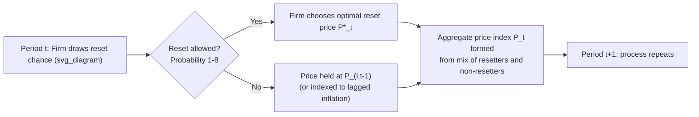

## Nominal Rigidities in DSGE Frameworks

### Overview

Nominal rigidities are frictions that prevent prices and/or wages from adjusting instantaneously to changes in economic conditions. In Dynamic Stochastic General Equilibrium (DSGE) models, these rigidities are the mechanism that converts an otherwise classical, monetary-neutral economy into one where monetary policy has real, short-run effects. Without nominal rigidities, a DSGE model collapses toward a Real Business Cycle (RBC) framework in which money is neutral even in the short run. New Keynesian DSGE models are distinguished precisely by embedding these frictions into an otherwise standard dynamic general equilibrium structure with rational expectations, intertemporal optimization, and stochastic shocks.

### Why Nominal Rigidities Matter

**Key Points**

- They break monetary neutrality, giving central banks real leverage over output and employment in the short run
- They generate the New Keynesian Phillips Curve (NKPC), linking inflation to real marginal cost or the output gap
- They create a rationale for stabilization policy: absent frictions, the flexible-price allocation is efficient (subject to other distortions), but with rigidities, demand shocks cause inefficient output/employment fluctuations
- They are essential for matching empirical persistence in inflation and output following monetary policy shocks, which flexible-price models cannot replicate

### Two Broad Categories

#### 1. Price Rigidities

Firms cannot freely re-optimize the prices they charge every period.

#### 2. Wage Rigidities

Households (or unions) supplying differentiated labor cannot freely re-optimize wages every period.

Most modern DSGE models (e.g., Christiano-Eichenbaum-Evans 2005; Smets-Wouters 2007) include both simultaneously, since matching both inflation and wage/labor market dynamics requires frictions on both margins.

### Modeling Approaches to Price Rigidity

#### Calvo Pricing (Calvo, 1983)

The dominant approach in the literature due to its analytical tractability. In each period, a firm faces a fixed probability $1-\theta$ of being allowed to reset its price, independent of how long it has held its current price. The probability $\theta$ of *not* resetting is often called the Calvo parameter.

- Expected duration between price resets: $\dfrac{1}{1-\theta}$
- Firms that cannot reset simply keep their previous price unchanged (in the baseline version), or partially index it to lagged/steady-state inflation (in indexed variants)
- Because reset probability is independent of price age, aggregation is tractable and yields a simple linear log-linearized relationship between inflation and marginal cost

**Optimal Reset Price**

A reoptimizing firm chooses a reset price $P_t^*$ to maximize the expected discounted sum of future profits, weighted by the probability that the price is still in effect $s$ periods ahead:

$$P_t^* = \frac{\varepsilon}{\varepsilon - 1} \cdot \frac{\mathbb{E}_t \sum_{s=0}^{\infty} \theta^s Q_{t,t+s} Y_{t+s} MC_{t+s} P_{t+s}^{\varepsilon}}{\mathbb{E}_t \sum_{s=0}^{\infty} \theta^s Q_{t,t+s} Y_{t+s} P_{t+s}^{\varepsilon - 1}}$$

where $\varepsilon$ is the elasticity of substitution across differentiated goods, $Q_{t,t+s}$ is the stochastic discount factor, $MC_{t+s}$ is nominal marginal cost, and $\dfrac{\varepsilon}{\varepsilon-1}$ is the frictionless markup.

#### Log-Linearized New Keynesian Phillips Curve

Under Calvo pricing, log-linearizing around the zero-inflation steady state yields the canonical forward-looking NKPC:

$$\hat{\pi}_t = \beta \, \mathbb{E}_t[\hat{\pi}_{t+1}] + \kappa \, \widehat{mc}_t$$

where $\hat{\pi}_t$ is inflation deviation from steady state, $\beta$ is the household discount factor, $\widehat{mc}_t$ is the real marginal cost gap, and:

$$\kappa = \frac{(1-\theta)(1-\beta\theta)}{\theta}$$

**Key Points**

- $\kappa$ is decreasing in $\theta$: stickier prices (higher $\theta$) flatten the Phillips Curve
- Real marginal cost is often re-expressed in terms of the output gap using the labor market/production function, giving the more familiar $\hat{\pi}_t = \beta \mathbb{E}_t[\hat{\pi}_{t+1}] + \kappa \lambda \, \hat{y}_t^{gap}$ form
- This is a purely forward-looking equation; empirical inflation persistence often requires additional mechanisms (indexation, backward-looking rule-of-thumb pricers) to match the data [Inference: the degree of persistence needed is model- and dataset-dependent]

#### Rotemberg Pricing (Rotemberg, 1982)

An alternative in which all firms reset prices every period, but face a convex quadratic cost of price adjustment, typically specified as:

$$\text{Adjustment Cost}_t = \frac{\phi}{2}\left(\frac{P_t(i)}{P_{t-1}(i)} - 1\right)^2 Y_t$$

- Yields a first-order condition that, after log-linearization, produces an NKPC **identical in form** to the Calvo version under a specific mapping between $\phi$ and $\theta$: $\phi = \dfrac{(\varepsilon-1)\theta}{(1-\theta)(1-\beta\theta)}$
- Preferred in some quantitative/computational settings (e.g., models solved with global/nonlinear methods) because it avoids tracking the cross-sectional price distribution required under Calvo, since all firms are symmetric each period
- Does not generate price dispersion as a resource cost in the same way Calvo does, which changes welfare calculations at the second order [Inference: the practical difference is mainly relevant for higher-order/nonlinear solution methods and welfare analysis, not first-order dynamics]

#### Taylor Contracts (Taylor, 1980)

An older, deterministic-duration alternative in which firms are pre-committed to fixed-length overlapping contracts (e.g., staggered $N$-period wage or price contracts) rather than facing a random reset probability. Less common in modern quantitative DSGE work than Calvo due to weaker tractability with heterogeneous contract lengths, but historically important as the original staggered-contracting framework.

#### Menu Cost Models (Mankiw, 1985; Golosov-Lucas, 2007)

Microfound rigidity via a fixed cost of changing prices, generating (S,s)-type state-dependent pricing rather than the time-dependent pricing of Calvo/Taylor.

- Firms adjust only when the gap between actual and desired price exceeds a threshold
- More realistic microfoundation, consistent with micro price-change data showing lumpy, state-dependent adjustment
- Substantially harder to aggregate and solve in general equilibrium; breaks the convenient linear aggregation of time-dependent models
- Golosov-Lucas showed that state-dependent pricing can generate much less monetary non-neutrality than time-dependent models calibrated to match the same frequency of price change, since firms selectively adjust when it matters most [Unverified: exact magnitude of the neutrality result is sensitive to calibration and idiosyncratic shock specification]

### Wage Rigidity: The Erceg-Henderson-Levin (EHL, 2000) Framework

Wage stickiness is modeled by treating households as monopolistic suppliers of differentiated labor varieties, mirroring the Calvo/Dixit-Stiglitz structure used for goods prices.

- A continuum of households each supply a differentiated labor type, aggregated by unions/labor packers via a CES aggregator with elasticity $\varepsilon_w$
- Each household resets its nominal wage with probability $1-\theta_w$ each period (Calvo wage-setting)
- Produces a **wage Phillips Curve** structurally analogous to the price NKPC:

$$\hat{\pi}_t^w = \beta \, \mathbb{E}_t[\hat{\pi}_{t+1}^w] + \kappa_w \left(\widehat{mrs}_t - \hat{w}_t\right)$$

where $\hat{\pi}_t^w$ is wage inflation, $\widehat{mrs}_t$ is the marginal rate of substitution between consumption and leisure (the household's "desired" real wage), and $\hat{w}_t$ is the actual real wage.

**Key Points**

- Wage rigidity is essential empirically: models with only price stickiness tend to generate excessive real wage volatility and cannot match the sluggish, hump-shaped response of wages to shocks
- Combined price and wage stickiness is standard in medium-scale estimated models (Smets-Wouters 2007, CEE 2005) and materially improves fit to VAR-based impulse responses [Inference: fit improvement magnitude is estimation-sample-dependent]

### Indexation and Hybrid Phillips Curves

Purely forward-looking Calvo pricing implies inflation jumps immediately in response to news, which conflicts with observed inflation persistence. Two common fixes:

1. **Partial indexation**: non-reoptimizing firms mechanically update prices by a fraction $\gamma$ of lagged inflation, $P_t(i) = P_{t-1}(i) \times \pi_{t-1}^{\gamma}$
2. **Rule-of-thumb price setters** (Galí-Gertler, 1999): a fraction of firms set prices using a simple backward-looking rule rather than fully rational expectations

Both generate a **hybrid NKPC**:

$$\hat{\pi}_t = \gamma_f \, \mathbb{E}_t[\hat{\pi}_{t+1}] + \gamma_b \, \hat{\pi}_{t-1} + \kappa \, \widehat{mc}_t$$

with $\gamma_f + \gamma_b$ often (though not always) constrained to sum to one depending on the derivation.

### Illustrative Diagram: Calvo Price-Setting Timeline

### Log-Linearized System: Putting It Together

A minimal three-equation New Keynesian DSGE core combining price rigidity with the rest of the model:

$$\hat{y}_t = \mathbb{E}_t[\hat{y}_{t+1}] - \frac{1}{\sigma}\left(\hat{i}_t - \mathbb{E}_t[\hat{\pi}_{t+1}] - \hat{r}_t^n\right) \quad \text{(Dynamic IS Curve)}$$

$$\hat{\pi}_t = \beta \, \mathbb{E}_t[\hat{\pi}_{t+1}] + \kappa \, \hat{y}_t^{gap} \quad \text{(New Keynesian Phillips Curve)}$$

$$\hat{i}_t = \phi_\pi \hat{\pi}_t + \phi_y \hat{y}_t^{gap} \quad \text{(Taylor Rule)}$$

Here $\hat{r}_t^n$ is the natural real rate, $\sigma$ is the inverse intertemporal elasticity of substitution, and $\phi_\pi, \phi_y$ are policy response coefficients. Nominal rigidity (via $\kappa$) is what makes the NKPC a non-trivial constraint linking real activity to inflation — this is the core transmission channel through which the Taylor Rule affects the real economy.

### Calibration Conventions in the Literature

**Example**

| Parameter | Typical Value | Interpretation |
| --- | --- | --- |
| $\theta$ (Calvo price stickiness) | 0.66 – 0.85 | Avg. price duration ≈ 3–7 quarters |
| $\theta_w$ (Calvo wage stickiness) | 0.6 – 0.75 | Avg. wage duration ≈ 2.5–4 quarters |
| $\varepsilon$ (goods elasticity of substitution) | 6 – 11 | Steady-state markup 10–20% |
| $\gamma$ (price indexation) | 0 – 1 | Full indexation nests Christiano-Eichenbaum-Evans (2005) |

These values are commonly estimated via Bayesian methods (e.g., Smets-Wouters 2007) rather than fixed by calibration alone in modern quantitative work. [Inference: exact posterior means vary by dataset, sample period, and prior specification across studies]

### Empirical and Policy Implications

**Key Points**

- **Monetary non-neutrality**: nominal rigidities are the reason an unanticipated interest rate cut raises output and employment before eventually raising prices — the hallmark impulse response of estimated New Keynesian models
- **Divine coincidence**: in the simplest NK model with only price stickiness, stabilizing inflation is equivalent to stabilizing the output gap; this breaks down once wage stickiness, markup shocks, or other frictions are added, creating genuine policy trade-offs
- **Sacrifice ratio**: the slope $\kappa$ of the Phillips Curve determines how costly disinflation is in terms of lost output — flatter Phillips Curves (higher $\theta$) imply higher sacrifice ratios
- **Zero Lower Bound analysis**: nominal rigidities combined with a binding ZLB on nominal rates are central to modern liquidity trap and forward-guidance literature, since sticky prices prevent real rates from falling enough to clear markets when nominal rates cannot fall further

### Common Extensions

- **Firm-specific vs. economy-wide factor markets**: whether firms with sticky prices face common or firm-specific labor/capital costs affects the slope of the NKPC ("strategic complementarity" in price setting)
- **Sticky information** (Mankiw-Reis, 2002): an alternative to sticky prices where firms update information/plans infrequently rather than prices directly, generating different persistence properties
- **Multi-sector/multi-country DSGE**: sectoral heterogeneity in price stickiness (e.g., services vs. durables) is used to explain differential responses to common shocks
- **Zero Lower Bound-augmented NK models**: occasionally binding constraints combined with sticky prices for unconventional monetary policy analysis

**Related Topics**

- New Keynesian Phillips Curve derivation and micro-foundations
- Smets-Wouters (2007) medium-scale estimated DSGE model
- Taylor Rule design and determinacy conditions
- Zero Lower Bound and forward guidance in sticky-price models
- Bayesian estimation of DSGE models (priors, Kalman filter, MCMC)
- Search and matching frictions in labor markets (Diamond-Mortensen-Pissarides) as a complement to wage rigidity
- Menu cost models and state-dependent pricing (Golosov-Lucas)
- Divine coincidence and the trade-offs it implies for optimal monetary policy