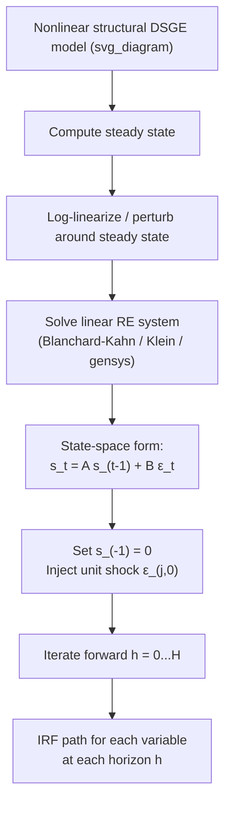

## Impulse Response Function Analysis

### Overview

An impulse response function (IRF) traces the dynamic path of endogenous variables in response to a one-time, one-unit (or one-standard-deviation) shock to a structural disturbance, holding all other shocks at zero. In DSGE models, IRFs are the primary tool for interpreting model dynamics: since the model is solved as a linear (or linearized) state-space system, the entire qualitative story of "how a technology shock propagates through the economy" is read directly off these functions. IRFs bridge the gap between the abstract mathematical solution of a DSGE model and economically interpretable narratives about propagation, persistence, and amplification.

### Mathematical Definition

For a linearized DSGE model written in state-space form:

$$s_t = A s_{t-1} + B \varepsilon_t$$

$$y_t = C s_t + D \varepsilon_t$$

where $s_t$ is the vector of state variables, $y_t$ is the vector of observable/control variables, and $\varepsilon_t \sim (0, \Sigma)$ is the vector of structural shocks, the impulse response of $y_t$ to a shock $\varepsilon_{j,0}$ of size $\delta$ in shock $j$ at time 0 is:

$$\text{IRF}_h = \frac{\partial y_{t+h}}{\partial \varepsilon_{j,t}} = C A^h B e_j \delta, \quad h = 0, 1, 2, \dots$$

where $e_j$ is a selection vector isolating shock $j$ and $h$ is the **horizon** (periods since impact).

**Key Points**

- $h=0$ gives the **impact response** — how much $y$ moves in the period the shock hits
- The sequence $\{\text{IRF}_h\}_{h=0}^{H}$ for some horizon $H$ (commonly 20–40 quarters) is the full impulse response
- Because the system is linear, IRFs scale proportionally with shock size and are independent of the history of past shocks — this **linearity property** is a direct consequence of first-order (linear) approximation and does not hold in models solved with higher-order or nonlinear methods

### Why IRFs Matter in DSGE Analysis

- **Model diagnosis**: comparing model-implied IRFs to empirical VAR-based IRFs is a standard model validation exercise (see below)
- **Transmission mechanism**: IRFs make visible *how* a shock propagates — e.g., a monetary policy shock raising the nominal rate lowers output with a delay, and lowers inflation with an even longer delay, tracing out the "long and variable lags" of monetary transmission
- **Policy counterfactuals**: central banks and policy institutions use IRFs to communicate expected effects of policy actions
- **Parameter identification**: matching IRF shapes (hump-shaped output, persistent inflation) disciplines structural parameter choices during calibration/estimation

### Step-by-Step Construction Process

**Example**

1. **Specify the model** in its non-linear structural form (Euler equations, budget constraints, market clearing)
2. **Solve for the steady state**, either analytically or numerically
3. **Log-linearize** (or use a perturbation method) around the steady state to obtain a linear rational expectations system
4. **Solve the linear system** using a method such as Blanchard-Kahn, Klein's QZ decomposition, or Sims' `gensys`, yielding reduced-form policy functions $s_t = A s_{t-1} + B\varepsilon_t$
5. **Set initial state to steady state** ($s_{-1} = 0$ in deviation form)
6. **Feed in a unit (or one-standard-deviation) shock** to a single structural innovation $\varepsilon_{j,0}$, with all other shocks and lagged states at zero
7. **Iterate the state equation forward** for $h = 0, \dots, H$ periods, recording each variable's deviation from steady state at every horizon
8. **Plot or tabulate** the resulting paths, typically as deviation from steady state (in percent for log-linearized variables, or in level/percentage-point terms for rates)

### Illustrative Diagram: IRF Construction Pipeline

### Typical Shapes and Economic Interpretation

**Key Points**

- **Technology (TFP) shock** in an RBC/NK model: output, consumption, and investment rise persistently; in sticky-price NK models with a "cost-push" interpretation, hours worked can *fall* on impact — a well-known empirical puzzle used to discriminate between RBC and NK models [Inference: the sign and magnitude of the hours response is highly sensitive to model specification, including the monetary policy rule and degree of price stickiness]
- **Monetary policy tightening shock** (unexpected rate hike): output falls with a delay (hump-shaped, peaking around 4–8 quarters), inflation falls with an even longer delay, and the nominal/real rate rises on impact before mean-reverting
- **Government spending shock**: output rises (fiscal multiplier), but consumption's response (rise vs. fall) is a key point of contention between RBC-style crowding-out models and NK models with rule-of-thumb consumers
- **Persistence and hump shapes** in output/investment responses to monetary shocks typically require real frictions (habit formation, investment adjustment costs) layered on top of nominal rigidities — a pure sticky-price model without these frictions tends to generate responses that peak too quickly relative to VAR evidence [Inference: based on the standard finding in the estimated medium-scale DSGE literature, e.g. Christiano-Eichenbaum-Evans 2005]

### Confidence Bands and Uncertainty

Since DSGE parameters are estimated (via Maximum Likelihood or Bayesian methods) rather than known with certainty, IRFs inherit parameter uncertainty.

- **Bayesian approach**: draw parameter vectors from the posterior distribution (via the MCMC chain used in estimation), compute an IRF for each draw, and report percentile bands (e.g., 5th–95th) across draws
- **Classical/bootstrap approach**: use the asymptotic covariance matrix of ML estimates, or bootstrap the estimation sample, to generate a distribution of IRFs
- Wide bands at short horizons often indicate weak identification of the underlying shock or parameter; this is a standard diagnostic red flag in applied DSGE work

### Comparing DSGE IRFs to VAR-Based IRFs

A central empirical discipline in DSGE model-building is checking whether model-implied IRFs match those estimated from a **Structural VAR (SVAR)** on actual macro data.

**Key Points**

- Identify a comparable shock in an SVAR (e.g., via Cholesky ordering, sign restrictions, or narrative identification for monetary shocks) using observed time series (GDP, inflation, interest rates)
- Compute the SVAR's empirical IRF to that shock
- Overlay the DSGE-implied IRF (same shock, same variables) against the empirical SVAR bands
- **Qualitative match** (correct sign, correct hump-shape, roughly correct persistence) is treated as validating the model's transmission mechanism; **quantitative mismatch** (wrong magnitude, wrong timing) motivates respecification (adding frictions such as habit formation, adjustment costs, or indexation)
- This comparison exercise is central to the influential Christiano-Eichenbaum-Evans (2005) and Smets-Wouters (2007) methodology of building "estimated DSGE models that fit the VAR evidence"

### Common Software Implementations

**Example**

| Tool | Typical Workflow for IRFs |
| --- | --- |
| Dynare (MATLAB/Octave/Julia) | `stoch_simul(irf=40)` after model block; auto-generates IRF plots for all shocks/variables |
| IRIS Toolbox (MATLAB) | `srf` (simulate reduced-form) function on solved model object |
| `gEcon` / R `gEcon` package | Symbolic model → solve → `compute_irf()` |
| Python (e.g., `dolo`, custom state-space code) | Solve via perturbation, then manually iterate $s_t = As_{t-1}+B\varepsilon_t$ |

[Unverified: exact function names and default arguments may differ across software versions; consult current package documentation before use]

### Nonlinear and Higher-Order IRFs

Under second-order or higher perturbation solutions (common when the ZLB, precautionary savings, or risk premia are of interest), IRFs lose the clean linearity/additivity property:

- **Generalized Impulse Response Functions (GIRFs)**, following Koop, Pesaran, and Potter (1996), are computed by simulating the model forward with and without the shock from many different starting states (not just steady state), then averaging the difference — this is necessary because responses can depend on the state of the economy and the sign/size of the shock
- GIRFs are computationally more expensive (requiring Monte Carlo simulation over many initial states) but necessary for models with occasionally binding constraints (e.g., ZLB) or precautionary behavior, where a shock's effect during a recession can differ meaningfully from its effect during an expansion [Inference: the magnitude of state-dependence is model-specific and is itself an active area of research]

### Practical Pitfalls

**Key Points**

- **Unit confusion**: verify whether the model reports responses in percent deviation from steady state, percentage points (for rates), or absolute levels — mixing these across variables in a single plot is a common presentation error
- **Shock size convention**: one-standard-deviation shocks (using the estimated $\sigma_\varepsilon$) vs. unit shocks yield very different magnitudes; always check which convention a paper or software output uses
- **Sign convention**: verify whether a "monetary policy shock" is defined as a rate increase or a rate decrease in the model's shock equation — this varies across papers and can flip apparent results
- **Horizon truncation**: reporting too short a horizon can visually hide non-stationary or slow-decaying dynamics, especially near the boundary of determinacy

**Related Topics**

- Log-linearization and perturbation methods for solving DSGE models
- Blanchard-Kahn conditions and rational expectations model solution
- Structural VAR identification (Cholesky, sign restrictions, narrative approaches)
- Bayesian estimation of DSGE models and posterior IRF bands
- Generalized Impulse Response Functions and nonlinear solution methods
- Christiano-Eichenbaum-Evans (2005) and Smets-Wouters (2007) estimated DSGE models
- Forecast error variance decomposition
- Zero Lower Bound and occasionally binding constraints in DSGE models