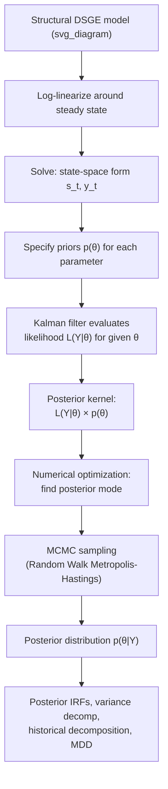

## Bayesian Estimation of DSGE Models

### Overview

Bayesian estimation is the dominant methodology for taking DSGE models to the data in modern macroeconomics. Rather than calibrating parameters from micro-evidence or matching a small set of steady-state ratios, Bayesian estimation combines prior beliefs about structural parameters with the likelihood implied by the observed data, producing a posterior distribution over the entire parameter vector. This approach underlies influential models such as Smets-Wouters (2007) and is standard practice at central banks (Federal Reserve, ECB, Bank of England) for policy-relevant DSGE models.

### Why Bayesian Rather Than Classical (MLE) Estimation

**Key Points**

- **Weak/partial identification**: DSGE likelihoods are often flat or ridge-shaped in some parameter directions, making pure maximum likelihood estimation numerically unstable; priors regularize the estimation and pin down otherwise poorly identified parameters
- **Incorporating pre-sample information**: micro-level evidence (e.g., labor supply elasticities from labor economics, price-change frequency from micro price data) can be formally incorporated as priors rather than discarded
- **Model comparison**: Bayesian methods provide a natural metric (the marginal data density / Bayes factor) for comparing non-nested DSGE model variants, which classical hypothesis testing handles awkwardly
- **Full-system estimation**: unlike GMM-based single-equation methods, Bayesian estimation fits the entire model to multiple observed time series jointly, exploiting all cross-equation restrictions implied by the theory

### The Bayesian Estimation Problem

Bayes' rule applied to the DSGE parameter vector $\theta$ given data $Y^T = \{y_1, \dots, y_T\}$:

$$p(\theta \mid Y^T) = \frac{\mathcal{L}(Y^T \mid \theta) \, p(\theta)}{\int \mathcal{L}(Y^T \mid \theta) \, p(\theta) \, d\theta} \propto \mathcal{L}(Y^T \mid \theta) \, p(\theta)$$

where:

- $p(\theta)$ is the **prior density**, encoding beliefs about parameters before seeing the data
- $\mathcal{L}(Y^T \mid \theta)$ is the **likelihood**, the probability of observing the data given a parameter vector
- $p(\theta \mid Y^T)$ is the **posterior density**, the updated belief after observing the data
- The denominator, $\int \mathcal{L}(Y^T \mid \theta)p(\theta)\,d\theta$, is the **marginal data density (MDD)**, used for model comparison

### The Estimation Pipeline

**Example**

1. **Specify the structural model** and log-linearize (or use higher-order perturbation) around the steady state
2. **Solve the linear rational expectations system**, obtaining the state-space form: $s_t = A(\theta)s_{t-1} + B(\theta)\varepsilon_t$, $y_t = C(\theta)s_t + D(\theta)\varepsilon_t$
3. **Choose observable variables** ($y_t$) — typically real GDP growth, consumption growth, investment growth, hours worked, real wage growth, inflation, and the nominal interest rate (the "seven observables" of Smets-Wouters)
4. **Map model variables to data** via a measurement equation, correcting for demeaning, detrending (HP filter or one-sided growth rates), and units
5. **Evaluate the likelihood** using the **Kalman filter**, which recursively computes the one-step-ahead prediction error and its variance at each date, given a candidate $\theta$
6. **Specify priors** for each parameter, chosen based on economic plausibility, micro-evidence, or convention from prior literature
7. **Find the posterior mode** via numerical optimization (e.g., quasi-Newton) as a starting point/diagnostic
8. **Sample from the posterior** using a Markov Chain Monte Carlo (MCMC) algorithm — typically the **Random Walk Metropolis-Hastings (RWMH)** algorithm
9. **Check convergence diagnostics** (multiple chains, Brooks-Gelman-Rubin statistics, trace plots)
10. **Report posterior summaries**: means, medians, and credible intervals for each parameter, plus derived quantities (IRFs, variance decompositions, historical decompositions)

### Illustrative Diagram: Bayesian Estimation Pipeline

### The Kalman Filter in Likelihood Evaluation

Given the linear Gaussian state-space representation, the Kalman filter computes the likelihood recursively without needing to invert large matrices directly:

$$\mathcal{L}(Y^T \mid \theta) = \prod_{t=1}^{T} p(y_t \mid Y^{t-1}, \theta)$$

Each factor $p(y_t \mid Y^{t-1}, \theta)$ is Gaussian, with mean and variance produced by the filter's **prediction** and **update** steps:

- **Prediction**: $\hat{s}_{t|t-1} = A\hat{s}_{t-1|t-1}$, $\; P_{t|t-1} = AP_{t-1|t-1}A' + BB'$
- **Update**: incorporate the new observation $y_t$ to form $\hat{s}_{t|t}$ and $P_{t|t}$, using the Kalman gain

This is computationally efficient (linear in $T$) and is why linear/log-linearized DSGE models are tractable to estimate even with many observables and states. [Inference: for models solved with nonlinear/particle-filter methods, likelihood evaluation is substantially more expensive — see Nonlinear Extensions below]

### Prior Specification

**Key Points**

- Priors are typically specified as independent across parameters (though joint priors are possible), each with a distribution matched to the parameter's support:
  - **Beta distribution**: parameters bounded in $(0,1)$, e.g., Calvo probabilities $\theta$, habit persistence, capital share
  - **Gamma or Inverse Gamma distribution**: positive parameters, e.g., shock standard deviations, Frisch elasticity, adjustment cost parameters
  - **Normal distribution**: parameters that can be positive or negative or centered away from a boundary, e.g., Taylor rule inflation/output coefficients (truncated to respect determinacy where needed)
- **Prior tightness** (variance) reflects confidence: tight priors around micro-estimated values (e.g., capital depreciation rate) are standard, while looser priors are used for parameters with less consensus (e.g., price stickiness)
- **Prior predictive checks**: simulating the model at prior draws and checking whether implied moments (variances, autocorrelations) are economically sensible is recommended practice before proceeding to estimation [Inference: this step is a methodological best practice rather than a universal requirement in published work]

### Markov Chain Monte Carlo: Random Walk Metropolis-Hastings

The standard algorithm for sampling from the DSGE posterior:

1. Start at an initial point $\theta^{(0)}$ (often the posterior mode found via optimization)
2. At each iteration $i$, propose $\theta^{*} = \theta^{(i-1)} + \eta$, where $\eta \sim N(0, c^2 \Sigma_m)$, with $\Sigma_m$ typically the inverse Hessian at the posterior mode (scaling the proposal to the local curvature of the posterior)
3. Compute the acceptance ratio:

   $$\alpha = \min\left(1, \frac{\mathcal{L}(Y^T\mid\theta^*)p(\theta^*)}{\mathcal{L}(Y^T\mid\theta^{(i-1)})p(\theta^{(i-1)})}\right)$$
4. Accept $\theta^{(i)} = \theta^*$ with probability $\alpha$; otherwise set $\theta^{(i)} = \theta^{(i-1)}$
5. Repeat for many iterations (often 100,000–1,000,000+ draws across multiple chains), discard an initial **burn-in** period, and thin if needed

**Key Points**

- The **scale parameter** $c$ is tuned so the acceptance rate falls in a target range, conventionally around 20–40% [Inference: exact optimal target range depends on the dimensionality and shape of the posterior; the commonly cited rule-of-thumb figures come from Metropolis-Hastings tuning literature]
- Multiple parallel chains from dispersed starting points are used to check convergence via between-chain and within-chain variance comparisons
- Poor mixing (high autocorrelation in the chain, low effective sample size) is a common practical problem requiring reparameterization, longer chains, or alternative samplers

### Model Comparison via Marginal Data Density

The MDD, $\int \mathcal{L}(Y^T\mid\theta)p(\theta)\,d\theta$, integrates out parameter uncertainty and provides the basis for Bayesian model comparison:

$$\text{Bayes Factor}_{12} = \frac{p(Y^T \mid M_1)}{p(Y^T \mid M_2)}$$

comparing two competing model specifications $M_1$ and $M_2$ (e.g., with vs. without financial frictions).

- Computed via methods such as the **Geweke (1999) modified harmonic mean estimator** or **Chib-Jeliazkov (2001) method**, since the integral has no closed form
- Naturally penalizes model complexity (an implicit Occam's razor), since more flexible models spread posterior mass more thinly, generally lowering the MDD unless the added flexibility earns a sufficiently better fit
- Preferred over simple in-sample fit comparisons (e.g., R²-type measures) precisely because it accounts for this complexity penalty

### Standard Observables and Measurement Equations (Smets-Wouters Convention)

**Example**

| Observable | Model Counterpart |
| --- | --- |
| Real GDP growth | $\Delta \hat{y}_t$ (output growth, demeaned) |
| Real consumption growth | $\Delta \hat{c}_t$ |
| Real investment growth | $\Delta \hat{i}_t$ |
| Real wage growth | $\Delta \hat{w}_t$ |
| Hours worked | $\hat{l}_t$ (demeaned, since hours are stationary in levels) |
| GDP deflator inflation | $\hat{\pi}_t$ |
| Nominal short-term interest rate | $\hat{r}_t$ |

Each observable is linked to model variables via a measurement equation that adds the model's steady-state growth rate (for trending variables) to the stationary log-linearized deviation.

### Nonlinear Extensions: Particle Filters

When the model is solved with second-order or higher perturbation (necessary for models with occasionally binding constraints like the ZLB, or when risk/uncertainty shocks are of direct interest), the Kalman filter's Gaussian-linear assumptions no longer hold, and likelihood evaluation requires simulation-based methods:

- **Particle filters** (Sequential Monte Carlo) approximate the filtering distribution using a large number of simulated "particles," which are propagated forward and reweighted according to their fit to observed data
- Substantially more computationally expensive than the Kalman filter — often orders of magnitude slower — since likelihood evaluation at each candidate $\theta$ requires simulating many particles for the full sample [Unverified: exact computational overhead is highly implementation- and hardware-dependent]
- Combined with MCMC, this gives rise to **Particle MCMC (PMCMC)** methods, an active area of computational macroeconomics research

### Common Software Implementations

| Tool | Role |
| --- | --- |
| Dynare (MATLAB/Octave/Julia) | `estimation` command handles Kalman filtering, mode-finding, and RWMH sampling end-to-end |
| gEcon (R) | Symbolic model definition with Bayesian estimation add-ons |
| Python (`dsge`, custom PyMC/Stan implementations) | Increasingly used for custom estimation workflows, especially combining DSGE state-space solutions with modern probabilistic programming samplers (NUTS/HMC) |

[Unverified: specific command syntax and default settings change across software versions; consult current documentation]

### Common Pitfalls

**Key Points**

- **Stochastic singularity**: the model must have at least as many structural shocks as observables, or the likelihood is degenerate (a standard technical requirement in DSGE estimation)
- **Prior-data conflict**: if the likelihood strongly disagrees with a tight prior, the posterior can end up in an economically implausible region or exhibit bimodality — always check posterior vs. prior overlays
- **Local vs. global optimization**: posterior mode-finding can converge to a local optimum; multiple starting values are recommended
- **Filtering out the trend incorrectly**: mis-specifying detrending (e.g., using HP-filtered data inconsistently with the model's stationarity assumptions) biases estimated parameters and IRFs

**Related Topics**

- Kalman filtering and state-space representations
- Markov Chain Monte Carlo methods (Metropolis-Hastings, Gibbs sampling)
- Marginal data density computation and Bayesian model comparison
- Impulse response function analysis (posterior-based IRF bands)
- Particle filters and nonlinear/non-Gaussian state-space estimation
- Smets-Wouters (2007) medium-scale estimated DSGE model
- Determinacy and the Blanchard-Kahn conditions
- Prior elicitation and prior predictive checks