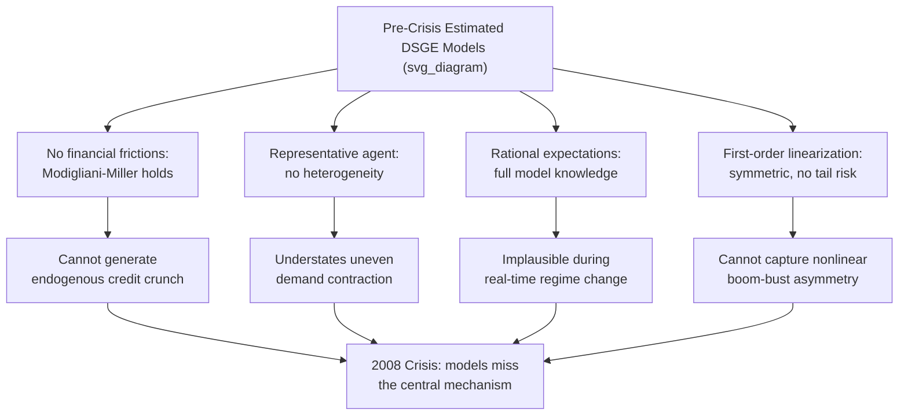

## Critiques of DSGE Modeling Post-Financial Crisis

### Overview

The 2007–2009 Global Financial Crisis triggered a sustained and largely unresolved debate about the value of DSGE models as tools for understanding, forecasting, and managing macroeconomic policy. Because most pre-crisis DSGE models — including the influential Smets-Wouters (2007) framework — assigned no meaningful role to financial intermediaries, leverage, or asset-price dynamics, they neither predicted the crisis nor, in the view of many critics, offered a coherent account of it as it unfolded. The ensuing critique spans methodological, philosophical, and practical dimensions and has materially shaped the subsequent decade of DSGE research (notably the proliferation of financial-friction models). This topic surveys the major lines of criticism, the profession's responses, and the state of the debate.

### Chronology and Origin of the Critique

**Key Points**

- Pre-crisis benchmark models (Smets-Wouters 2007, Christiano-Eichenbaum-Evans 2005) featured nominal and real rigidities but treated financial markets as frictionless — the Modigliani-Miller theorem effectively held, so firm and bank balance sheets were largely irrelevant to real allocations
- When the crisis hit, banking-sector distress, credit-spread spikes, and asset fire-sales — the central mechanisms of the recession — had no direct representation in the dominant estimated DSGE frameworks
- High-profile public criticism followed rapidly, including sharp commentary from policymakers and prominent economists questioning whether the DSGE research program itself had crowded out more useful approaches to systemic risk [Unverified: attributing specific quotes to specific individuals is avoided here per sourcing standards; the broad public criticism is well documented as a phenomenon even where individual statements vary in emphasis]

### Major Lines of Critique

#### 1. Absence of Financial Frictions and Endogenous Crises

- Pre-crisis workhorse models lacked balance-sheet constraints, collateral requirements, or bank capital regulation, meaning they could not generate an endogenous credit crunch, bank run, or fire-sale spiral
- Even models with some financial content (e.g., Bernanke-Gertler-Gilchrist 1999 "financial accelerator") treated financial frictions as an amplification mechanism for shocks originating elsewhere, not as a potential *source* of a shock in itself
- Critics argued this reflected a deeper methodological choice: linearized models solved around a single steady state are, by construction, poorly suited to capturing rare, large, self-reinforcing disequilibrium dynamics — a "This time is different"-style regime change is difficult to represent in a framework built around small deviations from a stable equilibrium [Inference: this is a widely made methodological point in the post-crisis literature, though its force is contested by researchers who argue financial-friction DSGE extensions can capture much of the relevant amplification]

#### 2. The Representative Agent and Aggregation Critique

- Many DSGE models (though not all, particularly after the shift toward heterogeneous-agent New Keynesian, or HANK, models) rely on a representative household, abstracting from wealth and income heterogeneity
- Critics argue this abstraction removes channels through which financial crises transmit unevenly — e.g., liquidity-constrained households cutting consumption sharply while wealthy households are largely insulated — and can materially understate the aggregate demand contraction following a financial shock
- The representative-agent assumption also sidesteps distributional questions (who bears the cost of a crisis or a stabilization policy) that became central to post-crisis policy debates [Inference: the magnitude of the resulting bias is model-dependent and is precisely the motivation for the HANK literature discussed below]

#### 3. Rational Expectations and Bounded Rationality

- Standard DSGE models assume agents form expectations using the true, correctly specified model of the economy (rational expectations), often including full knowledge of the probability distribution of future shocks
- Critics contend this assumption is particularly implausible during a crisis, when agents are learning about a regime change in real time, and that it may itself contribute to model misspecification about how expectations (and hence asset prices, credit spreads, and confidence) evolve during turmoil
- Responses in the literature include adaptive learning models, models with bounded rationality or "sticky expectations," and behavioral extensions — but these remain a minority tradition relative to full-information rational expectations in mainstream estimated DSGE work [Inference: relative prevalence in the literature, not a claim about relative merit]

#### 4. Linearization and the Treatment of Tail Risk

- Standard log-linearization (first-order perturbation) implies that the model's response to shocks is symmetric and proportional — a boom and a bust of equal size produce mirror-image dynamics — which is inconsistent with the empirically asymmetric, nonlinear character of financial crises (sharp, nonlinear collapses followed by slow, gradual recoveries)
- First-order-approximated models also eliminate a role for "uncertainty shocks" or time-varying risk premia to have first-order effects on real allocations, since certainty equivalence holds at first order
- This critique directly motivated increased use of higher-order perturbation, global solution methods, and occasionally-binding-constraint techniques (particularly for the Zero Lower Bound) in the years following the crisis

#### 5. Real Business Cycle Legacy and Shock Taxonomy

- Some critics trace the deeper problem to the RBC tradition from which New Keynesian DSGE models descend: business cycles are modeled as optimal (or near-optimal) responses to exogenous shocks (technology, preferences, "wedges"), rather than as potentially arising from endogenous financial instability, coordination failures, or self-fulfilling expectations
- This is linked to a broader complaint that DSGE models require ever-more exogenous shock processes (investment-specific technology shocks, risk-premium shocks, wage markup shocks) to fit the data, raising concerns about overfitting and the economic interpretability of the estimated shocks [Inference: the overfitting concern is a matter of ongoing methodological debate rather than a settled finding]

#### 6. Practical Forecasting and Policy-Use Critique

- Central bank DSGE models were criticized for failing to signal the buildup of systemic risk in the mid-2000s (rising leverage, house-price appreciation, shadow-banking growth) despite being the primary quantitative tool used for policy analysis at several major institutions
- Critics distinguish between a model's use for **conditional policy analysis** (e.g., "what happens if the policy rate rises by 25bp, given the model's structure") — where DSGE models arguably remain useful — versus **unconditional forecasting or early-warning of crises** — where the pre-crisis track record was widely judged poor [Inference: this distinction and the associated judgment reflect a common position in post-crisis assessments, though views differ on how much weight to place on each use case]

### Illustrative Diagram: Critique Map

### The Profession's Response: Post-Crisis Model Extensions

**Key Points**

- **Financial-friction DSGE models**: rapid expansion of models embedding bank balance sheets, leverage constraints, and collateral constraints (building on and extending Bernanke-Gertler-Gilchrist 1999, Kiyotaki-Moore 1997, and Gertler-Kiyotaki 2010-style banking sectors), allowing financial shocks to originate and amplify within the model
- **Heterogeneous Agent New Keynesian (HANK) models**: incorporate household heterogeneity in wealth and income, with incomplete markets and idiosyncratic risk, generating a more realistic and often larger consumption response to income and interest-rate shocks than representative-agent models
- **Occasionally binding constraints and the ZLB**: substantial methodological investment in solving models where the nominal interest rate cannot fall below zero (or a similar effective lower bound), directly motivated by the post-crisis policy environment
- **Uncertainty and risk shocks**: models incorporating time-varying volatility (e.g., Bloom 2009-style uncertainty shocks) as a distinct driver of business cycles, addressing the linearization critique by using solution methods that allow volatility to have first-order real effects
- **Macroprudential policy analysis**: DSGE models extended to study capital requirements, loan-to-value limits, and other regulatory tools, reflecting the post-crisis policy focus on financial stability alongside price stability

### Defenses of the DSGE Approach

**Key Points**

- Proponents argue DSGE's core contribution — internal consistency, general equilibrium feedback, and explicit microfoundations — remains valuable precisely because it forces modelers to specify a complete and coherent economic story, unlike purely statistical (e.g., unrestricted VAR) or narrative approaches
- The rapid post-crisis extension of the framework to include financial frictions, heterogeneity, and nonlinear solution methods is cited as evidence of the paradigm's flexibility and capacity for improvement, rather than a fundamental flaw requiring abandonment
- Defenders distinguish between critiquing the *specific models in use before 2008* (which is broadly accepted as fair) and critiquing the *DSGE methodology as such* (which remains contested), noting that many criticisms (representative agent, no financial sector) describe choices made for tractability within a given vintage of models rather than necessary features of the DSGE approach itself [Inference: this is a characterization of a live methodological debate rather than a resolved conclusion]

### Alternative and Complementary Approaches Advanced in the Debate

- **Agent-based computational models (ACE)**: fully heterogeneous, boundedly rational agents interacting via explicit rules rather than optimization, capable of generating endogenous instability and emergent phenomena, but often criticized in turn for lacking the discipline of optimization-based microfoundations and being harder to take rigorously to data
- **Stock-flow consistent (SFC) models**: post-Keynesian-influenced models emphasizing detailed sectoral balance-sheet accounting (a modeling tradition associated with Godley and Lavoie), used to argue that rigorous accounting for financial stocks and flows can reveal unsustainable trajectories (e.g., rising private debt) that representative-agent DSGE models tend to miss
- **Enhanced structural VARs and narrative approaches**: less theory-dependent empirical methods used as a complement or robustness check on DSGE-based conclusions, particularly for financial-crisis-related questions

### Balanced Assessment

**Conclusion**

The post-crisis critique of DSGE modeling is best understood as targeting a specific generation of models and a specific set of simplifying assumptions (frictionless finance, representative agents, full rational expectations, linear solution methods) rather than the DSGE methodology in an absolute sense. The profession's response — financial frictions, HANK models, nonlinear/global solution methods, and explicit ZLB analysis — represents a substantial expansion of the framework's scope, largely in directions the critique specifically identified as missing. Whether these extensions have fully addressed the deeper philosophical critiques (representative-agent aggregation, rational expectations under regime change, the treatment of endogenous versus exogenous sources of instability) remains an active and unsettled debate within the field. [Inference: the overall state of consensus is characterized here based on the trajectory of published research; individual researchers' assessments of how much progress has been made vary considerably]

**Related Topics**

- Financial frictions and the financial accelerator (Bernanke-Gertler-Gilchrist)
- Heterogeneous Agent New Keynesian (HANK) models
- Zero Lower Bound and occasionally binding constraints
- Macroprudential policy modeling in DSGE frameworks
- Agent-based computational economics
- Stock-flow consistent modeling (Godley-Lavoie tradition)
- Uncertainty shocks and time-varying volatility in DSGE models
- Bayesian estimation of DSGE models (as the empirical backbone being critiqued)