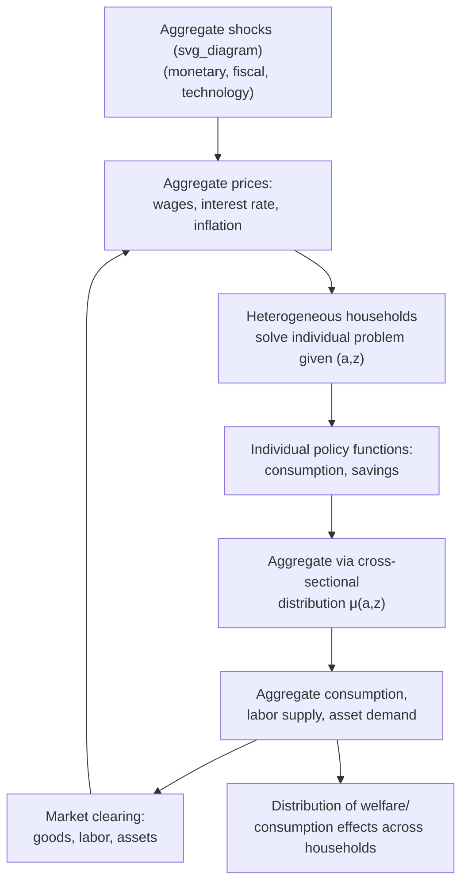

## Heterogeneous Agent Extensions to DSGE Models

### Overview

Heterogeneous agent (HA) extensions relax the representative-household assumption of standard DSGE models, allowing individuals or firms to differ along dimensions such as wealth, income, productivity, or age. This matters because a representative agent, by construction, cannot generate any role for the *distribution* of resources across households — yet distribution turns out to be central to how aggregate consumption responds to income shocks, fiscal transfers, and monetary policy. The modern synthesis of heterogeneous-agent incomplete-markets modeling (the "Bewley-Huggett-Aiyagari" tradition) with New Keynesian nominal rigidities and general equilibrium is known as **HANK** (Heterogeneous Agent New Keynesian), a framework that has become one of the most active research areas in DSGE modeling since roughly the mid-2010s.

### Motivation: Why Heterogeneity Matters

**Key Points**

- **Representative-agent (RA) models** imply consumption tracks permanent income closely (via the permanent income hypothesis / consumption-smoothing logic of the standard Euler equation), so temporary income changes have small effects on spending
- **Empirical evidence** (from natural experiments such as fiscal stimulus payments and tax rebates) consistently shows a much larger and more immediate consumption response to temporary income changes than RA models predict — often attributed to a meaningful share of households being **hand-to-mouth** (spending close to all disposable income each period, whether due to zero liquid savings or borrowing constraints)
- **Monetary policy transmission**: in RA models, the primary channel of interest-rate changes on consumption is the **intertemporal substitution effect** (via the Euler equation); heterogeneous-agent models reveal that **indirect effects through labor income and general equilibrium** (e.g., how a rate cut affects wages and profits, which then affects constrained households) can dominate the direct interest-rate channel [Inference: the relative size of direct vs. indirect channels is a live estimation question and varies by model calibration]
- **Distributional policy questions**: heterogeneity is necessary to analyze who gains and loses from a given policy (inflation, monetary tightening, fiscal transfers) — a question a representative agent cannot address by construction

### The Building Block: Bewley-Huggett-Aiyagari Models

Before embedding heterogeneity into a full New Keynesian DSGE model, it is useful to understand the underlying incomplete-markets framework:

- Households face **idiosyncratic labor income risk** (uninsurable shocks to individual productivity/earnings) that cannot be pooled away because markets for insuring against these shocks are missing or incomplete
- Households can self-insure only by accumulating a single risk-free asset, subject to a **borrowing constraint** (often a "natural" or ad hoc debt limit)
- In general equilibrium, individual asset-holding decisions aggregate up to determine the economy-wide capital stock (Aiyagari, 1994) or bond supply (Huggett, 1993), and the interest rate adjusts to clear the asset market
- The **household's problem** is a dynamic programming problem over an individual state $(a, z)$ — asset holdings $a$ and idiosyncratic productivity $z$ — solved via value function iteration or the endogenous grid method, yielding a policy function $a' = g(a, z)$
- The **stationary distribution** $\mu(a, z)$ of households across the state space is a key equilibrium object, typically found by iterating the policy function's implied transition operator (a Markov transition matrix over a discretized state space) until convergence

$$V(a, z) = \max_{c, a'} \left\{ u(c) + \beta \, \mathbb{E}_z\left[V(a', z') \mid z\right] \right\} \quad \text{s.t.} \quad c + a' = (1+r)a + wz, \quad a' \geq \underline{a}$$

### From Aiyagari to HANK: Adding Nominal Rigidities and Aggregate Shocks

HANK models embed this incomplete-markets household block into a general equilibrium framework with:

- **Nominal price rigidity** (Calvo or Rotemberg pricing, as in standard NK models)
- **Aggregate shocks** (monetary policy, technology, government spending) that move prices, wages, interest rates, and aggregate income — which every household's idiosyncratic problem responds to
- A **firm/production sector** structurally similar to representative-agent NK models, since firm heterogeneity is typically not the focus (most HANK models retain representative or simply-structured firms)
- A **government/fiscal block** specifying how taxes, transfers, and debt respond to aggregate conditions — critical since fiscal policy is often the main redistributive channel studied

**Key Points**

- The central technical challenge is that the **cross-sectional distribution** $\mu_t(a, z)$ is now itself a state variable of the aggregate economy — an infinite-dimensional object — and its evolution depends on aggregate prices, which in turn depend on the distribution, creating a genuine fixed-point problem each period
- This is a substantially harder computational problem than the representative-agent case, where the state space is just a handful of aggregate variables

### Solution Methods for Aggregate Dynamics with a Distributional State

#### 1. Krusell-Smith (1998) Approximate Aggregation

- Approximates the evolution of the cross-sectional distribution using a small set of **summary statistics** (typically just the aggregate capital stock, sometimes higher moments), rather than tracking the full distribution
- Works well when the "approximate aggregation" result holds — i.e., when higher moments of the distribution barely affect the law of motion for the aggregates households actually care about forecasting
- Originally developed for RBC-style models with capital and idiosyncratic employment risk; adapted to NK settings but can face challenges when nominal rigidities and monetary policy amplify the importance of distributional dynamics [Inference: the accuracy of the approximate-aggregation shortcut in NK/HANK contexts is model- and calibration-specific and has been a subject of methodological scrutiny]

#### 2. Reiter (2009) Linearization Method

- Solves for the stationary distribution and individual policy functions exactly (nonlinearly) at the steady state, then **linearizes the aggregate dynamics** around that steady state while keeping the (discretized) distribution as a (large but finite-dimensional) state vector
- Allows standard linear rational-expectations solution techniques (as used in representative-agent DSGE models) to be applied to the *linearized* system, even though the underlying household problem is solved without approximation at the individual level
- This method underlies much of the widely used **Sequence-Space Jacobian (SSJ)** computational approach (Auclert, Bardóczy, Rognlie, Straub, 2021), which computes the aggregate linear response to shocks efficiently by chaining together Jacobians of individual policy functions with respect to aggregate prices, without explicitly linearizing the full nonlinear system by hand

#### 3. Global/Nonlinear Methods

- Necessary when the researcher cares about nonlinear phenomena inherently tied to heterogeneity — e.g., a systemic crisis where a large fraction of households simultaneously hit their borrowing constraint, or asymmetric responses to large shocks
- Substantially more computationally demanding; often solved with specialized discretization and iteration techniques rather than perturbation

### Illustrative Diagram: HANK Model Structure

### Key Findings from the HANK Literature

**Key Points**

- **Monetary policy transmission is reallocated**: the standard "intertemporal substitution" channel (higher real rates reduce consumption today directly via the Euler equation) is often found to be quantitatively small for hand-to-mouth households (who don't respond to interest-rate incentives when unconstrained saving is near zero); the dominant channel instead operates through the effect of monetary policy on aggregate labor income and profits, which then passes through to consumption via households' marginal propensity to consume out of income [Inference: relative channel decomposition is a central but still debated quantitative result across different HANK specifications]
- **Fiscal multipliers** tend to be larger in HANK models than in representative-agent equivalents, because transfers to high-MPC (hand-to-mouth) households are spent rather than saved, amplifying the aggregate demand effect
- **Forward guidance puzzle resolution**: representative-agent NK models can imply implausibly large effects of far-future interest-rate announcements on current consumption (the "forward guidance puzzle"); HANK models with incomplete markets tend to dampen this effect substantially, since distant future income changes matter less for constrained/impatient households [Inference: the degree of resolution depends on specific model features, e.g., the persistence and size of idiosyncratic risk]
- **Inequality and monetary policy**: HANK models are used to analyze how monetary tightening or easing affects income and wealth inequality, since the exposure of different households to interest-rate changes (as savers vs. borrowers, wage-earners vs. capital-owners) is heterogeneous by construction

### Standard Calibration Targets

**Example**

| Target Moment | Typical Source | Purpose |
| --- | --- | --- |
| Share of hand-to-mouth households | Household survey data (e.g., Survey of Consumer Finances) | Disciplines the fraction of constrained agents |
| Wealth distribution (Gini coefficient, top wealth shares) | Household wealth surveys | Disciplines the idiosyncratic income process and borrowing constraint |
| Average marginal propensity to consume (MPC) | Natural experiments (stimulus payment studies) | Key moment HANK models are built to match, often poorly matched by RA models |
| Earnings persistence and variance | Panel earnings data (administrative or survey) | Parameterizes the idiosyncratic productivity process $z$ |

[Unverified: exact calibrated values vary substantially across studies, countries, and time periods; consult the specific paper's calibration section]

### Computational Tools

| Tool/Method | Role |
| --- | --- |
| Sequence-Space Jacobian (SSJ) toolkit (Python) | Efficient computation of linearized aggregate dynamics in HANK models via chained Jacobians |
| Endogenous Grid Method (EGM) | Fast solution of individual household policy functions without root-finding on the Euler equation |
| Reiter (2009) linearization | Standard approach for embedding a discretized distribution into a linear RE solver |
| Krusell-Smith algorithm | Approximate aggregation using simulated panels and forecasting rules |

[Unverified: specific software packages and their feature sets evolve; consult current documentation and papers for implementation details]

### Practical Challenges

**Key Points**

- **Computational cost**: even with efficient methods (SSJ, Reiter), HANK models remain substantially more expensive to solve and estimate than representative-agent equivalents, which has limited (though not prevented) their adoption for full-scale Bayesian estimation exercises
- **Calibration vs. estimation trade-off**: many HANK papers rely more heavily on calibration to match micro-moments (wealth distribution, MPCs) than on formal Bayesian estimation of the full parameter vector, partly for computational tractability
- **Model risk in the idiosyncratic income process**: results can be sensitive to the specified stochastic process for individual earnings risk, which is difficult to pin down precisely from available panel data [Inference: sensitivity varies by application and is an active robustness-checking concern in the literature]

**Related Topics**

- Bewley-Huggett-Aiyagari incomplete markets models
- Sequence-Space Jacobian method (Auclert-Bardóczy-Rognlie-Straub)
- Hand-to-mouth consumers and marginal propensity to consume
- Forward guidance puzzle in New Keynesian models
- Bayesian estimation of DSGE models (contrast with HANK calibration practices)
- Fiscal multipliers and transfer policy design
- Critiques of DSGE modeling post-financial crisis (representative-agent critique)
- Endogenous grid method and numerical dynamic programming