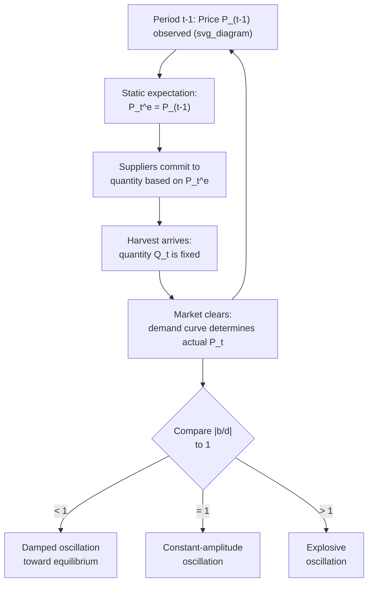

## Static Expectations

### Overview

Static expectations is the simplest hypothesis about how economic agents form beliefs about the future: agents expect the value of a variable next period to equal its value this period, with no adjustment for observed trends, cycles, or information about underlying structural change. Formally, if $x_t^e$ denotes the expectation of variable $x$ formed at time $t$ for period $t+1$:

$$x_{t+1}^e = x_t$$

Despite its simplicity, static expectations plays an important pedagogical and historical role in macroeconomics — it is the starting point against which more sophisticated expectation-formation hypotheses (adaptive, rational) are contrasted, and it remains embedded in several classic models, most notably the cobweb model of market dynamics.

### Formal Definition

For any variable $x_t$ (price, inflation rate, output, etc.), the static expectations rule states that the expected value next period equals the currently observed value:

$$\mathbb{E}_t^{\text{static}}[x_{t+1}] = x_t$$

**Key Points**

- No use is made of past history beyond the single most recent observation
- No use is made of the underlying structural model generating $x_t$ — the expectation rule is entirely mechanical
- Expectations are **systematically wrong** whenever $x_t$ follows any consistent trend or cyclical pattern, since the forecast simply repeats the last observed value regardless of the variable's known dynamics

### Historical Origin: The Cobweb Model

Static expectations is most famously associated with the **cobweb model** (Ezekiel, 1938), developed to explain observed cyclical fluctuations in agricultural prices and quantities.

**Example**

Consider a market where:

- **Supply** decisions must be made one period in advance (e.g., farmers plant crops based on the price they expect to prevail at harvest)
- **Demand** responds to the *current* market price at the time of sale

$$Q_t^S = a + b \, P_t^e = a + b\, P_{t-1} \quad \text{(supply, based on static expectations)}$$

$$Q_t^D = c - d\, P_t \quad \text{(demand, based on current price)}$$

Setting $Q_t^S = Q_t^D$ and solving for the price path yields a first-order difference equation:

$$P_t = \frac{c-a}{d} - \frac{b}{d} P_{t-1}$$

**Key Points**

- The stability of the resulting price path depends entirely on the ratio $\dfrac{b}{d}$ (the ratio of the supply elasticity to the demand elasticity, in absolute value)
- If $\left|\dfrac{b}{d}\right| < 1$ (demand more elastic than supply in the relevant sense): the price path **converges** in a damped oscillation toward equilibrium
- If $\left|\dfrac{b}{d}\right| = 1$: the price path oscillates with **constant amplitude** indefinitely
- If $\left|\dfrac{b}{d}\right| > 1$: the price path **diverges** in an explosive oscillation, moving farther from equilibrium each period
- The name "cobweb" comes from the characteristic spiral shape traced out when plotting successive $(Q,P)$ pairs on a supply-demand diagram

### Illustrative Diagram: Cobweb Dynamics

### Why Static Expectations Is Considered Naive

**Key Points**

- **No learning from forecast errors**: unlike adaptive expectations, static expectations does not adjust the forecast rule even after repeated, systematic errors — an agent forecasting a rising trend variable with static expectations will be wrong in the same direction every single period
- **No use of available information**: any publicly observable pattern (seasonality, known policy rules, past forecast errors) that could improve the forecast is ignored by construction, which is the central objection raised by proponents of the rational expectations hypothesis
- **Special case of adaptive expectations**: static expectations can be seen as the limiting case of the adaptive expectations formula $x_{t+1}^e = x_t^e + \lambda(x_t - x_t^e)$ when the adjustment parameter $\lambda = 1$ — i.e., full (immediate and complete) adjustment to the most recent forecast error, with no weight placed on the previously held expectation

### Comparison to Other Expectation Hypotheses

| Hypothesis | Formula | Information Used |
| --- | --- | --- |
| Static | $x_{t+1}^e = x_t$ | Only the current value |
| Adaptive | $x_{t+1}^e = x_t^e + \lambda(x_t - x_t^e)$ | Current value and prior expectation, partially weighted |
| Extrapolative | $x_{t+1}^e = x_t + \eta(x_t - x_{t-1})$ | Current value and recent trend/change |
| Rational | $x_{t+1}^e = \mathbb{E}[x_{t+1} \mid \Omega_t]$ | The full information set $\Omega_t$ and the true structural model |

**Key Points**

- Static expectations sits at one extreme of this spectrum: it is the *least* forward-looking and uses the *least* information of any standard expectations hypothesis
- Rational expectations sits at the other extreme, assuming agents know and correctly apply the entire structural model generating the data
- Adaptive and extrapolative expectations occupy intermediate positions, using more information than static expectations but generally still failing to be consistent with the true underlying model in every state (an objection central to the Lucas Critique)

### Role in Macroeconomic Theory Today

**Key Points**

- Static expectations is rarely used as a serious empirical or policy-relevant assumption in modern macroeconomics (including DSGE modeling), having been largely superseded first by adaptive expectations and then by rational expectations following the New Classical revolution of the 1970s
- It retains value as a **pedagogical baseline**: it is the simplest possible expectation rule against which to illustrate why expectation formation matters for model dynamics and stability
- It remains directly relevant in **agricultural economics and commodity markets** with long, fixed production lags (the cobweb model's original domain), and more broadly as an illustrative special case in courses covering the historical development of expectations theory
- In some behavioral and bounded-rationality models, a static or "naive" forecasting rule is reintroduced deliberately as one behavioral type among several (mixed with more sophisticated agents), used to study market stability when not all agents are fully rational [Inference: this specific modeling choice varies substantially by paper and application within the behavioral macro/finance literature]

**Related Topics**

- Adaptive expectations and the error-correction formulation
- Extrapolative expectations and trend-chasing behavior
- Rational expectations hypothesis and the Lucas Critique
- The cobweb model and market stability conditions
- Expectations formation in DSGE models (rational expectations as the standard assumption)
- Behavioral and bounded-rationality approaches to expectations (e.g., heterogeneous expectations models)