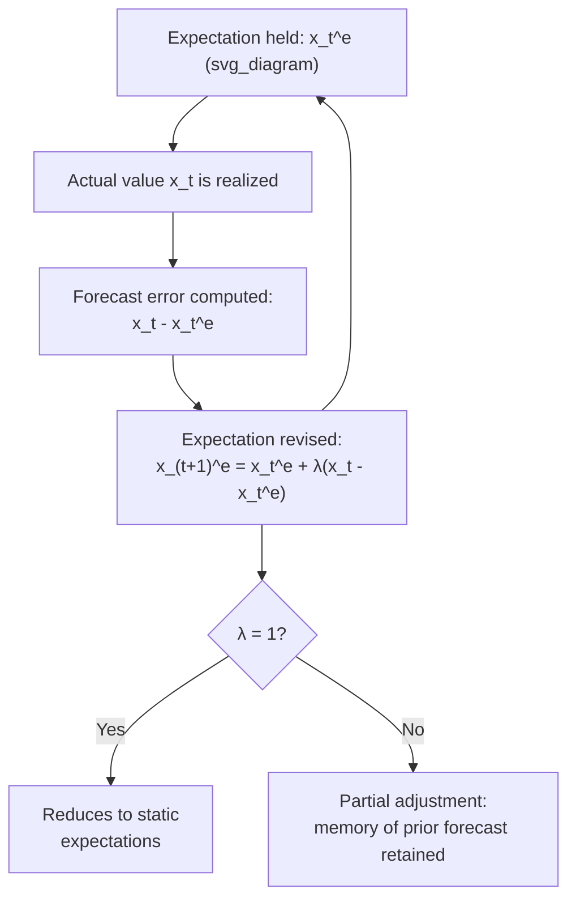

## Adaptive Expectations Formation

### Overview

Adaptive expectations is a hypothesis of expectation formation in which agents revise their forecast of a variable based on the error made in their previous forecast, adjusting proportionally to how wrong they were. Rather than assuming full and immediate adjustment to the latest observation (as in static expectations) or full knowledge of the true underlying model (as in rational expectations), adaptive expectations occupies a middle ground: agents learn gradually and mechanically from past mistakes. The concept, formalized independently by Cagan (1956), Nerlove (1958), and Friedman (1957) in different applied contexts, played a central role in macroeconomics from the 1950s through the 1970s, particularly in the expectations-augmented Phillips Curve debate and Friedman's Permanent Income Hypothesis, before being substantially displaced by the rational expectations revolution.

### Formal Definition

The core adaptive expectations formula states that the revision of expectations is proportional to the most recent forecast error:

$$x_{t+1}^e - x_t^e = \lambda \left(x_t - x_t^e\right), \quad 0 < \lambda \leq 1$$

Rearranged into the standard forecasting form:

$$x_{t+1}^e = \lambda x_t + (1-\lambda) x_t^e$$

where:

- $x_t^e$ is the expectation of $x$ held as of period $t$ (formed using information available at $t-1$)
- $x_t$ is the actual realized value at time $t$
- $\lambda \in (0,1]$ is the **adjustment coefficient** (sometimes called the "speed of adjustment" or "adaptive expectations parameter")

**Key Points**

- When $\lambda = 1$: the formula collapses exactly to **static expectations**, $x_{t+1}^e = x_t$ — full, immediate adjustment with no memory of the prior forecast
- When $\lambda \to 0$: expectations become extremely sluggish, barely updating at all in response to new information
- The parameter $\lambda$ is typically estimated empirically or calibrated based on the persistence properties of the variable being forecast

### The Geometric (Koyck) Distributed Lag Interpretation

Repeatedly substituting the adaptive expectations formula backward reveals that the current expectation is a **weighted average of all past observed values**, with **geometrically declining weights**:

$$x_{t+1}^e = \lambda \sum_{i=0}^{\infty} (1-\lambda)^i \, x_{t-i}$$

**Key Points**

- This is mathematically identical to a **Koyck transformation** / geometric distributed lag, a well-known econometric structure
- Higher $\lambda$ (faster adjustment) puts more weight on very recent observations and lets weights decay quickly; lower $\lambda$ spreads weight more evenly across a longer history
- Because of this equivalence, adaptive expectations models can often be estimated using standard partial-adjustment or Koyck-lag econometric techniques, without needing to observe the unobservable expectation series $x_t^e$ directly — a major practical advantage that contributed to its widespread empirical use in the pre-rational-expectations era

### Illustrative Diagram: Adaptive Expectations Updating Loop

### Classic Applications

#### 1. Cagan's Model of Hyperinflation (1956)

Cagan used adaptive expectations to model money demand during hyperinflations, where expected inflation is the key driver of real money balances:

$$m_t - p_t = -\alpha \, \pi_t^e$$

with $\pi_t^e$ formed adaptively from past observed inflation. This became one of the most influential early applications, since hyperinflation episodes provided rich, high-frequency data against which the adaptive expectations mechanism could be tested. [Inference: subsequent research using these same hyperinflation episodes became an important early testing ground for the rational expectations hypothesis, since adaptive expectations was shown to imply systematically biased forecasts during rapidly accelerating inflation]

#### 2. Friedman's Expectations-Augmented Phillips Curve (1968)

Friedman (and independently Phelps) argued that the observed negative relationship between inflation and unemployment (the Phillips Curve) would break down once *expected* inflation was properly accounted for:

$$\pi_t = \pi_t^e - \beta(u_t - u_n) + \varepsilon_t$$

where $u_n$ is the natural rate of unemployment. With adaptively formed $\pi_t^e$, a sustained attempt to hold unemployment below $u_n$ via expansionary policy generates a spiral: actual inflation consistently exceeds expected inflation, expectations adjust upward each period, and unemployment returns to $u_n$ only at an ever-higher (and still rising) rate of inflation. This mechanism was central to the **stagflation** debates of the 1970s and represented the first major crack in the simple (expectations-free) Phillips Curve relationship.

#### 3. Friedman's Permanent Income Hypothesis (1957)

Permanent income — the income level households base consumption decisions on — was modeled as an adaptively formed (geometrically weighted) average of past income realizations, providing a tractable empirical proxy for an inherently unobservable expectational concept.

### The Central Critique: Systematic Forecast Errors

**Key Points**

- The Lucas Critique and the broader rational expectations revolution (Lucas, Sargent, Muth) identified a fundamental flaw: **adaptive expectations generates systematic, predictable forecast errors whenever the variable being forecast has a persistent trend**
- Concretely, if inflation is rising steadily, an adaptively formed expectation will *always* underpredict actual inflation, period after period — a fully rational agent, understanding this systematic bias, would incorporate it into their forecast and thereby stop making the same mistake repeatedly
- This violates the core rational expectations postulate that agents should not make **systematic** (as opposed to random) forecast errors, since doing so leaves unexploited information "on the table"
- Muth (1961), somewhat ironically the originator of the rational expectations concept, explicitly contrasted it against adaptive-expectations-style models precisely on these grounds

### Adaptive Expectations vs. Rational Expectations

| Dimension | Adaptive Expectations | Rational Expectations |
| --- | --- | --- |
| Information used | Own past forecast error only | Entire available information set and the true model |
| Forecast errors | Systematic and predictable during trends | Only random, unpredictable (by construction) |
| Policy implication | Sustained trade-offs possible short-run (e.g., Phillips Curve) | Policy trade-offs vanish once anticipated (policy ineffectiveness) |
| Tractability | Simple, single-parameter, easily estimated via Koyck lag | Requires solving the full model for the rational forecast |
| Behavioral realism | Plausible as a boundedly-rational learning rule | Requires strong cognitive/informational assumptions |

### Adaptive Learning as a Modern Revival

**Key Points**

- While pure adaptive expectations (in Cagan/Friedman's original form) is rarely used as the primary expectations assumption in modern DSGE models, a closely related concept — **adaptive learning** — has been revived in the macro-learning literature (Evans-Honkapohja, 2001, and subsequent work)
- Adaptive learning models typically assume agents use a statistically more sophisticated updating rule (e.g., recursive least squares estimating a perceived law of motion) rather than the simple fixed-$\lambda$ formula, but retain the core adaptive spirit: expectations converge toward rational expectations only gradually, through a learning process, rather than being assumed correct from period one
- This literature is used to study whether an economy under a given policy rule will actually **converge** to the rational expectations equilibrium under plausible learning dynamics, a stability question the pure rational expectations assumption cannot address on its own [Inference: convergence results are highly specific to the learning algorithm and model structure used, and are an active area of ongoing research]

### Practical and Pedagogical Standing Today

**Key Points**

- Adaptive expectations remains a standard topic in introductory and intermediate macroeconomics courses as the natural stepping stone between static and rational expectations, and as the mechanism underlying the classic accelerationist Phillips Curve story
- In applied econometric contexts requiring a simple, estimable proxy for unobserved expectations (e.g., historical survey-based inflation expectations studies), adaptive-expectations-style geometric distributed lags are still occasionally used as a benchmark or robustness comparison against forward-looking or survey-based expectation measures [Unverified: the specific extent of continued empirical use varies by subfield and is not centrally documented]
- In modern DSGE and New Keynesian modeling, rational expectations remains the dominant baseline assumption, with adaptive learning as the primary avenue through which bounded rationality is reintroduced when researchers wish to relax full rationality

**Related Topics**

- Static expectations and the cobweb model
- Rational expectations hypothesis and the Lucas Critique
- Cagan's model of hyperinflation and money demand
- Friedman-Phelps expectations-augmented Phillips Curve
- Permanent Income Hypothesis
- Adaptive learning (Evans-Honkapohja) and convergence to rational expectations equilibrium
- Koyck transformation and geometric distributed lag estimation