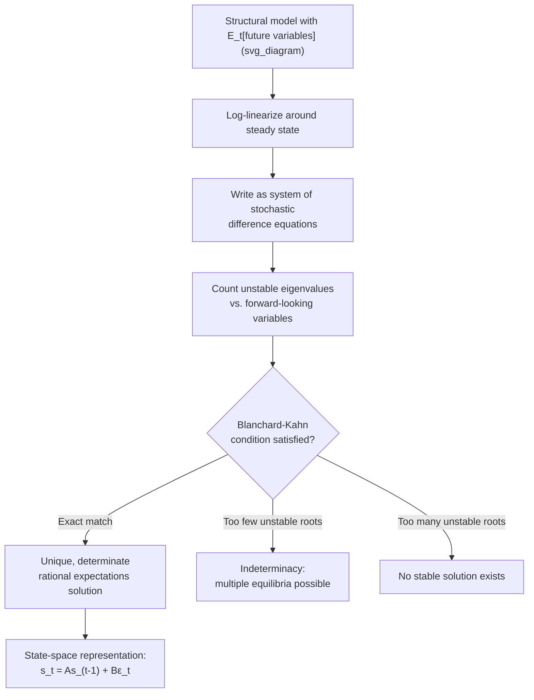

## Rational Expectations Hypothesis

### Overview

The rational expectations hypothesis (REH) postulates that economic agents form expectations about future variables using all available relevant information and the true structural model of the economy, such that their subjective forecasts coincide, on average, with the objective mathematical expectation implied by that model. First formalized by John Muth (1961) in the context of microeconomic price expectations, the hypothesis was subsequently developed into the foundation of macroeconomic modeling by Robert Lucas, Thomas Sargent, and Neil Wallace during the 1970s "New Classical" revolution. Rational expectations is now the standard baseline assumption in virtually all mainstream DSGE models, and its adoption fundamentally reshaped how economists think about policy effectiveness, model specification, and econometric identification.

### Formal Definition

Rational expectations states that an agent's subjective expectation of a variable $x_{t+1}$, conditional on the information set $\Omega_t$ available at time $t$, equals the mathematical (objective) conditional expectation implied by the true model of the economy:

$$x_{t+1}^e \equiv \mathbb{E}[x_{t+1} \mid \Omega_t]$$

Equivalently, the forecast error $\eta_{t+1} = x_{t+1} - x_{t+1}^e$ must satisfy:

$$\mathbb{E}[\eta_{t+1} \mid \Omega_t] = 0$$

**Key Points**

- Forecast errors are **unpredictable given information available at the time the forecast was made** — this is the single most important operational implication of the hypothesis
- This does **not** mean agents forecast perfectly; it means errors are **random** (mean zero conditional on $\Omega_t$) rather than **systematic**
- $\Omega_t$ is typically assumed to include the true structural model itself, along with all publicly available data — a strong assumption often summarized as agents "knowing the model as well as the economist studying it"
- Rational expectations is a property of the *forecast*, not a claim that agents are error-free or omniscient about the future realization of shocks

### Origins: Muth (1961) and Microeconomic Roots

Muth introduced rational expectations to address a specific empirical puzzle in commodity/agricultural markets (directly building on and critiquing the cobweb model's static expectations assumption): observed price series did not display the persistent, systematic oscillations that naive expectation-formation hypotheses predicted. Muth argued that if firms genuinely understood the structure of supply and demand in their market, they should form expectations consistent with that structure rather than mechanically extrapolating the past, and that market outcomes would reflect this consistency.

### The New Classical Macroeconomic Revolution

**Key Points**

- **Lucas (1972, 1976)** extended rational expectations from microeconomic settings to full macroeconomic general equilibrium, showing that when agents form rational expectations, systematic monetary policy cannot generate real effects — only *unanticipated* monetary shocks can move real output ("Lucas surprise supply function" / "Lucas islands" framework)
- **Sargent and Wallace (1975)** formalized the **Policy Ineffectiveness Proposition**: under rational expectations combined with market-clearing prices, any *systematic* (rule-based, anticipated) monetary policy is fully absorbed into expectations and has no effect on real output or employment, even in the short run — only random policy surprises matter
- This directly overturned the adaptive-expectations-based Friedman-Phelps view that policy could exploit a short-run Phillips Curve trade-off even temporarily through anticipated demand management, since anticipated policy changes are immediately incorporated into wage and price setting

### The Lucas Critique

Perhaps the single most influential methodological consequence of rational expectations, articulated in Lucas (1976):

**Key Points**

- Reduced-form econometric relationships (e.g., an estimated Phillips Curve, an estimated consumption function) are **not structural** — their estimated coefficients are combinations of genuinely deep "taste and technology" parameters *and* the parameters of the specific policy regime in place when the data were generated
- If agents form expectations rationally, then a change in policy regime changes the way agents' expectations respond to shocks, which in turn changes the estimated reduced-form relationship itself
- Consequently, using a reduced-form model estimated under one policy regime to predict the effects of a *different* policy regime is invalid — the very coefficients being relied upon will shift once the regime shifts
- This critique motivated the shift toward **microfounded, deep-parameter models** (i.e., the DSGE research program) explicitly designed so that structural parameters (preferences, technology) are, at least in principle, invariant to policy regime changes, while only the policy rule itself is varied in counterfactual analysis

### Rational Expectations in DSGE Models: Solution Concept

In a linearized DSGE model, imposing rational expectations means solving a system of stochastic difference equations where expectations of future endogenous variables appear on the right-hand side, e.g., a generic Euler equation:

$$y_t = \mathbb{E}_t[y_{t+1}] - \frac{1}{\sigma}(i_t - \mathbb{E}_t[\pi_{t+1}])$$

**Key Points**

- The model does not simply plug in a mechanical forecasting rule (as with adaptive or static expectations); instead, the *entire system* must be solved simultaneously, since $\mathbb{E}_t[y_{t+1}]$ is itself a function of the model's full solution
- This requires specialized rational expectations solution techniques: the **Blanchard-Kahn (1980)** method, **Klein's (2000) QZ decomposition**, or **Sims' (2002) gensys** algorithm, which separate the system into stable and unstable dynamic components
- A well-posed linear rational expectations model requires the number of "unstable" eigenvalues (roots outside the unit circle) to exactly equal the number of non-predetermined ("jump" or "forward-looking") variables — the **Blanchard-Kahn condition** — for a unique, non-explosive (determinate) solution to exist
- **Indeterminacy** arises when this condition fails (too few unstable roots), implying multiple equilibria consistent with rational expectations, often associated in the literature with poorly designed monetary policy rules that fail the **Taylor Principle** (insufficiently aggressive response of the policy rate to inflation)

### Illustrative Diagram: Rational Expectations Solution Logic

### Empirical Testing and Anomalies

**Key Points**

- **Survey-based expectations data** (e.g., the Survey of Professional Forecasters, Michigan Survey of Consumers) have been used extensively to test rational expectations directly, generally by checking whether forecast errors are correlated with information available at the time the forecast was made
- A substantial body of empirical work finds **evidence against strict rational expectations** in survey data — forecast errors are often found to be predictable using past information, and forecasts often display patterns consistent with under-reaction or over-reaction to news (sometimes described as evidence for "sticky information" or diagnostic-expectations-style models) [Inference: the specific interpretation and robustness of these findings is actively debated across studies and time periods, and results vary by dataset, forecast horizon, and variable studied]
- Despite these empirical anomalies, rational expectations remains the dominant *modeling convention* in DSGE work, in part because it provides internal consistency and a well-defined benchmark, and in part because it avoids having to take an ad hoc stance on an alternative expectations-formation rule [Inference: this is a characterization of prevailing modeling practice, not a claim that the debate over its empirical validity is settled]

### Common Critiques of the Rational Expectations Hypothesis

**Key Points**

- **Cognitive implausibility**: critics argue the assumption that ordinary agents (households, small firms) know and correctly apply the full structural model of the economy is an unrealistically strong informational and cognitive requirement
- **Model uncertainty**: REH as typically formalized assumes agents know the *single, correct* model; in reality, agents (and economists) face genuine uncertainty about which model is correct — a concern addressed by the related but distinct literature on robust control and model misspecification (Hansen-Sargent)
- **Learning and convergence**: even if a rational expectations equilibrium exists, it is not obvious that agents would arrive at it without some learning process — this motivated the adaptive learning literature (Evans-Honkapohja) studying whether boundedly rational, econometrically-updating agents converge to the REH outcome over time
- **Multiplicity and sunspots**: rational expectations models can admit multiple self-fulfilling equilibria (including "sunspot" equilibria driven by extraneous, economically irrelevant variables) when the Blanchard-Kahn condition fails, raising questions about equilibrium selection

### Standing in Modern Macroeconomics

**Conclusion**

Rational expectations remains the default assumption embedded in essentially all mainstream estimated DSGE models (Smets-Wouters and its many descendants), continuing to serve as the disciplining device that connects micro-founded structural parameters to macro dynamics in a way immune (at least in principle) to the Lucas Critique. At the same time, its empirical shortcomings — particularly in matching survey expectations data and in generating excess sensitivity to news relative to observed behavior — have motivated a substantial and growing body of alternative-expectations research (adaptive learning, sticky/noisy information, diagnostic expectations, level-k reasoning) that relaxes full rationality while attempting to preserve much of the internal consistency and tractability that made the original hypothesis so influential. [Inference: the balance of adoption between strict REH and these alternatives in frontier research is an evolving methodological question rather than a settled matter]

**Related Topics**

- Static and adaptive expectations (contrast cases)
- The Lucas Critique and structural vs. reduced-form modeling
- Sargent-Wallace policy ineffectiveness proposition
- Blanchard-Kahn conditions and determinacy in linear rational expectations models
- Adaptive learning (Evans-Honkapohja) and convergence to rational expectations equilibria
- Sticky information and diagnostic expectations models
- Bayesian estimation of DSGE models (rational expectations as the maintained assumption)
- Indeterminacy and sunspot equilibria