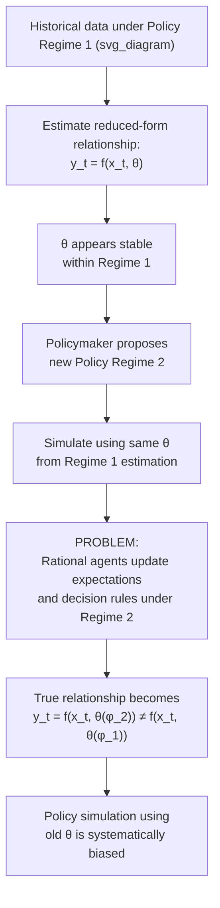

## Lucas Critique and Policy Evaluation

### Overview

The Lucas Critique, articulated by Robert Lucas in his 1976 paper "Econometric Policy Evaluation: A Critique," is one of the most influential methodological arguments in the history of macroeconomics. It holds that the parameters of estimated reduced-form econometric models are not structural or policy-invariant, but are themselves functions of the prevailing policy regime — because rational, forward-looking agents adjust their behavior (and hence their decision rules) whenever they perceive that policy has changed. Consequently, using historically estimated reduced-form relationships to simulate the effects of a *new* policy is fundamentally invalid, since the very relationship being relied upon will shift once the new policy is in place. The critique reshaped how economists build and use models for policy analysis, and it is the central intellectual justification for the entire DSGE research program's emphasis on microfounded, "deep" structural parameters.

### The Core Argument, Formally

Consider a generic reduced-form macroeconometric relationship of the form:

$$y_t = f(x_t, \theta) + \varepsilon_t$$

where $y_t$ is an outcome (e.g., inflation, output), $x_t$ includes policy variables, and $\theta$ is a vector of estimated coefficients treated, in traditional (pre-Lucas) econometric policy evaluation, as **fixed structural parameters**.

Lucas's argument is that $\theta$ is not policy-invariant whenever agents' decision rules depend on their expectations of policy, because those decision rules are themselves optimal responses to the policy environment:

$$\theta = \theta(\phi)$$

where $\phi$ represents the parameters of the policy rule or regime in effect. Formally, if household and firm decision rules are derived from dynamic optimization problems in which expectations of future policy enter directly, then:

$$y_t = h(x_t, \, \mathbb{E}_t[\text{future policy} \mid \phi], \, \alpha) + \varepsilon_t$$

where $\alpha$ denotes the *genuinely* deep parameters (preferences, technology) that are policy-invariant. The reduced-form coefficients $\theta$ observed in the data are a **composite** of $\alpha$ and $\phi$ — changing $\phi$ (the policy regime) changes the observed $\theta$, even though $\alpha$ itself has not changed.

**Key Points**

- The critique is not that reduced-form models are useless for describing the past under an unchanged policy regime — it is that they are unreliable for **forecasting the effects of a policy regime change**
- The critique applies with particular force to any model built by fitting historical correlations between policy instruments and outcomes (e.g., a historically estimated Phillips Curve) and then simulating a *different, hypothetical* policy path using those same fitted coefficients
- The magnitude of the critique's practical bite depends on how sensitive agents' expectations and decision rules actually are to the specific policy change being considered — a small, similar-in-kind policy change may generate only a modest degree of bias, while a genuine regime change can generate large biases [Inference: the empirical magnitude of Lucas-Critique-type bias in any specific application remains a matter of ongoing empirical assessment; it is not a claim that all policy simulations using reduced-form models are equally invalid]

### The Canonical Illustration: The Phillips Curve

**Example**

The most cited illustration of the Lucas Critique concerns the **expectations-augmented Phillips Curve**:

$$\pi_t = \pi_t^e + \beta(u_n - u_t) + \varepsilon_t$$

- Under an **adaptive expectations** regime (or, more generally, whenever $\pi_t^e$ is treated as fixed/exogenous in the estimated equation), a policymaker might observe a historically stable negative relationship between unemployment and inflation and conclude that a permanent reduction in unemployment below $u_n$ can be achieved by tolerating permanently higher inflation
- But if the policymaker then implements a systematic policy of running the economy "hot" to keep unemployment low, **rational agents will incorporate this systematic policy into $\pi_t^e$** — expected inflation rises to reflect the new, more inflationary policy regime
- As $\pi_t^e$ rises to match actual policy, the previously observed Phillips Curve trade-off **shifts** (or, under strict rational expectations and market clearing, vanishes entirely in the long run, per the Sargent-Wallace Policy Ineffectiveness Proposition) — the policymaker who assumed the historical trade-off was a stable structural relationship is left with **higher inflation and no sustained reduction in unemployment**
- This is precisely the stagflation dynamic observed in many advanced economies during the 1970s, and it became the most powerful real-world illustration cited in support of the critique's practical relevance [Inference: attributing the entirety of 1970s stagflation specifically and solely to this mechanism, as opposed to contributing supply shocks such as oil price increases, is a matter of ongoing historical and empirical debate among macroeconomists]

### Illustrative Diagram: How Policy Regime Change Breaks a Reduced-Form Relationship

### The Methodological Response: Microfounded, Deep-Parameter Modeling

The Lucas Critique's constructive proposal was not merely a warning but a **research program**: build models whose parameters are, as far as possible, genuinely structural — derived from preferences, technology, and market institutions that are plausibly invariant across policy regimes — with only the explicitly modeled **policy rule** varying across counterfactual scenarios.

**Key Points**

- This is the direct intellectual origin of the **DSGE modeling methodology**: households solve genuine dynamic optimization problems (utility maximization subject to budget constraints), firms solve genuine profit-maximization problems (subject to technology and, in New Keynesian variants, price-adjustment frictions), and **only the policy rule (e.g., the central bank's Taylor Rule, or the fiscal authority's tax/spending rule) is treated as the object that changes** across policy experiments
- Deep parameters — the discount factor $\beta$, risk aversion $\sigma$, the Calvo price-stickiness parameter $\theta$, production function parameters — are estimated or calibrated with the explicit intention that they describe technology and preferences, not the interaction of technology/preferences with a specific historical policy regime
- Counterfactual policy analysis in a DSGE model proceeds by **changing only the policy rule's parameters** (e.g., the Taylor Rule's inflation-response coefficient $\phi_\pi$) and re-solving the entire rational-expectations system, so that *all* endogenous decision rules (consumption, investment, pricing) automatically and consistently adjust to the new policy environment — precisely the adjustment that a reduced-form model would miss

### Practical Limitations of the "Solution"

**Key Points**

- **Are DSGE "deep parameters" really policy-invariant?** Critics note that even preference and technology parameters estimated within a DSGE model may not be fully immune to the critique if the model is misspecified or if agents' true decision rules depend on aspects of the policy environment not explicitly modeled (e.g., an implicit "regime" of central bank credibility not captured by the estimated policy-rule coefficients alone) [Inference: this represents a genuine, actively-discussed limitation rather than a decisively resolved methodological point]
- **The critique also applies within DSGE models**: if a DSGE model itself is estimated with data spanning a policy regime change (e.g., a change in the Federal Reserve's implicit inflation target, or the transition into and out of a Zero Lower Bound episode), and this change is not explicitly modeled as a shift in the policy-rule parameters, the "deep" parameters estimated from that data can themselves be contaminated by the same Lucas-Critique-style bias the methodology was designed to avoid
- **Structural break testing** in applied DSGE and time-series work (testing whether estimated parameters are stable across candidate regime-change dates, e.g., pre- and post-Volcker monetary policy in the US) is a direct, practical response to this concern, and remains standard due diligence in serious policy-model estimation [Inference: the specific set of regime-change dates tested varies by study and country]

### Related but Distinct Concepts

**Key Points**

- **Time inconsistency (Kydland-Prescott, 1977)**: a closely related but conceptually distinct critique, focused on the incentive for a policymaker to *deviate* from a previously announced optimal policy once private agents have already committed to decisions based on that announcement — this is about the *credibility* of policy rules, whereas the Lucas Critique is about the *invalidity of reduced-form estimation* for policy counterfactuals. The two concerns are often discussed together because both rely on rational, forward-looking private-sector responses to policy, but they identify different problems (estimation bias vs. policymaker credibility)
- **Policy Ineffectiveness Proposition (Sargent-Wallace, 1975)**: a specific *consequence* that follows from combining rational expectations with market-clearing prices — the Lucas Critique itself is a more general methodological point about econometric identification that does not, by itself, require market clearing or imply full policy ineffectiveness

### Standing in Modern Policy Analysis

**Conclusion**

The Lucas Critique remains foundational to how central banks, treasuries, and academic macroeconomists approach policy evaluation: virtually no serious institutional policy model today relies purely on unadjusted historical reduced-form correlations to simulate the effects of a genuinely new policy regime, and the explicit separation between "deep parameters" and "policy rule parameters" in DSGE models is a direct methodological legacy of Lucas's argument. At the same time, the critique's own logic implies that no model — DSGE included — can claim complete immunity from the underlying problem unless every relevant aspect of the policy environment influencing private expectations is explicitly and correctly modeled, a standard that is difficult to fully verify in practice. [Inference: the degree to which any specific institutional DSGE model achieves full Lucas-Critique immunity in practice is a matter of ongoing methodological scrutiny rather than a settled question]

**Related Topics**

- Rational expectations hypothesis
- Sargent-Wallace policy ineffectiveness proposition
- Time inconsistency of optimal policy (Kydland-Prescott)
- Bayesian estimation of DSGE models and structural parameter estimation
- Adaptive expectations and the pre-Lucas Phillips Curve
- Structural break testing and regime-change identification
- Taylor Rule design and monetary policy credibility