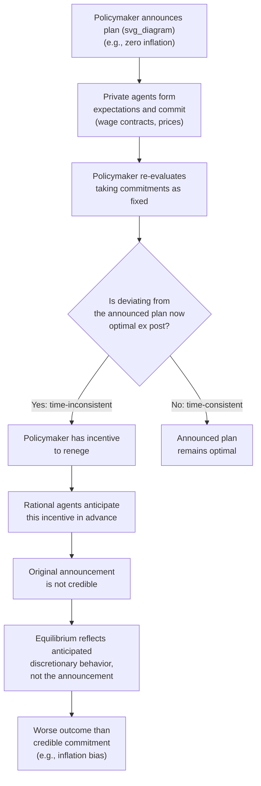
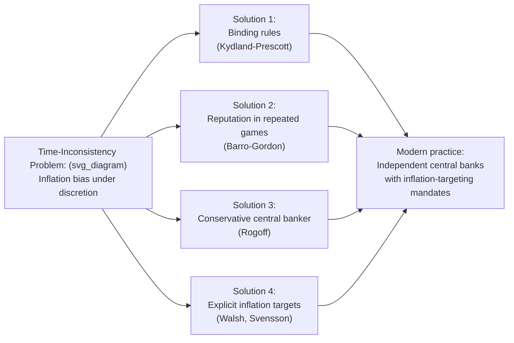

## Time Inconsistency and the Kydland-Prescott Framework

### Overview

Time inconsistency describes a situation in which a policy that is optimal when announced (from an "ex ante" perspective) is no longer optimal once private agents have made decisions based on that announcement (from an "ex post" perspective) — creating an incentive for the policymaker to renege on the original plan. Kydland and Prescott's 1977 paper "Rules Rather Than Discretion: The Inconsistency of Optimal Plans" formalized this problem and demonstrated that rational, forward-looking private agents will anticipate the policymaker's incentive to renege, undermining the credibility of announced policy and generating systematically worse outcomes than a credible, rule-bound policy would achieve. The paper (for which Kydland and Prescott shared the 2004 Nobel Memorial Prize in Economic Sciences, alongside their separate contributions to real business cycle theory) is foundational to modern monetary policy design, central bank independence, and the broader theory of policy credibility.

### The Core Logic

**Key Points**

- A policymaker announces a policy plan for the future, taking as given how private agents will respond
- Private agents, understanding the announced plan, make decisions (investment, wage contracts, price-setting, inflation expectations) that depend on that plan being carried out
- Once agents have committed to those decisions, the policymaker's incentives change: it may now be optimal, taking agents' *already-made* decisions as fixed, to deviate from the originally announced plan
- If agents are rational, they anticipate this incentive to deviate **in advance** and do not actually believe the original announcement — they instead form expectations consistent with what the policymaker will *actually* do once the time comes, not what was announced
- The equilibrium outcome under **discretion** (the policymaker re-optimizing every period with no binding commitment) is therefore systematically worse than the outcome that could be achieved under a credible **commitment** to a rule, even though the rule is, by construction, never the period-by-period optimal choice from the discretionary policymaker's perspective

### The Canonical Illustration: Inflation and the Time-Consistency Problem

**Example**

The most widely used illustration (formalized further by Barro-Gordon, 1983) considers a central bank with a **Phillips Curve** relating unemployment to inflation surprises:

$$u_t = u_n - \alpha(\pi_t - \pi_t^e)$$

and a policymaker loss function penalizing both inflation and unemployment deviations from targets, often with unemployment targeted **below** the natural rate $u_n$ (e.g., due to labor market distortions such as taxes or union power creating an inefficiently high natural rate):

$$L = \frac{1}{2}\left[(u_t - k u_n)^2 + \chi \, \pi_t^2\right], \quad 0 < k < 1$$

**Step-by-step logic:**

1. **Ex ante ("Rules") outcome**: if the central bank could credibly commit in advance to zero inflation, and the private sector believed this commitment, expected inflation $\pi_t^e = 0$, and the central bank has no *further* incentive to inflate once expectations are set at zero, so the commitment is consistent: $\pi_t = 0$
2. **Ex post ("Discretion") outcome**: but suppose the private sector *did* set $\pi_t^e = 0$. Taking this as given, the central bank now faces an incentive to create a positive inflation surprise ($\pi_t > \pi_t^e = 0$), since doing so pushes unemployment below $u_n$ (which is valuable given the target $ku_n < u_n$) at a cost of only moderate inflation
3. **Rational anticipation**: private agents, understanding this incentive, do **not** actually expect zero inflation — they anticipate the central bank will inflate, and set $\pi_t^e > 0$ accordingly
4. **Discretionary equilibrium**: solving the central bank's period-by-period optimization taking $\pi_t^e$ as given, and imposing the rational expectations consistency condition $\pi_t = \pi_t^e$ in equilibrium, yields a positive **inflation bias**:

$$\pi^{\text{discretion}} = \frac{\alpha(1-k)u_n}{\chi} > 0 = \pi^{\text{rule}}$$

**Key Points**

- Under discretion, the economy ends up with **positive average inflation and no reduction in unemployment below $u_n$** — since in rational-expectations equilibrium the inflation surprise term $(\pi_t - \pi_t^e)$ is zero on average, exactly as under the credible rule, but inflation itself is strictly higher
- This is the formal mechanism behind the informal claim that "discretionary policy has an inflationary bias" — it is not that policymakers are irrational or malicious, but that the *equilibrium* response of rational private agents to an unconstrained, period-by-period-optimizing policymaker generates a worse outcome for **everyone**, including the policymaker, than a credible commitment would

### Illustrative Diagram: The Time-Consistency Problem

### Distinguishing Time Inconsistency from the Lucas Critique

**Key Points**

- Both concepts rely on rational, forward-looking private-sector behavior and were developed in the same intellectual period (mid-to-late 1970s), and are frequently discussed together, but they identify **distinct** problems:
  - The **Lucas Critique** is about the **invalidity of using historically estimated reduced-form parameters** to simulate the effects of a policy regime *the analyst is proposing* — a problem of econometric identification and model misspecification
  - **Time inconsistency** is about the **credibility of the policymaker's own announced plan**, given that the policymaker retains full discretion to re-optimize later — a problem of institutional design and commitment, which exists even if the "true" structural model is known with certainty by everyone
- A policymaker can, in principle, have a perfectly correctly specified structural model (avoiding the Lucas Critique entirely) and still face a time-inconsistency problem, because the issue is not model misspecification but the policymaker's own incentive to deviate from an announced plan

### Solutions Proposed in the Literature

#### 1. Rules Rather Than Discretion (Kydland-Prescott's Original Proposal)

- Binding the policymaker to a fixed, pre-announced **rule** (rather than allowing period-by-period discretionary optimization) removes the incentive to renege, since the policymaker literally cannot deviate
- The practical challenge is designing an institutional mechanism that makes commitment to the rule genuinely binding (rather than just a promise that could itself be time-inconsistent to keep)

#### 2. Reputation and Repeated-Game Enforcement (Barro-Gordon, 1983)

- In an infinitely repeated interaction between the policymaker and private agents, a **reputational equilibrium** can support low inflation even under discretion, if agents punish deviations (e.g., by reverting to high-inflation expectations for some period) severely enough to deter the policymaker from reneging
- This provides a channel through which discretion can approximate the rule-based outcome **without** literal commitment, but the resulting equilibrium is typically supported by trigger strategies and can be fragile to changes in how harshly deviations are punished [Inference: the robustness of specific reputational equilibria to alternative punishment specifications is a standard but non-trivial finding across variants of this literature]

#### 3. Delegation to a "Conservative" Central Banker (Rogoff, 1985)

- Delegating monetary policy to an independent central banker who places **greater weight on inflation aversion** than society's true (average) preferences would imply reduces the equilibrium inflation bias, since a more inflation-averse decision-maker has a smaller incentive to generate inflation surprises
- This provides a formal justification for **central bank independence** with an explicit, strong anti-inflation mandate, and is widely cited as the theoretical underpinning for the global trend toward independent central banks with inflation-targeting mandates from the 1990s onward
- The trade-off is that a sufficiently "conservative" central banker also responds less to genuine supply shocks that would ideally call for some accommodative response, creating a distinct stabilization cost [Inference: the optimal degree of "conservatism" balancing credibility gains against stabilization costs is a model-dependent quantitative question]

#### 4. Explicit Inflation Targets and Contracts (Walsh, 1995; Svensson, 1997)

- Designing an explicit incentive contract or numerical inflation target for the central bank/central banker that directly penalizes inflation outcomes, achieving a similar credibility effect to Rogoff's conservative-banker solution through an alternative institutional mechanism
- Modern inflation-targeting regimes adopted by many central banks (with explicit, publicly announced numerical targets and regular accountability reporting) are frequently interpreted, at least in part, through this lens — as institutional commitment devices addressing the time-inconsistency problem [Inference: central banks' own stated rationales for inflation targeting typically emphasize multiple objectives, including public communication and expectation anchoring more broadly, not solely time-inconsistency resolution]

### Illustrative Diagram: Institutional Solutions Mapped to the Problem

### Applications Beyond Monetary Policy

**Key Points**

- **Capital taxation**: a government may promise not to tax capital income to encourage investment, but once capital is installed (sunk), taxing it becomes attractive ex post since the tax no longer distorts the (already-made) investment decision — anticipation of this dynamic discourages investment in the first place, a classic time-inconsistency problem in public finance
- **Patent policy and intellectual property**: a government may wish to commit to strong patent protection to encourage R&D investment, but once an invention exists, the ex post temptation to weaken protection (allowing cheaper generic competition, which benefits consumers) creates a similar credibility problem
- **Debt restructuring and sovereign default**: a government may wish to commit not to default on debt to maintain access to credit markets, but once debt is issued, default can become ex post attractive, again undermining the credibility of the original no-default commitment
- **Fiscal rules**: the broader debate around binding fiscal rules (debt/deficit limits) versus discretionary fiscal policy mirrors the Kydland-Prescott monetary-policy logic directly [Inference: the specific institutional design trade-offs are the subject of extensive separate literature in public finance and political economy]

### Integration into DSGE Modeling

**Key Points**

- Modern DSGE models used for monetary policy analysis typically specify the central bank's behavior via an explicit **policy rule** (e.g., the Taylor Rule) rather than solving for fully discretionary optimal policy period-by-period, partly as a direct, practical response to the time-inconsistency problem — a simple, transparent rule is easier to credibly commit to and to communicate than a complex discretionary optimization
- The literature on **optimal monetary policy under commitment versus discretion** within DSGE/New Keynesian frameworks (building on Clarida-Galí-Gertler, 1999, and related work) formally compares outcomes under the two regimes, generally finding that commitment to (state-contingent) rules achieves a strictly better trade-off between inflation and output-gap stabilization than period-by-period discretionary reoptimization — the New Keynesian analogue of the original Kydland-Prescott inflation-bias result [Inference: the precise quantitative welfare gap between commitment and discretion is model- and calibration-specific]

**Related Topics**

- Lucas Critique and structural policy evaluation
- Rational expectations hypothesis
- Barro-Gordon reputational equilibrium model
- Central bank independence and inflation-targeting regimes
- Optimal monetary policy under commitment versus discretion (Clarida-Galí-Gertler)
- Taylor Rule design and credibility
- Sovereign debt and time-inconsistent default incentives