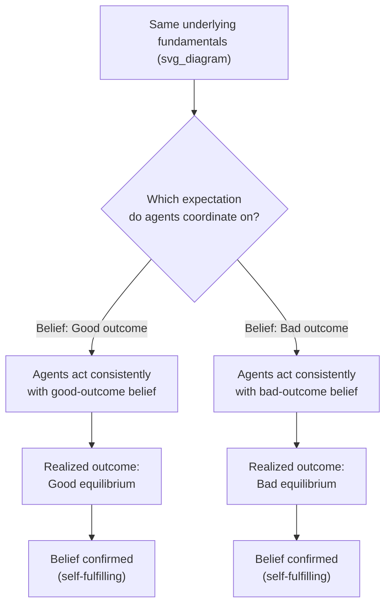
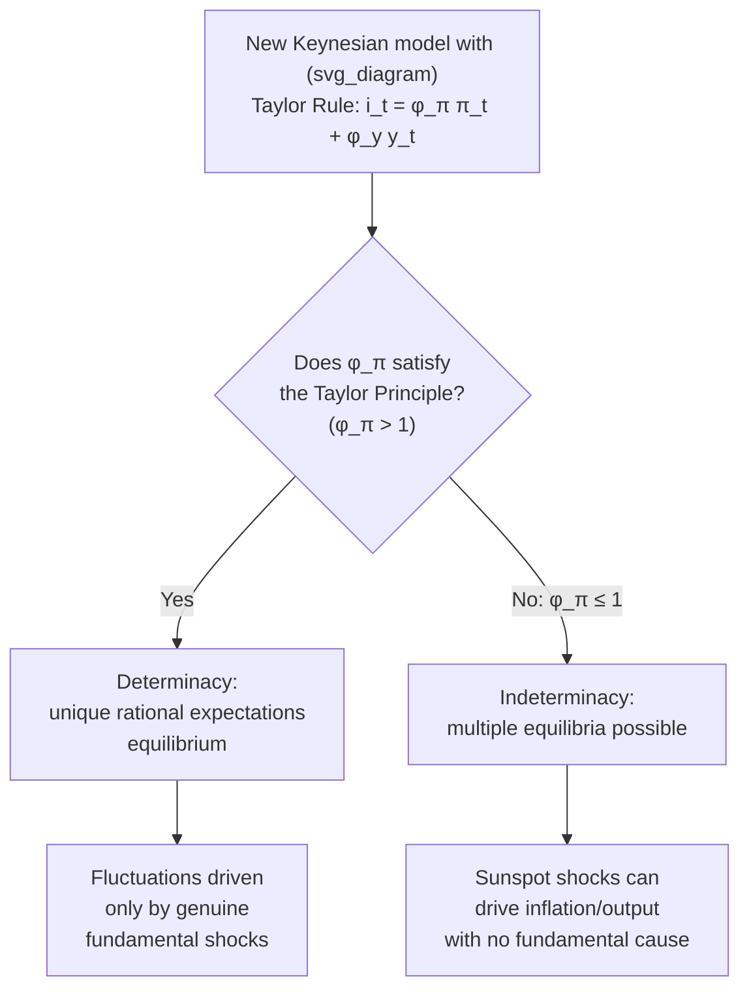

## Expectations Traps and Self-Fulfilling Prophecies

### Overview

An expectations trap arises when private-sector beliefs about a future economic outcome are themselves sufficient to bring that outcome about, independent of underlying "fundamental" conditions — a phenomenon more generally known as a **self-fulfilling prophecy** or **sunspot equilibrium**. In such settings, an economy characterized by identical fundamentals can settle into multiple distinct equilibrium outcomes depending purely on which outcome agents expect, and coordination on a "bad" expectation can become a self-reinforcing trap that is difficult to escape through policy actions targeting fundamentals alone. This class of phenomena is central to understanding bank runs, currency crises, debt crises, and indeterminacy in New Keynesian DSGE models with poorly designed monetary policy rules.

### Formal Structure: Multiple Equilibria from Self-Referential Expectations

**Key Points**

- The defining feature of an expectations trap is that the *expectation itself* enters as a causal input into the outcome being expected, creating a fixed-point problem with potentially more than one solution
- Formally, if the outcome $y_t$ depends on the expectation of that same outcome, $y_t = f(y_t^e)$, and $f$ has a shape allowing multiple values of $y_t^e$ to satisfy $y_t^e = f(y_t^e)$ (i.e., multiple fixed points), then the "true" fundamentals of the model are consistent with more than one equilibrium value of $y_t$
- Which equilibrium is realized is not pinned down by fundamentals alone — it depends on which beliefs agents happen to coordinate on, sometimes formalized as depending on an extraneous, economically irrelevant "sunspot" variable that agents use purely as a coordination device
- This is fundamentally different from a standard rational-expectations model with a **unique** determinate solution, where fundamentals alone pin down the equilibrium outcome regardless of which arbitrary beliefs agents might otherwise entertain

### Illustrative Diagram: The Self-Fulfilling Prophecy Mechanism

### Classic Example 1: Bank Runs (Diamond-Dybvig, 1983)

**Example**

- A bank holds illiquid long-term assets funded by short-term, demandable deposits, and can meet withdrawal demands **as long as only the fraction of depositors with a genuine early liquidity need withdraws**
- **Good equilibrium**: depositors believe the bank is solvent and only withdraw when they genuinely need liquidity; the bank can honor all such withdrawals from available reserves, and the belief is confirmed
- **Bad equilibrium (bank run)**: if depositors instead believe **other** depositors are about to withdraw en masse, each individual depositor's best response is to withdraw immediately too (since the bank will become insolvent if it must liquidate illiquid assets at a loss to meet a mass withdrawal, and late withdrawers would receive nothing) — the anticipation of a run causes the run
- Crucially, **both equilibria can exist for the identical bank, with identical underlying asset quality** — nothing about the bank's fundamental solvency needs to have changed for the run equilibrium to be selected instead of the no-run equilibrium
- This is the canonical justification for **deposit insurance** and **lender-of-last-resort** facilities: by guaranteeing depositors will be made whole regardless of whether a run occurs, these institutions remove the incentive to withdraw preemptively, eliminating the bad equilibrium as a rational best response

### Classic Example 2: Self-Fulfilling Currency Crises (Obstfeld, 1994, 1996)

**Key Points**

- In "second-generation" currency crisis models, a government maintaining a fixed exchange rate faces a cost of defending the peg (e.g., higher domestic interest rates, reduced monetary flexibility) that depends on **whether speculators attack the currency**
- If speculators believe the peg will hold, they do not attack, defense is cheap, and the peg does in fact hold — a self-confirming "good" equilibrium
- If speculators believe the peg is about to be abandoned, they attack (selling the currency, forcing the central bank to spend reserves or raise rates to defend it), which raises the true cost of defense — potentially making abandonment the government's actual best response, confirming the "bad" equilibrium
- Unlike "first-generation" crisis models (Krugman, 1979), where a crisis occurs only once fundamentals (e.g., persistent fiscal deficits monetized over time) deteriorate past an identifiable threshold, second-generation models allow a crisis to occur **even without any prior fundamental deterioration**, purely through a shift in speculative expectations — though most formal treatments emphasize that self-fulfilling crises are typically only *possible* within some intermediate range of fundamentals (a country with extremely strong fundamentals is not vulnerable regardless of beliefs, and a country with extremely weak fundamentals faces crisis regardless of beliefs) [Inference: the precise boundaries of this "vulnerability zone" are model-specific and depend on the particular defense-cost and payoff structure assumed]

### Classic Example 3: Sovereign Debt Crises and Rollover Risk

**Key Points**

- A government financing its debt by continuously issuing new bonds to roll over maturing debt can face a similar self-fulfilling dynamic: if investors believe other investors will refuse to buy new debt (fearing default), each individual investor's rational response is also to refuse, since default becomes more likely if the government cannot roll over its debt — even if the government's underlying fiscal position would have been sustainable had investors simply continued rolling over debt as before
- This mechanism has been invoked in analyses of sovereign debt crises where borrowing costs spike sharply and rapidly in a manner not obviously proportional to any equally rapid change in underlying fiscal fundamentals [Unverified: attributing any *specific* historical sovereign debt crisis primarily to this self-fulfilling mechanism, as opposed to a genuine fundamentals-driven repricing, is contested among researchers and depends on case-specific empirical analysis]
- This has motivated institutional responses such as lender-of-last-resort facilities for sovereigns (analogous to deposit insurance for banks) intended to remove the self-fulfilling rollover-crisis equilibrium as a rational possibility

### Indeterminacy in DSGE and New Keynesian Models

**Key Points**

- In linearized rational-expectations DSGE models, **indeterminacy** occurs when the Blanchard-Kahn condition fails — specifically, when there are **fewer unstable eigenvalues than forward-looking ("jump") variables** — meaning multiple bounded, rational-expectations-consistent paths exist for the same shock processes and structural parameters
- The most cited practical example: a monetary policy rule that responds to inflation **too weakly** (violating the **Taylor Principle**, i.e., a nominal interest rate response coefficient to inflation $\phi_\pi \leq 1$) can generate indeterminacy in an otherwise standard New Keynesian model, opening the door to **sunspot-driven fluctuations in inflation and output** that are entirely unrelated to any fundamental shock
- Under indeterminacy, the economy's dynamics can be driven by a **sunspot shock** — an extraneous random variable that has no direct effect on preferences, technology, or endowments, but which agents nonetheless use to coordinate their expectations, and which then has genuine real effects purely because everyone believes it does
- This result is a central argument for designing monetary policy rules that satisfy the Taylor Principle: doing so is argued to rule out sunspot-driven instability, anchoring the economy to the unique, fundamentals-determined equilibrium [Inference: this is the standard result in the baseline three-equation New Keynesian model; determinacy conditions can differ in richer models with additional frictions or a more complex policy rule specification]

### Illustrative Diagram: Determinacy vs. Indeterminacy Under Alternative Policy Rules

### Why Expectations Traps Are Difficult to Escape

**Key Points**

- Because the bad equilibrium is **self-confirming**, simply announcing that fundamentals are sound is often insufficient to escape a bad-equilibrium trap — agents rationally continue coordinating on the bad outcome as long as they believe others will do so too, regardless of the announcement's factual accuracy
- Escaping a bad equilibrium typically requires either: (a) a sufficiently credible **change in the underlying game** (e.g., an explicit, sufficiently large guarantee — deposit insurance, a lender-of-last-resort commitment — that changes each individual agent's best response even if others continue expecting the bad outcome), or (b) a coordinating event or policy announcement forceful enough to shift the entire population's beliefs simultaneously
- This is closely related to, but distinct from, the **time-inconsistency** problem: a credible commitment (e.g., "the central bank will always backstop solvent banks") must itself be believed to be time-consistent (i.e., that the authority will actually follow through when the bad equilibrium threatens to materialize) in order to successfully remove the bad equilibrium as a possibility

### Distinguishing Expectations Traps from Related Concepts

| Concept | Key Distinguishing Feature |
| --- | --- |
| Expectations trap / self-fulfilling prophecy | Multiple equilibria exist for identical fundamentals; belief alone selects the outcome |
| Lucas Critique | Concerns the invalidity of using historically estimated parameters for policy simulation, not multiplicity of equilibria |
| Time inconsistency | Concerns a policymaker's *incentive to renege* on an announced plan, not the existence of multiple beliefs-driven equilibria per se (though the two can interact, since a lack of credible commitment can itself open the door to expectations traps) |
| First-generation crisis models | Crisis triggered by fundamentals crossing a threshold, not by a shift in beliefs alone |

### Policy and Institutional Design Implications

**Key Points**

- Much of modern financial and monetary institutional design — deposit insurance, central bank lender-of-last-resort facilities, IMF-style emergency lending programs, and the Taylor Principle in monetary policy rule design — can be understood, at least in part, as attempts to eliminate "bad" self-fulfilling equilibria from the feasible equilibrium set, rather than simply reacting to fundamentals-driven shocks after the fact
- A recurring theme is that **credible, sufficiently strong commitment devices can remove multiplicity entirely**, converting a game with multiple equilibria into one with a unique equilibrium — but the credibility of the commitment device itself is essential, and a commitment device widely perceived as insufficiently backed (e.g., an underfunded deposit insurance scheme) may fail to eliminate the bad equilibrium in practice [Inference: the practical sufficiency of any specific real-world institutional backstop is an empirical and case-specific question, not a general theoretical guarantee]

**Related Topics**

- Diamond-Dybvig bank run model and deposit insurance
- Obstfeld second-generation currency crisis models
- Sunspot equilibria and indeterminacy in New Keynesian DSGE models
- Taylor Principle and monetary policy rule design
- Blanchard-Kahn conditions and determinacy
- Time inconsistency and the Kydland-Prescott framework
- Sovereign debt rollover crises and lender-of-last-resort institutions
- Rational expectations hypothesis