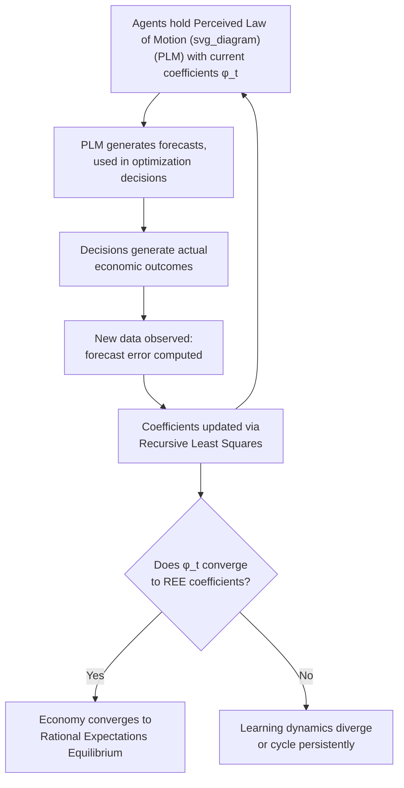

## Learning Models as an Alternative to Rational Expectations

### Overview

Adaptive learning models relax the strong informational assumption embedded in rational expectations — that agents already know the true structural model of the economy — and instead assume agents behave like econometricians, estimating a forecasting model from observed data and updating their beliefs as new data arrive. Rather than jumping directly to the rational expectations equilibrium (REE), agents in a learning model gradually revise their perceived law of motion (PLM) using a statistical learning algorithm, and the central theoretical question becomes whether this learning process **converges** to the REE over time, converges to some other outcome, or fails to converge at all. This literature, most comprehensively systematized by Evans and Honkapohja (2001), addresses stability and plausibility concerns left open by the rational expectations hypothesis and has become an active complement to (and occasional critique of) standard DSGE modeling.

### Motivation: Why Learning Models Are Needed

**Key Points**

- **Rational expectations assumes but does not explain coordination**: REE requires that all agents simultaneously hold expectations consistent with the *same* correct model — but standard rational expectations theory offers no account of *how* an economy characterized by initially heterogeneous or incorrect beliefs would ever arrive at this common, correct understanding
- **Stability as a selection device for multiple equilibria**: when a rational expectations model admits multiple equilibria (e.g., due to indeterminacy, as in models violating the Taylor Principle), learning dynamics provide a natural criterion for equilibrium selection — an REE that is **not** the limit point of any plausible learning process is arguably a less credible prediction for what will actually be observed, even if it is mathematically a valid rational expectations solution
- **Reintroducing transitional/out-of-equilibrium dynamics**: learning models generate genuine transitional dynamics as beliefs converge (or fail to converge), providing a more realistic account of phenomena such as gradual disinflation, delayed responses to policy regime changes, or temporary destabilizing episodes that a model assuming REE from the outset cannot generate by construction

### The Core Framework: Perceived Law of Motion vs. Actual Law of Motion

**Key Points**

- Agents in a learning model do not know the **Actual Law of Motion (ALM)** — the true reduced-form relationship implied by the full model under rational expectations — but instead hold a **Perceived Law of Motion (PLM)**, typically a simpler statistical forecasting model (often linear) that they estimate from available data
- A common and tractable PLM specification takes the form of a simple linear regression, e.g., $x_t = a + b \, z_{t-1} + \text{error}$, where $z_{t-1}$ is some observable state variable, with the coefficients $(a, b)$ updated recursively as new data arrive
- Agents' PLM-based forecasts feed into their (otherwise standard) optimization problems, generating actual economic outcomes; those outcomes, together with the true model structure, generate an implied ALM — the object of interest is whether the PLM coefficients, updated period by period using observed data, **converge to the ALM's own coefficients** (which, if achieved, is precisely the rational expectations equilibrium)
- This creates a well-defined dynamic system — the **T-map** (mapping PLM parameters into the ALM parameters they generate) — whose fixed points correspond to REE, and whose local stability properties under a given learning rule determine whether learning actually converges to that REE

### Standard Learning Algorithm: Recursive Least Squares (RLS)

The most common updating rule in the literature has agents re-estimate their PLM coefficients each period via recursive least squares, updating incrementally rather than re-running a full regression from scratch:

$$\phi_t = \phi_{t-1} + \gamma_t R_t^{-1} z_{t-1}\left(x_{t-1} - \phi_{t-1}' z_{t-1}\right)$$

$$R_t = R_{t-1} + \gamma_t\left(z_{t-1}z_{t-1}' - R_{t-1}\right)$$

where $\phi_t$ is the vector of estimated PLM coefficients, $R_t$ tracks the (scaled) second-moment matrix of regressors, and $\gamma_t$ is a **gain sequence** governing how much weight is placed on the most recent forecast error.

**Key Points**

- **Decreasing gain** ($\gamma_t = 1/t$): equivalent to standard ordinary least squares estimation using the full sample history, with each new observation receiving progressively less weight as the sample grows — this is the specification most directly analogous to a rational econometrician and is the standard case analyzed for **asymptotic convergence** to REE
- **Constant gain** ($\gamma_t = \bar{\gamma}$, fixed): agents place a constant weight on new information regardless of how much history has accumulated, effectively discounting distant past observations — this specification does not generally converge to a fixed REE point but instead generates persistent, ongoing fluctuations in beliefs even in the absence of any fundamental shock, which some researchers argue is a more empirically realistic description of ongoing forecaster and agent behavior, particularly following structural breaks or regime changes [Inference: the relative empirical fit of constant-gain versus decreasing-gain specifications is an active area of research and is not uniformly resolved across applications]

### Illustrative Diagram: The Learning Dynamics Loop

### E-Stability: The Key Convergence Condition

**Key Points**

- Evans and Honkapohja developed the concept of **Expectational Stability (E-stability)**, a local stability condition (based on the eigenvalues of the derivative of the T-map at the REE fixed point) that determines whether a given REE is a stable attractor for the recursive least squares learning dynamics
- The central and widely cited result is the **E-stability principle**: under fairly general conditions, an REE is **locally stable under real-time (adaptive) learning if and only if it is E-stable**, connecting a relatively tractable, differential-equation-based local stability analysis to the actual, more complex stochastic recursive learning process
- This provides a practical tool: rather than simulating the full nonlinear stochastic recursive learning system, researchers can check E-stability conditions (often reducible to inequality conditions on structural model parameters) to determine whether a candidate REE is learnable
- In models with **multiple REE** (e.g., under indeterminacy), it is common to find that some equilibria are E-stable (learnable, and hence a more credible prediction of what could actually emerge) while others are not — providing a learning-based equilibrium selection criterion distinct from, but sometimes complementary to, other selection criteria in the literature [Inference: results on which specific equilibria are E-stable are model-specific]

### Applications in Macroeconomics

**Key Points**

- **Monetary policy and the Taylor Principle**: learning-based analysis has been used to examine whether monetary policy rules satisfying the Taylor Principle (necessary for determinacy under rational expectations) are also sufficient to ensure the unique REE is stable under learning — an additional, complementary justification for aggressive inflation-responsive policy rules beyond the determinacy argument alone
- **Escape dynamics and self-reinforcing beliefs (Sargent, 1999, and related work)**: under constant-gain learning, temporary shifts in beliefs can generate episodes where the economy's dynamics "escape" from the vicinity of the REE for an extended period, driven by a sequence of forecast errors that reinforce a particular (mistaken) belief before eventually correcting — this has been used to model observed historical episodes of gradual, hard-to-reverse shifts in inflation dynamics [Inference: application of escape dynamics to any specific historical episode remains an area of contested interpretation]
- **Learning about policy regime changes**: constant-gain learning models are used to study how private-sector beliefs adjust gradually (rather than instantaneously, as full rational expectations would imply) following an actual change in monetary or fiscal policy regime, providing a formal account of the kind of transitional credibility-building process central banks are often understood to go through when adopting a new policy framework

### Comparison to Standard Rational Expectations DSGE Modeling

| Dimension | Rational Expectations (Standard DSGE) | Adaptive Learning |
| --- | --- | --- |
| Model knowledge | Agents know the true structural model | Agents estimate a (typically simpler) forecasting model |
| Convergence to REE | Assumed to hold from the start | An outcome to be checked (E-stability), not assumed |
| Transitional dynamics | None — economy is always at REE (up to shocks) | Genuine transitional belief-adjustment dynamics |
| Equilibrium selection under multiplicity | Requires an external selection criterion | E-stability provides a learning-based selection criterion |
| Tractability | Well-developed linear RE solution methods (Blanchard-Kahn) | Requires additional apparatus (stochastic approximation, E-stability) but builds directly on the RE solution as its reference point |

### Relationship to Behavioral and Bounded-Rationality Alternatives

**Key Points**

- Adaptive learning is one of several modern approaches to relaxing full rational expectations, alongside **sticky/noisy information models** (Mankiw-Reis, 2002; Sims, 2003) and **diagnostic expectations** (Bordalo-Gennaioli-Shleifer, and related behavioral finance/macro work) — these approaches differ in *why* agents deviate from full rationality (informational frictions vs. statistical learning vs. representativeness-based belief distortion) and are not mutually exclusive research programs
- Adaptive learning is generally considered less of a wholesale departure from the rational expectations tradition than fully behavioral alternatives, since it retains optimization given beliefs and treats the *belief-formation process itself* as the object requiring relaxation, using an econometrically motivated updating rule rather than a psychologically motivated bias [Inference: this characterization reflects a common framing in survey treatments of the literature, though the boundaries between "statistical learning" and "behavioral" approaches are not always sharply drawn in specific papers]

### Standing in Modern Macroeconomic Research

**Conclusion**

Adaptive learning models occupy a distinctive niche in modern macroeconomics: they are close enough to the rational expectations tradition to be directly compatible with standard DSGE model structures (the same structural equations, with only the expectations-formation mechanism replaced), while directly addressing two genuine gaps in the rational expectations hypothesis — the lack of any account of how coordination on the REE would emerge, and the lack of a principled way to select among multiple equilibria when they exist. The framework remains most prominent as a robustness and stability-checking tool applied *alongside* standard rational-expectations DSGE analysis (e.g., checking E-stability of a proposed policy rule's implied REE) rather than as a wholesale replacement for rational expectations in mainstream estimated policy models. [Inference: this characterization of the learning literature's role relative to mainstream RE-based DSGE modeling reflects the balance of its use in the literature as commonly surveyed, rather than a claim about its ultimate theoretical merit relative to RE]

**Related Topics**

- Rational expectations hypothesis
- E-stability and the Evans-Honkapohja framework
- Expectations traps and sunspot equilibria (learning-based equilibrium selection)
- Sticky information and rational inattention models (Mankiw-Reis, Sims)
- Constant-gain learning and escape dynamics (Sargent)
- Taylor Principle and determinacy under rational expectations
- Adaptive expectations (historical precursor concept)
- Diagnostic expectations and behavioral macroeconomics