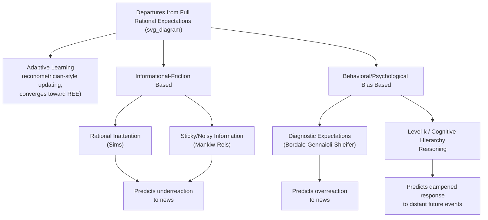

## Behavioral and Bounded Rationality Approaches to Expectations

### Overview

Behavioral and bounded-rationality approaches to expectations relax the rational expectations hypothesis not merely by assuming agents learn gradually (as in adaptive learning models) but by introducing systematic, psychologically motivated biases or explicit cognitive/informational constraints into the expectation-formation process itself. Where adaptive learning models retain an econometrician-like updating logic that eventually converges toward rational forecasts, this broader family of models — encompassing rational inattention, sticky information, diagnostic expectations, and level-k reasoning — allows for expectation errors that are systematic and persistent by construction, motivated either by genuine informational frictions (costly or delayed information acquisition) or by well-documented psychological heuristics from behavioral economics (representativeness, overreaction, anchoring). This family of models has grown substantially since the early 2000s, driven partly by survey-expectations evidence that appears difficult to reconcile with either strict rational expectations or standard adaptive learning.

### Motivation: Empirical Anomalies in Survey Expectations Data

**Key Points**

- Survey-based measures of inflation, output, and interest-rate expectations (e.g., the Survey of Professional Forecasters, the Michigan Survey of Consumers, and firm-level expectations surveys) have been extensively used to test the predictions of rational expectations directly, since these surveys provide a direct, observable proxy for the otherwise unobservable expectation object
- A recurring empirical finding is that individual and average forecast errors in these surveys are often **predictable using information available at the time the forecast was made** — a direct violation of the core rational expectations orthogonality condition ($\mathbb{E}[\eta_{t+1}|\Omega_t] = 0$)
- Two distinct empirical patterns are commonly documented: **underreaction** to news at the individual forecaster level (revisions to individual forecasts are too small relative to the new information received, generating serial correlation in individual forecast errors), alongside **overreaction** in some settings, particularly documented in analyses of consensus/average forecast revisions or specific asset-price and credit-cycle contexts [Inference: which pattern dominates, and under what conditions, is an active empirical question with results that vary by dataset, forecast horizon, and forecaster type (professional vs. household)]
- These patterns have motivated distinct classes of models designed to generate underreaction (sticky/noisy information) versus overreaction (diagnostic expectations) as their central predictions

### Rational Inattention (Sims, 2003)

**Key Points**

- Proposes that agents face a genuine **information-processing constraint** — modeled formally using concepts from information theory (Shannon mutual information/channel capacity) — meaning agents cannot costlessly observe and process all relevant economic data, and must optimally allocate limited attention across competing sources of information
- Rather than assuming agents ignore information for purely psychological reasons, rational inattention treats the resulting imperfect information as the outcome of a genuine **optimization problem**: agents choose how precisely to observe each variable, trading off the cost of more precise information against the benefit of more accurate decisions
- Generates expectation errors and sluggish responses to news that are, notably, still consistent with agents behaving **rationally** given their information constraint — the departure from standard rational expectations is in the informational environment, not in the optimization or updating logic itself
- This distinguishes rational inattention conceptually from behavioral-bias-based models: it is a theory of **optimal ignorance under a resource constraint**, not a theory of psychological error

### Sticky/Noisy Information Models (Mankiw-Reis, 2002)

**Key Points**

- Mankiw and Reis proposed that only a **fraction of agents update their information set** in any given period (mirroring the Calvo pricing structure used for nominal price rigidity), with the remaining agents continuing to forecast using **stale, outdated information** from whenever they last updated
- This "sticky information" structure generates a distinctive **Sticky-Information Phillips Curve**, which — unlike the standard forward-looking New Keynesian Phillips Curve under sticky prices — depends on a weighted average of **past** expectations of current inflation (formed at various past dates by agents who have not yet updated), producing a form of inflation persistence and a more gradual, delayed disinflation process following a credible policy change
- A closely related but distinct variant, **noisy information models** (building on the rational inattention tradition), have *all* agents update every period but receive only a **noisy signal** of the true state, generating gradual aggregate adjustment through a different mechanism (imprecise rather than stale information)
- Both sticky-information and noisy-information models are specifically designed to generate **underreaction**-type predictable forecast errors at the individual level, consistent with the empirical patterns discussed above

### Diagnostic Expectations (Bordalo-Gennaioli-Shleifer, and related work)

**Key Points**

- Grounded directly in the psychology and behavioral-economics literature on **representativeness** (Kahneman-Tversky), diagnostic expectations models propose that agents systematically **overweight** news that is representative of a possible future state relative to its true statistical likelihood
- Formally, a diagnostic expectation is often modeled as a distorted belief that exaggerates the true rational expectations forecast in the direction of recent news:

$$x_{t+1}^{e,\text{diagnostic}} = \mathbb{E}_t[x_{t+1}] + \theta \left(\mathbb{E}_t[x_{t+1}] - \mathbb{E}_{t-1}[x_{t+1}]\right), \quad \theta > 0$$

where the correction term captures the extent to which the *change* in the rational forecast (the "kernel of truth" in the news) is over-extrapolated

- This generates **overreaction**-type predictable errors, in contrast to the underreaction generated by sticky/noisy information models, and has been used prominently to model boom-bust credit cycles, excessive optimism during expansions followed by excessive pessimism during downturns, and asset-price overreaction to news [Inference: the specific magnitude of the diagnosticity parameter $\theta$ and its stability across applications is an actively researched empirical question]
- Diagnostic expectations models represent one of the more explicitly "behavioral" (as opposed to purely informational-friction-based) departures from rational expectations within this family, since the distortion is motivated by a documented cognitive bias rather than an optimization problem under a resource constraint

### Level-k Reasoning and Cognitive Hierarchy Models

**Key Points**

- Borrowed from behavioral game theory, level-k models assume agents differ in the **depth of strategic/rational reasoning** they apply: a "level-0" agent uses a simple, non-strategic rule of thumb; a "level-1" agent best-responds assuming everyone else is level-0; a "level-2" agent best-responds assuming everyone else is level-1; and so on, with full rational expectations corresponding to the limiting case of infinite reasoning depth
- Applied to macroeconomics (e.g., in models of forward guidance and the "forward guidance puzzle"), level-k-style bounded reasoning has been used to show that agents with finite reasoning depth respond much less strongly to announcements about the far future than full rational expectations would imply, offering an alternative resolution to the forward-guidance puzzle distinct from the incomplete-markets/HANK-based resolution
- The empirical calibration of the *distribution* of reasoning levels across the population (how many agents are level-1 vs. level-2 vs. higher) is typically drawn from experimental game-theory evidence rather than macro-specific data directly, which is sometimes raised as a limitation when importing these results into macro settings [Inference: the appropriateness of transferring level-k distributions estimated in laboratory games to macroeconomic expectation formation is a modeling choice subject to ongoing methodological debate]

### Illustrative Diagram: Taxonomy of Departures from Rational Expectations

### Comparative Summary

| Model | Core Mechanism | Typical Predicted Error Pattern |
| --- | --- | --- |
| Rational inattention | Optimal information-processing constraint | Underreaction / gradual adjustment |
| Sticky information | Fraction of agents forecast with stale information | Underreaction, persistence |
| Noisy information | All agents update, but with imprecise signals | Underreaction, gradual adjustment |
| Diagnostic expectations | Overweighting of representative/recent news | Overreaction, boom-bust dynamics |
| Level-k reasoning | Finite depth of strategic reasoning | Dampened response to distant/complex news |
| Adaptive learning | Statistical (econometrician-style) belief updating | Converges toward REE; transitional errors only |

### Integration into DSGE Modeling

**Key Points**

- Each of these frameworks can, in principle, be embedded into an otherwise standard DSGE model by replacing the rational-expectations operator $\mathbb{E}_t[\cdot]$ in the model's Euler equations and pricing/wage-setting conditions with the relevant behavioral or informationally constrained expectations operator, while retaining the rest of the model's optimization and general equilibrium structure
- Sticky-information and rational-inattention variants have been used to construct alternative Phillips Curves compared against the standard sticky-price New Keynesian Phillips Curve, testing which specification better matches inflation persistence and survey-expectations dynamics jointly
- Diagnostic-expectations-augmented DSGE models have been used to study credit cycles, financial crises, and the amplification of business-cycle fluctuations through belief-driven overreaction, complementing the financial-friction-based DSGE extensions developed in response to the post-2008 critique of standard DSGE modeling
- Computationally, most of these extensions are more tractable than full heterogeneous-agent (HANK) modeling, since they typically retain a representative (or small number of types of) agent(s) and modify only the expectations-formation rule, rather than introducing a full cross-sectional wealth/income distribution as a state variable [Inference: relative computational tractability compared to HANK modeling is a general characterization; specific implementations vary in complexity]

### Standing and Open Questions

**Conclusion**

Behavioral and bounded-rationality approaches to expectations represent one of the most active frontiers in modern macroeconomic modeling, directly motivated by survey-expectations evidence that both strict rational expectations and standard adaptive learning struggle to fully explain. No single framework among rational inattention, sticky information, diagnostic expectations, and level-k reasoning has emerged as a clear consensus replacement for rational expectations — different frameworks better match different empirical patterns (underreaction versus overreaction) and different application domains (Phillips Curve dynamics versus credit-cycle and asset-price dynamics), and the relative empirical support for each remains an actively contested and evolving area of research. [Inference: this assessment of the state of consensus reflects the general character of a still-developing literature rather than a definitively settled ranking of these approaches]

**Related Topics**

- Rational expectations hypothesis and the Lucas Critique
- Adaptive learning models (Evans-Honkapohja) and E-stability
- Sticky-Information Phillips Curve (Mankiw-Reis)
- Rational inattention and information theory in economics (Sims)
- Diagnostic expectations and credit cycle models
- Forward guidance puzzle and its alternative resolutions
- Expectations traps and self-fulfilling prophecies