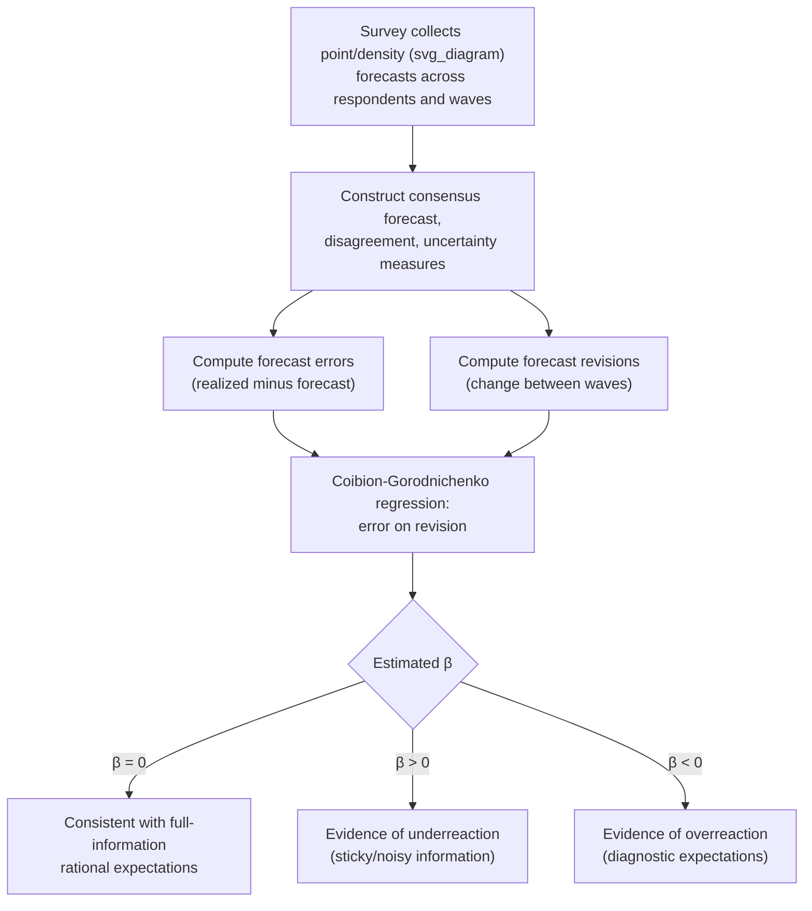

## Survey-Based Measures of Expectations

### Overview

Survey-based measures of expectations provide direct, observable proxies for the otherwise unobservable belief variables central to macroeconomic theory — inflation expectations, growth expectations, interest-rate expectations — by asking households, professional forecasters, firms, and financial market participants directly what they expect to happen. Because expectations enter virtually every modern macroeconomic model (Euler equations, Phillips Curves, asset pricing relationships) yet cannot be observed directly from market outcomes alone, survey data has become an indispensable empirical complement to theoretical expectations models, providing the primary evidence base used to test rational expectations, calibrate adaptive learning and behavioral models, and inform central bank communication strategy.

### Major Survey Instruments

**Key Points**

- **Survey of Professional Forecasters (SPF)**: administered by the Federal Reserve Bank of Philadelphia (originally by the American Statistical Association and NBER before 1990), collecting quarterly point and density (probabilistic) forecasts for GDP, inflation, unemployment, and other variables from a panel of professional economists — one of the longest-running and most heavily used survey datasets in empirical macroeconomics
- **University of Michigan Survey of Consumers**: a monthly household-level survey collecting inflation expectations, spending intentions, and broader consumer sentiment measures, widely used to study household (as opposed to professional) expectation formation, which often differs systematically from professional forecasts
- **New York Fed Survey of Consumer Expectations (SCE)**: a more recently developed monthly panel survey providing household-level density forecasts (not just point forecasts) across a range of variables, including inflation, home prices, and labor market outcomes, enabling richer analysis of the *distribution* of individual beliefs, not just the consensus mean
- **Consensus Economics and Blue Chip surveys**: privately compiled panels of professional forecasters (financial-sector and corporate economists) providing similar point-forecast data to the SPF but with different panel composition and broader international coverage
- **Central bank-specific surveys**: many central banks conduct their own surveys of professional forecasters, businesses, or households (e.g., the ECB's Survey of Professional Forecasters, the Bank of England's Decision Maker Panel and Inflation Attitudes Survey, the RBA's consumer inflation expectations survey), often specifically designed to monitor the credibility and anchoring of the central bank's own inflation target

### Point Forecasts vs. Density (Probabilistic) Forecasts

**Key Points**

- **Point forecasts** ask for a single expected value (e.g., "What do you expect CPI inflation to be over the next 12 months?"), which is the most common and longest-available format across most survey instruments
- **Density (probability distribution) forecasts** ask respondents to assign probabilities to different ranges or outcomes (e.g., "What probability do you assign to inflation being between 2% and 3% next year?"), which allows researchers to construct measures of forecaster **uncertainty** (typically the variance or interquartile range of the elicited subjective distribution) in addition to the central-tendency forecast
- The SPF has collected density forecasts since 1968 (and expanded coverage since), making it a particularly valuable dataset for studying not just average expectations but also **disagreement** across forecasters and each forecaster's own subjective **uncertainty**, both of which are theoretically important but were historically difficult to measure using only point-forecast data [Unverified: exact historical coverage dates and variable-by-variable availability should be confirmed against the current Philadelphia Fed SPF documentation, as survey scope has been expanded and revised over time]

### Key Derived Measures from Survey Data

**Example**

| Measure | Construction | Typical Use |
| --- | --- | --- |
| **Consensus (mean/median) forecast** | Average or median across respondents in a given survey wave | Standard proxy for "the market's" or "the public's" expectation |
| **Forecast disagreement** | Cross-sectional dispersion (e.g., standard deviation or interquartile range) of point forecasts across respondents | Proxy for genuine belief heterogeneity; used to test models predicting common vs. dispersed information |
| **Forecaster-level uncertainty** | Dispersion of an individual respondent's own subjective probability distribution (from density forecasts) | Distinguished from disagreement; measures each forecaster's own confidence, not variation across forecasters |
| **Forecast error** | Realized value minus the previously elicited forecast | Core object used to test the rational expectations orthogonality condition |
| **Forecast revision** | Change in an individual's forecast between consecutive survey waves | Used to test underreaction/overreaction to news (regressing forecast errors on prior revisions) |

### Empirical Testing Framework: The Coibion-Gorodnichenko Regression

**Key Points**

- A widely used empirical specification (Coibion and Gorodnichenko, 2015) regresses the **average forecast error** on the **average forecast revision**:

$$x_{t+h} - \bar{\mathbb{E}}_t[x_{t+h}] = \alpha + \beta\left(\bar{\mathbb{E}}_t[x_{t+h}] - \bar{\mathbb{E}}_{t-1}[x_{t+h}]\right) + \varepsilon_t$$

- Under full-information rational expectations, $\beta$ should be zero (forecast errors are unpredictable using any information available at the time the forecast was formed, including the forecaster's own recent revision)
- A **positive** estimated $\beta$ is interpreted as evidence of **underreaction/informational rigidity** — consensus forecasts adjust too little to new information relative to what rational expectations would imply, consistent with sticky-information or noisy-information models
- A **negative** estimated $\beta$ is interpreted as evidence of **overreaction** — consensus forecasts adjust too much, consistent with diagnostic-expectations-type models
- This single regression framework has become the standard empirical workhorse for adjudicating between underreaction-based and overreaction-based behavioral/informational models of expectations, and has been applied across many variables (inflation, GDP growth, interest rates) and many countries [Inference: findings on the sign and magnitude of $\beta$ vary substantially across the specific variable, forecaster population (professional vs. household), country, and sample period studied, and no single universal finding holds across all applications]

### Illustrative Diagram: The Survey-Testing Pipeline

### Household vs. Professional Forecaster Divergence

**Key Points**

- A robust and widely documented empirical finding is that **household inflation expectations (e.g., from the Michigan Survey) systematically differ from professional forecaster expectations (e.g., from the SPF)** — households' inflation expectations tend to be higher on average, more volatile, more dispersed across individuals, and more strongly correlated with salient personal experiences (e.g., recent gasoline or grocery price changes) than professional forecasts
- This divergence has motivated research into whether monetary policy transmission through the **household expectations channel** operates differently than through the **financial-market/professional-forecaster channel**, since standard New Keynesian models typically assume a single, homogeneous rational-expectations-forming representative agent that does not distinguish between these populations
- Central banks monitor household inflation expectations survey data specifically as an indicator of whether inflation expectations remain **anchored** to the policy target, since a sustained drift in household expectations away from target is viewed as a warning sign for potential de-anchoring, even when professional forecasts remain well-anchored [Inference: the precise weight central banks place on household versus professional survey measures in practice varies by institution and is not uniformly documented across all central banks]

### Market-Based Alternatives and Complements

**Key Points**

- **Break-even inflation rates** derived from the yield spread between nominal and inflation-indexed government bonds (e.g., US TIPS breakevens) provide a market-based, real-time alternative measure of inflation expectations, distinct from survey-based measures
- Market-based measures reflect the expectations of **marginal, typically sophisticated financial market participants** and are available at high (often daily) frequency, but embed an **inflation risk premium** and **liquidity premium** that must be stripped out to isolate the pure expectations component — a nontrivial econometric decomposition problem
- Survey-based and market-based measures of inflation expectations often move together but can diverge meaningfully, particularly during periods of financial market stress (when liquidity premia in inflation-indexed bonds can be elevated) — comparing the two is a standard robustness exercise in applied monetary economics [Inference: specific decomposition methodologies for separating expectations from risk/liquidity premia vary across studies and central bank technical approaches]

### Applications in DSGE and Macroeconomic Modeling

**Key Points**

- Survey expectations data is used directly as an **additional observable** in Bayesian estimation of DSGE models incorporating non-rational-expectations mechanisms (sticky information, adaptive learning, diagnostic expectations), providing direct empirical discipline on the expectations-formation block of the model rather than relying solely on the model's other observables (output, inflation, interest rates) to indirectly identify expectations parameters
- Survey-based disagreement and uncertainty measures have been used as proxies for the (otherwise unobservable) "uncertainty shocks" studied in DSGE models incorporating time-varying volatility, since periods of unusually high forecaster disagreement often coincide with periods research has separately identified as high-uncertainty episodes [Inference: the precise mapping between survey-based disagreement and model-based "uncertainty shocks" is an approximation, not an exact theoretical equivalence, and is treated with corresponding caution in the literature]

### Practical Limitations and Caveats

**Key Points**

- **Survey response quality and incentives**: unlike market-based measures where participants have direct financial stakes in accuracy, survey respondents (particularly households) face no direct financial cost for inaccurate or careless responses, raising measurement-error concerns that must be addressed through data cleaning and outlier treatment
- **Panel composition changes**: professional forecaster panels (SPF, Blue Chip) experience entry and exit of individual forecasters over time, which can complicate the interpretation of changes in consensus forecasts or disagreement measures if not carefully addressed (e.g., using only a balanced panel of continuously participating forecasters for certain analyses)
- **Framing and question-wording sensitivity**: survey-based inflation expectations, particularly for households, have been shown to be sensitive to question wording and elicitation format (e.g., asking about "prices in general" versus a specific price index), complicating cross-survey and cross-country comparisons [Unverified: the magnitude of this sensitivity varies across studies and specific survey redesign episodes]

**Related Topics**

- Rational expectations hypothesis and empirical testing
- Behavioral and bounded rationality approaches to expectations
- Adaptive learning models and constant-gain learning
- Sticky and noisy information models (Mankiw-Reis, Sims)
- Diagnostic expectations and the Coibion-Gorodnichenko test
- Inflation anchoring and central bank credibility
- Break-even inflation rates and inflation risk premia