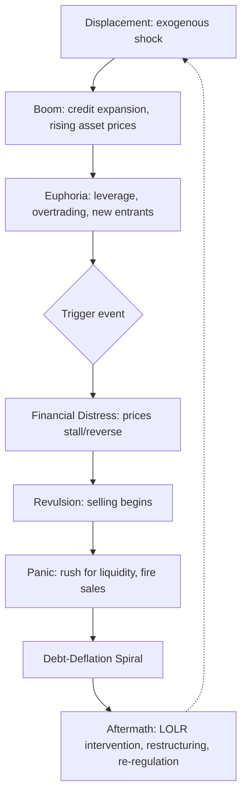

## Anatomy of a Financial Crisis

### Definition and Scope

A financial crisis is a disruption to financial markets in which asset prices collapse, liquidity evaporates, and credit intermediation breaks down severely enough to impair the real economy. Financial crises are distinct from normal business-cycle downturns because they involve a self-reinforcing interaction between falling asset prices, impaired balance sheets, and contracting credit supply — a dynamic often called a "financial accelerator" or "doom loop."

Crises manifest in several overlapping forms:

- **Banking crises**: bank runs, insolvency, and credit crunches (e.g., 2008 US subprime crisis)
- **Currency crises**: sharp, unsustainable depreciations of a currency, often tied to a loss of confidence in a peg (e.g., 1997 Asian Financial Crisis)
- **Sovereign debt crises**: a government's inability or unwillingness to service its debt (e.g., 2010–2012 European sovereign debt crisis)
- **Twin/triple crises**: simultaneous banking, currency, and/or sovereign debt crises, common in emerging markets

### The Canonical Anatomy: A Five-Stage Framework

Building on the work of Hyman Minsky and later formalized by Charles Kindleberger in *Manias, Panics, and Crashes*, most financial crises follow a recognizable sequence.

**Stage 1 — Displacement**

An exogenous shock changes profit expectations in at least one sector of the economy. Examples include a technological innovation (the internet in the late 1990s), financial deregulation, a large capital inflow, or a shift in monetary policy. This shock creates new profit opportunities and closes off others, setting the stage for a boom.

**Stage 2 — Boom (Credit Expansion)**

Optimism builds and credit expands to finance the new opportunities. Asset prices begin rising. Bank lending, often accommodated by loose monetary policy, feeds the expansion. Speculation increases as more participants enter the market, extrapolating past price gains into the future.

**Stage 3 — Euphoria (Overtrading and Mania)**

Prices detach from underlying fundamentals. Leverage rises sharply as investors borrow to buy appreciating assets, expecting to sell at a profit — a pattern Kindleberger termed "overtrading." New, often unsophisticated, investors enter the market ("this time is different" thinking). Financial innovation proliferates to accommodate demand for leveraged exposure, frequently outpacing regulatory oversight.

**Stage 4 — Crisis (Distress and Panic)**

Some triggering event — a piece of negative news, the failure of a firm, or simply insiders realizing prices are unsustainable — causes a reversal. This stage itself has substructure:

- *Financial distress*: Asset prices stall or begin to fall; highly leveraged positions become unprofitable
- *Revulsion*: Investors realize the boom was unsustainable and begin selling
- *Panic (discredit)*: A rush for liquidity ensues — the desire to convert any asset into cash. Fire sales depress prices further, which impairs more balance sheets, which forces more sales — a debt-deflation spiral (Irving Fisher's mechanism)

**Stage 5 — Aftermath (Revulsion, Consolidation, or Policy Response)**

The crisis resolves through some combination of: a lender of last resort halting the panic, government fiscal/monetary intervention, debt restructuring, widespread bankruptcy, and eventual re-regulation of the sector that caused the crisis.

### Core Theoretical Mechanisms

**Minsky's Financial Instability Hypothesis**

Hyman Minsky classified borrowers/investment units into three categories based on their debt-servicing capacity, and argued that financial systems endogenously migrate from stability toward fragility during expansions:

- **Hedge finance**: cash flows from the investment are sufficient to cover both principal and interest payments
- **Speculative finance**: cash flows cover interest but not principal; the borrower must roll over debt
- **Ponzi finance**: cash flows cover neither interest nor principal; the borrower depends entirely on the appreciation of the underlying asset to refinance

The "Minsky Moment" is the point at which asset prices stop rising, and Ponzi units can no longer refinance, forcing asset sales that trigger the broader downturn.

**Fisher's Debt-Deflation Theory**

Irving Fisher (1933) described nine interlinked steps by which over-indebtedness triggers a self-reinforcing deflationary spiral. The core mechanical relationship, in simplified form, is that if debt is fixed in nominal terms, a decline in the price level $P$ raises the real debt burden:

$$\text{Real Debt Burden} = \frac{\text{Nominal Debt}}{P}$$

As distressed borrowers sell assets to raise cash, prices fall further, which raises real debt burdens further, inducing more distress selling.

**The Financial Accelerator (Bernanke, Gertler, Gilchrist)**

This mechanism explains why small shocks can produce large, persistent output effects. It rests on the "external finance premium" — the gap between the cost of external funds and the opportunity cost of internal funds — which rises as a borrower's net worth falls:

$$\text{External Finance Premium} = f(\text{Net Worth}^{-})$$

A negative shock to net worth (e.g., a fall in collateral asset prices) raises the cost of external finance, which reduces investment and spending, which further reduces asset prices and net worth — amplifying and propagating the initial shock.

**Diamond–Dybvig Bank Runs**

The Diamond–Dybvig (1983) model formalizes why banks are inherently vulnerable to self-fulfilling runs. Banks perform maturity transformation — funding illiquid, long-term loans with liquid, short-term deposits. If depositors believe others will withdraw, it is individually rational to withdraw as well, even if the bank is fundamentally solvent, because the bank cannot liquidate long-term assets fast enough to pay all depositors on demand. This produces two possible equilibria: the "good" equilibrium (only depositors who genuinely need liquidity withdraw) and the "bank run" equilibrium (everyone withdraws, and the bank fails even though it was solvent under normal conditions).

**Sovereign Debt and Currency Crisis Models**

- *First-generation models* (Krugman, 1979): a currency peg becomes unsustainable when persistent fiscal deficits monetized by the central bank deplete foreign reserves, leading to a speculative attack once reserves fall to a critical threshold
- *Second-generation models* (Obstfeld, 1994): self-fulfilling crises can occur even with sound fundamentals, if investors believe a government will abandon a peg (e.g., due to unemployment costs of defending it), and that belief becomes rational once enough investors share it
- *Third-generation models* (post-1997 Asian crisis): incorporate corporate/bank balance-sheet currency mismatches (borrowing in foreign currency, earning in domestic currency), which amplify a currency depreciation into a full banking crisis

### Key Amplification Channels

**Leverage and Procyclicality**

Financial intermediaries tend to expand balance sheets during booms and contract them during busts, amplifying the cycle rather than dampening it. A key relationship is between leverage and value-at-risk-based risk management: as asset prices rise, measured risk falls, permitting more leverage; as prices fall, measured risk rises, forcing deleveraging precisely when liquidity is scarcest.

**Fire Sales**

When distressed institutions must sell assets quickly, they often receive prices below fundamental value because the natural buyers are capital-constrained or absent. This depresses market prices for all holders of similar assets (mark-to-market losses), even those who did not sell — a contagion channel independent of any direct contractual link.

**Contagion**

Crises propagate across institutions and countries through several channels:

- **Direct exposure**: interbank lending, counterparty credit and derivative exposures
- **Common creditor/asset holdings**: institutions holding overlapping portfolios are forced to sell similar assets simultaneously
- **Information contagion**: distress at one institution or country causes investors to reassess risk at similar institutions/countries ("wake-up call" effect)
- **Trade and real linkages**: currency crises can reduce demand for trading partners' exports

**Liquidity Spirals**

Market liquidity (ease of transacting without moving prices) and funding liquidity (ease of obtaining financing) reinforce each other. A fall in asset prices reduces the value of collateral, tightening funding liquidity, which forces sales, which reduces market liquidity further — the "liquidity spiral" described by Brunnermeier and Pedersen.

### Case Illustration: The 2008 Global Financial Crisis

**Key Points**

- **Displacement**: financial deregulation, low interest rates post-dot-com, and securitization innovation (mortgage-backed securities, CDOs) expanded the supply of mortgage credit
- **Boom/Euphoria**: US house prices rose steadily; subprime lending expanded rapidly; leverage in the shadow banking system (investment banks, structured investment vehicles) rose to extreme levels, often 30:1 or higher
- **Trigger**: US house prices peaked around 2006 and began falling; subprime mortgage defaults rose in 2007
- **Crisis**: Bear Stearns's collapse (March 2008) and Lehman Brothers's bankruptcy (September 2008) triggered a wholesale funding freeze; money market funds "broke the buck"; interbank lending rates (LIBOR-OIS spread) spiked, signaling acute counterparty distrust
- **Aftermath**: coordinated central bank liquidity provision, TARP capital injections, near-zero policy rates, and quantitative easing; subsequent re-regulation via the Dodd-Frank Act and Basel III capital/liquidity standards

[Inference] The precise counterfactual effect of any single policy intervention (e.g., whether TARP alone prevented a deeper collapse) remains debated among economists, since the observed outcome cannot be directly compared to an unobserved alternative path.

### Case Illustration: 1997 Asian Financial Crisis

- **Displacement**: capital account liberalization in Thailand, Indonesia, South Korea, and others attracted large short-term foreign capital inflows during the early-to-mid 1990s
- **Boom**: inflows financed rapid credit growth, real estate investment, and current account deficits; currencies were pegged (formally or informally) to the US dollar
- **Vulnerability**: banks and corporations borrowed heavily in US dollars while earning revenue in local currency — a currency mismatch that amplified any depreciation
- **Trigger/Crisis**: Thailand's baht devaluation in July 1997 triggered contagion across the region as investors reassessed similar vulnerabilities elsewhere (a "wake-up call"); capital flight forced abandonment of currency pegs, and currency depreciation raised the local-currency value of dollar debts, causing widespread corporate and bank insolvency
- **Aftermath**: IMF-led rescue packages with conditionality (fiscal austerity, structural reform); several countries subsequently built large foreign exchange reserve buffers as self-insurance against future crises

### Warning Indicators (Early Warning Systems)

Economists and institutions (IMF, BIS, central banks) monitor variables associated with elevated crisis risk:

- **Credit-to-GDP gap**: the deviation of the credit-to-GDP ratio from its long-run trend; a widely used Basel III countercyclical capital buffer trigger
- **Rapid credit growth**: sustained growth in private credit substantially above GDP growth
- **Asset price growth**: sharp appreciation in equity or real estate prices relative to historical norms or rental/earnings yields
- **Current account deficits**: persistent, large deficits financed by volatile short-term capital
- **Maturity/currency mismatches**: short-term liabilities funding long-term assets, or foreign-currency liabilities funding local-currency assets
- **Rising leverage** across households, corporates, or the financial sector

[Unverified] The predictive accuracy of any specific early-warning indicator threshold is contested in the empirical literature, as such models have historically generated both false positives and missed crises out-of-sample.

### Policy Responses

**Crisis Containment (Short-Run)**

- **Lender of last resort**: central bank liquidity provision to solvent-but-illiquid institutions, following the classical Bagehot rule (lend freely, at a penalty rate, against good collateral)
- **Deposit insurance and guarantees**: designed to prevent self-fulfilling bank runs by removing depositors' incentive to withdraw preemptively
- **Recapitalization**: government equity injections into undercapitalized banks
- **Asset purchase/relief programs**: removing impaired assets from bank balance sheets to restore lending capacity

**Structural Reform (Long-Run)**

- **Macroprudential regulation**: countercyclical capital buffers, loan-to-value and debt-to-income limits, and systemic risk surcharges for large institutions
- **Microprudential regulation**: capital adequacy requirements (Basel III), liquidity coverage ratios, and stress testing
- **Resolution regimes**: mechanisms (e.g., "bail-in" provisions) to wind down failing institutions without taxpayer-funded bailouts

### Illustrative Diagram: Balance Sheet Contagion Loop (svg_diagram)

<svg xmlns="http://www.w3.org/2000/svg" viewBox="0 0 800 420">
<text x="400" y="30" font-size="18" font-weight="bold" text-anchor="middle" font-family="sans-serif">Balance Sheet Contagion Loop (svg_diagram)</text>
<rect x="40" y="70" width="200" height="70" rx="8" fill="#fde2e2" stroke="#c0392b" stroke-width="1.5" />
<text x="140" y="100" font-size="14" text-anchor="middle" font-family="sans-serif">Asset Prices Fall</text>
<text x="140" y="120" font-size="12" text-anchor="middle" font-family="sans-serif" fill="#555">(trigger shock)</text>
<rect x="300" y="70" width="200" height="70" rx="8" fill="#fdebd0" stroke="#d35400" stroke-width="1.5" />
<text x="400" y="100" font-size="14" text-anchor="middle" font-family="sans-serif">Bank/Firm Net Worth</text>
<text x="400" y="120" font-size="12" text-anchor="middle" font-family="sans-serif" fill="#555">Falls (collateral value drop)</text>
<rect x="560" y="70" width="200" height="70" rx="8" fill="#fcf3cf" stroke="#b7950b" stroke-width="1.5" />
<text x="660" y="100" font-size="14" text-anchor="middle" font-family="sans-serif">External Finance</text>
<text x="660" y="120" font-size="12" text-anchor="middle" font-family="sans-serif" fill="#555">Premium Rises</text>
<rect x="560" y="200" width="200" height="70" rx="8" fill="#d5f5e3" stroke="#1e8449" stroke-width="1.5" />
<text x="660" y="230" font-size="14" text-anchor="middle" font-family="sans-serif">Credit Supply</text>
<text x="660" y="250" font-size="12" text-anchor="middle" font-family="sans-serif" fill="#555">Contracts (deleveraging)</text>
<rect x="300" y="200" width="200" height="70" rx="8" fill="#d6eaf8" stroke="#1f618d" stroke-width="1.5" />
<text x="400" y="230" font-size="14" text-anchor="middle" font-family="sans-serif">Forced Asset Sales</text>
<text x="400" y="250" font-size="12" text-anchor="middle" font-family="sans-serif" fill="#555">(fire sales)</text>
<rect x="40" y="200" width="200" height="70" rx="8" fill="#fde2e2" stroke="#c0392b" stroke-width="1.5" />
<text x="140" y="230" font-size="14" text-anchor="middle" font-family="sans-serif">Asset Prices Fall</text>
<text x="140" y="250" font-size="12" text-anchor="middle" font-family="sans-serif" fill="#555">Further</text>
<rect x="270" y="320" width="260" height="70" rx="8" fill="#e8daef" stroke="#6c3483" stroke-width="1.5" />
<text x="400" y="350" font-size="14" text-anchor="middle" font-family="sans-serif">Real Economy</text>
<text x="400" y="370" font-size="12" text-anchor="middle" font-family="sans-serif" fill="#555">Investment/consumption fall</text>
<line x1="240" y1="105" x2="300" y2="105" stroke="#333" stroke-width="2" marker-end="url(#arrow)" />
<line x1="500" y1="105" x2="560" y2="105" stroke="#333" stroke-width="2" marker-end="url(#arrow)" />
<line x1="660" y1="140" x2="660" y2="200" stroke="#333" stroke-width="2" marker-end="url(#arrow)" />
<line x1="560" y1="235" x2="500" y2="235" stroke="#333" stroke-width="2" marker-end="url(#arrow)" />
<line x1="300" y1="235" x2="240" y2="235" stroke="#333" stroke-width="2" marker-end="url(#arrow)" />
<line x1="140" y1="200" x2="140" y2="140" stroke="#333" stroke-width="2" stroke-dasharray="5,4" marker-end="url(#arrow)" />
<line x1="400" y1="270" x2="400" y2="320" stroke="#333" stroke-width="2" marker-end="url(#arrow)" />
<line x1="660" y1="270" x2="450" y2="330" stroke="#333" stroke-width="2" marker-end="url(#arrow)" />
</svg>

### Common Pitfalls and Misconceptions

- **Mistaking correlation for cause**: rising leverage or credit growth is a *symptom* of increasing fragility, not necessarily the sole cause; the underlying displacement and expectations shift matter equally
- **Assuming crises require irrational behavior**: several formal models (e.g., Diamond-Dybvig, second-generation currency crisis models) show that self-fulfilling crises can occur among fully rational agents responding to coordination problems
- **Treating "this time is different" skepticism as sufficient**: recognizing a bubble in real time is empirically difficult even for informed observers, since fundamentals are genuinely uncertain during a boom
- **Conflating illiquidity and insolvency**: the appropriate policy response differs sharply — lender-of-last-resort support is appropriate for illiquid-but-solvent institutions, while insolvent institutions generally require resolution or recapitalization

### Practical Example: Identifying Stage of a Hypothetical Crisis

Consider a hypothetical economy where a central bank has held interest rates near zero for several years (displacement), commercial real estate lending has grown at 15% annually for three years versus 4% nominal GDP growth (boom), and a growing share of new loans require refinancing within 12 months because rental income does not cover debt service (a shift toward Ponzi finance, signaling euphoria). Applying the Minsky framework, an analyst would flag this economy as approaching a "Minsky Moment": any shock that halts real estate price appreciation (e.g., a policy rate increase) would leave a large share of borrowers unable to roll over debt, likely triggering the crisis and panic stages described above.

### **Related Topics**

- Bank runs and the Diamond–Dybvig model in depth
- Sovereign debt crises and default dynamics
- Currency crisis models (first, second, and third generation)
- Macroprudential policy and countercyclical capital buffers
- The lender of last resort and Bagehot's rule
- Financial contagion and network models of systemic risk
- The 2008 Global Financial Crisis: detailed timeline and policy response
- Sudden stops and capital flow reversals in emerging markets
- Debt-deflation and Fisher's theory in historical context (the Great Depression)
- Shadow banking and non-bank financial intermediation risk