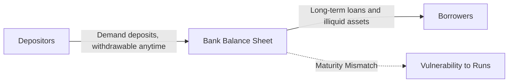
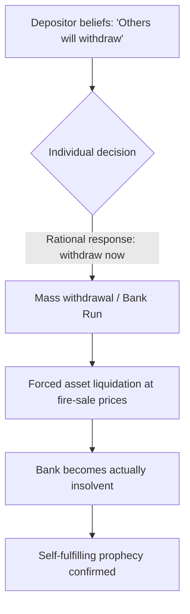
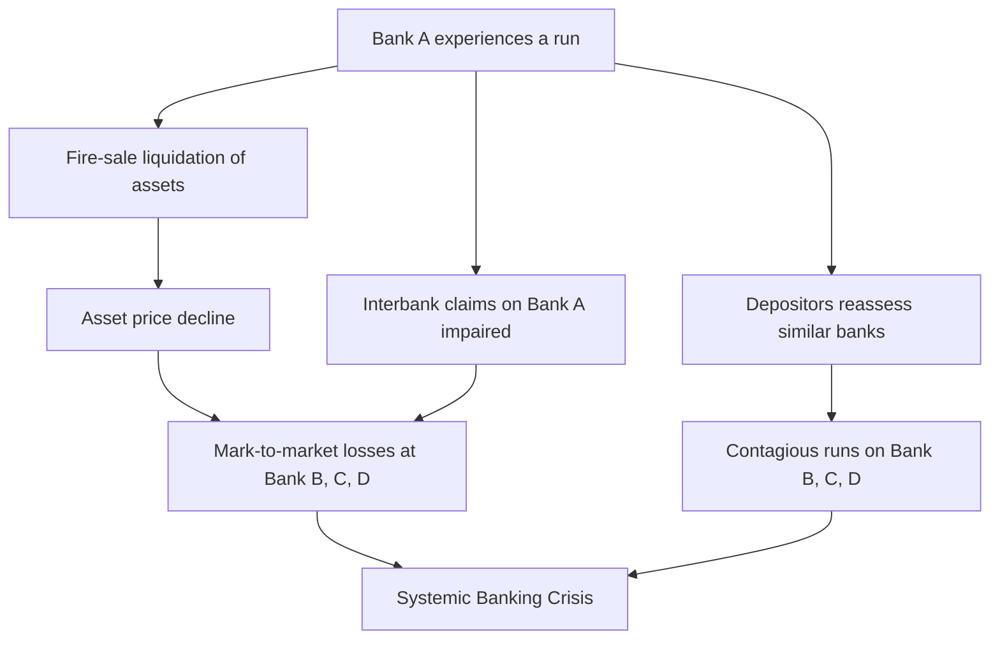
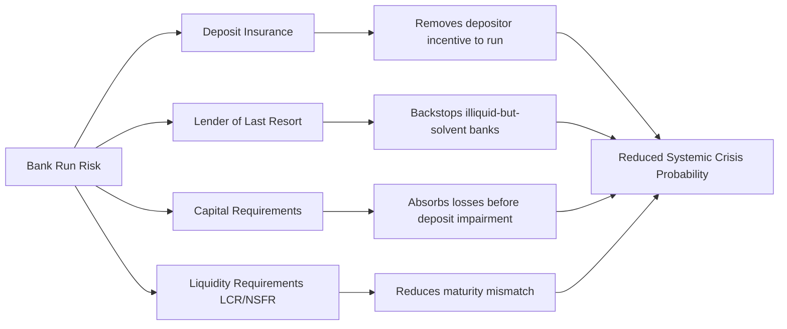

## Banking Crises and Bank Runs

### Definitions and Core Concepts

A **banking crisis** is a situation in which a significant share of a banking system's institutions become insolvent or illiquid simultaneously, triggering disruptions to credit intermediation and, typically, real economic activity. A **bank run** is the more specific phenomenon in which depositors or other short-term creditors withdraw funds from a bank en masse, driven by fear that the bank will be unable to honor withdrawal requests in full.

Banking crises and bank runs are distinct but tightly linked: a run can cause an otherwise solvent bank to fail (a liquidity-driven crisis), while a run can also be the *transmission mechanism* through which an underlying insolvency problem becomes a full-blown failure. Systemic banking crises occur when runs, insolvencies, or both spread across many institutions at once, often through interbank linkages, common exposures, or contagion in depositor beliefs.

### The Fractional Reserve Banking Structure

Banking crises are rooted in the basic structure of fractional reserve banking, in which banks hold liquid reserves equal to only a fraction of their deposit liabilities while lending out the remainder in longer-term, less liquid assets (loans, mortgages, securities).

$$\text{Reserves} + \text{Illiquid Assets} = \text{Deposits} + \text{Equity}$$

This creates a fundamental **maturity mismatch**: liabilities (deposits) are payable on demand, while assets (loans) can only be liquidated slowly or at a loss. This mismatch is what makes banks structurally vulnerable to runs, even when they are fundamentally solvent under normal conditions.

### The Diamond-Dybvig Model

The canonical theoretical framework for bank runs is the **Diamond-Dybvig model** (Diamond and Dybvig, 1983). It formalizes why banks are useful (liquidity insurance) and why that same function makes them fragile.

**Key Points**

- Banks provide **liquidity transformation**: they pool deposits from many individuals with uncertain, idiosyncratic liquidity needs and invest in illiquid, higher-return long-term projects.
- Depositors are of two types: "early" types who need to consume in period 1, and "late" types who can wait until period 2. Ex ante, no depositor knows which type they will be.
- The bank offers a demand-deposit contract promising a fixed payment $r_1$ to anyone who withdraws early, and a larger payment $r_2$ to those who wait, funded by the return on long-term investment.
- **The good equilibrium**: only true early types withdraw in period 1; late types wait and receive the higher payoff $r_2$. This equilibrium achieves efficient risk-sharing.
- **The bad equilibrium (bank run)**: if late-type depositors *believe* other late types will withdraw early, it becomes individually rational for them to withdraw early too, since the bank serves depositors sequentially ("first come, first served") and assets liquidated early are sold at a loss. This is a **self-fulfilling prophecy** — the run is not necessarily triggered by any change in fundamentals.
- The model demonstrates **multiple equilibria**: the same bank, with the same balance sheet, can end up in either the efficient equilibrium or the run equilibrium depending purely on depositor expectations.

**Sequential Service Constraint**

The mechanism that makes runs rational is the sequential service constraint: withdrawals are honored in the order received, on a first-come-first-served basis, until funds are exhausted. This creates a payoff structure resembling a **coordination game**:

$$U_i(\text{withdraw early} \mid \text{others run}) > U_i(\text{wait} \mid \text{others run})$$

Even a late-type depositor who has no genuine need for early consumption will rationally join the run if they expect the bank's liquidation value to be insufficient to pay late withdrawers, since waiting risks receiving nothing.

### Fundamentals-Based vs. Panic-Based Runs

A central analytical distinction in the literature is between two triggers for runs, though in practice they often interact.

**Example**

- **Fundamentals-based runs**: Depositors receive genuine adverse information about a bank's asset quality (e.g., rising loan defaults, falling collateral values) and rationally update their beliefs that the bank may become insolvent, prompting withdrawal. This is consistent with information-based models of bank runs (e.g., Gorton, 1988), where runs are correlated with the business cycle and observable leading indicators.
- **Panic-based (sunspot) runs**: Runs occur due to shifts in depositor sentiment or coordination failure unrelated to any change in the bank's actual solvency — as in the pure Diamond-Dybvig equilibrium-selection mechanism. These are often described as driven by "animal spirits" or extrinsic, non-fundamental signals ("sunspots").

[Inference] In practice, empirically distinguishing panic-driven runs from fundamentals-driven runs is difficult, since panics often originate from ambiguous or noisy signals about fundamentals, and a "pure" sunspot run with zero informational content is a theoretical idealization rarely observed in isolation.

### Depositor Coordination Problem

The bank run can be modeled game-theoretically as a **coordination game with multiple Nash equilibria**:

| Depositor's Strategy | If Others Wait | If Others Run |
| --- | --- | --- |
| Wait | High payoff ($r_2$) — efficient outcome | Low/zero payoff — worst outcome |
| Run | Moderate payoff ($r_1$) — foregone gains | Moderate payoff ($r_1$, if fast enough) — best individual response |

This payoff structure means that **"Wait, Wait"** and **"Run, Run"** are both Nash equilibria. Coordination on the bad equilibrium is possible without any change in fundamentals, and beliefs about others' actions become self-confirming.

### Contagion and Systemic Banking Crises

Individual bank runs can escalate into systemic banking crises through several transmission channels:

**Key Points**

- **Interbank exposure contagion**: Banks lend to and hold claims on each other in interbank markets; the failure of one bank can directly impair the balance sheets of its counterparties.
- **Information contagion**: A run or failure at one bank can lead depositors to update their beliefs about the solvency of *other*, seemingly unrelated banks, especially those perceived to share similar risk exposures (common shocks, similar loan portfolios, or geographic overlap).
- **Fire-sale externalities**: When one distressed bank liquidates assets rapidly, it depresses market prices for those assets. Other banks holding similar assets must mark down their own balance sheets, potentially pushing otherwise-solvent banks toward insolvency — a mechanism formalized in the work of Shleifer and Vishny on fire sales.
- **Payment system disruption**: Interconnection through clearing and settlement systems means a failure can freeze payment flows economy-wide, amplifying real-sector disruption beyond the financial sector itself.

### Historical Episodes

**Example**

- **U.S. Banking Panics (1873, 1893, 1907, 1930-1933)**: Pre-deposit-insurance era panics characterized by classic depositor runs, culminating in the wave of bank failures during the Great Depression, which motivated the creation of the Federal Deposit Insurance Corporation (FDIC) in 1933.
- **Savings and Loan Crisis (1980s, United States)**: A slower-moving crisis driven primarily by interest-rate risk and asset-liability mismatches (fixed-rate mortgages funded by short-term deposits) combined with deregulation and risk-shifting incentives, rather than classic overnight runs.
- **Nordic Banking Crises (early 1990s)**: Sweden, Finland, and Norway experienced systemic banking crises following financial liberalization, credit booms, and subsequent real estate collapses.
- **Asian Financial Crisis (1997-1998)**: Featured currency crises intertwined with banking sector fragility, capital flight, and runs on banks perceived to be exposed to foreign-currency-denominated debt.
- **Northern Rock (UK, 2007)**: A modern, visually iconic bank run in which depositors queued physically outside branches after news broke of the bank's reliance on wholesale funding markets that had seized up; notable as a wholesale funding crisis that spilled into a retail depositor run.
- **Global Financial Crisis (2007-2009)**: Featured a "run" not primarily on traditional retail deposits (largely protected by deposit insurance in advanced economies) but on **wholesale, short-term funding** — repo markets, commercial paper, and interbank lending — a phenomenon termed the "shadow banking run" by Gorton and Metrick.
- **Silicon Valley Bank (2023, United States)**: [Unverified — details subject to ongoing analysis] A rapid, largely digitally-mediated run in which a concentrated depositor base (many with uninsured deposits above the $250,000 FDIC limit) withdrew an estimated tens of billions of dollars within roughly 24 hours, aided by social media-driven information spread and mobile banking, following disclosure of unrealized losses on the bank's held-to-maturity securities portfolio amid rising interest rates.

### Modern "Silent Runs" and Wholesale Funding

Contemporary banking crises increasingly manifest through wholesale and shadow banking channels rather than classic retail queues.

**Key Points**

- **Repo market runs**: Short-term repurchase agreement (repo) lenders, seeing rising counterparty risk, refuse to roll over funding or demand higher haircuts, forcing the borrowing institution to deleverage rapidly.
- **Commercial paper market freezes**: Money market funds and other short-term lenders stop purchasing a bank's or shadow bank's commercial paper, cutting off a key funding source.
- **Digital/social-media-accelerated runs**: The speed of modern bank runs has increased substantially relative to historical episodes, since withdrawals can be executed instantly via mobile banking apps and panic can spread virally through social media, compressing what once took days or weeks into hours. [Inference] This dynamic likely reduces the effectiveness of traditional crisis-management tools (e.g., weekend regulatory interventions) that assumed a slower run trajectory.

### Bank Solvency vs. Liquidity: The Diagnostic Distinction

A central practical and policy question during any banking crisis is distinguishing between two different failure modes:

| Dimension | Liquidity Crisis | Solvency Crisis |
| --- | --- | --- |
| Underlying condition | Assets > Liabilities, but assets cannot be sold/converted to cash fast enough | Liabilities > Assets (negative net worth) |
| Appropriate policy response | Lender of last resort (LOLR) lending against good collateral | Resolution, recapitalization, or orderly wind-down |
| Risk if misdiagnosed as the other | Solvent bank unnecessarily fails / insolvent bank propped up with public funds (zombie bank) | — |

[Inference] In practice this distinction is often blurred in real time because asset valuations are uncertain during a crisis, and a liquidity crisis that persists (forcing fire-sale asset liquidation) can itself *cause* genuine insolvency — meaning the two categories can become observationally and causally intertwined as a crisis unfolds.

### Policy Responses and Crisis Prevention Tools

**Deposit Insurance**

Government-backed deposit insurance (e.g., FDIC in the U.S., up to statutory coverage limits) directly targets the Diamond-Dybvig run mechanism by removing depositors' incentive to run: since their funds are guaranteed regardless of the bank's fate, there is no payoff advantage to withdrawing early. This is credited with substantially reducing the frequency of classic retail bank runs in economies where it is credibly implemented.

**Lender of Last Resort (LOLR)**

Central banks can act as lenders of last resort, a doctrine associated with Walter Bagehot's dictum ("Bagehot's Rule"): lend freely, against good collateral, at a penalty rate, to illiquid but solvent institutions. This provides emergency liquidity to stem a run without requiring the central bank to absorb genuine credit losses from insolvent institutions.

**Key Points**

- **Capital requirements** (e.g., Basel III risk-weighted capital ratios) increase the equity buffer absorbing losses before depositors are at risk, reducing the fundamentals-based run trigger.
- **Liquidity requirements** — the Liquidity Coverage Ratio (LCR) and Net Stable Funding Ratio (NSFR) under Basel III — directly target the maturity mismatch by requiring banks to hold sufficient high-quality liquid assets and stable funding.
- **Deposit insurance premiums and resolution regimes** (e.g., Dodd-Frank's Orderly Liquidation Authority in the U.S.) aim to allow failing banks to be wound down without triggering broader panic or requiring open-ended bailouts.
- **Stress testing** (e.g., the Federal Reserve's CCAR/DFAST programs) is used to assess bank resilience to hypothetical adverse scenarios before a crisis materializes.
- **Bank holidays**: A historical circuit-breaker tool — temporarily closing banks (as in the 1933 U.S. "Bank Holiday" under Roosevelt) to halt a run and allow time for solvency assessment and confidence-restoring measures.

### Moral Hazard Trade-Off

**Key Points**

- Deposit insurance and LOLR facilities, while stabilizing against runs, introduce **moral hazard**: insured depositors have less incentive to monitor bank risk-taking, and banks may take on excessive risk knowing losses will be partly socialized ("too big to fail").
- This creates a policy tension between **crisis prevention** (safety nets reduce run risk) and **incentive design** (safety nets can encourage the risk-taking that causes crises in the first place).
- Regulatory responses to this trade-off include risk-based deposit insurance premiums, capital surcharges for systemically important banks (G-SIBs), and mandated "living wills" for orderly resolution.

### Macro-Financial Transmission Channels

Banking crises transmit into the broader macroeconomy through several channels relevant to open-economy and closed-economy macro analysis:

$$\Delta \text{Credit Supply} \downarrow \Rightarrow \Delta \text{Investment} \downarrow, \Delta \text{Consumption} \downarrow \Rightarrow \Delta \text{Output (Y)} \downarrow$$

**Key Points**

- **Credit crunch**: Distressed or failed banks sharply curtail lending, restricting credit access for firms and households even those with sound projects, amplifying the real economic downturn (the "financial accelerator" mechanism of Bernanke, Gertler, and Gilchrist).
- **Balance sheet channel**: Falling asset prices (from fire sales) reduce collateral values, further restricting borrowers' access to credit in a mutually reinforcing spiral.
- **Confidence and precautionary saving effects**: Households and firms may increase precautionary saving and defer spending amid uncertainty about the financial system's stability, compounding the demand-side contraction.
- **Cross-border transmission**: In open economies, banking crises can transmit internationally through cross-border interbank lending, foreign bank subsidiaries/branches, and sudden capital flow reversals ("sudden stops"), linking domestic banking fragility to exchange rate and balance-of-payments crises (twin crises).

**Related Topics**

- Twin crises (currency and banking crisis interactions)
- Financial accelerator and balance sheet channel (Bernanke-Gertler-Gilchrist model)
- Shadow banking and the 2007-2009 wholesale funding run (Gorton-Metrick)
- Sudden stops and capital flow reversals in emerging markets
- Basel III capital and liquidity regulatory framework
- Lender of last resort doctrine and central bank crisis management
- Sovereign-bank "doom loop" (sovereign debt and banking sector interlinkages)
- Deposit insurance design and coverage limits across jurisdictions
- Contagion models in interbank networks
- Resolution regimes and "bail-in" mechanisms (post-2008 reforms)