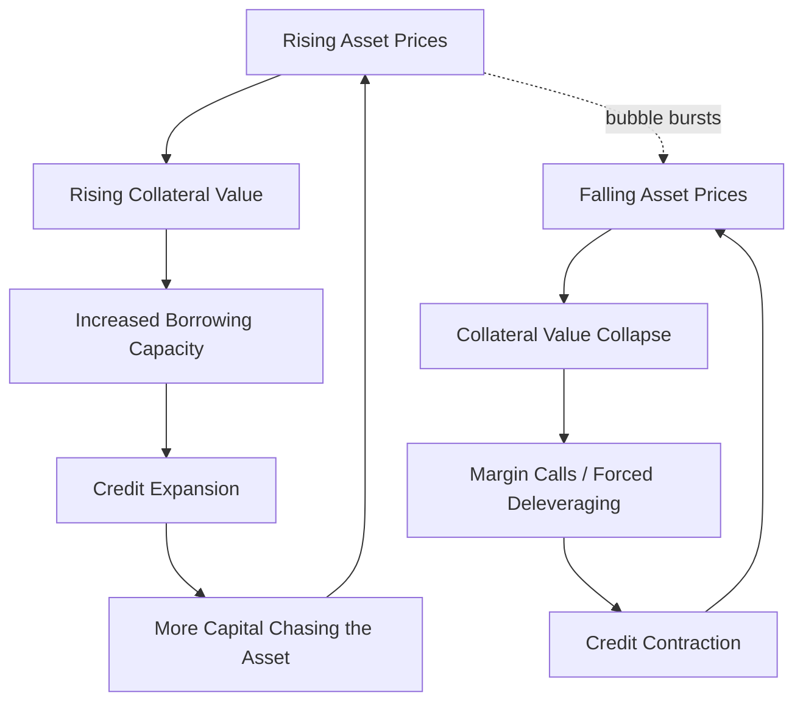

## Asset Price Bubbles and Their Macroeconomic Consequences

### Definitions and Core Concepts

An **asset price bubble** is a sustained deviation of an asset's market price from its **fundamental value** — the price justified by the discounted stream of future cash flows the asset is expected to generate — typically driven by expectations of further price appreciation rather than by changes in underlying fundamentals.

$$P_t = P_t^{f} + B_t$$

where $P_t$ is the observed market price, $P_t^{f}$ is the fundamental value, and $B_t$ is the bubble component. A bubble is present when $B_t \neq 0$ and, in rational bubble models, grows at a rate related to the required rate of return.

**Key Points**

- Bubbles are inherently difficult to identify *in real time*, since the fundamental value $P_t^f$ is itself an unobservable estimate subject to disagreement (e.g., about future growth rates, discount rates, or risk premia). Most identification is only possible *ex post*, after a crash confirms the deviation.
- Bubbles are distinguished from ordinary asset price volatility by their **persistence** and by the presence of a self-reinforcing feedback loop between rising prices and rising demand.

### The Fundamental Value Framework

For an asset paying dividends $D_t$, the fundamental (no-bubble) price under the standard present-value model is:

$$P_t^{f} = \sum_{i=1}^{\infty} \frac{E_t[D_{t+i}]}{(1+r)^{i}}$$

where $r$ is the required rate of return (discount rate). Deviations from this benchmark can, in principle, arise even under full rationality.

**Rational Bubbles**

In certain theoretical settings, a rational bubble can persist in equilibrium because agents are willing to pay more than fundamental value today, provided they expect it to be even more overvalued tomorrow, such that the *expected return* from holding the bubble component still equals the required rate of return:

$$E_t[B_{t+1}] = (1+r)B_t$$

[Inference] This growth condition implies rational bubbles must grow in expectation without bound (or collapse entirely, typically modeled with a fixed per-period collapse probability), which is why most rational bubble models incorporate a stochastic bursting process rather than a bubble that persists indefinitely.

### Behavioral and Psychological Drivers

Not all bubble episodes are well-explained by rational-bubble theory; a substantial literature emphasizes behavioral and structural mechanisms.

**Key Points**

- **Extrapolative expectations**: Investors form beliefs about future price changes by extrapolating recent past price trends, rather than by discounting expected fundamentals — a mechanism central to Hyman Minsky's and Robert Shiller's accounts of bubble dynamics.
- **Herding behavior**: Investors mimic the actions of others, sometimes rationally (inferring information from others' trades) and sometimes due to social/psychological conformity pressures, amplifying price momentum.
- **Overconfidence and disagreement**: Heterogeneous beliefs about asset values, combined with short-sale constraints that prevent pessimists from betting against overvaluation, can allow optimists' valuations to dominate observed prices (the Miller 1977 / Harrison-Kreps mechanism).
- **Greater fool theory**: Investors purchase an asset they know or suspect to be overvalued, on the expectation that they can resell it to another buyer ("a greater fool") at an even higher price before any correction occurs.
- **Narrative economics**: [Inference] Shiller's framework suggests that compelling, emotionally resonant stories about a "new era" or a transformative technology (e.g., "this time is different") can spread contagiously through a population and sustain bubble psychology independent of any change in objective fundamentals, though this remains a qualitative/narrative rather than strictly quantitative framework.

### Minsky's Financial Instability Hypothesis

Hyman Minsky's framework describes a recurring pattern by which credit-fueled speculation builds and eventually collapses, providing a structural account of how bubbles form and burst.

**Key Points — The Minsky Cycle Stages**

1. **Displacement**: An exogenous shock (e.g., a new technology, financial deregulation, or a sharp fall in interest rates) creates new profit opportunities in some sector, kicking off a boom.
2. **Boom**: Prices in the sector begin rising; positive feedback and media attention draw in more investors; credit expands to finance further purchases.
3. **Euphoria**: Caution is abandoned; valuations become disconnected from fundamentals; new, less-experienced investors enter, often using leverage; speculation dominates.
4. **Profit-taking / Distress**: Informed insiders begin quietly selling; the pace of new buyers entering the market fails to keep up with growing supply of assets/credit; cracks in the narrative emerge.
5. **Panic**: Prices reverse sharply; a stampede to sell (mirroring a bank run) sets in; forced liquidations and margin calls accelerate the decline, often overshooting fundamental value on the downside.

**Minsky's Financial Fragility Taxonomy**

Minsky further classified borrowers by their debt-servicing capacity, a taxonomy central to understanding *why* a credit-fueled boom becomes fragile:

| Financing Type | Cash Flow vs. Debt Service | Characteristic |
| --- | --- | --- |
| **Hedge finance** | Income covers both principal and interest | Financially robust; sustainable |
| **Speculative finance** | Income covers interest only; principal must be rolled over | Vulnerable to refinancing/interest-rate shocks |
| **Ponzi finance** | Income covers neither principal nor interest; relies entirely on asset price appreciation to refinance | Fragile; collapses if asset prices stop rising |

[Inference] Minsky's core thesis — often summarized as "stability is destabilizing" — is that prolonged economic calm itself encourages a gradual systemic shift from hedge to speculative to Ponzi financing structures, since periods without crisis erode risk aversion; this is a structural/behavioral claim rather than a strictly falsifiable empirical law, though it has substantial support from historical case studies.

### The Credit-Asset Price Feedback Loop

A central macro-financial mechanism is the two-way, self-reinforcing relationship between credit expansion and asset prices, sometimes termed the **financial accelerator** in its bubble-specific form.

**Key Points**

- On the way up, this creates a **procyclical leverage** dynamic: rising collateral values allow more borrowing, which fuels more asset purchases, which raises prices further.
- On the way down, the mechanism reverses symmetrically and often more violently, since falling collateral values trigger margin calls and forced asset sales (fire sales), which depress prices further, generating a debt-deflation spiral.
- This feedback loop is central to models of **procyclicality in the financial system**, a key concern of macroprudential regulation (e.g., Basel III's countercyclical capital buffer).

### Fisher's Debt-Deflation Theory

Irving Fisher's 1933 debt-deflation theory describes the mechanism by which the *bursting* of a credit-fueled asset bubble transmits into a broader depression, particularly under high pre-existing debt levels.

**Key Points — The Debt-Deflation Sequence**

1. Debt liquidation begins (triggered by the crash), leading to distress selling.
2. Distress selling contracts the money supply (as bank deposits are extinguished when loans are repaid or written off), causing deflation.
3. Falling asset and goods prices raise the **real burden of debt** ($\text{Real Debt} = \text{Nominal Debt} / P$), even as nominal debt is unchanged — a mechanism sometimes called "debt deflation."
4. Rising real debt burdens cause further distress selling, bankruptcies, and reduced investment/output — feeding back into further price declines.
5. Falling output and employment reduce confidence and further contract credit and spending, deepening the downturn.

$$\text{Real Debt Burden} = \frac{D_0}{P_t}, \quad \frac{\partial (\text{Real Debt Burden})}{\partial P_t} < 0$$

[Inference] This mechanism helps explain why asset price bubble collapses associated with high leverage (e.g., 1929, 2007-2008, Japan post-1990) tend to produce substantially longer and deeper recessions than equity-market corrections that occur without a preceding credit boom, though isolating the causal contribution of debt-deflation specifically from other concurrent factors in any single historical episode is inherently difficult.

### Historical Bubble Episodes

**Example**

- **Dutch Tulip Mania (1636-1637)**: Frequently cited as the earliest well-documented speculative bubble, involving extreme price appreciation in tulip bulb futures contracts before a rapid collapse; [Unverified] the precise magnitude and broader economic impact of this episode are debated among economic historians, with some arguing its severity has been exaggerated in popular retellings.
- **South Sea Bubble (1720, Britain) and Mississippi Bubble (1720, France)**: Speculative manias in shares of chartered trading companies granted monopoly privileges, both collapsing sharply and prompting early securities regulation.
- **Roaring Twenties Stock Market Bubble and 1929 Crash**: U.S. equity prices rose sharply on margin-financed speculation through the late 1920s before the October 1929 crash, which — combined with banking panics and debt-deflation dynamics — contributed to the Great Depression.
- **Japanese Asset Price Bubble (late 1980s)**: Real estate and equity prices in Japan rose to extraordinary levels (famously, the land under the Tokyo Imperial Palace was estimated to be worth more than all real estate in California) before collapsing in the early 1990s, ushering in Japan's prolonged "Lost Decade(s)" of stagnation and deflation.
- **Dot-com Bubble (1995-2000)**: Technology and internet-related equity valuations rose dramatically, often disconnected from earnings or even revenue, before the NASDAQ composite fell roughly 78% from its March 2000 peak to its October 2002 trough.
- **U.S. Housing Bubble (2003-2006) and Global Financial Crisis (2007-2009)**: Sustained home price appreciation, fueled by subprime mortgage lending, securitization (mortgage-backed securities, CDOs), and lax underwriting standards, collapsed starting in 2006-2007, triggering the broader global financial crisis through the credit-asset price feedback and debt-deflation mechanisms described above.

### Macroeconomic Consequences of Bubble Bursts

**Key Points**

- **Wealth effect reversal**: Household net worth declines sharply when asset prices (housing, equities) fall, reducing consumption via the wealth effect on the permanent income / life-cycle consumption channel.
- **Investment collapse**: Firms reduce capital expenditure both due to reduced access to credit (balance sheet channel) and reduced Tobin's Q (market value of firms relative to replacement cost of capital) following equity price declines.
- **Banking sector impairment**: Since bubbles are frequently credit-financed, their collapse directly damages bank balance sheets through loan losses, potentially triggering the banking crisis dynamics (contagion, credit crunch) discussed in the related banking-crisis material.
- **Labor market effects**: Sectors that expanded disproportionately during the bubble (e.g., construction and real estate during the U.S. housing bubble) experience disproportionate employment losses, often with slow labor reallocation to other sectors (structural/sectoral mismatch).
- **Fiscal consequences**: Governments often absorb private losses through bank bailouts, deposit insurance payouts, and automatic stabilizers (unemployment insurance, reduced tax revenue), raising public debt-to-GDP ratios.
- **Balance sheet recession**: [Inference] Following Richard Koo's analysis of Japan's post-bubble experience, firms and households may prioritize debt repayment over new borrowing or spending even at near-zero interest rates, muting the effectiveness of conventional monetary policy and producing a prolonged period of weak aggregate demand — a phenomenon termed a "balance sheet recession."

$$C_t = f(\text{Permanent Income}, \text{Wealth}_t), \quad \frac{\partial C_t}{\partial \text{Wealth}_t} > 0$$

### Monetary Policy and the "Lean vs. Clean" Debate

A long-standing policy debate concerns whether central banks should attempt to preemptively deflate asset bubbles ("lean against the wind") or instead wait and respond only after a bubble bursts ("clean up afterward").

| Approach | Core Argument | Key Objection |
| --- | --- | --- |
| **Leaning against the wind** | Raising interest rates preemptively during a suspected bubble can limit its size and reduce the severity of the eventual bust | Bubbles are difficult to identify in real time; a blunt interest-rate tool imposes broad economic costs (e.g., higher unemployment) to address a narrow, sector-specific problem; central banks may misjudge and choke off a legitimate expansion |
| **Cleaning up afterward** (the pre-2008 "Greenspan doctrine") | Central banks cannot reliably identify bubbles ex ante, and monetary policy is too blunt a tool; better to keep policy accommodative and use aggressive monetary easing to mitigate damage after a bust | The 2008 crisis is widely cited as evidence that "cleaning up" can be extremely costly and that some bubbles (particularly credit-fueled ones) leave lasting damage that easy monetary policy cannot fully offset |

[Inference] The Global Financial Crisis substantially shifted mainstream central banking opinion toward favoring a role for **macroprudential policy** (e.g., loan-to-value limits, countercyclical capital buffers, stress testing) as a more targeted alternative to interest-rate-based "leaning," since macroprudential tools can address sector-specific credit booms without necessarily requiring broad-based monetary tightening — though this remains an active area of policy debate rather than a fully settled consensus.

### Macroprudential Policy Tools

**Key Points**

- **Loan-to-value (LTV) and debt-to-income (DTI) limits**: Directly constrain how much leverage can be used to purchase an asset (typically applied to mortgage lending), reducing the credit-asset price feedback loop at its source.
- **Countercyclical capital buffer (CCyB)**: Requires banks to build additional capital during credit booms (which can be released during downturns), under the Basel III framework, increasing loss-absorption capacity ahead of a potential bust.
- **Sectoral capital requirements**: Higher risk weights or capital charges applied to lending toward specific asset classes (e.g., commercial real estate) identified as bubble-prone.
- **Stress testing incorporating asset price scenarios**: Regulators model bank resilience under hypothetical sharp asset price declines to assess capital adequacy ahead of any actual crisis.

### Identifying Bubbles: Empirical Approaches

**Key Points**

- **Price-to-fundamental ratios**: Comparing metrics like price-to-earnings (equities), price-to-rent or price-to-income ratios (housing) against long-run historical averages to flag potential overvaluation.
- **Right-tail explosive behavior tests**: Econometric tests (e.g., the Phillips-Shi-Yu / PSY methodology) that test for periods of explosive, non-stationary price growth inconsistent with a stable fundamental process, used to date-stamp bubble episodes.
- **Credit-to-GDP gap**: A widely used macroprudential indicator (part of the Basel III countercyclical buffer framework) measuring deviation of the credit-to-GDP ratio from its long-run trend, since rapid credit growth is a common leading indicator of asset bubbles and subsequent crises.

[Inference] No single empirical test reliably identifies bubbles in real time with high confidence, since all such tests involve a joint hypothesis problem (testing for a bubble requires an assumed fundamental-value model, and a rejection could reflect either a genuine bubble or a misspecified fundamental model) — this remains an area of active econometric research rather than settled practice.

### Bubbles and Currency/Twin Crises

In open-economy contexts, domestic asset price bubbles are frequently financed by capital inflows, linking bubble dynamics to exchange rate and balance-of-payments vulnerabilities.

**Key Points**

- Capital inflow surges (often denominated in foreign currency) can fund domestic credit booms and asset price appreciation, particularly in emerging markets.
- A bubble collapse can trigger **sudden stops** in capital inflows and rapid capital flight, placing simultaneous pressure on the domestic currency and banking system — a **twin crisis** dynamic observed in the 1997-1998 Asian Financial Crisis.
- Currency depreciation during such episodes raises the domestic-currency value of foreign-currency-denominated debt, compounding balance sheet stress for firms, banks, and sometimes sovereigns (the "original sin" problem in emerging-market finance).

**Related Topics**

- Minsky's Financial Instability Hypothesis (extended treatment)
- Fisher's debt-deflation theory and balance sheet recessions
- Macroprudential regulation and the countercyclical capital buffer
- Twin crises: currency and banking crisis interactions
- Sudden stops and capital flow reversals in emerging markets
- Behavioral finance: herding, extrapolative expectations, and narrative economics
- Tobin's Q and investment theory
- Historical case study: the Japanese Lost Decade(s)
- Historical case study: the 2007-2009 U.S. housing bubble and subprime crisis
- Econometric bubble detection methods (PSY test, variance bounds tests)