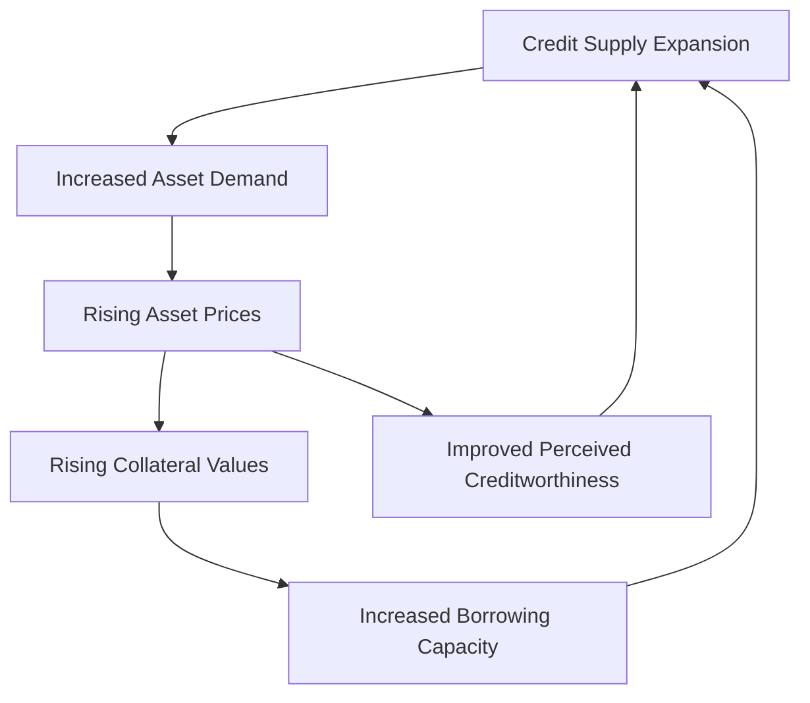
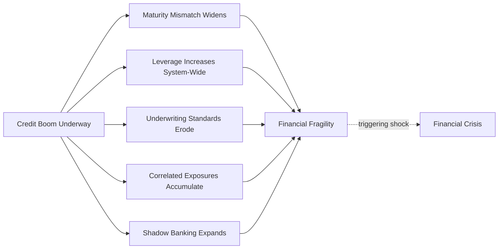

## Credit Booms and Financial Fragility

### Definitions and Core Concepts

A **credit boom** is a period of rapid, sustained growth in aggregate credit — bank lending and broader debt issuance — that significantly exceeds the growth rate of underlying economic fundamentals such as GDP, income, or productive capacity. **Financial fragility** refers to the resulting condition in which the financial system's capacity to absorb shocks without triggering a crisis is progressively eroded, typically as a byproduct of the boom itself.

$$\text{Credit-to-GDP Gap}_t = \frac{\text{Credit}_t}{\text{GDP}_t} - \text{Trend}\left(\frac{\text{Credit}}{\text{GDP}}\right)_t$$

**Key Points**

- Credit booms are not synonymous with credit crises: many credit booms deleverage gradually without a crisis ("good booms" or soft landings), while others culminate in a sharp bust ("bad booms").
- The credit-to-GDP gap, as formalized in the Basel III macroprudential framework, is one of the most widely used empirical indicators for flagging when credit growth has become excessive relative to trend, and is used to calibrate the countercyclical capital buffer.
- Financial fragility is best understood as a *state variable* that accumulates gradually and often invisibly during a boom, only becoming apparent once a triggering shock exposes it — a key theme distinguishing modern macro-financial analysis from earlier views that treated financial crises as unpredictable, exogenous shocks.

### Why Credit Booms Arise: Drivers

**Key Points**

- **Financial liberalization and deregulation**: Removal of interest rate ceilings, capital controls, or lending restrictions can trigger a rapid expansion of credit supply as previously constrained institutions compete for market share.
- **Monetary policy and low interest rates**: Prolonged periods of low policy rates reduce the cost of borrowing and can compress risk premia, encouraging both credit demand and risk-taking by lenders (the "risk-taking channel" of monetary policy, associated with Borio and Zhu).
- **Capital inflow surges**: In open economies, foreign capital inflows — often seeking yield or attracted by favorable growth prospects — can fund rapid domestic credit expansion, frequently denominated in foreign currency.
- **Financial innovation**: New instruments (securitization, structured credit products, new forms of collateralized lending) can expand the *effective* supply of credit by allowing risk to be repackaged, diversified, or transferred, sometimes obscuring true underlying risk concentrations.
- **Collateral value appreciation**: Rising asset prices (real estate, equities) increase the collateral available to back new borrowing, creating a self-reinforcing loop between credit supply and asset prices (see also material on asset price bubbles).
- **Behavioral/expectational drivers**: Extrapolative or overly optimistic expectations about future income growth, asset returns, or macroeconomic stability — consistent with Minsky's "stability breeds instability" thesis — can lead both borrowers and lenders to systematically underprice risk during extended expansions.

### The Credit-Asset Price-Collateral Feedback Loop

**Key Points**

- This feedback mechanism is **procyclical**: it amplifies expansions and, symmetrically, amplifies contractions once the cycle reverses.
- The loop operates independent of any change in the underlying productive capacity of the economy, meaning credit growth can substantially outpace GDP growth for extended periods before any correction becomes evident.
- Because collateral valuations depend on the same asset prices the credit expansion is inflating, the system contains an inherent **endogeneity problem**: rising credit *causes* rising collateral values, which *justifies* further credit extension, in a circular rather than independently verified process.

### Minsky's Financial Instability Hypothesis Applied to Credit Booms

**Key Points — Financing Structure Migration**

| Stage | Financing Type | Debt-Servicing Capacity |
| --- | --- | --- |
| Early boom | Hedge finance | Income covers principal and interest — robust |
| Mid boom | Speculative finance | Income covers interest only; principal rolled over — vulnerable to refinancing conditions |
| Late boom | Ponzi finance | Income covers neither; debt serviced only via further borrowing or asset appreciation — fragile |

[Inference] Minsky's central claim is that the *composition* of aggregate credit shifts systematically toward speculative and Ponzi finance the longer an expansion persists without a correction, since sustained calm erodes lenders' and borrowers' risk aversion — a structural hypothesis about financial system evolution rather than a mechanically testable law, though credit boom episodes provide illustrative support.

**Example**

The pre-2008 U.S. subprime mortgage market illustrates this migration concretely: early adjustable-rate mortgages required borrowers to demonstrate income sufficient to service the loan (hedge/speculative finance), while later-vintage "NINJA" loans (No Income, No Job, No Assets) and interest-only or negative-amortization products relied explicitly on continued home price appreciation to permit refinancing — a textbook instance of Ponzi finance at the household level.

### Empirical Regularities: Credit Booms as Crisis Predictors

A substantial empirical literature — notably work by Schularick and Taylor (2012), Mendoza and Terrones, and Gourinchas and Obstfeld — has established credit growth as one of the most robust leading indicators of financial crises across countries and historical periods.

**Key Points**

- **Credit growth outperforms many alternative indicators** (including current account deficits, fiscal balances, and asset price growth alone) as a predictor of subsequent financial crisis probability across long-run cross-country panel datasets.
- The relationship is **nonlinear**: the probability of a crisis rises disproportionately once credit growth exceeds certain historical thresholds relative to GDP trend, rather than increasing smoothly and proportionally with credit growth.
- **Not all rapid credit growth leads to crisis** — the empirical relationship is probabilistic, not deterministic. [Inference] This means credit growth functions best as a risk indicator that shifts the probability distribution of future crisis likelihood, rather than as a deterministic trigger, and using it as an early-warning signal necessarily involves a trade-off between false positives (booms that do not end in crisis) and false negatives (missed crises).
- Post-crisis recessions preceded by larger credit booms tend to be **deeper and more protracted** than recessions not preceded by a credit boom, a finding often summarized as "it's not the credit boom itself but the deleveraging afterward that does the damage."

### Mechanisms of Fragility Accumulation

**Key Points**

- **Maturity mismatch expansion**: As credit expands, lenders (particularly in wholesale and shadow banking channels) often increasingly fund longer-term assets with progressively shorter-term liabilities, widening the maturity mismatch discussed in the bank-run material.
- **Leverage buildup**: Both financial institutions and non-financial borrowers (households, firms) increase leverage ratios during booms, reducing the equity buffer available to absorb subsequent losses.
- **Underwriting standard erosion**: Competitive pressure among lenders during a boom tends to progressively loosen credit standards (lower down payments, reduced documentation requirements, covenant-lite lending), a pattern documented extensively in the pre-2008 mortgage market and in leveraged loan markets in subsequent cycles.
- **Correlated exposure concentration**: Lenders across the system often become exposed to correlated risks (e.g., regional real estate, a specific industry sector) without recognizing the aggregate concentration, since each individual lender's exposure may appear diversified from its own vantage point.
- **Shadow banking growth**: Credit intermediation migrates outside the traditionally regulated banking sector into less-supervised, less-capitalized institutions and markets (money market funds, structured investment vehicles, repo markets), expanding aggregate system leverage while remaining partially outside standard regulatory perimeters.

### The Boom-Bust Cycle and Triggering Mechanisms

**Key Points**

- Fragility accumulated during a boom is typically **latent** until a triggering event exposes it — the trigger itself need not be large relative to the scale of the eventual crisis, since it is the *pre-existing fragility*, not the trigger, that determines crisis severity.
- Common triggers include: monetary policy tightening (raising debt-servicing costs), a reversal in the asset price cycle underlying the credit expansion, an idiosyncratic shock to a systemically important institution, or a shift in investor sentiment (a Minsky "moment").
- The bust phase typically features **deleveraging**: borrowers and financial institutions simultaneously attempt to reduce debt, which — in aggregate — can be self-defeating (the paradox of deleveraging, related to Fisher's debt-deflation mechanism), since one agent's debt repayment can require asset sales that depress prices and increase the *real* debt burden of others.

$$\text{Aggregate Deleveraging Paradox}: \quad \sum_i \Delta \text{Debt}_i \downarrow \Rightarrow P_{\text{assets}} \downarrow \Rightarrow \frac{\text{Debt}_i}{P_{\text{assets}}} \uparrow \text{ for remaining holders}$$

### Sudden Stops and Open-Economy Credit Booms

**Key Points**

- **Sudden stops** (Calvo, 1998) describe an abrupt reversal or cessation of capital inflows, often triggered by a shift in global risk sentiment, a change in advanced-economy monetary policy, or a domestic shock, which can rapidly convert a domestic credit boom into a currency and banking crisis simultaneously.
- **Currency mismatch risk**: When domestic credit booms are financed by foreign-currency-denominated borrowing (a phenomenon sometimes called "original sin" in emerging-market finance literature), a subsequent domestic currency depreciation mechanically increases the local-currency value of debt service obligations, amplifying financial fragility precisely when the economy is already under stress.
- **Twin crises**: The interaction between a currency crisis and a banking crisis, often mutually reinforcing, has been extensively documented in the 1994 Mexican Peso Crisis, the 1997-1998 Asian Financial Crisis, and various emerging-market episodes since.
- **Global financial cycle**: [Inference] A body of research (notably associated with Hélène Rey) argues that capital flows, credit growth, and asset prices across many countries co-move with a common "global financial cycle" driven substantially by advanced-economy monetary policy and global risk appetite, implying that domestic credit boom dynamics in smaller open economies may be only partially under the control of domestic policymakers — though the degree of monetary policy autonomy under different exchange rate and capital account regimes remains actively debated (related to the "trilemma"/"dilemma" literature).

### Macroprudential Policy Responses

**Key Points**

- **Countercyclical capital buffer (CCyB)**: Requires banks to accumulate additional capital during periods when the credit-to-GDP gap signals excessive credit growth, building loss-absorption capacity ahead of a potential downturn; this buffer can be released during stress to support continued lending.
- **Loan-to-value (LTV) and debt-service-to-income (DSTI) limits**: Directly cap leverage at the point of loan origination, particularly for mortgage lending, constraining the credit-collateral feedback loop at its source rather than relying solely on lender capital buffers.
- **Sectoral and time-varying risk weights**: Regulators can impose higher capital charges on lending to specific sectors identified as experiencing unsustainable credit growth (e.g., commercial real estate, specific consumer credit categories).
- **Reserve requirements and capital flow management measures**: In open-economy contexts, some countries employ reserve requirements on foreign-currency borrowing or capital flow management tools to moderate the pace of externally-financed credit booms — a more controversial and heterogeneously applied set of tools relative to advanced-economy macroprudential instruments.
- **Stress testing incorporating credit cycle scenarios**: Regulatory stress tests increasingly incorporate scenarios explicitly modeling the unwinding of credit booms, rather than only generic macroeconomic downturns.

### Historical Episodes

**Example**

- **U.S. Subprime Mortgage Boom (2003-2007)**: Rapid expansion of mortgage credit — facilitated by securitization, declining underwriting standards, and low policy rates — culminated in the 2007-2009 Global Financial Crisis; widely cited as the canonical modern illustration of the Minsky financing-structure migration and credit-collateral feedback loop.
- **Nordic Credit Booms (late 1980s)**: Financial liberalization in Sweden, Finland, and Norway preceded rapid credit expansion and asset price appreciation, followed by systemic banking crises in the early 1990s once the boom reversed.
- **East Asian Credit Booms (early-to-mid 1990s)**: Rapid, partly externally-financed credit growth across Thailand, Indonesia, South Korea, and other economies preceded the 1997-1998 Asian Financial Crisis, which combined currency crisis and banking crisis dynamics in a canonical twin-crisis episode.
- **Spanish and Irish Credit Booms (2000s)**: Eurozone membership provided access to low, converged interest rates, fueling large construction and real-estate-linked credit booms in both countries; their subsequent unwinding during the European sovereign debt crisis (2010-2012) illustrated the sovereign-bank "doom loop," in which weakened banks required state support even as elevated sovereign borrowing costs simultaneously weakened bank balance sheets holding government debt.
- **Chinese Credit Expansion (post-2008)**: [Inference] China's aggregate credit-to-GDP ratio rose substantially following a large post-Global-Financial-Crisis stimulus program and subsequent shadow banking growth; assessment of the associated financial stability risk remains an active and debated area of ongoing analysis given data limitations and the distinct structure of China's financial system, and is not treated here as a resolved historical case in the way the pre-2008 U.S. or 1990s Asian episodes are.

### Distinguishing "Good" and "Bad" Credit Booms

**Key Points**

- Not all periods of above-trend credit growth are precursors to crisis; some reflect genuine, sustainable **financial deepening** — an economy's financial sector maturing and expanding credit access to previously underserved households or firms in line with real income growth.
- Empirical work attempting to distinguish "good" booms from "bad" booms has examined factors such as: the extent to which credit growth is financing productive investment versus consumption or speculative asset purchases; whether the boom is financed by stable domestic deposits versus volatile wholesale or foreign funding; and the degree of underwriting standard deterioration accompanying the credit expansion.
- [Inference] In practice, this distinction is difficult to draw with confidence in real time (as opposed to in retrospective historical analysis), which is a core reason macroprudential policy frameworks tend to rely on relatively mechanical, rules-based indicators like the credit-to-GDP gap rather than requiring regulators to make real-time qualitative judgments about the "goodness" of a given boom's composition.

**Related Topics**

- Asset price bubbles and their macroeconomic consequences
- Banking crises and bank runs
- Fisher's debt-deflation theory and the deleveraging paradox
- Basel III macroprudential framework and the countercyclical capital buffer
- Sudden stops and the "original sin" problem in emerging-market finance
- The global financial cycle and monetary policy spillovers
- Twin crises: currency and banking crisis interactions
- Shadow banking and non-bank financial intermediation
- Sovereign-bank doom loops (Eurozone periphery case studies)
- Early warning systems and crisis prediction models in macro-financial surveillance