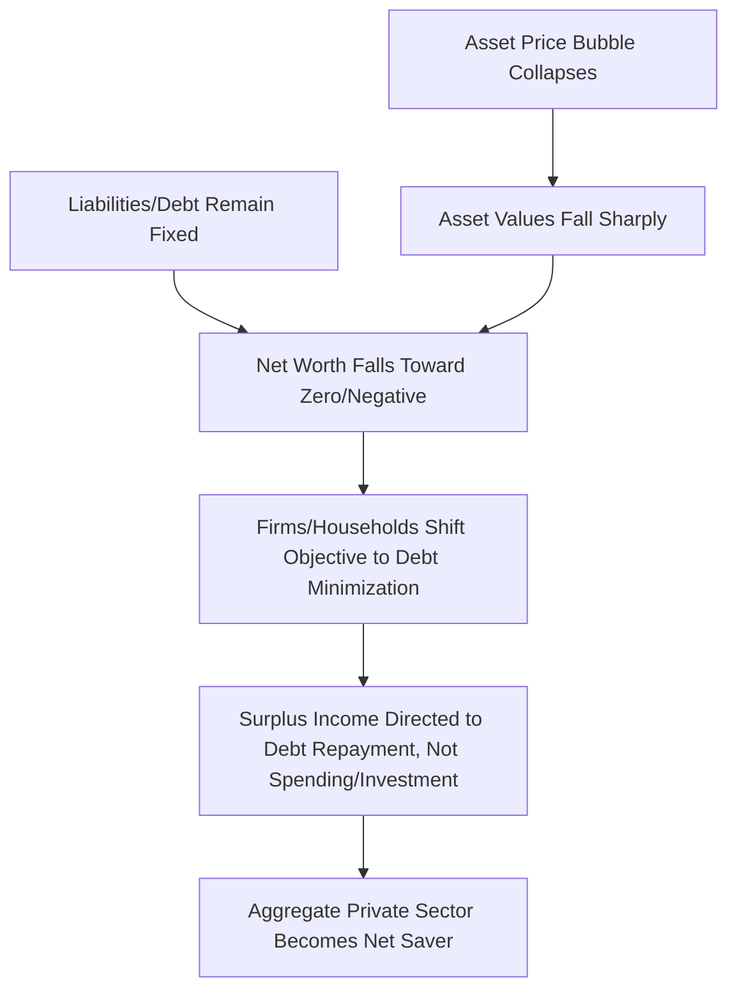

## Balance Sheet Recessions

### Definitions and Core Concepts

A **balance sheet recession** is a prolonged economic downturn that occurs when a large share of firms and/or households, following the collapse of a debt-financed asset price bubble, shift their primary financial objective from profit or utility maximization to **debt minimization** — prioritizing the repair of impaired balance sheets over new borrowing, investment, or consumption, even when interest rates are at or near zero.

**Key Points**

- The term and framework are most closely associated with economist **Richard Koo**, developed initially to explain Japan's prolonged stagnation following the collapse of its late-1980s asset price bubble, and later applied to the post-2008 experiences of the United States and parts of Europe.
- The defining feature is a shift in aggregate behavior: the private sector, in aggregate, becomes a **net saver** even at very low or zero interest rates, because minimizing debt (repairing a negative or impaired net worth position) becomes a more urgent objective than maximizing returns on new investment.
- Balance sheet recessions are distinguished from ordinary business-cycle recessions by their **duration and their resistance to conventional monetary policy**, since the transmission channel monetary policy normally relies upon (lower rates stimulating new borrowing) is impaired when borrowers are focused on debt repayment rather than debt origination.

### The Balance Sheet Mechanism

$$\text{Net Worth}_t = \text{Assets}_t - \text{Liabilities}_t$$

When an asset price bubble collapses, asset values ($\text{Assets}_t$) fall sharply while nominal liabilities ($\text{Liabilities}_t$, i.e., debt taken on to finance the original asset purchase) remain contractually fixed. This can push net worth toward zero or negative for a broad cross-section of borrowers simultaneously.

**Key Points**

- Firms or households whose liabilities now exceed the market value of their assets are, in a technical sense, **balance-sheet insolvent**, even if their income remains sufficient to service debt on a cash-flow basis.
- Rather than declaring bankruptcy, [Inference] Koo's framework argues that most such borrowers in a balance sheet recession rationally choose to continue servicing their debt using ongoing cash flow while directing any surplus income toward accelerated debt repayment rather than new spending, since restoring a positive net worth position (or avoiding the reputational, legal, and relationship costs of default) is treated as a higher priority than optimizing current consumption or investment.
- This produces what Koo terms **"debt minimization" behavior**: the borrower's objective function is not profit or utility maximization in the conventional textbook sense, but reduction of debt to a sustainable or positive-net-worth level as quickly as possible.

### Fisher's Debt-Deflation Theory as Precursor

The balance sheet recession framework builds directly on Irving Fisher's 1933 **debt-deflation theory**, extending it into a more explicit account of aggregate behavioral response and its policy implications.

**Key Points**

- Fisher's original mechanism describes how falling asset and goods prices raise the *real* burden of nominal debt, triggering distress selling, further price declines, and a self-reinforcing deflationary spiral.
- Koo's balance sheet recession framework can be viewed as describing the **behavioral response** that follows once this debt-deflation dynamic has run its course: rather than a chaotic cascade of defaults and fire sales, the framework emphasizes a more orderly, sustained period in which private agents quietly and persistently pay down debt over many years, producing chronic economic weakness rather than acute collapse.
- The distinction matters for **duration**: acute debt-deflation spirals can, in principle, resolve relatively quickly once asset prices and defaults reach a new equilibrium, whereas balance sheet recessions as Koo describes them can persist for a decade or more, since debt repayment out of income (rather than default) is inherently a slow process.

### Why Conventional Monetary Policy Loses Traction

**Key Points**

- Conventional monetary transmission relies on lower interest rates inducing **increased borrowing** by firms and households, which then translates into higher investment and consumption spending.
- In a balance sheet recession, the private sector's objective is debt reduction, not debt origination — [Inference] this implies that even at a zero or near-zero policy rate, the demand for new credit may remain suppressed, because borrowers are not primarily motivated by the cost of new credit but by the imperative to repair a damaged balance sheet, effectively muting the interest-rate channel regardless of how low rates fall.
- This is sometimes associated with, though conceptually distinct from, a **liquidity trap** (in which money and short-term bonds become near-perfect substitutes at the zero lower bound); the balance sheet recession framework emphasizes a *demand-side* impairment in the willingness to borrow, rather than purely a *monetary* mechanism of policy ineffectiveness.
- Evidence commonly cited for this dynamic includes periods in which central banks maintained near-zero policy rates for extended periods (Japan from the late 1990s onward, the U.S. and Eurozone following 2008) while private credit growth and investment remained subdued despite the low cost of borrowing.

### Fiscal Policy as the Recommended Counter-Cyclical Tool

**Key Points**

- Koo's central policy recommendation is that when the private sector is simultaneously deleveraging (a net saver even at zero interest rates), the **government must act as the "borrower of last resort"** — running fiscal deficits and directly injecting demand into the economy — to offset the demand shortfall created by aggregate private-sector saving.
- This differs from the standard prescription for an *ordinary* recession, where monetary policy (lowering interest rates) is generally considered the first line of response, with fiscal policy playing a more secondary or temporary countercyclical role.
- The identity underlying this argument draws on the **sectoral balances framework**:

$$(S - I) + (T - G) + (M - X) = 0$$

where $(S-I)$ is the private sector's net saving, $(T-G)$ is the government's fiscal balance (negative when running a deficit), and $(M-X)$ is the net capital outflow (current account balance with sign convention varying by source). If the private sector runs a large net saving surplus $(S - I) > 0$ during a balance sheet recession, then in the absence of an offsetting change in the external balance, government deficit spending $(G - T) > 0$ is, in this accounting sense, necessary to prevent aggregate demand — and therefore output and employment — from contracting sharply.

**Key Points — Policy Implications**

- [Inference] Under this framework, premature fiscal consolidation (deficit reduction) during a balance sheet recession — before the private sector has substantially completed its deleveraging — risks deepening and prolonging the downturn, since withdrawing government demand while the private sector remains a net saver removes a primary offsetting source of aggregate spending. Koo has cited Japan's 1997 consumption tax increase, and various early-2010s European austerity programs, as illustrative of this risk, though attributing subsequent economic weakness solely to fiscal policy timing versus other concurrent factors involves some degree of counterfactual judgment that is contested among economists.
- The recommended exit strategy under this framework is to maintain fiscal support until private-sector balance sheets are substantially repaired (evidenced by a return of credit growth and private investment), at which point fiscal deficits can be gradually reduced without a comparable offsetting adjustment being required elsewhere.

### Case Study: Japan's Balance Sheet Recession

**Example**

Following the collapse of Japan's asset price bubble in the early 1990s (a sharp multi-year decline in commercial land prices from peak to trough, alongside a comparable equity market decline), Japanese corporations — which had accumulated substantial debt during the 1980s bubble to finance land and equity purchases — are argued by Koo to have spent much of the 1990s and 2000s prioritizing debt repayment over new investment, despite the Bank of Japan maintaining near-zero interest rates for an extended period.

**Key Points**

- Japan's corporate sector shifted from a net borrower to a substantial **net saver** during this period — an unusual and historically atypical position for the corporate sector of a major economy to hold for a sustained multi-decade span.
- [Inference] Koo's interpretation attributes much of Japan's prolonged period of weak growth and mild deflation (sometimes termed the "Lost Decade(s)") primarily to this corporate balance sheet repair process combined with what he characterizes as premature or insufficiently sustained fiscal support; this remains one interpretation among several in a broader academic and policy literature on Japan's stagnation, which has also emphasized demographic decline, structural/productivity factors, and banking sector "zombie lending" as contributing or alternative explanations.
- Japan's public debt-to-GDP ratio rose substantially over this period as the government ran persistent deficits, consistent with the sectoral-balances mechanism described above, though the sustainability implications of this debt buildup are themselves a distinct and separately debated topic.

### Case Study: Post-2008 United States and Eurozone

**Example**

Following the collapse of the U.S. housing bubble and the 2007-2009 Global Financial Crisis, U.S. households engaged in substantial deleveraging: aggregate household debt as a share of disposable income declined markedly from its pre-crisis peak over the following several years, alongside historically elevated personal saving rates despite near-zero policy interest rates.

**Key Points**

- Proponents of the balance sheet recession framework point to this period — persistently subdued consumption and investment growth relative to historical post-recession recoveries, despite the Federal Reserve's near-zero rates and successive rounds of quantitative easing — as consistent with impaired private-sector balance sheets muting conventional monetary transmission.
- In the Eurozone, several periphery economies (Spain, Ireland) experienced comparable private-sector deleveraging following their pre-2008 credit and construction booms, compounded by simultaneous fiscal austerity imposed amid the 2010-2012 sovereign debt crisis — cited by Koo and others as a particularly severe instance of fiscal tightening occurring precisely when, under the balance-sheet-recession framework, expansionary fiscal policy would have been indicated instead.
- [Unverified/Speculation] The extent to which the post-2008 U.S. and Eurozone slowdowns reflect balance sheet recession dynamics specifically, as opposed to other concurrent explanations (e.g., secular stagnation driven by demographic and productivity trends, uncertainty-driven precautionary behavior, or credit supply constraints originating from impaired bank balance sheets rather than borrower demand), remains actively debated in the academic literature, and the balance sheet recession framework itself is not universally accepted as the primary or sole explanation for these episodes.

### Distinguishing Balance Sheet Recessions from Ordinary Recessions

| Dimension | Ordinary (Inventory/Business-Cycle) Recession | Balance Sheet Recession |
| --- | --- | --- |
| Primary agent behavior | Firms/households respond normally to price and income signals; maximize profit/utility | Firms/households prioritize debt reduction over profit/utility maximization |
| Effective policy response | Monetary policy (interest rate cuts) typically sufficient | Fiscal policy (government as "borrower of last resort") argued to be necessary |
| Private credit demand response to rate cuts | Responsive — lower rates stimulate new borrowing | Muted — debt-minimizing agents do not substantially increase borrowing even at zero rates |
| Typical duration | Generally shorter, often resolved within one to two years | Can persist for a decade or longer |
| Underlying trigger | Inventory cycles, demand shocks, moderate credit tightening | Collapse of a large, debt-financed asset price bubble |

### Critiques and Alternative Perspectives

**Key Points**

- Some economists argue that observed weak private borrowing during these episodes may reflect **credit supply constraints** (impaired bank balance sheets restricting lending) rather than, or in addition to, weak private *demand* for credit, which would imply a different — and potentially more bank-recapitalization-focused — set of policy priorities than Koo's demand-side framework emphasizes.
- Others situate the same empirical phenomena within the broader **secular stagnation** hypothesis (associated with Larry Summers and, in earlier form, Alvin Hansen), which attributes persistently weak demand and low equilibrium real interest rates to structural factors such as demographic aging, a global saving glut, and declining investment demand — factors not necessarily specific to a preceding asset bubble collapse.
- [Inference] Because balance sheet recession dynamics, credit supply constraints, and secular stagnation forces can plausibly operate simultaneously and are difficult to cleanly separate empirically, most mainstream macro-financial analysis of episodes like Japan's Lost Decade(s) or the post-2008 recovery treats these as complementary or overlapping explanations rather than strictly competing ones, and assigning precise relative weights to each remains a matter of ongoing academic judgment rather than settled consensus.

### Policy Implications for Central Banks and Fiscal Authorities

**Key Points**

- Under the balance sheet recession framework, central banks facing this dynamic may need to rely more heavily on **unconventional monetary tools** (quantitative easing, forward guidance, negative interest rates) precisely because the conventional interest-rate channel is impaired — though the framework itself suggests these tools may have more limited traction than fiscal policy in directly offsetting the private-sector demand shortfall.
- Fiscal authorities are advised, under this framework, to avoid premature consolidation and to maintain deficit spending until clear evidence emerges that private-sector balance sheet repair is substantially complete (e.g., resumed private credit growth, rising business investment, or a normalization of household/corporate saving rates).
- [Inference] A practical challenge in applying this framework in real time is that "substantially complete" balance sheet repair is difficult to identify with precision while it is occurring, creating a policy risk symmetric to the risk of premature consolidation: fiscal support maintained well past the point it is genuinely needed could itself generate separate costs (e.g., elevated public debt levels, potential inflationary pressure once private demand does recover) — a trade-off the framework's proponents generally regard as more acceptable than the risk of premature withdrawal, though this value judgment is not universally shared.

**Related Topics**

- Fisher's debt-deflation theory and the deleveraging paradox
- Asset price bubbles and their macroeconomic consequences
- Credit booms and financial fragility
- Secular stagnation hypothesis (Summers, Hansen)
- Sectoral balances framework and the government budget constraint
- Liquidity traps and the zero lower bound
- Unconventional monetary policy: quantitative easing and forward guidance
- Case study: Japan's Lost Decade(s) and "zombie lending"
- Case study: post-2008 Eurozone periphery austerity and deleveraging
- Sovereign-bank doom loops and fiscal-financial interlinkages