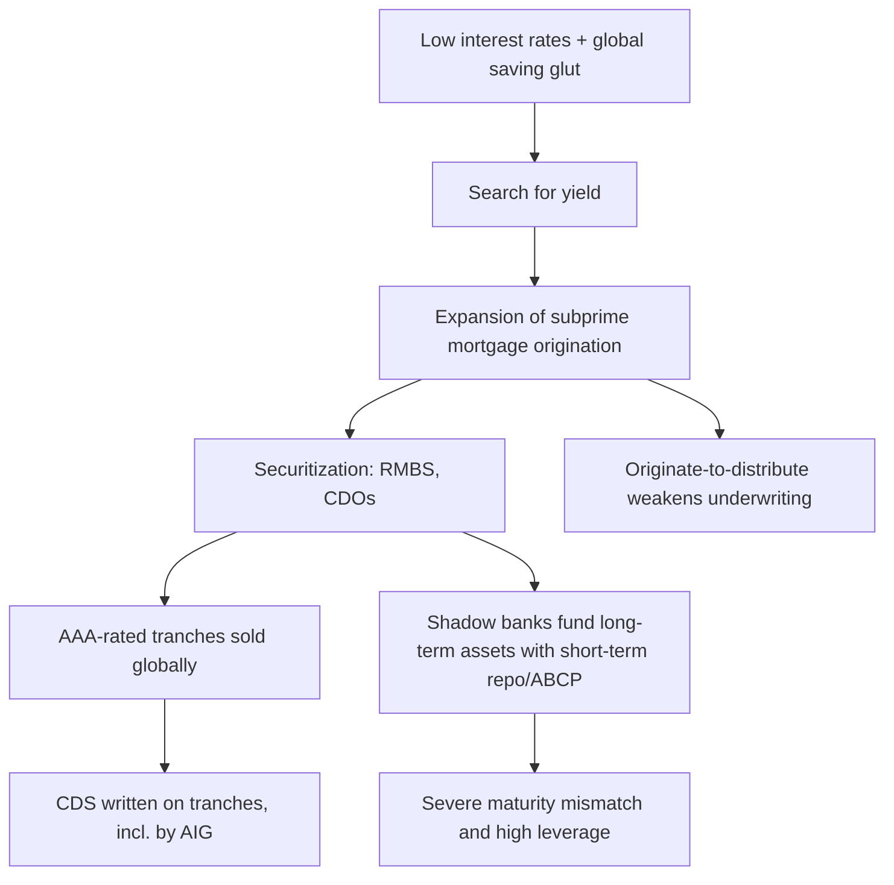
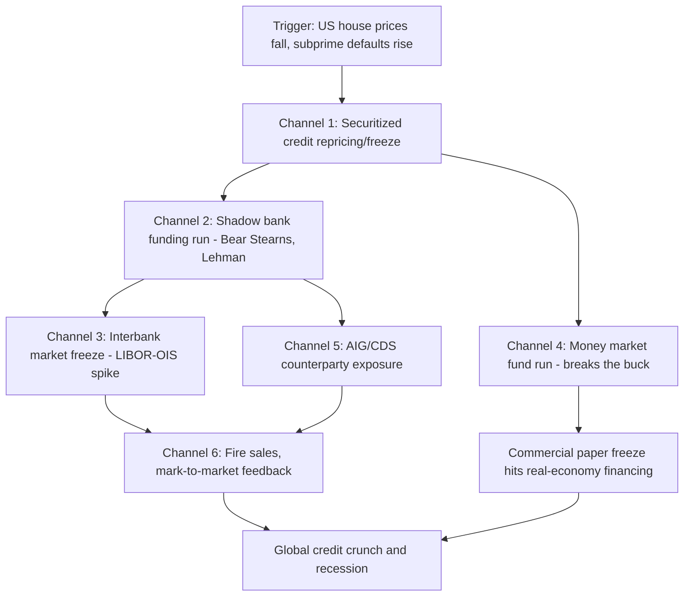

## The 2008 Global Financial Crisis: Causes and Transmission

### Overview

The 2008 Global Financial Crisis (GFC) was the most severe financial disruption since the Great Depression, originating in the US subprime mortgage market and propagating through securitized credit markets, shadow banking, and interbank funding networks to become a global banking, liquidity, and economic crisis. Understanding it requires separating three analytically distinct questions: what structural conditions built up the vulnerability (causes), what event(s) triggered the reversal, and through what channels the shock transmitted from a relatively small mortgage market segment into a global crisis (transmission).

### Structural Causes: Building the Vulnerability

**Macroeconomic Backdrop**

Following the 2001 dot-com recession, the US Federal Reserve held its policy rate at historically low levels (1% from mid-2003 to mid-2004), part of a broader period some economists label the "Great Moderation" — characterized by low and stable inflation and output volatility. Low policy rates reduced yields on safe assets, pushing investors toward higher-yielding, higher-risk instruments in a "search for yield." Simultaneously, large current account surpluses in export-oriented economies (notably China) and oil exporters generated substantial capital inflows into US fixed-income markets, a phenomenon Ben Bernanke termed the "global saving glut," which further compressed long-term interest rates independent of Fed policy.

**Financial Innovation: Securitization**

Securitization — pooling loans and issuing tranched securities backed by their cash flows — allowed originators to remove loans from their balance sheets and transfer credit risk to investors. The relevant chain was:

1. **Origination**: mortgage brokers and lenders issued loans, increasingly to subprime borrowers (lower credit scores, higher loan-to-value ratios, limited income documentation)
2. **Pooling**: loans were sold to investment banks and packaged into Residential Mortgage-Backed Securities (RMBS)
3. **Tranching**: RMBS cash flows were split into tranches with different seniority — senior tranches absorbed losses last and received AAA ratings; equity/junior tranches absorbed first losses and offered higher yields
4. **Re-securitization**: mezzanine tranches (often rated BBB) were re-pooled into Collateralized Debt Obligations (CDOs), and CDO tranches were sometimes re-pooled again into "CDO-squared" structures, further obscuring the underlying collateral quality

**Key Points — Why Securitization Amplified Risk**

- **Originate-to-distribute model**: because originators sold loans quickly rather than holding them, underwriting incentives weakened — a form of moral hazard where the party assessing borrower risk did not bear the consequences of that risk materializing
- **Ratings reliance and conflicts of interest**: credit rating agencies were paid by the issuers whose securities they rated, and their models generally assumed regional house price diversification would limit correlated defaults — an assumption that failed when the decline was nationwide
- **Complexity and opacity**: multiple layers of re-securitization made it extremely difficult for investors (and regulators) to assess the true credit quality and correlation structure of underlying assets
- **Credit Default Swaps (CDS)**: these derivative contracts allowed investors to buy insurance-like protection against the default of a reference security. AIG's Financial Products division sold large volumes of CDS protection on CDO tranches without holding capital reserves proportional to the risk, effectively creating unregulated, undercapitalized insurance exposure

**Leverage in Shadow Banking**

Investment banks and other non-depository intermediaries (collectively "shadow banks") increasingly funded long-term, illiquid mortgage-related assets with short-term wholesale funding — primarily overnight or short-term repurchase agreements (repo) and asset-backed commercial paper (ABCP). [Inference] Aggregate leverage ratios at major investment banks are generally cited in the 25:1 to 35:1 range during 2006-2007, though precise figures vary by measurement methodology and reporting period. This structure created a severe maturity mismatch: long-dated mortgage assets funded by liabilities that had to be rolled over daily or weekly, making these institutions acutely vulnerable to a loss of short-term funding confidence — structurally similar to a traditional bank run, but occurring in unregulated wholesale funding markets with no deposit insurance.

**Regulatory Gaps**

- Investment banks were regulated primarily by the SEC's voluntary Consolidated Supervised Entities program, which imposed less stringent capital requirements than bank holding company regulation
- The over-the-counter derivatives market (including CDS) was largely exempt from regulation under the Commodity Futures Modernization Act of 2000
- Basel II capital requirements allowed banks to use internal models to calculate risk weights, and highly-rated (AAA) securitized tranches received favorable capital treatment, encouraging banks to hold them
- Shadow banking entities (structured investment vehicles, conduits) were often kept off-balance-sheet, allowing sponsoring banks to avoid capital charges despite retaining implicit exposure to their performance

### The Trigger

US house prices, as measured by indices such as Case-Shiller, peaked around 2006 and began a sustained decline. This reversal exposed the fragility built up during the boom:

- Adjustable-rate subprime mortgages began resetting to higher rates, raising monthly payments for borrowers who had often qualified based on initial "teaser" rates
- Falling house prices eliminated the equity cushion borrowers relied on to refinance before rate resets
- Delinquencies and foreclosures on subprime mortgages rose sharply through 2007

This was the point at which "hedge" and "speculative" borrowing units (in Minsky's terminology) — dependent on continued price appreciation for refinancing — could no longer roll over their debt, triggering the shift from boom to distress.

### Transmission Channel 1: Repricing and the Freeze in Securitized Credit Markets

As mortgage delinquencies rose in 2007, investors began questioning the valuation and creditworthiness of RMBS and CDO tranches, particularly those backed by subprime collateral. Because these securities were complex and thinly traded, price discovery broke down: with few or no transactions occurring, mark-to-market accounting rules forced holders to record steep write-downs based on distressed or estimated prices, even absent an actual sale. This created a direct link between market illiquidity and reported balance-sheet losses.

**BNP Paribas (August 2007)** froze redemptions on three investment funds holding subprime-related assets, citing an inability to value the holdings — an early, widely-cited signal that the freeze in securitized credit was systemic rather than isolated.

### Transmission Channel 2: Shadow Bank Runs and the Wholesale Funding Freeze

As losses mounted, lenders in short-term wholesale funding markets (repo, commercial paper) became unwilling to roll over funding to institutions perceived as holding impaired mortgage-related assets, or demanded steep "haircuts" (higher collateral relative to loan value) as compensation for uncertainty. This produced a run on shadow banking analogous to a traditional deposit run, but occurring among institutional counterparties rather than retail depositors.

- **Bear Stearns (March 2008)**: reliant on overnight repo funding, Bear Stearns faced a rapid loss of counterparty confidence and was unable to roll over its funding; the Federal Reserve facilitated its acquisition by JPMorgan Chase, with the Fed absorbing a portion of Bear Stearns's less-liquid assets
- **Lehman Brothers (September 15, 2008)**: unlike Bear Stearns, Lehman was allowed to enter bankruptcy after the Fed and Treasury determined they lacked a legal mechanism or willing acquirer to prevent it (Lehman lacked sufficient collateral for a Bear-Stearns-style Fed loan). [Unverified] Whether an alternative government intervention could have prevented Lehman's bankruptcy without violating existing legal constraints on Fed lending authority remains a debated counterfactual among economists and policymakers.

Lehman's bankruptcy was the pivotal escalation event: it demonstrated that a major, systemically interconnected institution could fail, converting isolated distress into a systemic panic.

### Transmission Channel 3: Interbank Market Freeze

Following Lehman's collapse, banks became reluctant to lend to one another even on a short-term (overnight) basis, since any counterparty might hold undisclosed exposure to Lehman or similar impaired assets. This is measurable in the **LIBOR-OIS spread** — the gap between the London Interbank Offered Rate (an unsecured interbank lending rate) and the Overnight Indexed Swap rate (a proxy for expected future policy rates with minimal credit risk):

$$\text{LIBOR-OIS Spread} = \text{LIBOR} - \text{OIS Rate}$$

A widening spread indicates rising perceived counterparty credit risk in the banking system. [Inference] The LIBOR-OIS spread, which had typically traded near 10 basis points before the crisis, is generally reported to have exceeded 300 basis points in the weeks following Lehman's collapse, though exact peak values differ slightly across data sources and measurement windows. This freeze meant that even solvent banks with temporary liquidity needs could not obtain short-term funding at reasonable rates, threatening to convert liquidity problems into genuine insolvency across the banking system.

### Transmission Channel 4: Money Market Funds and the Commercial Paper Market

The Reserve Primary Fund, a money market mutual fund, held Lehman-issued commercial paper and "broke the buck" (its net asset value fell below the conventional $1.00 per share) after Lehman's bankruptcy. Since money market funds were widely perceived as cash-equivalent, safe instruments, this triggered a broader run on prime money market funds, which in turn were major purchasers of commercial paper issued by non-financial corporations. This threatened to cut off short-term financing to the real economy — corporations that relied on commercial paper to fund payroll and inventory — extending the crisis beyond the financial sector.

### Transmission Channel 5: AIG and Counterparty/Derivative Exposure

AIG's Financial Products unit had written large volumes of CDS protection referencing mortgage-related CDOs without holding capital reserves commensurate with the risk. As the referenced securities were downgraded and lost value, AIG faced enormous collateral posting requirements under its CDS contracts. Because AIG's counterparties included many major global banks, AIG's potential failure threatened to transmit losses across the entire interconnected financial system simultaneously — a concrete illustration of how derivative counterparty networks can propagate a single firm's distress broadly. The Federal Reserve extended emergency credit to AIG (ultimately totaling well over $100 billion in support) to prevent this systemic transmission.

### Transmission Channel 6: Fire Sales and Mark-to-Market Feedback

As institutions faced funding pressure, they sold assets to raise cash. Because many institutions held similar mortgage-related securities, simultaneous selling depressed prices for everyone holding those assets, not just the sellers — a fire-sale externality. Mark-to-market accounting then forced remaining holders to record losses on unsold assets at these depressed prices, further eroding capital and triggering additional deleveraging. This is a direct real-world instance of the financial-accelerator and liquidity-spiral mechanisms described in the general anatomy of financial crises.

### Global Transmission: From US Crisis to Global Crisis

The crisis transmitted internationally through several concrete channels:

- **Direct exposure**: European banks (e.g., UK, German, and Swiss institutions) held significant quantities of US mortgage-related securities and faced similar write-downs
- **Dollar funding shortages**: many non-US banks relied on short-term US dollar wholesale funding to finance dollar-denominated asset holdings; the freeze in US funding markets left them unable to roll over this funding, prompting the Fed to establish central bank liquidity swap lines with major foreign central banks
- **Trade channel**: the collapse in global credit and demand reduced international trade volumes sharply in late 2008 and 2009, transmitting the financial shock into real economic contraction worldwide
- **Confidence and risk repricing**: global investors broadly reassessed risk across asset classes and geographies, tightening financial conditions even in economies with limited direct subprime exposure

### Policy Response Summary

**Liquidity and Solvency Measures**

- Federal Reserve emergency lending facilities (e.g., Term Auction Facility, Primary Dealer Credit Facility) to provide liquidity beyond traditional discount-window-eligible banks
- Troubled Asset Relief Program (TARP, October 2008): initially designed to purchase troubled assets, later redirected primarily toward direct capital injections (equity purchases) into banks
- FDIC temporary guarantees on bank debt and expanded deposit insurance limits
- Central bank swap lines to address global dollar funding shortages

**Monetary Policy**

- The Fed cut its policy rate to a target range of 0–0.25% by December 2008
- Subsequent large-scale asset purchases ("quantitative easing") to provide further monetary accommodation once conventional rate policy reached its lower bound

**Post-Crisis Regulatory Reform**

- **Dodd-Frank Act (2010)**: expanded regulatory authority over systemically important non-bank financial institutions, created the Consumer Financial Protection Bureau, mandated central clearing for many derivatives, and introduced the Volcker Rule restricting proprietary trading by banks
- **Basel III**: raised minimum capital quality and quantity requirements, introduced a leverage ratio backstop independent of risk-weighted assets, and introduced the Liquidity Coverage Ratio and Net Stable Funding Ratio to address the maturity-mismatch vulnerabilities exposed by the crisis

### Common Misconceptions

- **"Subprime mortgages alone caused the crisis"**: subprime mortgages were the trigger and initial locus of losses, but the crisis's scale and severity stemmed from leverage, maturity mismatch, and interconnectedness in the broader financial system — the subprime market itself was too small to explain losses of the crisis's ultimate magnitude on its own
- **"It was purely a US crisis"**: European and other international banks held substantial exposure directly, and dollar funding dependencies transmitted the shock globally independent of any direct subprime holdings
- **"Rating agencies were solely to blame"**: rating agency failures were one contributing factor among several structural weaknesses (originator incentives, regulatory capital arbitrage, shadow bank leverage); attributing the crisis to a single actor or institution oversimplifies a multi-channel structural failure

### Practical Example: Tracing a Loss Through the System

Consider a subprime mortgage originated in 2006, pooled into an RMBS, with a mezzanine tranche re-securitized into a CDO purchased by a European bank's off-balance-sheet conduit, which itself was funded by asset-backed commercial paper sold to a US money market fund. When the underlying borrower defaults: the RMBS trust records a loss; the CDO tranche (concentrating mezzanine-tranche risk) suffers a disproportionately large loss; the European bank's conduit, unable to roll over its commercial paper as investors grow wary, draws on its liquidity backstop from the sponsoring bank, transferring the loss onto that bank's balance sheet; and the money market fund holding the paper faces redemption pressure from its own investors. A single mortgage default is thus transmitted — amplified at each securitization layer — into losses spanning a US originator, a European bank, and a US money market fund, illustrating concretely why crisis losses can appear disproportionate to the size of the originating asset class.

### **Related Topics**

- Anatomy of a financial crisis (general theoretical framework)
- Shadow banking system structure and regulation
- Credit default swaps and derivative market mechanics
- Lender of last resort operations and the Bagehot rule
- Dodd-Frank Act and Basel III: detailed provisions
- Quantitative easing and unconventional monetary policy
- The European sovereign debt crisis (2010–2012) as a second-wave transmission
- Systemic risk measurement (e.g., CoVaR, SRISK)
- Money market fund reform post-2008
- Cross-border banking and international liquidity swap lines