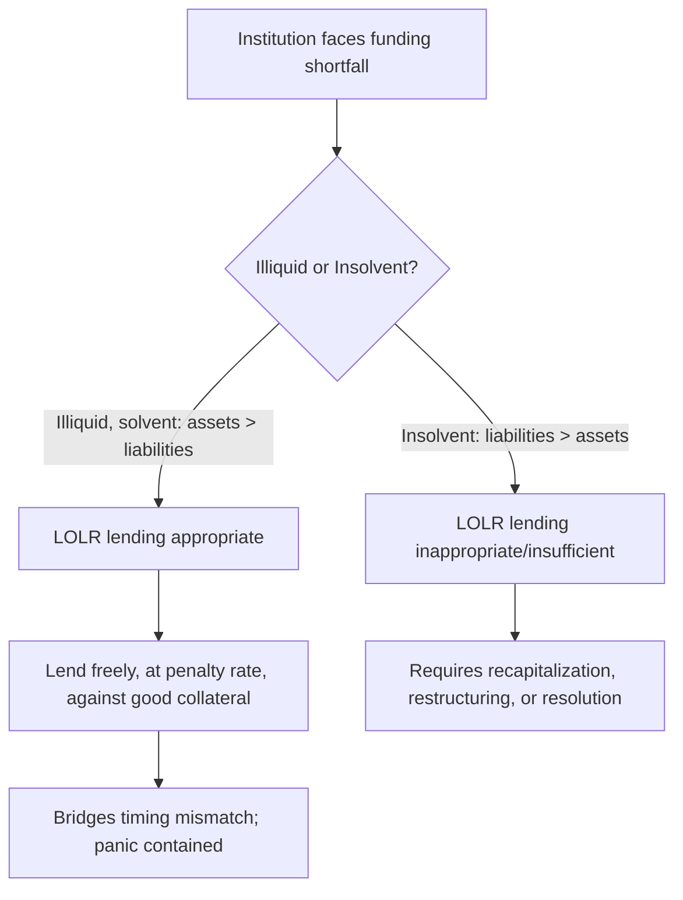

## Lender of Last Resort Function

### Definition and Purpose

The lender of last resort (LOLR) function refers to a central bank's role in providing emergency liquidity to solvent financial institutions facing a temporary shortage of liquid funds, when no other source of funding is available on reasonable terms. The function exists to prevent a liquidity shortage at an otherwise-viable institution from becoming a solvency crisis through forced fire sales of assets, and to prevent localized distress from spreading into a systemic panic through contagion.

The theoretical justification rests on the maturity-transformation role banks perform: banks fund long-term, illiquid loans with short-term, liquid liabilities (deposits or wholesale funding). This structure is efficient in normal conditions but leaves banks structurally exposed to a self-fulfilling run, as formalized in the Diamond–Dybvig (1983) model — if depositors or funders believe others will withdraw, it becomes individually rational to withdraw as well, even from a fundamentally solvent institution, because assets cannot be liquidated quickly enough at fair value to meet a sudden surge in withdrawal demand.

### Historical Origins: Bagehot's Rule

The classical formulation of LOLR doctrine originates with Walter Bagehot's *Lombard Street* (1873), written in response to recurring 19th-century British banking panics. Bagehot's rule, still cited as the foundational principle for central bank crisis lending, consists of three core prescriptions:

1. **Lend freely**: the central bank should not ration credit during a panic; it should meet all legitimate demand for liquidity
2. **At a penalty rate**: lending should occur at an interest rate above the pre-crisis market rate, so that the facility is unattractive to institutions with access to normal funding and is used only by those genuinely in need — this also discourages moral hazard by ensuring borrowing is costly, not free
3. **Against good collateral**: loans should be secured by collateral that would have been considered good (liquid, high-quality) in normal times, valued at pre-crisis prices — this distinguishes lending to illiquid-but-solvent institutions from bailing out insolvent ones

**Key Points — Rationale for Each Element**

- Lending freely prevents the central bank itself from becoming a source of uncertainty about who will and won't receive support, which could otherwise worsen the panic
- The penalty rate criterion serves as a self-selecting mechanism: institutions with cheaper alternatives will not use it, limiting the facility's cost and moral hazard exposure
- The collateral requirement is the operational mechanism for distinguishing illiquidity from insolvency: a solvent bank should, by definition, hold sufficient good collateral to cover the loan; an insolvent bank generally will not

### Distinguishing Illiquidity from Insolvency

This distinction is the central analytical and practical challenge of LOLR policy.

- **Illiquid but solvent**: total assets exceed total liabilities (positive net worth) on a fundamental, hold-to-maturity basis, but the institution cannot immediately convert enough assets to cash to meet current obligations. LOLR support is theoretically appropriate here — it bridges a timing mismatch, not a resource shortfall
- **Insolvent**: liabilities exceed the fundamental value of assets; no amount of liquidity provision resolves this, since the institution structurally cannot meet its obligations. Appropriate responses instead include recapitalization, restructuring, or orderly resolution/wind-down

**[Inference]** In practice, this distinction is often difficult to assess in real time, particularly during a crisis where asset valuations are themselves highly uncertain and rapidly changing; central banks frequently must act under significant uncertainty about which category an institution falls into, and ex-post assessments of illiquidity versus insolvency can differ from real-time judgments.

### The Moral Hazard Problem

Providing LOLR support creates an incentive problem: if financial institutions expect to be rescued during a crisis, they have weaker incentives to manage liquidity and risk prudently in normal times — a form of moral hazard. This tension runs through the design of every LOLR framework:

- **Penalty rates** partially address this by making the facility costly to use, but if the penalty is set too low relative to the severity of the crisis, or if lending is repeatedly extended to the same institutions, the deterrent effect weakens
- **Constructive ambiguity**: some central banks deliberately avoid pre-committing to specific rescue terms or even to whether support will be provided at all, to preserve incentives for prudent behavior — though this can conflict with the "lend freely" principle if uncertainty itself worsens a panic
- **"Too big to fail"**: when an institution is judged systemically important, markets may anticipate that its distress will be met with support that is more accommodating than to smaller institutions, potentially causing large institutions to take on more risk than they otherwise would, anticipating implicit government support

### LOLR in Practice: Modes of Intervention

**Standing/Discount Window Facilities**

Central banks typically maintain a permanent facility (e.g., the Federal Reserve's discount window) through which eligible depository institutions can borrow against acceptable collateral at a set rate, generally above the target policy rate. This is the routine, non-crisis form of the LOLR function.

**Emergency/Crisis Facilities**

During acute stress, central banks have historically created or expanded facilities to reach a broader range of institutions and collateral types than the standard discount window permits. Examples from the 2008 crisis include:

- **Term Auction Facility (TAF)**: allowed depository institutions to bid for term funding, addressing stigma concerns associated with discount window borrowing (banks were often reluctant to use the discount window because doing so could signal weakness to markets)
- **Primary Dealer Credit Facility (PDCF)**: extended access to overnight funding to primary dealers (including investment banks), which were not traditional depository institutions eligible for the discount window
- **Term Securities Lending Facility (TSLF)**: allowed primary dealers to exchange less-liquid securities for more-liquid Treasury securities

**Emergency Lending to Individual Institutions**

Central banks may also extend support to specific systemically important institutions in acute distress, such as the Federal Reserve's facilitation of the Bear Stearns acquisition (March 2008) and direct emergency credit to AIG (September 2008). These interventions typically involve legal authority for lending in "unusual and exigent circumstances" and are more controversial than broad-based facilities, since they involve discretionary decisions about which specific firms receive support.

**International Dimension: Central Bank Swap Lines**

When domestic institutions face shortages of a foreign currency (commonly US dollars, given its role as the dominant global funding and reserve currency), a central bank's domestic LOLR capacity is limited, since it cannot create foreign currency. Central bank liquidity swap lines address this: for example, the Federal Reserve extends dollars to a foreign central bank (e.g., the ECB) in exchange for that central bank's currency, and the foreign central bank then lends the dollars to institutions in its own jurisdiction. This mechanism was used extensively during the 2008 crisis to relieve global dollar funding shortages.

### Formal Considerations in LOLR Design

**Collateral Valuation**

A key operational question is what valuation standard to apply to collateral during a crisis, when market prices may themselves be distorted by illiquidity (as discussed in the fire-sale/mark-to-market feedback dynamic common to financial crises). Bagehot's original prescription of "pre-crisis" collateral valuation reflects an attempt to lend against fundamental rather than temporarily depressed market value, but determining fundamental value during a live crisis is inherently uncertain.

**Rate Setting**

The penalty rate must balance two competing objectives:

$$\text{Penalty Rate} > \text{Normal Market Rate}$$

but not so high as to:

- Discourage legitimate borrowing by illiquid-but-solvent institutions, which could defeat the purpose of the facility during a genuine panic
- Signal excessive central bank concern about the borrower's condition, worsening market perception of counterparty risk (a "stigma effect")

[Inference] The appropriate penalty rate level involves a judgment call specific to the severity and nature of each crisis episode, and there is no universally agreed formula for setting it; central banks have in practice adjusted facility design (e.g., using auction-based mechanisms like the TAF) partly to sidestep stigma concerns associated with a visibly punitive discount rate.

**Scope of Eligible Institutions**

Traditional LOLR frameworks were designed around regulated depository banks. The growth of shadow banking exposed a gap: non-bank intermediaries (investment banks, money market funds, structured investment vehicles) performed bank-like maturity transformation but fell outside traditional LOLR eligibility and deposit insurance frameworks. The 2008 crisis prompted an expansion of emergency facilities to reach these institutions, raising ongoing debate about the appropriate permanent scope of central bank backstops beyond traditional banking.

### Interaction with Deposit Insurance

Deposit insurance and LOLR support serve complementary but distinct functions in preventing bank runs:

- **Deposit insurance** removes individual depositors' incentive to run by guaranteeing they will be made whole regardless of the bank's condition, addressing the coordination-failure mechanism in the Diamond–Dybvig framework directly at the depositor level
- **LOLR support** addresses liquidity shortfalls at the institutional level, including circumstances not covered by deposit insurance (e.g., wholesale funding markets, uninsured deposits above coverage limits, or non-deposit-taking institutions)

Both tools share the moral hazard concern: guaranteeing outcomes in advance can weaken incentives for prudent behavior by both depositors/funders and the institutions themselves, which is why both are typically paired with prudential regulation and supervision.

### Practical Example: Applying Bagehot's Rule

Consider a commercial bank in an otherwise well-capitalized banking system that suddenly faces a large, unexpected wholesale funding outflow due to a market-wide loss of confidence unrelated to that bank's specific balance sheet quality. The bank holds a substantial portfolio of high-quality government bonds that would ordinarily be readily saleable, but the market for such sales is temporarily disrupted.

Applying Bagehot's rule: the central bank would (1) accept the bank's application for emergency liquidity without rationing, provided the collateral is adequate ("lend freely"); (2) price the facility above the bank's normal cost of wholesale funding, ensuring only genuinely liquidity-constrained institutions use it ("penalty rate"); and (3) value the government bond collateral at its pre-crisis market price rather than any temporarily depressed price reflecting the current dislocation ("good collateral"). If the bank's underlying capital position is sound, this liquidity bridge allows it to meet its obligations until the funding market normalizes, without forcing disorderly asset sales that could spread stress to other holders of similar bonds.

### Common Pitfalls and Misconceptions

- **"LOLR support means bailing out failing banks"**: correctly designed LOLR support targets liquidity problems, not insolvency; providing liquidity to a genuinely insolvent institution without addressing the underlying capital shortfall does not resolve the crisis and may merely delay resolution while increasing ultimate losses
- **"A penalty rate always deters use"**: during a severe systemic panic, the relevant comparison is not the pre-crisis market rate but the alternative of no funding at all (or funding at prohibitive fire-sale-implied rates), so even a substantial penalty rate can be attractive relative to the alternative
- **"LOLR is only relevant to traditional banks"**: the 2008 crisis demonstrated that LOLR logic applies wherever maturity transformation occurs, including shadow banking, and central banks have in practice extended emergency support well beyond traditional depository institutions when systemic risk warranted it

### **Related Topics**

- Diamond–Dybvig model of bank runs
- Anatomy of a financial crisis (general theoretical framework)
- The 2008 Global Financial Crisis: causes and transmission
- Deposit insurance design and moral hazard
- Too-big-to-fail and systemically important financial institutions (SIFIs)
- Central bank liquidity swap lines and international dollar funding
- Shadow banking regulation and the scope of the financial safety net
- Bank resolution regimes and bail-in mechanisms
- Unconventional monetary policy and quantitative easing
- Macroprudential regulation and financial stability mandates