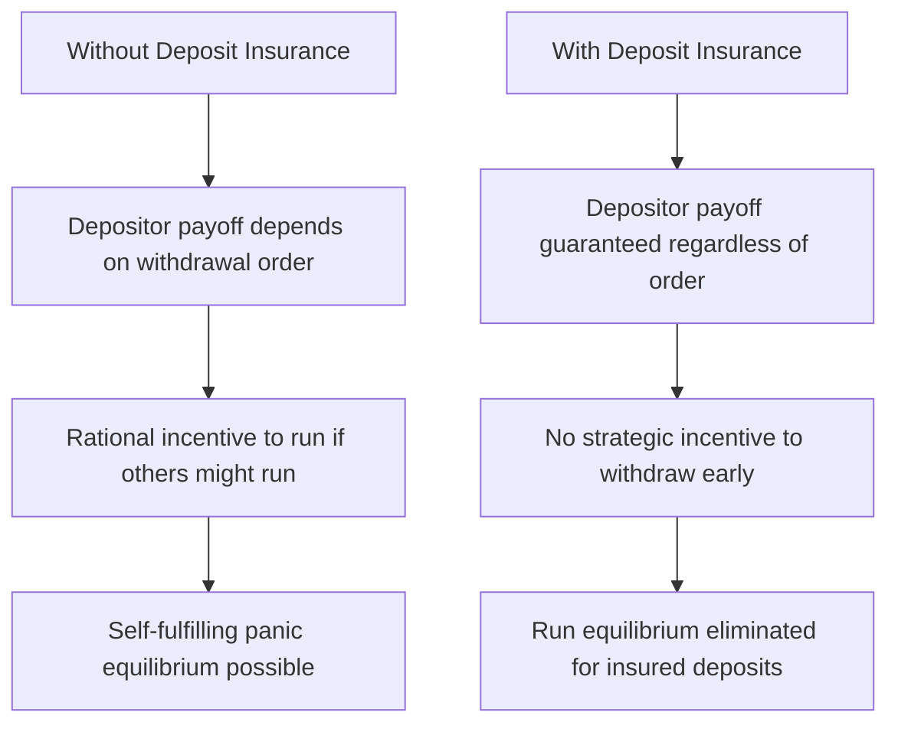
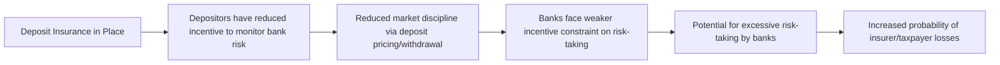
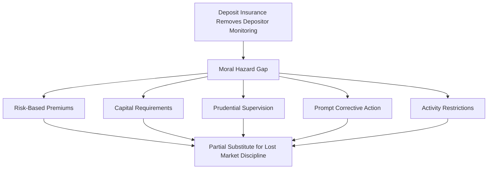

## Deposit Insurance and Moral Hazard

### Definitions and Core Concepts

**Deposit insurance** is a government or government-sponsored guarantee that protects depositors, up to a specified coverage limit, from loss in the event that their bank fails. **Moral hazard**, in this context, refers to the tendency of insulated parties — insured depositors and, indirectly, the banks that hold their funds — to take on greater risk than they would in the absence of the guarantee, since the costs of that risk-taking are partly shifted onto the insurer (typically a government agency, and ultimately taxpayers).

**Key Points**

- Deposit insurance is designed to directly neutralize the coordination-failure mechanism underlying bank runs, discussed in the Diamond-Dybvig framework: if depositors know their funds are protected regardless of the bank's fate, there is no longer any individually rational reason to join a run based purely on fear that other depositors will withdraw first.
- The policy tension at the heart of this topic is that the very feature which makes deposit insurance effective at preventing runs — removing depositors' incentive to monitor and react to bank risk — simultaneously removes a key market-based disciplinary mechanism that would otherwise constrain banks from taking on excessive risk.
- This trade-off between **crisis prevention** and **incentive distortion** is a recurring theme across nearly all financial safety-net policy, including the lender-of-last-resort function discussed elsewhere in this chapter.

### How Deposit Insurance Addresses the Run Mechanism

Recall from the Diamond-Dybvig framework that a bank run can occur as a self-fulfilling equilibrium: a late-type depositor, believing other depositors will withdraw early, rationally joins the run even absent any change in the bank's underlying fundamentals, since the sequential-service constraint means late withdrawers risk receiving nothing if the bank's liquidatable assets are exhausted.

$$U_i(\text{withdraw early} \mid \text{others run, uninsured}) > U_i(\text{wait} \mid \text{others run, uninsured})$$

Deposit insurance changes this payoff structure directly:

$$U_i(\text{withdraw early} \mid \text{insured}) \approx U_i(\text{wait} \mid \text{insured})$$

**Key Points**

- Because the insured depositor receives their guaranteed payment regardless of whether they withdraw before or after other depositors, the strategic advantage to withdrawing early — the core driver of the panic equilibrium — is eliminated.
- This transforms the coordination game from one with multiple equilibria (a "good" no-run equilibrium and a "bad" run equilibrium) into one where the run equilibrium is no longer a rational best response for insured depositors, effectively selecting for the efficient, no-run outcome.
- Empirically, the introduction of federal deposit insurance in the United States (the FDIC, established 1933, following the banking panics of 1930-1933) is widely credited with a marked and sustained reduction in the frequency of classic retail bank runs in the decades that followed, relative to the pre-insurance era.

### Design Features of Deposit Insurance Schemes

**Key Points**

- **Coverage limits**: Most schemes insure deposits only up to a specified cap per depositor per institution (e.g., $250,000 per depositor per insured bank under current U.S. FDIC rules), rather than providing unlimited coverage.
- **Funding mechanism**: Deposit insurance funds are typically financed through premiums levied on member banks (ex ante funding), though some jurisdictions have historically relied more heavily on ex post assessments or government backstops when the insurance fund itself is depleted by a large wave of failures.
- **Scope of coverage**: Schemes vary in which deposit types are covered (e.g., typically checking and savings deposits, certificates of deposit) versus excluded (e.g., uninsured wholesale funding, brokered deposits in some contexts, or deposits above the coverage cap).
- **Administering authority**: In the U.S., the FDIC both administers deposit insurance and, in many cases, acts as the receiver for failed banks, combining the insurance function with a resolution role; other jurisdictions structure these functions differently, sometimes separating the insurance fund administrator from the bank supervisor and resolution authority.

### The Coverage Limit Problem: Uninsured Deposits and Runs

**Key Points**

- Coverage limits mean that deposits *above* the cap remain economically exposed to the Diamond-Dybvig run dynamic, since large depositors with uninsured balances retain the same rational incentive to withdraw early during a perceived risk event that insured depositors no longer have.
- This creates a bifurcated depositor base at many banks: insured retail depositors are effectively immunized against run incentives, while uninsured depositors (often large corporate accounts, high-net-worth individuals, or institutional depositors) remain vulnerable to — and capable of triggering — a modern-style run.
- **Example**: The Silicon Valley Bank failure (March 2023) is widely cited as illustrating this dynamic in a modern, digitally accelerated form: [Unverified — details subject to ongoing analysis] the bank's depositor base was unusually concentrated among technology startups and venture-backed firms holding balances well in excess of the $250,000 FDIC coverage limit, meaning a very large proportion of the bank's total deposits were uninsured and therefore economically exposed to run incentives once concerns about the bank's securities portfolio losses became public; withdrawals reportedly proceeded at a pace facilitated by mobile banking and amplified by rapid information spread through venture capital networks and social media.
- [Inference] This episode has been widely interpreted as evidence that the classical deposit-insurance solution to bank runs, designed around a mostly-insured retail depositor base, provides substantially less protection against panic in banking models where a large share of deposits are institutional and uninsured — prompting renewed policy discussion of whether coverage limits, or the treatment of uninsured deposits during resolution, should be reconsidered, though no settled consensus on specific reforms had been reached as of the available information.

### The Core Moral Hazard Mechanism

**Key Points**

- With deposit insurance in place, depositors have substantially reduced incentive to **monitor bank risk-taking** or to demand higher interest rates (a risk premium) from riskier banks, since their return is effectively unaffected by the bank's actual risk profile up to the coverage limit.
- This removes a market discipline mechanism that would otherwise exist: in an uninsured world, depositors seeking higher safety would migrate toward more conservatively managed banks, and riskier banks would face higher funding costs or deposit flight, creating a natural incentive for banks to manage risk prudently.
- Banks, aware that their depositor base has reduced sensitivity to the bank's actual risk level, may face weaker market-based incentives to maintain conservative risk profiles, potentially leading to greater risk-taking than would prevail absent the insurance guarantee — a dynamic sometimes summarized as deposit insurance converting depositors from active monitors into passive, price-insensitive funding sources.

### Historical Illustration: The U.S. Savings and Loan Crisis

**Example**

The U.S. Savings and Loan (S&L) crisis of the 1980s is frequently cited as a canonical illustration of deposit-insurance-related moral hazard in practice.

**Key Points**

- Many S&L institutions ("thrifts") faced severe interest-rate risk exposure in the early 1980s (holding long-term, fixed-rate mortgages funded by short-term deposits, amid a period of sharply rising interest rates), leaving a substantial number of institutions insolvent or near-insolvent on a mark-to-market basis by the early-to-mid 1980s.
- Deregulation in this period expanded the range of activities permitted to federally insured thrifts (including riskier commercial real estate lending and other speculative investments) at precisely the moment when many institutions were already under balance-sheet stress.
- [Inference] A substantial body of research on this episode argues that already-insolvent or severely undercapitalized thrifts, protected by federal deposit insurance, had a rational incentive to pursue high-risk, high-return strategies ("go for broke" behavior or "gambling for resurrection") since insured depositors would not withdraw funds regardless of the institution's risk profile, while the institution's owners retained the upside of successful bets and were substantially insulated from the downside by the deposit insurance guarantee and limited liability — a classic moral hazard dynamic. This episode's regulatory response ultimately required a large public bailout (the Resolution Trust Corporation, established under FIRREA in 1989) to resolve.

### Mitigating Mechanisms: Addressing the Moral Hazard Trade-Off

Because eliminating deposit insurance entirely is not generally regarded as a viable policy option (given its effectiveness at preventing the far more costly outcome of systemic bank runs), the standard policy approach is to retain deposit insurance while layering on complementary mechanisms designed to substitute for the market discipline it removes.

**Key Points**

- **Risk-based deposit insurance premiums**: Rather than charging all insured banks a flat premium regardless of risk profile, many schemes (including the FDIC) charge higher premiums to banks assessed as carrying greater risk, attempting to reintroduce a pricing signal that penalizes risk-taking, similar to what uninsured depositors would otherwise impose.
- **Capital requirements**: Minimum capital ratios (under frameworks like Basel III) require bank shareholders to bear a meaningful first-loss buffer, ensuring that risk-taking still exposes the bank's owners to potential loss even though depositors are insulated, partially substituting shareholder discipline for the depositor discipline that insurance removes.
- **Prudential supervision and examination**: Bank regulators conduct ongoing supervisory examinations, asset quality reviews, and enforcement actions, functioning as a direct substitute for the market monitoring that insured depositors no longer have incentive to perform themselves.
- **Prompt corrective action frameworks**: Regulatory regimes (such as the U.S. Prompt Corrective Action framework under FDICIA, enacted partly in response to the S&L crisis) mandate automatic, escalating supervisory intervention as a bank's capital ratio deteriorates, intended to constrain risk-taking and force corrective action before an institution reaches the point of insolvency, reducing reliance on ex post deposit insurance payouts.
- **Limits on activities of insured institutions**: Some regulatory frameworks restrict the types of higher-risk activities that federally insured depository institutions may engage in directly (as opposed to through separately capitalized non-bank affiliates), intended to limit the scope of activities implicitly subsidized by the deposit insurance guarantee.

### "Too Big to Fail" and Extended Moral Hazard

**Key Points**

- The moral hazard dynamic extends beyond retail deposit insurance to a broader phenomenon at systemically important institutions: creditors and counterparties beyond insured depositors (including uninsured wholesale funders, bondholders, and derivatives counterparties) may also anticipate that the government will intervene to prevent the failure of a sufficiently large or interconnected institution, extending implicit protection — and its associated moral hazard — well beyond the formally insured deposit base.
- This "too big to fail" extension of moral hazard was a central concern motivating post-2008 reforms, including capital surcharges for global systemically important banks (G-SIBs) under Basel III and resolution frameworks (such as Dodd-Frank's Orderly Liquidation Authority) designed to allow large institutions to fail and be resolved — including imposing losses on uninsured creditors through **bail-in** mechanisms — without requiring open-ended public bailouts.
- [Inference] The credibility of these reforms in fully eliminating "too big to fail" moral hazard remains debated: critics argue that in an actual crisis, policymakers may still find it politically or economically difficult to allow a very large, highly interconnected institution to fail and impose losses broadly, meaning the *de facto* expectation of intervention may persist to some degree regardless of the *de jure* resolution framework in place — though this is inherently difficult to test empirically absent an actual large-institution failure under the post-reform framework.

### Cross-Country Variation in Deposit Insurance Design

**Key Points**

- Deposit insurance schemes vary substantially across countries in coverage limits, funding structure (ex ante fund accumulation versus ex post levies), and whether coverage is explicit and legally codified versus implicit (an unlegislated but historically observed practice of government intervention to protect depositors).
- [Inference] Cross-country empirical research (including work associated with the World Bank's deposit insurance database) has generally found that the relationship between deposit insurance generosity and financial stability is not uniformly positive: while deposit insurance reduces run risk, more generous coverage combined with weak complementary supervisory and regulatory frameworks has in some empirical studies been associated with a higher incidence of banking crises, consistent with the moral hazard mechanism dominating in institutional contexts where offsetting discipline mechanisms are weak or poorly enforced — though the strength and robustness of this relationship varies across studies and time periods, and causal identification in cross-country panel settings of this kind is methodologically challenging.

### Summary: The Central Policy Trade-Off

| Consideration | Effect of More Generous Deposit Insurance |
| --- | --- |
| Bank run risk | Decreases — depositors have reduced incentive to withdraw preemptively |
| Depositor monitoring / market discipline | Decreases — insured depositors have reduced incentive to assess bank risk |
| Bank risk-taking incentive (absent offsetting regulation) | Potentially increases — moral hazard |
| Fiscal exposure / contingent liability to government | Increases — insurer bears greater potential loss exposure |
| Systemic stability during a broad panic | Generally improves, provided complementary supervisory/capital frameworks are adequate |

**Related Topics**

- Banking crises and bank runs (Diamond-Dybvig framework)
- Lender of last resort function
- The 2008 Global Financial Crisis: causes and transmission
- The U.S. Savings and Loan crisis (extended case study)
- Basel III capital requirements and G-SIB surcharges
- Resolution regimes and bail-in mechanisms
- Prompt corrective action and prudential supervision frameworks
- "Too big to fail" and systemic risk regulation
- Silicon Valley Bank failure and uninsured deposit runs (2023)
- Cross-country deposit insurance design and financial stability outcomes