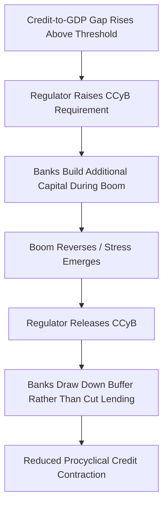
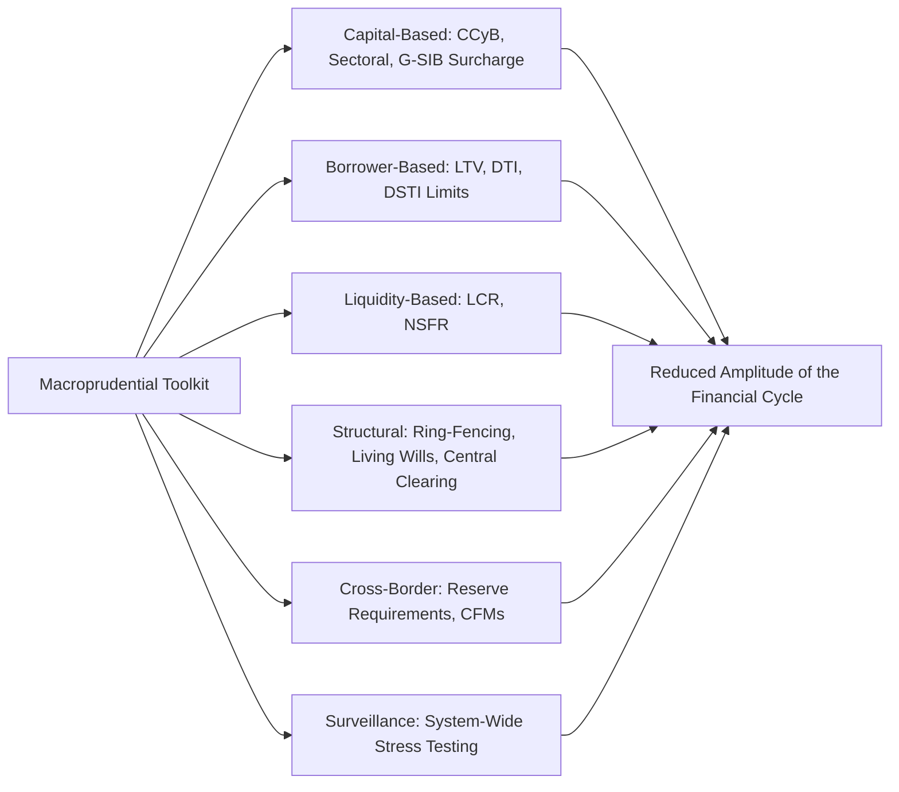

## Macroprudential Regulation Tools

### Definitions and Core Concepts

**Macroprudential regulation** refers to a set of policy tools designed to address risks to the **financial system as a whole** (systemic risk), as distinct from traditional **microprudential regulation**, which focuses on the safety and soundness of individual institutions in isolation. The macroprudential approach recognizes that a financial system can become systemically fragile even when each individual institution appears sound on a standalone basis, because risks can be correlated across institutions, amplified through interconnections, and generated by aggregate, procyclical behavior.

**Key Points**

- The conceptual foundation of macroprudential policy is the distinction between the **cross-sectional dimension** of systemic risk (how risk is distributed and concentrated across institutions at a given point in time) and the **time-series dimension** (how aggregate risk builds up and unwinds over the financial cycle, i.e., procyclicality).
- Macroprudential regulation emerged as a distinct, formalized policy framework substantially in response to the 2008 Global Financial Crisis, which exposed the limitations of a purely microprudential approach: individual banks that appeared well-capitalized on a standalone basis nonetheless contributed to, and were vulnerable to, system-wide credit booms, asset bubbles, and contagion.
- The overarching objective is to reduce the amplitude of the financial cycle — moderating credit booms during expansions and preserving loss-absorption capacity ahead of downturns — rather than to eliminate financial cycles or business cycles entirely.

### Microprudential vs. Macroprudential: The Fallacy of Composition

$$\text{Sum of individually "safe" institutions} \neq \text{A safe financial system}$$

**Key Points**

- A central insight motivating macroprudential regulation is a **fallacy-of-composition** problem: actions that are individually rational and risk-reducing for a single institution (e.g., selling assets to reduce leverage during a downturn) can be collectively destabilizing when undertaken simultaneously by many institutions (triggering fire sales, discussed extensively in the asset-bubble and credit-boom material).
- Microprudential regulation, by focusing on each institution's standalone resilience, does not naturally account for these system-wide interaction effects, correlated exposures across institutions, or the procyclical feedback between the financial sector and the real economy.
- Macroprudential tools are therefore explicitly calibrated with reference to system-wide indicators (aggregate credit growth, asset price trends, interconnectedness measures) rather than solely institution-specific risk metrics.

| Dimension | Microprudential Regulation | Macroprudential Regulation |
| --- | --- | --- |
| Primary objective | Safety and soundness of individual institutions | Stability of the financial system as a whole |
| Risk treated as | Exogenous to the institution | Partly endogenous — driven by collective behavior across institutions |
| Typical calibration | Institution-specific risk profile | System-wide indicators (credit-to-GDP gap, asset prices, interconnectedness) |
| Time dimension | Point-in-time institutional soundness | Explicitly cyclical — varies with the credit/financial cycle |

### The Countercyclical Capital Buffer (CCyB)

**Key Points**

- The **countercyclical capital buffer**, introduced under the Basel III framework, requires banks to hold additional capital, above minimum microprudential requirements, during periods when aggregate credit growth is judged excessive relative to trend.
- The buffer is calibrated primarily with reference to the **credit-to-GDP gap** (the deviation of the credit-to-GDP ratio from its long-run trend), a metric extensively validated in cross-country empirical work (notably by Basel Committee researchers and academics including Schularick and Taylor) as one of the most robust early-warning indicators of subsequent financial crises.
- The buffer can range up to a jurisdiction-specific maximum (commonly up to 2.5% of risk-weighted assets under the original Basel III framework, with some jurisdictions subsequently authorizing higher maxima) and is set by national or regional macroprudential authorities, which can raise it during a credit boom and release it during a downturn.
- **Release mechanism**: When systemic stress materializes, the accumulated buffer can be released, allowing banks to draw down capital ratios and continue lending rather than being forced to deleverage precisely when credit is most needed — directly counteracting the procyclical credit contraction that typically follows a boom.

### Borrower-Based Measures: LTV, DTI, and DSTI Limits

**Key Points**

- **Loan-to-value (LTV) limits** cap the amount that can be borrowed relative to the value of the collateral asset (most commonly applied to residential mortgages), directly constraining the credit-collateral feedback loop discussed in the credit-booms material at its origination point.

$$\text{LTV} = \frac{\text{Loan Amount}}{\text{Collateral Value}} \leq \text{LTV}_{\max}$$

- **Debt-to-income (DTI) limits** cap total borrower debt relative to income, addressing borrower repayment capacity risk independent of collateral value fluctuations.
- **Debt-service-to-income (DSTI) limits** cap the share of a borrower's income devoted to debt service payments, a related but distinct measure that accounts for the interest rate and repayment schedule of the specific loan rather than the total debt stock alone.
- **Key distinguishing feature**: unlike bank capital requirements, which operate on the *lender's* balance sheet, borrower-based measures constrain the *terms of the loan itself* at origination, making them a more direct tool for moderating credit-collateral feedback loops in specific asset markets (most commonly residential and commercial real estate) without requiring a broad-based tightening of aggregate credit conditions.
- [Inference] Borrower-based measures are generally considered more targeted (affecting specifically the sector or asset class where a boom is occurring) than aggregate tools like the CCyB, though this same targeting can create incentives for credit activity to migrate toward less-regulated channels (regulatory arbitrage/leakage) if the measures are not applied consistently across all lender types in a given market.

### Sectoral and Institution-Specific Capital Tools

**Key Points**

- **Sectoral capital requirements / risk weights**: Regulators can impose higher capital charges on bank exposures to specific sectors identified as exhibiting excessive credit growth or asset price appreciation (e.g., commercial real estate, specific consumer lending categories), allowing a more surgical intervention than an economy-wide buffer.
- **Systemic risk buffer**: An additional capital requirement, distinct from the CCyB, that can be applied to address structural (non-cyclical) systemic risks, such as high concentration in a particular sector or persistent structural vulnerabilities in a national banking system.
- **G-SIB / D-SIB capital surcharges**: Additional capital requirements applied specifically to institutions designated as globally or domestically systemically important banks (G-SIBs/D-SIBs), reflecting the greater systemic consequences of their potential failure and partially internalizing the "too big to fail" externality discussed in the deposit-insurance and lender-of-last-resort material.
- **Large exposure limits**: Restrictions on the maximum credit exposure a bank may have to a single counterparty or group of connected counterparties, intended to limit concentration risk and contagion channels through direct interbank or corporate exposures.

### Liquidity-Based Macroprudential Tools

**Key Points**

- **Liquidity Coverage Ratio (LCR)**: A Basel III requirement that banks hold sufficient high-quality liquid assets (HQLA) to cover projected net cash outflows over a 30-day stress scenario, directly targeting the maturity-mismatch vulnerability that underlies bank runs (both classical retail runs and modern wholesale/repo runs).

$$\text{LCR} = \frac{\text{High-Quality Liquid Assets}}{\text{Total Net Cash Outflows over 30 days}} \geq 100\%$$

- **Net Stable Funding Ratio (NSFR)**: A complementary Basel III requirement addressing longer-horizon funding structure, requiring banks to fund illiquid, long-term assets with sufficiently stable funding sources over a one-year horizon, directly targeting the structural maturity mismatch discussed in the fractional-reserve-banking framework.

$$\text{NSFR} = \frac{\text{Available Stable Funding}}{\text{Required Stable Funding}} \geq 100\%$$

- Both ratios are explicitly motivated by the shadow-banking "run on repo" dynamics observed during the 2008 crisis, in which reliance on short-term wholesale funding to finance longer-term, illiquid assets left institutions acutely vulnerable to a sudden funding withdrawal.

### Stress Testing as a Macroprudential Tool

**Key Points**

- **System-wide stress testing** — assessing how the banking system as a whole, rather than any single institution, would perform under a severe but plausible hypothetical adverse macroeconomic and financial scenario — has become a central macroprudential surveillance tool since the 2008 crisis.
- The U.S. **Comprehensive Capital Analysis and Review (CCAR)** and **Dodd-Frank Act Stress Testing (DFAST)** programs, and the European Banking Authority's EU-wide stress tests, exemplify this approach, requiring large banks to demonstrate they would remain adequately capitalized under scenarios involving sharp GDP contraction, asset price declines, and unemployment spikes.
- [Inference] Stress testing serves a dual macroprudential function: it provides regulators with information about system-wide vulnerability (including, in some designs, second-round contagion effects from bank interactions), and — when results are publicly disclosed — can itself function as a confidence-building or confidence-restoring mechanism, as was widely credited following the U.S. Supervisory Capital Assessment Program's 2009 disclosure during the depths of the GFC.
- A methodological challenge for stress testing as a macroprudential tool is capturing genuinely **system-wide** effects (fire sales, contagion, common exposures across institutions) rather than treating each bank's resilience independently, since the latter approach risks reproducing the same fallacy-of-composition limitation that motivated the shift toward macroprudential regulation in the first place; more advanced stress-testing frameworks have increasingly incorporated network and contagion modeling to address this.

### Structural and Institutional Tools

**Key Points**

- **Ring-fencing / structural separation**: Some jurisdictions (e.g., the UK's ring-fencing regime, related in spirit to the U.S. Volcker Rule's restrictions on proprietary trading) require legal or operational separation between a bank's core retail deposit-taking activities and its higher-risk trading or investment banking activities, intended to insulate insured deposits and critical payment functions from losses generated by riskier business lines.
- **Resolution and "living will" requirements**: Systemically important institutions are required to prepare and regularly update resolution plans ("living wills") demonstrating how they could be wound down in an orderly manner without requiring public bailout support, directly addressing the too-big-to-fail moral hazard problem discussed in the deposit-insurance material.
- **Central clearing requirements for derivatives**: Post-2008 reforms (under Dodd-Frank and equivalent international frameworks) mandated that standardized over-the-counter derivatives be cleared through central counterparties, intended to reduce the opaque, bilateral counterparty risk web that contributed to contagion concerns during the AIG episode of the GFC.

### Capital Flow Management Measures (Open-Economy Context)

**Key Points**

- In open economies, particularly emerging markets, macroprudential policy can extend to tools addressing risks arising from **cross-border capital flows**, given the sudden-stop and currency-mismatch vulnerabilities discussed in the credit-booms material.
- **Reserve requirements on foreign-currency liabilities**: Some countries impose differentiated reserve requirements on foreign-currency-denominated bank funding, intended to raise the cost of, and thereby moderate, externally-financed credit booms.
- **Capital flow management measures (CFMs)**: A broader and more heterogeneously applied category of tools (including taxes or limits on certain types of capital inflows) intended to moderate the volume or composition of capital flows in ways judged likely to reduce systemic vulnerability, distinct from traditional capital controls primarily motivated by balance-of-payments or exchange-rate management objectives.
- [Inference] The appropriate scope and use of capital flow management measures for macroprudential purposes remains more contested internationally than domestic tools like the CCyB or LTV limits, given historical debates (including within the IMF) about the costs of capital account restrictions to market efficiency and international capital allocation versus their potential financial-stability benefits; the IMF's institutional view has evolved over time to acknowledge a more qualified role for such measures in specific circumstances, though this remains a more actively debated area of policy than most bank-focused macroprudential tools.

### Institutional Architecture for Macroprudential Policy

**Key Points**

- Macroprudential policy requires clear institutional authority to identify systemic risk and calibrate/activate tools, and jurisdictions have adopted varying institutional models: dedicated macroprudential authorities or committees (e.g., the UK's Financial Policy Committee, housed within the Bank of England), central-bank-led frameworks, or inter-agency coordinating bodies (e.g., the U.S. Financial Stability Oversight Council, established under Dodd-Frank, which coordinates across multiple existing regulatory agencies rather than creating a single unified macroprudential regulator).
- [Inference] A recurring institutional design question is whether macroprudential authority should be housed within the central bank (potentially benefiting from the central bank's market intelligence, LOLR role, and independence) or in a separate body (potentially avoiding the concentration of both monetary policy and financial stability mandates in a single institution, and separating the political economy considerations attached to each); different jurisdictions have made different institutional choices, and no single model has emerged as a clear, universally-adopted best practice.

### Limitations and Ongoing Debates

**Key Points**

- **Calibration difficulty**: Setting macroprudential tools (particularly the CCyB) requires real-time judgment about whether current credit growth is "excessive" — a distinction between "good" financial deepening and "bad," crisis-prone credit booms that, as discussed in the credit-booms material, is genuinely difficult to draw with confidence in real time rather than only in retrospect.
- **Regulatory arbitrage / leakage**: Tightening macroprudential requirements on regulated banks can push credit intermediation toward less-regulated shadow banking channels, potentially reducing the effectiveness of the intervention or even increasing aggregate systemic risk if oversight of the shadow banking sector is weaker.
- **Cross-border leakage**: In open, integrated financial markets, domestic macroprudential tightening can be partially offset if borrowers or activities shift toward foreign lenders not subject to the same domestic requirements, a concern that has motivated some international coordination efforts (e.g., reciprocity arrangements for the CCyB under Basel III, where foreign banks' domestic exposures can become subject to the host country's buffer requirement).
- **Interaction with monetary policy**: [Inference] The relationship between macroprudential policy and monetary policy is an active area of both theoretical and applied research — some frameworks treat the two as largely complementary (macroprudential tools handling sector-specific/financial-stability objectives, monetary policy handling broad price-stability objectives), while others argue for closer coordination or even integration given that both affect aggregate credit conditions and asset prices through overlapping channels, and this question remains without a fully settled resolution in mainstream macroeconomic policy design.

**Related Topics**

- Credit booms and financial fragility (credit-to-GDP gap as CCyB calibration input)
- Asset price bubbles and their macroeconomic consequences
- The 2008 Global Financial Crisis: causes and transmission
- Basel III capital and liquidity framework (LCR, NSFR, CCyB in technical detail)
- Deposit insurance and moral hazard ("too big to fail" and G-SIB surcharges)
- Lender of last resort function
- Sudden stops and capital flow management in open economies
- Resolution regimes and bail-in mechanisms
- Shadow banking and regulatory arbitrage
- System-wide stress testing methodology (CCAR, DFAST, EBA stress tests)