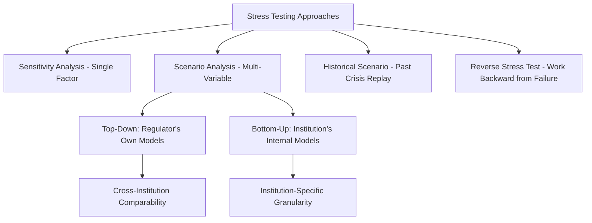
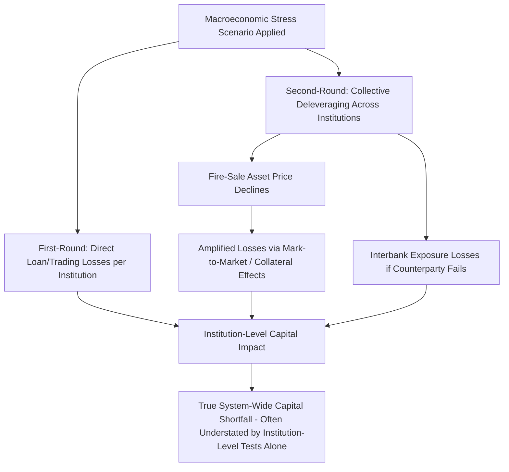

## Stress Testing and Systemic Risk Assessment

### Definitions and Core Concepts

**Stress testing** is a risk-assessment methodology that evaluates how a financial institution's or financial system's balance sheet and capital position would perform under a hypothetical severe but plausible adverse scenario, as distinct from assessments based solely on historical or current conditions. **Systemic risk assessment** more broadly encompasses the set of analytical tools used to identify and measure vulnerabilities that could threaten the stability of the financial system as a whole, of which stress testing is one central component.

**Key Points**

- Stress testing can be applied at the level of a single institution (microprudential stress testing) or across the banking/financial system as a whole (macroprudential or system-wide stress testing), with the latter explicitly designed to capture interactions and contagion effects between institutions that institution-level testing alone would miss.
- The core methodological logic is **counterfactual and forward-looking**: rather than measuring current risk based on historical loss experience, stress testing asks "what would happen to this institution's (or system's) capital position if a specific adverse scenario materialized," directly addressing the tail-risk blind spots that standard historical risk models can miss.
- Modern regulatory stress testing became a central pillar of financial supervision following the 2008 Global Financial Crisis, which exposed the inadequacy of pre-crisis risk models that had substantially underweighted the probability of a severe, correlated, nationwide decline in U.S. housing prices.

### Types of Stress Tests

**Key Points**

- **Sensitivity analysis**: Tests the impact of a single risk factor shock (e.g., a specified change in interest rates or a specific asset price) on an institution's balance sheet, holding other factors constant — a simpler, more limited form of stress testing.
- **Scenario analysis**: Tests the combined impact of a coherent, multi-variable macroeconomic and financial scenario (e.g., a specified path for GDP, unemployment, house prices, and equity markets simultaneously) developed to represent a plausible severe downturn, capturing interactions between variables that single-factor sensitivity analysis cannot.
- **Historical scenario tests**: Scenarios modeled directly on a specific past crisis episode (e.g., a repeat of 2008-2009 conditions), providing an intuitive, empirically grounded reference point, though [Inference] historical scenarios may understate risks specific to a changed financial system structure or new sources of vulnerability that did not exist during the historical reference episode.
- **Hypothetical/reverse stress tests**: Rather than specifying a scenario and measuring the resulting loss, reverse stress testing works backward from a defined failure outcome (e.g., breach of minimum capital requirements) to identify which combination of shocks would be sufficient to produce that outcome, helping identify an institution's or system's specific points of greatest vulnerability.
- **Top-down vs. bottom-up approaches**: Bottom-up stress tests are conducted by each institution using its own internal models and data, subject to supervisory review and challenge; top-down stress tests are conducted independently by the regulator using standardized models and data across all institutions, allowing more consistent cross-institution comparison but potentially less granular institution-specific detail. Many major regulatory stress-testing regimes combine both approaches, using top-down results to benchmark and challenge bottom-up submissions.

### The Regulatory Stress Testing Framework: Core Mechanics

**Key Points**

- A typical regulatory stress test specifies one or more macroeconomic scenarios (commonly a "baseline" and one or more "adverse" or "severely adverse" scenarios) covering a multi-year horizon, defining paths for variables such as real GDP growth, unemployment, equity prices, house prices, interest rates, and corporate bond spreads.
- Institutions (or the regulator, in top-down exercises) then project how these macroeconomic paths would translate into loan losses, trading losses, revenue changes, and resulting changes in regulatory capital ratios over the stress horizon, typically incorporating models linking macroeconomic conditions to credit losses (e.g., how rising unemployment translates into mortgage or consumer loan default rates).
- The test's pass/fail criterion is generally whether the institution's projected capital ratios remain above specified regulatory minimums throughout the stress horizon, even under the severely adverse scenario, without requiring extraordinary government support.

$$\text{Post-Stress Capital Ratio}_t = \frac{\text{Capital}_0 - \sum_{i=1}^{t} \text{Projected Losses}_i + \text{Projected Retained Earnings}_i}{\text{Risk-Weighted Assets}_t} \geq \text{Minimum Requirement}$$

**Key Points**

- Institutions that fail to maintain adequate capital under the stress scenario may be required to raise additional capital, restrict capital distributions (dividends, share buybacks), or take other remedial supervisory actions.
- Results are frequently used to inform ongoing capital planning requirements: in several major regimes, an institution's own internally-generated stress scenarios and capital plans must be submitted for supervisory review, and the ability to make capital distributions is explicitly conditioned on passing the stress test.

### Major Regulatory Stress Testing Regimes

**Example**

- **U.S. Comprehensive Capital Analysis and Review (CCAR)**: A Federal Reserve program requiring large U.S. bank holding companies to submit capital plans and undergo supervisory stress testing; a bank's approval to make planned capital distributions is contingent on demonstrating it would remain adequately capitalized under the Federal Reserve's stress scenarios.
- **Dodd-Frank Act Stress Testing (DFAST)**: A related, statutorily mandated companion program under the Dodd-Frank Act, requiring stress testing of large financial institutions using standardized scenarios, with results publicly disclosed to provide market transparency about the resilience of the banking system.
- **European Banking Authority (EBA) EU-wide stress tests**: Conducted periodically across major European Union banks in coordination with national supervisors and the European Central Bank, using common methodology and adverse scenarios calibrated to Eurozone-specific and EU-wide macroeconomic and financial vulnerabilities.
- **Bank of England stress tests**: The UK's stress testing framework, conducted by the Prudential Regulation Authority in coordination with the Bank of England's Financial Policy Committee, has at various points incorporated both an annual cyclical scenario and periodic exploratory or biennial scenarios addressing specific systemic themes (e.g., a scenario focused on climate-related financial risk in some exercises).
- **Historical origin — U.S. Supervisory Capital Assessment Program (SCAP, 2009)**: The first large-scale, publicly disclosed U.S. bank stress test, conducted at the height of the 2008-2009 crisis; widely credited with helping restore market confidence in the solvency of the U.S. banking system by providing credible, standardized, and transparent information about each major bank's capital adequacy under a severe scenario, and serving as the direct methodological and institutional precursor to the subsequent CCAR/DFAST framework.

### System-Wide vs. Institution-Level Stress Testing: The Contagion Challenge

A key methodological distinction, closely related to the microprudential-vs-macroprudential framing introduced elsewhere in this chapter, concerns whether a stress test captures only an institution's direct, first-round losses from a scenario, or also second-round, system-wide amplification effects.

**Key Points**

- **First-round (direct) effects**: The immediate losses an institution would incur from the specified macroeconomic scenario — for example, higher loan defaults directly resulting from higher unemployment in the adverse scenario.
- **Second-round (contagion/amplification) effects**: Losses arising from *interactions between institutions* triggered by the scenario — for example, fire-sale price declines caused by multiple institutions simultaneously deleveraging, interbank exposure losses if a counterparty in the system fails, or a broader credit crunch resulting from the collective response of all stressed institutions cutting back lending simultaneously.
- Standard institution-by-institution stress tests, even when applied consistently across all major banks, generally treat each institution's response in isolation and therefore do not naturally capture second-round contagion and fire-sale externalities — reproducing, in a stress-testing context, the same fallacy-of-composition limitation that motivated the broader shift toward macroprudential regulation.
- More advanced system-wide stress testing frameworks have increasingly attempted to incorporate **network models** of interbank exposures, common asset holdings across institutions, and endogenous fire-sale price impact, in order to capture these amplification channels explicitly, though [Inference] fully capturing second-round effects with confidence remains methodologically challenging given data limitations on cross-institutional exposures and the difficulty of modeling endogenous market liquidity and price impact during genuine crisis conditions, meaning system-wide stress test results likely still understate true tail-risk losses to some degree even in more sophisticated modern frameworks.

### Systemic Risk Assessment: Broader Analytical Tools

Stress testing is one component within a broader macroprudential surveillance toolkit used to monitor and assess systemic risk on an ongoing basis.

**Key Points**

- **Early warning indicators**: Ongoing monitoring of metrics empirically associated with elevated crisis risk, most notably the credit-to-GDP gap, asset price growth relative to historical trend, and measures of leverage and maturity mismatch across the financial system, as discussed in the credit-booms and macroprudential-tools material.
- **Network analysis of interconnectedness**: Mapping direct exposures (interbank lending, derivatives counterparty relationships) and indirect exposures (common asset holdings that create correlated vulnerability to the same shocks) across institutions to identify which failures would be most likely to propagate broadly through the system, and which institutions occupy structurally critical positions in the network.
- **Systemic risk indices and financial conditions indices**: Composite measures (such as various central bank and academic financial-stress indices) that aggregate multiple market-based indicators (credit spreads, volatility measures, funding market stress indicators) into a single gauge of current financial system stress, intended to provide real-time or near-real-time signals distinct from the forward-looking, scenario-based nature of stress testing.
- **Identification of systemically important institutions**: Methodologies (such as those underlying the Basel Committee's G-SIB assessment framework) that score institutions on dimensions including size, interconnectedness, complexity, cross-jurisdictional activity, and substitutability, used to determine which institutions warrant additional capital surcharges and enhanced supervisory attention given the greater systemic consequences of their potential failure.

### Data and Modeling Challenges

**Key Points**

- **Model risk**: Stress test results depend heavily on the specific models used to translate macroeconomic scenario paths into projected losses (e.g., models linking unemployment to mortgage default rates); [Inference] because these models are typically estimated using historical data, they may perform poorly precisely during genuinely novel crisis conditions that differ structurally from the historical estimation period — a limitation inherent to any model-based forward-looking risk assessment rather than a flaw specific to any particular stress-testing regime.
- **Scenario design risk**: The stress test's usefulness depends critically on whether the specified adverse scenario is severe enough, and covers the right combination of risk factors, to reveal genuine vulnerabilities; a scenario that is insufficiently severe, or that omits a risk factor that turns out to be central to an actual future crisis, will understate true vulnerability regardless of how rigorously the subsequent loss projection is modeled.
- **Procyclicality of scenario severity**: [Inference] There is a risk that stress scenarios designed during calm periods may be calibrated with reference to relatively benign recent historical experience, potentially understating the severity of scenario needed to reveal vulnerabilities building up during an unrecognized credit boom — echoing the broader difficulty, discussed in the credit-booms material, of identifying "excessive" risk-taking in real time rather than only in retrospect.
- **Behavioral response modeling**: Most standard stress tests assume institutions' balance sheets evolve mechanically under the scenario, but in an actual crisis, institutions' own behavioral responses (asset sales, credit tightening, hedging adjustments) can materially affect outcomes — capturing these endogenous behavioral responses, particularly at the system level, remains an active area of stress-testing methodology development rather than a fully resolved modeling problem.

### Stress Testing and Capital Distribution Policy

**Key Points**

- A distinctive and consequential feature of several major regulatory stress-testing regimes (notably U.S. CCAR) is the direct linkage between stress test results and an institution's ability to make capital distributions (dividends and share buybacks): institutions that would fall below minimum capital thresholds under the severely adverse scenario face restrictions on planned distributions until remediated.
- This linkage is intended to ensure that capital returned to shareholders during good times does not leave the institution under-capitalized relative to what would be needed to withstand a severe future downturn, directly incorporating a forward-looking, macroprudential consideration into an otherwise routine corporate capital-allocation decision.
- [Inference] This feature transforms stress testing from a purely diagnostic or informational exercise into an active, binding constraint on bank behavior, which likely increases its practical influence on bank risk management and capital planning relative to a stress-testing regime used solely for supervisory monitoring or public disclosure purposes without a direct capital-distribution consequence.

### Public Disclosure and Market Discipline

**Key Points**

- Many major stress-testing regimes publicly disclose either the scenario, the aggregate results, or both, at the individual-institution level, intended to provide market participants with standardized, comparable information about relative bank resilience that would otherwise be difficult for outside investors to assess independently.
- Public disclosure is argued to serve a **market discipline** function: investors, depositors (particularly large uninsured depositors and other market-based creditors, as discussed in the deposit-insurance material), and counterparties can incorporate stress test results into their own risk assessment and pricing of a given institution, potentially supplementing supervisory discipline with market-based discipline.
- [Inference] The confidence-restoring effect widely attributed to the 2009 SCAP disclosure is generally interpreted as evidence that credible, standardized public disclosure can itself be a stabilizing macroprudential tool during a crisis, distinct from and complementary to its underlying diagnostic function — though isolating the disclosure effect specifically from the concurrent effects of the capital-raising requirements imposed alongside the 2009 exercise, and from the broader policy interventions occurring simultaneously (TARP, monetary easing), involves some degree of counterfactual judgment.

### Limitations of Stress Testing as a Crisis Prevention Tool

**Key Points**

- Stress testing is fundamentally a **diagnostic and capital-adequacy assessment tool**, not a mechanism that directly prevents excessive risk-taking or credit booms from developing in the first place — it identifies vulnerability after a scenario has been specified, rather than constraining the accumulation of risk directly (a function more associated with tools like the CCyB or LTV limits discussed in the macroprudential-tools material).
- A stress test's value is entirely contingent on the scenario being sufficiently severe and well-specified relative to the risks that actually materialize; a stress test that is passed comfortably provides limited information about resilience to risks the scenario did not anticipate.
- [Inference] Given these limitations, most contemporary macroprudential frameworks treat stress testing as one complementary tool within a broader toolkit — alongside early warning indicators, network-based systemic risk monitoring, and the ex ante credit-growth-constraining tools discussed separately — rather than as a sufficient, standalone systemic risk management framework.

**Related Topics**

- Macroprudential regulation tools (CCyB calibration and stress test interaction)
- The 2008 Global Financial Crisis: causes and transmission (SCAP origins)
- Basel III capital and liquidity framework
- Credit booms and financial fragility (early warning indicators)
- Deposit insurance and moral hazard (market discipline via disclosure)
- Lender of last resort function
- G-SIB identification methodology and systemic risk buffers
- Network models of interbank contagion
- Climate-related financial risk stress testing
- Fire-sale externalities and endogenous market liquidity modeling